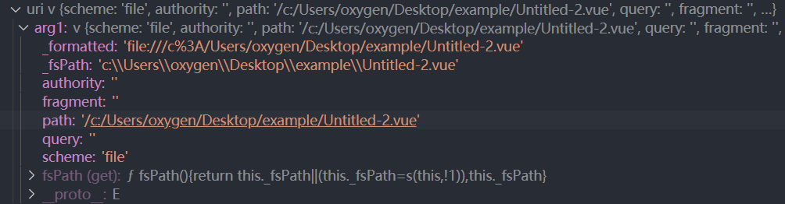

## 代码位置类

语言提示类插件往往需要精确的代码位置信息，vscode 提供以下类用于标识代码位置信息

### Position

`Position`对象用于表示一个字符的位置，例如鼠标光标当前的位置。`Position`对象需要通过传入以下构造函数参数来实例化：

```typescript
new Position(line: number, character: number): Position
```

- `line`：从`0`开始的行号，也就是第几行
- `character`：从`0`开始的字符值，第几行的第几个字符

### Range

`Range`对象使用两个字符的位置标识一部分代码。其构造函数如下，其中`startLine`表示起始字符的行号，`startCharacter`表示起始字符在该行第几个字符，`endLine`则表示截止字符的行号，`endCharacter`则表示改行第几个字符，在这之间的字符就是`Range`。

```typescript
new Range(start: Position, end: Position): Range

new Range(startLine: number, startCharacter: number, endLine: number, endCharacter: number): Range
```

### Location

`Location`类用于标识某个文件内的某段代码或者某个字符的位置信息

```typescript
new Location(uri: Uri, rangeOrPosition: Range | Position): Location;
```

其构造函数需要接收两个参数：

1. `uri`：`Uri` 对象标识文件，其通过传入以下参数到`Uri`构造函数实例化

```typescript
new Uri(scheme: string, authority: string, path: string, query: string, fragment: string): Uri
```

`Uri`的组成由以下部分组成，也就对应构造函数的参数：


2. `rangeOrPosition`：一个`Range`或者`Position`对象。

## 插件编写流程

### 配置激活事件

在`package.json`中配置以下激活事件类型，当在 vscode 启动以后，且检测到文件类型为`.js`，`.vue`时激活插件

```json
"activationEvents": [
  "onLanguage:vue",
  "onLanguage:javascript",
  "onStartupFinished"
]
```

### 注册hover方法

```typescript
vscode.languages.registerHoverProvider(
  ["javascript", "vue"],
  {
    provideHover(document, position, token) {
      return {
        // 返回的内容按顺序换行显示在tooltip内
        contents: ["Hover Content", "测试"],
      };
    },
  }
);
```

`registerHoverProvider`注册 hover 代码时触发的方法，第一个参数是指定特定的语言类型，第二个参数是一个包含`provideHover`方法的对象。

`provideHover`方法接收以下三个参数：

- `TextDocument`对象
- `position`：代码位置
- `token`：指定取消异步操作或者耗时请求的标识，例如当用户继续输入的情况

下面重点了解下这三个参数

#### TextDocument

`TextDocument`这个对象包含以下属性

- `eol`：代码行结尾换行符的标识使用的是`CRLF`还是`LF`，`CRLF=2`，`LF=1`

- `fileName`：当前文件的完整的绝对路径，可用于读取文件内容

- `isClosed`：当前文件是否被关闭

- `isDirty`：文件是否被修改

- `isUntitled`：文件是否命名，未命名的文件代表从未保存到本地磁盘

- `languageId`：文件标识符，注意不是文件名后缀

- `lineCount`：文件行数

- `uri`：文件的 URI 标识对象，大部分本地编辑器文件都是`file`协议，但是也有可能文件是通过 vscode 创建但未保存到本地，所以检查 URI 的`scheme`部分是否和`registerHoverProvider`的第一个参数指定的`scheme`匹配。

  

- `version`：文件版本，会在文件每次变化时改变，包括撤销等操作

`TextDocument`还包含以下方法：

- `getText(range: Range): string`：返回文件内指定范围内的代码段
- `getWordRangeAtPosition(position: Position, regexp?: RegExp)`：获取指定位置字符的起止范围，返回一个`Range`对象
- `lineAt(line: number): TextLine`：返回指定行号的代码；如果指定一个位置对象，则返回起止位置的代码
- `lineAt(position: Position): TextLine`：返回指定位置所在行的代码
- `offsetAt(position: Position): number`：将位置转换为改行代码的偏移量
- `positionAt(offset: number): Position`：将某行偏移量转换为`Location`对象
- `save`：保存文件
- `validatePosition`：验证指定位置数据在文件中是否包含
- `validateRange`：验证文件是否包含指定范围

#### CancellationToken

`CancellationToken`表示的是取消异步操作或者耗时请求的标识，例如当用户继续输入的时候，取消请求。

获取`CancellationToken`的实例需要使用`CancellationTokenSource`类来创建实例，实例具有两个属性：

- `isCancellationRequested`：当 token 被取消的时候为`true`，否则为`false`
- `event`：当取消的时候触发的事件

### 如何获取 hover 部分的代码字符

可以通过`document.getWordRangeAtPosition`和`document.getText`来获取 hover 部分连续的代码字符。`getWordRangeAtPosition`返回指定字符开始 hover 部分连续的字符串的范围`Range`，代码字符会根据空格，`-`，`_`，引号等自动分割，也可以指定特殊的正则表达式匹配连续的字符。`getText`则返回指定范围内的代码字符。

```typescript
provideHover(document, position, token) {
  const range = document.getWordRangeAtPosition(position);
  const content = document.getText(range);
  console.log(content);
}
```

### 注册定义跳转方法

`registerDefinitionProvider`可用于跳转到指定代码部分，其参数和`registerHoverProvider`基本一致，只是其需要提供`provideDefinition`方法，并且该方法必须返回一个`ProviderResult<Definition>`对象。

```typescript
  vscode.languages.registerDefinitionProvider([
    {
      scheme: "file",
      language: "javascript",
    },
    {
      scheme: "file",
      language: "vue",
    },
  ], {
    provideDefinition(document, position, token) {
      return {};
    }
  });
```

#### Definition

`Definition`定义了位置信息，也就是需要跳转到的代码的位置。其由一个或者多个`Location`对象组成，即用来表示跳转定义的代码位置。

