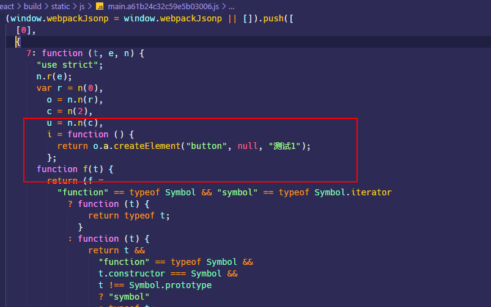
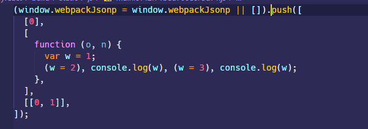
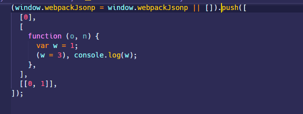
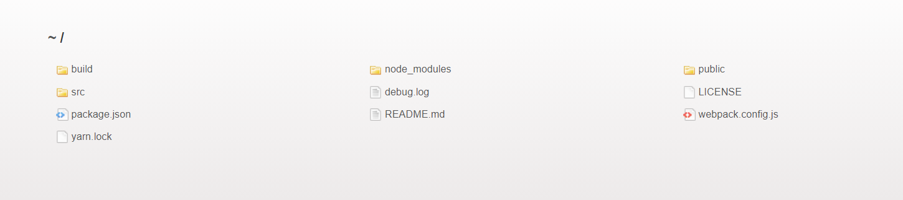
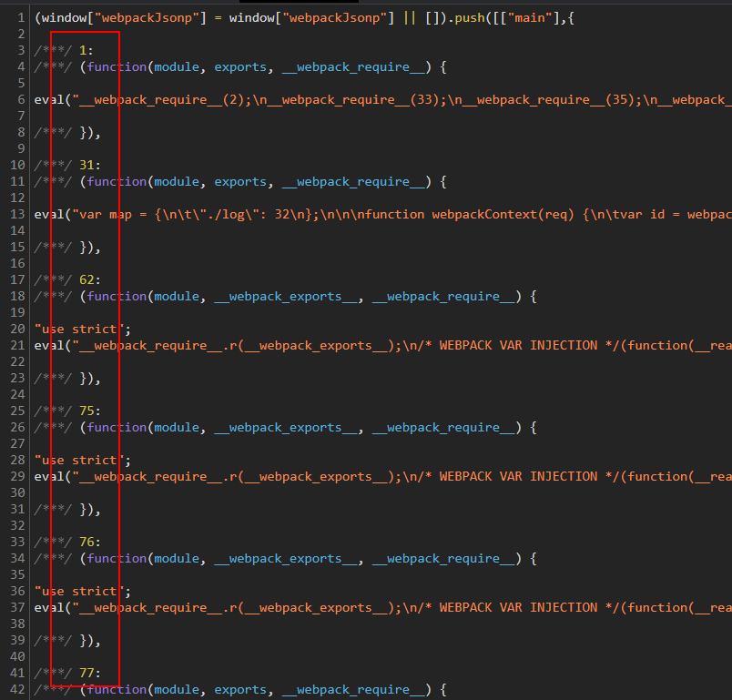
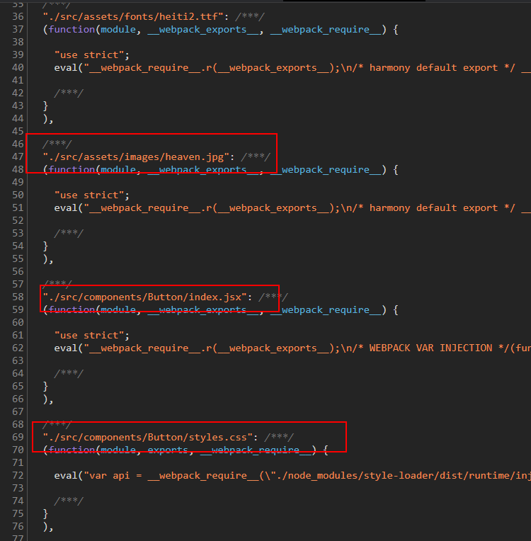
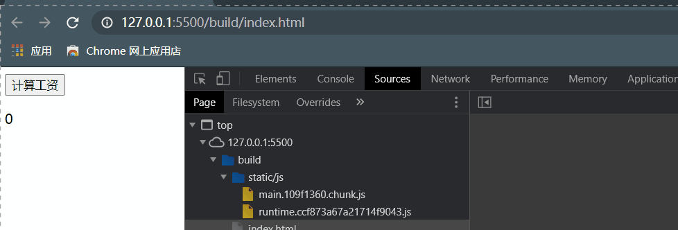

## tree shaking

tree shaking 这个词，我觉得很有意思，图源自 —— [掘金 - Tree-Shaking 性能优化实践](https://juejin.im/post/6844903544756109319)


tree shaking 是 webpack 里的术语，**用于移除 JS 上下文中未引用过的代码，以减小代码体积，间接减少代码在网络请求过程中的耗时**。我把这个称为代码清洁工。

### SideEffects

`SideEffects`也就是副作用，是计算机领域的一个术语 —— [副作用 (计算机科学)](<https://zh.wikipedia.org/wiki/%E5%89%AF%E4%BD%9C%E7%94%A8_(%E8%AE%A1%E7%AE%97%E6%9C%BA%E7%A7%91%E5%AD%A6)>)。函数副作用指的是调用函数的时候，其内部除了返回函数值，还对函数外部变量或者外界的全局变量等产生了影响。例如：

```javascript
let fruits = ['apple', 'orange', 'pear'];

const addFruit = function(fruit) {
  fruits.push(fruit); // 修改全局变量
};

addFruit('banana');
```

一个简单的例子，React class 组件的`React.Component`的`render`方法就应该是纯函数，它只负责根据`state`或者`props`来更新组件，一个规范就是`render`方法内部不应该产生对`state`的更改，这种情况往往不容易控制，因为`render`方法会在`state`修改以后去调用，如果内部再去修改`state`，这种情况很可能会造成死循环。

```jsx | pure
export default class extends Component {
  state = {
    value: 1,
  };

  render() {
    this.setState({
      value: this.state.value++,
    });

    return <div>{this.state.value}</div>;
  }
}
```


### Tree Shaking 原理

Tree Shaking 依赖于 ES Modules 语法（`import`和`export`），并且依赖于 webpack 构建依赖图谱的过程。因为 ES Modules 导入导出都是代码编译时的静态分析，所以可以直接通过`AST`分析出代码中上下文不存在引用关系的部分。

所以这就是为什么使用不当`lodash`不能被 Tree Shaking 的原因，因为`lodash`整个包是以[`UMD`](https://github.com/umdjs/umd)的模块语法暴露入口，`UMD`模块是通用模块语法，同时兼容`CJS`，`AMD`，ES Modules 语法。

例如，在一个 module 中声明了两个函数组件，通过`import`的语法全部引入：

```jsx | pure
// Button/index.jsx
import React from 'react';

export const Button1 = () => {
  return <button>测试1</button>;
};

export const Button2 = () => {
  return <button>测试2</button>;
};
```

```jsx | pure
// src/index.jsx
import { Button1, Button2 } from '../Button/index.jsx';

export default class extends Component {
  render() {
    return <Button1 />;
  }
}
```

经过`yarn build`打包以后，最终生成的 main chunk 只会包含`Button1`组件的代码，因为只有它在上下文中被用到了。



### 如何使用 Tree Shaking

#### ES Modules

tree shaking 功能是 webpack 默认在**生产环境**下提供的，但是由于 tree shaking 依赖 ES6 的模块语法，所以首先考虑在代码中使用`import`和`export`；这还不够，如果使用`babel-loader`编译源代码的话，还需要禁用`@babel/preset-env`的编译，babel 编译器默认会将 ES6 模块语法转换成 CommonJS 的形式，这种行为不利于 tree shaking，如果希望 tree shaking 更好的工作，可以禁用 babel 对该语法的编译。

```javascript
module.exports = {
  module: {
    rules: [
      {
        test: /\.m?jsx?$/,
        exclude: /(node_modules)/,
        use: {
          loader: 'babel-loader',
          options: {
            presets: [
              [
                '@babel/preset-env',
                {
                  modules: false,
                },
              ],
              ['@babel/preset-react'],
            ],
          },
        },
      },
    ],
  },
};
```

#### 指定 sideEffects

首先看一下`package.json` 的 `sideEffects`属性，这个属性可以全局设为`false`，也就是全局模块默认可以通过 tree shaking 来干掉没用的代码。

> Note：如果全局设为`false`，这种情况可能会对 CSS 造成影响，例如下面这种单纯的使用 CSS 的语法，CSS 在打包的时候就会被干掉

```javascript
import './styles.css';
```


要解决其它类型的模块是否受影响，可以在`package.json` 的 `sideEffects`为其指定一个数组，支持相对路径、绝对路径传入模块路径和 [glob 模式](<https://en.wikipedia.org/wiki/Glob_(programming)>)匹配相关文件（glob 模式也就类似于 gitignore 那种形式，使用通配符例如`*`来匹配文件名）例如：

```json
// package.json
{
  "sideEffects": [
    "*.css", //表明css文件是有副作用的，这样tree shaking就会跳过css文件
    "*.less" //表明less文件是有副作用的
  ]
}
```

同时也可以通过`module.rule.sideEffects`属性，**指定当前 loader 解析的模块类型具有副作用**，tree shaing 需要跳过它，经过测试，这个优先级要高于`package.json` 的 `sideEffects`。

```javascript
module.exports = {
  module: {
    rules: [
      {
        test: /\.css$/i,
        use: [
          isDevelopment && {
            loader: 'style-loader',
          },
          isProduction && {
            loader: MiniCssExtractPlugin.loader,
            options: {
              publicPath: '../../',
              esModule: true,
            },
          },
          {
            loader: 'css-loader',
            options: {
              modules: {
                localIdentName: isDevelopment
                  ? '[path][name]__[local]'
                  : '[hash:base64]',
              },
            },
          },
        ].filter(Boolean),
        sideEffects: true, //指定当前css具有side effect
      },
    ],
  },
};
```

#### optimization.providedExports

`optimization.providedExports`默认是`true`的。这个属性会指定 webpack 去收集模块都`export`哪些内容，可以为`export * from ...`这种语法生成更有效的代码。`export * from ...`通常用于重定向导出，也就是在当前模块导出另一个模块的所有代码，通过`providedExports`收集其他模块到底导出了哪些内容，就可以在`export * from ...`的基础上导出具体的模块，方便 tree shaking。

#### optimization.usedExports

`optimization.usedExports`默认是`true`的，不过也取决于`optimization.providedExports`是否为`true`。这个属性会指定 webpack 去收集哪些`export`或者`import`的内容在上下文中有用到，而哪些没用到。这些信息可以被 tree shaking 使用，也可以被代码压缩和优化工具使用，方便它们清理未使用过的代码。

`usedExports` 依赖于 [terser](https://github.com/terser-js/terser) （terser 是一个 JS 的高版本 ES6+的解析器，同时也提供压缩优化 JS 代码的功能）去检测语句中的副作用，它不能做到像下文的`sideEffects`标记那样直接标记一个模块被 tree shaking，同时它可能在 React 高阶组件中会发生问题，有时候可以看到在函数调用前标有`/*#__PURE__*/`这样的注释，它会告诉 terser 后面的函数是没有 side effect 的，可以通过 tree shaking 干掉。

下面测试一下，`/*#__PURE__*/`对于函数调用的影响，新建一个`test.js`文件，写入下面的代码，并修改 webpack 的`entry`，指向`test.js`文件；

在正常情况下，下面的代码会按顺序执行，最终在控制台打印出 2，3，打包的结果也很简单，如下图所示

```javascript
let a = 1;

function func() {
  a = 2;
  console.log(a);
}
func();

function test() {
  a = 3;
  console.log(a);
}
test(); // 2,3
```



现在修改`func()`的调用，在前面加上`/*#__PURE__*/`注释，最终在控制台只会打印出 3，打包结果如下图所示，可以看到，尽管

`func`函数修改了全局变量，但是`/*#__PURE__*/`注释让 webpack 以为这个`func`是没有 side effect 的，我也不管你改没改全局变量，直接在打包的时候给干掉。

而如果是在`test`里面调用的`func()`，那么结果也是一样的，不管其它地方用没用到你，也是直接干掉。

```javascript
let a = 1;

function func() {
  a = 2;
  console.log(a);
}
/*#__PURE__*/ func();

function test() {
  a = 3;
  console.log(a);
}
test();
```



#### optimization.sideEffects

`optimization.sideEffects`属性需要配合`package.json` 的 `sideEffects`来使用，指定 webpack 在打包的时候忽略那些`export`没有被任何其他模块用到，且本身被标记为`sideEffects:false`的模块。。`optimization.sideEffects`默认启用，不过也取决于`optimization.providedExports`是否启用；其会对打包时间有一定的损耗，但是通过 tree shaking 干掉没用的模块可以可观的减少代码体积，带来网页性能上的提升。

## optimization

`optimization`这个配置项内部的很多优化策略都是在生产环境默认开启的，启用这些规则从一定程序上来讲可以显著减少 bundle 体积，优化代码生成，帮助长期缓存等。

### optimization.minimize

`optimization.minimize`指定 webpack 默认使用 [`terser-webpack-plugin`](https://github.com/webpack-contrib/terser-webpack-plugin) 来压缩 JS 代码，或者使用其它在`optimization.minimizer`定义的插件。在生产环境下，这个配置项默认是`true`。

### optimization.minimizer

`optimization.minimizer`指定一个插件数组，其中包含使用的插件配置项。

例如可以单独指定一个针对`terser-webpack-plugin`的配置项：

```javascript
const TerserPlugin = require('terser-webpack-plugin');

module.exports = {
  optimization: {
    minimizer: [
      new TerserPlugin({
        //... Terser options
      }),
    ],
  },
};
```

也可以使用其它插件，之前我们是在`plugin`中配置压缩 CSS 的插件`optimize-css-assets-webpack-plugin`，现在可以把它挪出来放在这里去处理

```javascript
const TerserPlugin = require('terser-webpack-plugin'); //压缩JS代码
const OptimizeCssAssetsPlugin = require('optimize-css-assets-webpack-plugin'); //压缩CSS代码

module.exports = {
  optimization: {
    minimizer: [
      new TerserPlugin(),
      new OptimizeCssAssetsPlugin({
        assetNameRegExp: /\.css$/g,
        cssProcessor: require('cssnano'),
        cssProcessorPluginOptions: {
          preset: ['default', { discardComments: { removeAll: true } }],
        },
        canPrint: true,
      }),
    ],
  },
};
```

### optimization.noEmitOnErrors

`optimization.noEmitOnErrors`配置项默认是`false`。

在开发环境下，当 webpack 打包遇到程序错误时，会显示错误的堆栈信息，例如：


在生产环境下打包，当 webpack 打包遇到程序错误时，仍然会继续执行打包，在控制台会输出错误信息


如果设置`noEmitOnErrors:true`，在开发环境下，当 webpack 打包遇到程序错误时，不会显示错误信息，而是显示当前项目目录的信息



在生产环境下，打包程序遇到错误不会继续执行，会在控制台输出错误信息，也就是最终不会生成任何打包文件。

### optimization.namedModules

在开发环境下默认是`true`，生产环境下会禁用。

webpack 在打包的时候会为每一个模块按照解析顺序分配一个整数 id，如果将`optimization.namedModules`设为`false`，那么打包生成的 bundle 内部使用的模块也会使用 id 来作为键名，这样不便于阅读。



如果将`optimization.namedModules`设为`true`，打包的模块键名将是模块的路径



### optimization.moduleIds

指定 webpack 生成模块 id 的时候使用什么算法，webpack 官网的团队也不知多久没更新了，目前这个配置项支持的值如下：


- `natural`：默认值，也就是按模块顺序解析的整数 id
- `named`：根据模块的路径作为模块 id
- `hashed`：根据 hash 算法生成`4`个字符的模块 id


- `size`：也是整数 id，貌似和模块大小有关
- `deterministic`：deterministic 翻译过来是确定的意思，当 `optimization.moduleIds` 被设置成 `deterministic`，至少使用 3 位数字 Id 来标识 module；相比`hashed`来说，可以让 bundle 的数据量更小，并且有益于长期缓存。

- `total-size`和`hashed`在 webpack 5 都会被弃用。

### optimization.namedChunks

在开发环境下默认是`true`，生产环境下会禁用。

使用 code splitting 拆分出 chunk 的时候，webpack 会根据 chunk 的使用顺序为其指定整数 id 作为名称，一般来说，`main`命名的会是由`entry`指定的项目代码入口的起点，`runtime`负责 chunk 之间的连接。


而当`optimization.namedChunks`为`true`时，则会使用具体的 chunk 名称。


### optimization.chunkIds

指定 webpack 生成 chunk id 时的算法。

| Option            | Description                                                  |
| :---------------- | :----------------------------------------------------------- |
| `'natural'`       | 默认值，按 chunk 的使用顺序赋予的数字 Id                     |
| `'named'`         | 由 chunk 的名称来标识 chunk                                  |
| `'deterministic'` | webpack 5 才能用的，使用至少使用 3 位数字 Id 标识 chunk，在编译时候不会发生改变，有益于长期缓存 |
| `'size'`          | Numeric ids focused on minimal initial download size.        |
| `'total-size'`    | numeric ids focused on minimal total download size.          |

- 如果`optimization.occurrenceOrder`是`true`，那么`optimization.chunkIds`默认就是`total-size`；
- 如果`optimization.namedChunks`是`true`，那么`optimization.chunkIds`默认就是`named`；

- 如果是开发环境，`optimization.chunkIds`默认就是`named`；生产环境默认是`deterministic`

- 如果上述条件都不满足，`optimization.chunkIds`默认就是`natural`

### 其它 optimization 项：

- `removeAvailableModules` ：如果模块已经包含在所有父级模块中，告知 webpack 从 chunk 中检测出这些模块，或移除这些模块；
- `removeEmptyChunks`：如果 chunk 为空，告知 webpack 检测或移除这些 chunk；

- `mergeDuplicateChunks`：告知 webpack 合并含有相同模块的 chunk
- `flagIncludedChunks`：告知 webpack 确定和标记出作为其他 chunk 子集的那些 chunk，在已经加载过较大的 chunk 之后，就不再去加载这些 chunk 子集

- `occurrenceOrder`：告诉 webpack 找出模块的顺序，以减小 initial bundle 的体积

- `concatenateModules`：指定 webpack 去寻找模块依赖图中的片段，将它们安全地合并，取决于启用了`optimization.providedExports:true`，`optimization.usedExports:true`

## code splitting

> [developers.google - Extract dependencies and runtime into a separate file](https://developers.google.com/web/fundamentals/performance/webpack/use-long-term-caching#extract_dependencies_and_runtime_into_a_separate_file)

我个人觉得代码拆分最有意义的一个目的是利用客户端的长效缓存机制来避免因为发布导致没有发生更改的第三方依赖被重复请求。

根据 webpack 的[manifest](https://webpack.docschina.org/concepts/manifest/)，在 webpack 构建的过程中，有三种代码类型：

- 开发代码，分为同步模块`import xxx from xxx`和通过`import()`异步导入的模块；
- 通过`node_modules`依赖的第三方代码，被称为 **vendor**（供应商），它们很少像本地的源代码那样频繁修改，如果单独抽成一个 chunk，可以利用 client 的长效缓存机制，命中缓存来消除请求，减少网络请求过程中的耗时
- webpack 的 **runtime** 代码，用来连接模块化应用程序所需的所有代码，runtime 代码一般是网页加载 JS 的入口，并不涉及具体的业务，可以抽成一个单独的 chunk 并附加长效缓存机制。

webpack 内置了一些代码拆分的规则，默认情况下，webpack 会在生产环境打包的时候对满足以下条件的模块自动拆分出一个 chunk 来包含它：

- 动态导入`import()`

- 新的 chunk 被两个及以上模块引用，或者 chunk 内的 module 来自于`node_modules`文件夹；
- 新的 chunk 在压缩前大于`20kB`
- 并行请求的 chunk 最大数量要`<= 30`
- 初始页面加载时并行请求的最大数量要`<= 30`

### 按需加载

对于通过`import()`动态导入的模块，也就是按需加载，webpack 会自动将其拆分成一个 chunk 出来。

拆分出的 chunk 默认会根据使用顺序为其分配一个整数 id 做为`[name]`，然后和`output.chunkFilename`进行合成，如果要改变整数 id 的形式，可以通过在`import()`导入的模块前添加`/* webpackChunkName: "xxx" */`这个注释来解决。

拆分出的 chunk 不会被以`<script>`的形式插入到 HTML 中，也就是首次加载并不会去请求这个 chunk，而当页面中用到的时候才会去请求加载。

这里简单以一个例子来看一下，编写一个计算工资的组件，组件很简单，只包含一个`button`和一个`p`标签，其内部实现点击`button`动态导入计算函数的`math.js`模块，然后`setState`去改变页面显示结果。

```javascript
// math.js
export function add(a, b) {
  return a + b;
}
```

```jsx | pure
// 组件
import React, { Component } from 'react';

export default class extends Component {
  state = {
    value: 0,
  };

  handleClick = () => {
    // 动态导入
    import(/* webpackChunkName: "math" */ './math').then(({ add }) => {
      this.setState({
        value: add(1, 2),
      });
    });
  };

  render() {
    return (
      <>
        <button onClick={this.handleClick}>计算工资</button>
        <p>{this.state.value}</p>
      </>
    );
  }
}
```

现在我们执行打包`yarn build`，可以看到最终生成一个单独的`math.[hash].chunk.js`的文件，这个文件包含的模块也很少，就是`math.js`。


现在我们利用 vscode 的插件 Live Server 打开打包生成的 HTML 页面，可以看到其内部并没有包含动态导入的 chunk，也就是初始加载这个 chunk 并没有请求加载！


现在点击按钮测试组件的效果，可以看到点击过后，动态的导入的 chunk 才被请求下来。



### entry

从`entry`入口可以对开发代码进行拆分，`entry`配置项可以是`String/Object/Function`类型的配置。

如果传入一个字符串或字符串数组，就看成只有一个入口，最终也只会生成一个 chunk，并会被命名为 `main`，对应的也只有一个`main`命名的 CSS。

```javascript
module.exports = {
  entry: './src/index.js',
  //entry: ["./src/pages/home/index.js", "./src/pages/about/index.js"], 或者是指定一个数组
  output: {
    chunkFilename: isProduction
      ? 'static/js/[name].[contenthash:8].chunk.js'
      : 'static/js/[name].chunk.js',
  },
  plugins: [
    isProduction &&
      new MiniCssExtractPlugin({
        chunkFilename: 'static/css/[name].[contenthash:8].chunk.css',
      }),
  ],
};
```


如果传入一个对象，则每个属性的键就是一个入口，对应生成的 chunk 的名称前缀`[name]`，而属性的值是 chunk 的入口文件路径。

这种情况下，一个键一般对应生成一个 chunk，如果在入口文件中引用了 CSS，那么也是一个入口对应生成一个 CSS chunk。例如对于一个多页面的项目，`/home`对应于`src/pages/home`文件夹，`src/pages/about`文件夹，它们具有下面的目录结构：

```shell
src
└─ pages
       ├─ about
       │    ├─ index.js
       │    └─ styles.css
       └─ home
              ├─ index.js
              └─ styles.css
```

为其配置指定两个入口，那么最终就会生成两个 chunk，每个 chunk 分别还带有两个 CSS chunk，CSS chunk 最终能够输出的文件目录由提取插件`mini-css-extract-plugin`配置的`chunkFilename`决定。

```javascript
module.exports = {
  entry: {
    home: './src/index.js',
    other: './src/test.js',
  },
  output: {
    chunkFilename: isProduction
      ? 'static/js/[name].[contenthash:8].chunk.js'
      : 'static/js/[name].chunk.js',
  },
  plugins: [
    isProduction &&
      new MiniCssExtractPlugin({
        chunkFilename: 'static/css/[name].[contenthash:8].chunk.css',
      }),
  ],
};
```


对象的属性值也可以是一个数组，例如下面的配置和上面的效果是一样的。

```javascript
module.exports = {
  entry: {
    home: ['./src/pages/home/index.js', './src/pages/home/styles.css'],
    about: ['./src/pages/about/index.js', './src/pages/about/styles.css'],
  },
  plugins: [
    isProduction &&
      new MiniCssExtractPlugin({
        filename: 'static/css/[name].[contenthash].css',
      }),
  ],
};
```

如果传入一个函数，会在每次编译的时候被调用，然后返回一个入口文件路径。

```javascript
module.exports = {
  entry: () => './src/index.js',
};
```

webpack 5 引入了一个新的属性`dependOn`，`dependOn`只在**webpack@5.0.0-beta.14**版本后才能用。默认情况下，每个入口 chunk 会保存全部使用到的模块，可以使用`dependOn`可以定义在多个 chunk 之间共享的模块，例如下面的配置方式：

```javascript
module.exports = {
  //...
  entry: {
    home: './home.js',
    index: { import: './src/index.js', dependOn: 'shared' },
    another: { import: './src/another-module.js', dependOn: 'shared' },
    shared: ['react', 'react-dom', 'redux', 'react-redux'],
  },
};
```

### 抽取 runtime chunk

使用[`optimization.runtimeChunk`](https://webpack.docschina.org/configuration/optimization/#optimizationruntimechunk)可以将 webpack 的 runtime 代码在生产环境打包的时候拆分成一个单独的 chunk，**最终生成的 runtime chunk 文件名会从`output.filename`提取生成**。

`optimization.runtimeChunk`可以传递以下三种类型的值：

- `false`：默认情况下是`false`，每个入口 chunk 中直接嵌入 runtime 的代码

- `"single"`：创建一个在所有生成 chunk 之间共享的运行时文件，更多的情况下是设置成`"single"`，此时会为 runtime 代码单独生成一个 `runtime`前缀的 chunk

```javascript
module.exports = {
  //...
  optimization: {
    runtimeChunk: 'single',
  },
};
```


- `true` 或 `"multiple"`：为每个只含有 runtime 的入口添加一个额外 chunk，当我们指定多个入口时，就会根据多个入口每一个生成一个`runtime`的 chunk

```javascript
module.exports = {
  entry: {
    main: './src/index.js',
    other: './src/test.js',
  },
  //...
  optimization: {
    runtimeChunk: true,
  },
};
```


- 设置成一个对象，对象中可以设置只有 `name` 属性，其中属性值可以是名称或者返回名称的函数， 用于为 runtime chunks 命名，例如下面的配置效果和设置成`'single'`是一样的

```javascript
module.exports = {
  //...
  optimization: {
    runtimeChunk: {
      name: 'runtime',
    },
  },
};
```

或者可以给`runtimeChunk.name`传递一个函数，例如针对每一个`entry`都生成一个 runtime chunk，也就等价于上面`runtimeChunk:true`的的结果。

```javascript
module.exports = {
  entry: {
    main: './src/index.js',
    other: './src/test.js',
  },
  //...
  optimization: {
    runtimeChunk: {
      name: entrypoint => `runtime~${entrypoint.name}`,
    },
  },
};
```

#### 内联 runtime chunk

`runtime`chunk 的代码一般比较小，可以通过 inline `<script>`插入 HTML，减少一次请求过程。使用[`html-webpack-inline-source-plugin`](https://github.com/DustinJackson/html-webpack-inline-source-plugin)可以做到将`runtime`chunk 以 inline 的方式插入 HTML，但是这个插件已经不再维护了，而且最新的 v0.0.10 版本使用有 BUG —— [Cannot read property 'tapAsync' of undefined](https://github.com/DustinJackson/html-webpack-inline-source-plugin/issues/79)，即使按照 issue 提出的解决方法在 HtmlWebpackPlugin 中仍然无法做到将代码插入 HTML。然后找了[`script-ext-html-webpack-plugin`](https://github.com/numical/script-ext-html-webpack-plugin)和`inline-manifest-webpack-plugin`也是一样的问题。

在`html-webpack-inline-source-plugin`的 MD 文档里推荐使用 FB 团队的[`react-dev-utils.InlineChunkHtmlPlugin`](https://github.com/facebook/create-react-app/tree/master/packages/react-dev-utils#new-inlinechunkhtmlpluginhtmlwebpackplugin-htmlwebpackplugin-tests-regex)

```shell
yarn add react-dev-utils -D
```

```javascript
const InlineChunkHtmlPlugin = require('react-dev-utils/InlineChunkHtmlPlugin'); //inline runtime chunk

module.exports = {
  optimization: {
    runtimeChunk: {
      //为每一个入口文件生成的单独的runtime chunk
      name: entrypoint => `runtime-${entrypoint.name}`,
    },
    splitChunks: {
      chunks: 'all',
    },
  },
  plugins: [
    new HtmlWebpackPlugin(),
    isProduction && //根据上文runtime的命名方式来匹配
      new InlineChunkHtmlPlugin(HtmlWebpackPlugin, [/runtime-.+[.]js/]),
  ],
};
```

### SplitChunksPlugin

从 webpack4 以后，`CommonsChunkPlugin`被`SplitChunksPlugin`替换，并且`SplitChunksPlugin`的配置项被集成在了 webpack 的`optimization.splitChunks`配置项中。

#### optimization.splitChunks

通过配置项`optimization.splitChunks`可以自由的定制 webpack 抽取 chunk 的方式，webpack 对`optimization.splitChunks`的默认配置如下所示，从这个默认配置可以看出，**webpack 默认是把第三方`node_modules`的代码会抽成一个 chunk**，因为通过`import`导入第三方依赖的模块都会带有`node_modules`的前缀，所以利用`cacheGroups`的`test`属性匹配第三方依赖来生成`chunk`。

```javascript
module.exports = {
  //...
  optimization: {
    splitChunks: {
      chunks: 'all',
      minSize: 20000,
      minRemainingSize: 0,
      maxSize: 0,
      minChunks: 1,
      maxAsyncRequests: 30,
      maxInitialRequests: 30,
      automaticNameDelimiter: '~',
      enforceSizeThreshold: 50000,
      cacheGroups: {
        defaultVendors: {
          test: /[\\/]node_modules[\\/]/,
          priority: -10,
        },
        default: {
          minChunks: 2,
          priority: -20,
          reuseExistingChunk: true,
        },
      },
    },
  },
};
```

- `automaticNameDelimiter`：默认是`~`，定义 chunk 类型和 chunk 名称之间的分界符，例如`vendors~main.js`

- `chunks`：可以是一个字符串`'all'|'async'|'initial'`，分别代表了全部 chunk，按需加载的 chunk 以及初始加载的 chunk；也可以是一个函数，函数会接收`chunk.name`作为参数。

- `maxAsyncRequests` ：按需加载时的最大并行请求数，默认是`30`

- `maxInitialRequests`：入口点的最大并行请求数，默认是`30`

- `minChunks`：拆分 chunk 的时候，共享该 chunk 的最小模块数量，至少是`1`

- `minSize`：生成 chunk 的最小字节数，默认是`20000`，也就是大概`20KB`

- `enforceSizeThreshold`：强制执行拆分的大小阈值，默认是`50000`，也就是`50KB`

- `minRemainingSize`：webpack5 引入的新属性，指定拆分 chunk 后最小 chunk 的大小，在开发模式`mode=development`默认是`0`，在其他情况下，这个值取决于`splitChunks.minSize`

- `maxSize`：把超过`maxSize`的 chunk 进行拆分，每个 chunk 最小大小是`minSize`指定的。`maxSize`选项旨在与 HTTP / 2 和长期缓存一起使用，它增加了请求数量以实现更好的缓存。它还可以用于减小文件大小，以加快重建速度。从优先级方面来讲，`maxInitialRequest/maxAsyncRequests < maxSize < minSize`；设置 maxSize 的值会同时设置`maxAsyncSize`和`maxInitialSize`的值

- `maxAsyncSize`：`maxAsyncSize`仅会影响按需加载的 chunk

- `maxInitialSize`：`maxInitialSize`仅会影响初始加载的 chunk

- `name`：拆分生成的 chunk 名称，对于生产版本，建议将`splitChunks.name`设置为`false`，以免不必要地更改名称

- `automaticNamePrefix`：为创建的 chunk 设置名称前缀

- `cacheGroups`：每个`cacheGroups`都可以定义自己抽取模块的范围，也就是哪些文件中的公共代码会抽取到自己这个 chunk 中；
  - `test`属性用于匹配模块的名称，默认是`/[\\/]node_modules[\\/]/`，因为从 node_modules 中加载的依赖路径中都带有 `node_modules`前缀字符串，所以这个正则表达式也就是匹配所有从 node_modules 中加载的依赖。需要注意的是**如果模块路径带有`/`这样的分隔符，例如`./node_modules/@antv/g6/build`这样的，`test`路径匹配必须使用`[\\/]`的形式去匹配`/`**，我也不知道为啥，反正我不这么写就匹配不到！
  - 不同的 cacheGroups 之间的模块范围如果有交集，可以用`priority` 属性控制优先级；
  - `reuseExistingChunk`指定如果当前块包含已从主 bundle 中拆分出的模块，那么会被重用
  - `name`：拆分的 chunk 的名称，可以传递一个函数，这个属性比较常用
  - `filename`：只能用于初始加载的 chunk，使用`filename`重写其名称
  - `enforce`：忽略`minsize`，`minChunks`，`maxAsyncRequests` 和`maxInitialRequests`的限制，总是为当前 cache group 创建 chunk
  - `idHint`：设置 chunk 的 id，它会被添加到 chunk 的文件名中

#### optimization.splitChunks.cacheGroups

`cacheGroups`是十分强大的自定义 chunk 抽取的配置，通过`test`属性可以匹配`import`时候引入的模块的文件名，然后选择将其抽成一个 chunk。

不得不说，`webpack-bundle-analyzer`配合这个使用简直就是神器，从`webpack-bundle-analyzer`可以详细分析每个 chunk 有哪些模块组成以及这些模块的路径名，这样就方便使用`test`去匹配模块然后拆分 chunk。

过去我做过的一个项目，大量使用第三方库，对于`node_modules`中的代码，如果按照 webpack 默认的配置将`node_modules`抽成一个 chunk，结果就像下图这样：


接近`18MB`的一个`vendor`都被插在了 html 中，即使经过 Gzip 压缩也超过`2MB`。

下面配置把`node_modules`里的那个`xlsx`拆出来

```javascript
module.exports = {
  optimization: {
    runtimeChunk: 'single',
    splitChunks: {
      cacheGroups: {
        defaultVendors: {
          test: /[\\/]node_modules[\\/]/,
          name: 'vendors',
          priority: -10,
        },
        xlsx: {
          test: /[\\/]node_modules[\\/]xlsx/,
          name: 'xlsx',
          chunks: 'all',
        },
      },
    },
  },
};
```

经过拆分，`vendors` chunk 减少了接近`3MB` 的体积；


接下来可以继续按照上述的方法，把`pdfjs`，`echarts`，`g6`这三个模块拆出来，需要注意像`@antv/g6`这种模块名称带有分隔符的，分隔符需要使用`[\\/]`去匹配分隔符。

经过拆分，如果再加上使用 Gzip 压缩，`vendors`的大小只有`700KB`左右，相比一开始`2MB`（开启 Gzip）减少了很大的体积。

```javascript
module.exports = {
  optimization: {
    splitChunks: {
      cacheGroups: {
        defaultVendors: {
          test: /[\\/]node_modules[\\/]/,
          name: 'vendors',
          priority: -10,
        },
        xlsx: {
          test: /[\\/]node_modules[\\/]xlsx/,
          name: 'xlsx',
          chunks: 'all',
        },
        pdfjs: {
          test: /[\\/]node_modules[\\/]pdfjs-dist/,
          name: 'pdfjs',
          chunks: 'all',
        },
        echarts: {
          test: /[\\/]node_modules[\\/]echarts/,
          name: 'echarts',
          chunks: 'all',
        },
        antvg6: {
          test: /[\\/]node_modules[\\/]@antv[\\/]g6/,
          name: 'antvg6',
          chunks: 'all',
        },
      },
    },
  },
};
```

