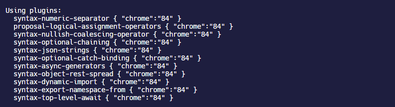

## 优化 babel-loader

`babel-loader`始终是项目处理任务最多的 loader，尤其是 React 开发过程中，有大量的 JSX 需要去解析，编译。从`babel-loader`的配置项入手可以进行一些优化。`babel-loader`使用的插件集合主要是`@babel/preset-env`和`@babel/preset-react`。

## @babel/preset-env

`@babel/preset-env`是一个负责将 JS 代码编译成兼容性更强的低版本 JS 代码的插件集合。

### 配置项

| 配置项                     | 类型                                                         | 默认值                     | 含义                                                         |
| -------------------------- | ------------------------------------------------------------ | -------------------------- | ------------------------------------------------------------ |
| `targets`                  | `String\|Array\|Object`                                      | `{}`                       | 配置浏览器的版本或者 nodejs 的版本                           |
| `bugfixes`                 | `Boolean`                                                    | `false`                    | 取决于`targets`设定，根据`targets`来编译目标浏览器支持的最新版本的语法；babel 8 版本后会自动启用 |
| `spec`                     | `Boolean`                                                    | `false`                    | 启用更多规范，会导致编译速度减慢                             |
| `loose`                    | `Boolean`                                                    | `false`                    | 宽松的编译规则，正常情况下，编译会尽可能遵循 ECMAScript 6 的语义，但是宽松模式会不严格，看起来像是手写的代码，见——[Babel 6: loose mode](https://2ality.com/2015/12/babel6-loose-mode.html) |
| `modules`                  | `"amd"\|"umd"\|"systemjs"\|"commonjs"\|"cjs"\|"auto"\|false` | `"auto"`                   | 将 ES Module 转换为其他类型模块语法的规则                    |
| `debug`                    | `Boolean`                                                    | `false`                    | 将 preset 使用的 plugin 和 polyfill 输出到控制台，这个配置不会受到 webpack 的`stats`的影响 |
| `include`                  | `Array`                                                      | `[]`                       | 自定义采用的插件名称                                         |
| `exclude`                  | `Array`                                                      | `[]`                       | 排除使用的插件                                               |
| `useBuiltIns`              | `"usage"\|"entry"\|false`                                    | `false`                    | 定义如何处理 polyfill                                        |
| `corejs`                   | `2`，`3`，`{version: 2\|3,proposals: boolean}`               | `2`                        | 仅在`useBuiltIns: usage`或者`useBuiltIns: entry`的时候才生效，定义`core-js`的版本，`version`必须是数字 2 或者 3 |
| `forceAllTransforms`       | `Boolean`                                                    | `false`                    | 禁用所有编译                                                 |
| `configPath`               | `String`                                                     | Node.js 进程的当前工作目录 | 配置指定了`browserslist`的目录                               |
| `ignoreBrowserslistConfig` | `Boolean`                                                    | `false`                    | 是否忽略`browserslist`配置                                   |
| `browserslistEnv`          | `Object`                                                     | `undefined`                | 配置不同开发环境下的`browserslist`                           |
| `shippedProposals`         | `Boolean`                                                    | `false`                    | 是否启用浏览器已经支持的提案                                 |

### 配置 modules

`modules`配置项默认会根据 babel 内部的[`caller`](https://babeljs.io/docs/en/options#caller)判断浏览器是否支持 ES Modules 的一些特性，例如是否支持静态`import`或者动态`import()`等语法；从而选择进一步将 ES Module 转换为 CommonJS 的那种`require`语法。

由于 webpack 内置的 tree shaking 功能依赖于 ES Modules 的静态语法分析，但是目前`modules`的支持程度也不是太高，IE 11 是完全不支持的，所以看情况选择是否将`modules`禁用。

### 配置 targets

早期的 babel 还有一个 preset，叫[`babel-preset-latest`](https://babel.docschina.org/docs/en/babel-preset-latest)，这个 preset 的特点是能自动根据 ES 规范的新特性添加对应的 plugin，这样就避免了开发者去单独配置，但是就这样直接添加进去会导致插件越来越多，并且随着时间推移，大部分 ES6 的语法已经被主流浏览器都支持了，没必要再去使用那些插件编译了，这些无用的插件留在 preset 中会导致 babel 的编译流程也越来越慢，于是推荐使用`@babel/preset-env`去替代这个 preset。

`@babel/preset-env`帮助开发者从`preset-latest`进行过渡，**如果不在`@babel/preset-env`中配置`targets`，那么它就会默认把 ES6+的 JS 代码全部编译成 ES5 的形式**。通过开启`@babel/preset-env`的`debug`配置项可以清楚的在控制台看到`@babel/preset-env`使用的 plugin 有多少，如果不设定`targets`，那么就会像下图这样引入最高兼容到 IE10 的 plugin。


在开发环境下，这些 plugin 基本都是不需要的，而`@babel/preset-env`并不会去查找`browserslist`的配置，即使是`browserslist`的默认配置，也必须在`targets`中配置，这个设定可能在 Babel 8 重新讨论。

```javascript
{
  "presets": [["@babel/preset-env", { "targets": "defaults" }]]
}
```

`targets`字段同样支持上述的`browserslist`配置形式，在开发环境始终使用最新的 Chrome 版本，这样开发环境引入的 plugin 就减少很多了。

```javascript
{
  targets: isDevelopment
		? "last 1 chrome version"
		: "> 1%, last 2 versions, Firefox ESR, ie >= 11, not dead",
}
```



`targets`还支持一些特殊字段的配置：

- `esmodules`：默认是`false`，指定目标浏览器支持 ES Modules 语法，如果设置成`true`，那么`browserslist`的配置会失效
- `node`：`"current" | true`，指定针对当前 node 的版本进行编译
- `safari`：`"tp"`，指定针对 safari 的技术预览版进行编译
- `browsers`：指定一个`browserslist`规则数组，不建议使用，因为未来版本可能会删除

### 配置 bugfixes

默认情况下，`@babel/preset-env`或者其他的 Babel plugin 会对 ES 语法特性进行相关分组，例如`function arguments`包含默认参数，剩余参数等内容，如果开启`bugfixes`，`@babel/preset-env`会根据`targets`设定的兼容范围，选择将不同的分组编译到目标浏览器支持的最接近的最新现代语法，这将导致已编译应用程序的大小显着减小，不仅优化 webpack 的构建速度，而且优化了生成的代码。

### 配置 polyfill

#### core-js 简介

> [core-js#babelpreset-env](https://github.com/zloirock/core-js#babelpreset-env)

`@babel/polyfill`已经在 7.4 版本以后被弃用了，目前主流的 polyfill 方案是使用[`core-js`](https://babeljs.io/docs/en/babel-preset-env#corejs)。

`core-js`本身具有三个版本：

- `yarn add core-js@3.6.5`：全局注入版本，使用的时候只需要在代码入口点全局引入`core-js`即可
- `yarn add core-js-pure@3.6.5`：模块导入版本，需要在使用的时候单独引入对应的 polyfill 模块文件
- `core-js-bundle`：使用 script 注入版本

此外每个版本还具有包含不同 feature 的模块：

- `core-js(-pure)/es`：`es`表示稳定的 ES 规范内容
- `core-js(-pure)/stable`：`stable`同时包含稳定的 whatwg 的规范内容以及 ES 规范内容
- `core-js(-pure)/features`：`features`只包含单独语法的特定模块内容，例如`core-js(-pure)/features/set`表示只包含`Set`数据集合的相关 polyfill

如果使用全局注入版本，可以只在项目入口文件全局引入，全局引入会自动根据目标环境将 polyfill 引入，不会按需引入。也可以使用`features`只注入需要的 polyfill。

```javascript
//全局注入
import 'core-js';

Array.from(new Set([1, 2, 3, 2, 1]));
[1, [2, 3], [4, [5]]].flat(2);
Promise.resolve(32).then(x => console.log(x));

//通过feature引入需要的模块
import 'core-js/features/array/from';
import 'core-js/features/array/flat';
import 'core-js/features/set';
import 'core-js/features/promise';

Array.from(new Set([1, 2, 3, 2, 1]));
[1, [2, 3], [4, [5]]].flat(2);
Promise.resolve(32).then(x => console.log(x));
```

如果使用`pure`版本，无法使用`import 'core-js-pure';`这种全局注入的方式，需要根据需要导入特定的模块；`pure`版本可以做到按需引入，但是使用很麻烦， 比如需要用到`Set`和`Array.from`两个 feature，需要去找这两个 feature 怎么去引入。

```javascript
import from from 'core-js-pure/features/array/from';
import flat from 'core-js-pure/features/array/flat';
import Set from 'core-js-pure/features/set';
import Promise from 'core-js-pure/features/promise';

from(new Set([1, 2, 3, 2, 1])); // => [1, 2, 3]
flat([1, [2, 3], [4, [5]]], 2); // => [1, 2, 3, 4, 5]
Promise.resolve(32).then(x => console.log(x));
```

#### useBuiltIns 和 corejs

> Note：如果使用`core-js-pure`是不需要配置`@babel/preset-env`的`useBuiltIns`和`corejs`属性的，可以通过下文介绍的`@babel/plugin-transform-runtime`让代码编写简化一些。

对于全局注入的版本，例如安装`core-js@3`版本以后，需要**首先设置`@babel/preset-env`的`corejs`配置项，并且建议指定较小的`core-js`版本号**，例如使用`3.6`而不是`3`，因为对于`corejs：3`，将不会添加在较小的`core-js`版本中添加的模块。默认情况下，只会采用稳定的 ES feature，对于尚在提案状态的规范内容不会引入 polyfill，不过可以通过`corejs.proposals`开启对提案内容的支持。

然后必须指定`useBuiltIns`，如果不指定不会有任何 polyfill 被添加进来。


以`core-js`的全局注入版本为例，指定`corejs: "3.6"`和`useBuiltIns: "entry"`，配置如下：

```javascript
module: {
  rules: [
    {
      test: /\.m?js$/,
      exclude: /(node_modules|bower_components)/,
      use: {
        loader: 'babel-loader',
        options: {
          presets: [
            '@babel/preset-env',
            {
              debug: true, // 开启debug模式
              targets: 'ie >= 8',
              bugfixes: true,
              modules: false,
              corejs: {
                version: 3,
                proposals: true,
              },
              useBuiltIns: 'entry',
            },
          ],
        },
      },
    },
  ];
}
```

当指定`useBuiltIns:"entry"`时，会把`core-js`所有的针对目标`targets`的 polyfill 都打包进来，那简直是噩梦！当我只在入口使用了`Set`和`Array.from`两个 feature 的时候，打包了 1 分钟 生成了一个`150KB`的 polyfill chunk

```javascript
import 'core-js';

console.log(Array.from(new Set([1, 2, 3, 2, 1])));
```

当指定`useBuiltIns:"usage"`时，只会根据代码引入需要的 polyfill，相应的打包时间和 chunk 体积就减小很多了，大概只有`20KB`。


因为直到 Babel 7.3 版本， `useBuiltIns: usage`还不够稳定，有时候一些需要的 polyfill 并不会自动添加进来，所以可能旧的项目使用会有一点问题。作为兼容性和按需引入更好的选择，可以使用下文`core-js-pure`和`@babel/plugin-transform-runtime`结合的方案。

## @babel/preset-react

`@babel/preset-react` preset 负责转换 JSX 等语法。

### 配置项

| 配置项             | 类型                     | 默认值                | 含义                                                         |
| ------------------ | ------------------------ | --------------------- | ------------------------------------------------------------ |
| `runtime`          | `"classic"或"automatic"` | `"classic"`           | 是否自动导入 JSX 转换后的函数，默认是不会                    |
| `development`      | `Boolean`                | `false`               | 是否开启开发环境，针对开发环境会启用辅助开发的插件，例如：[`@babel/plugin-transform-react-jsx-self`](https://www.babeljs.cn/docs/next/babel-plugin-transform-react-jsx-self) 和 [`@babel/plugin-transform-react-jsx-source`](https://www.babeljs.cn/docs/next/babel-plugin-transform-react-jsx-source) |
| `throwIfNamespace` | `Boolean`                | `false`               | 是否在使用 XML 命名空间的标记名是抛出错误；例如`<f:image />`形式，虽然 JSX 规范允许这样做，但是默认情况下是被禁止的，因为 React 的 JSX 目前并不支持这种方式 |
| `importSource`     | `String`                 | `react`               | 设置函数导入来源的名称                                       |
| `pragma`           | `String`                 | `React.createElement` | 替换编译 JSX 表达式时使用的函数                              |
| `pragmaFrag`       | `String`                 | `React.Fragment`      | 设置 JSX fragments 语法转换后的函数                          |
| `useBuiltIns`      | `Boolean`                | `false`               | 是否使用原生内置的 polyfill，而不是通过其他插件进行 polyfill |
| `useSpread`        | `Boolean`                | `false`               | 当展开`props`的时候，使用 inline object 形式，而不是使用 Babel 拓展或者`Object.assign`复制对象 |

inline object 形式：

```javascript
{
  (firstName = 'john'), (lastName = 'walter');
}
```

针对不同环境配置`@babel/preset-react`，以在开发环境使用辅助开发的插件

```javascript
module: {
  rules: [
    {
      test: /\.m?js$/,
      exclude: /(node_modules|bower_components)/,
      use: {
        loader: 'babel-loader',
        options: {
          presets: [
            '@babel/preset-env',
            [
              '@babel/preset-react',
              {
                development: isDevelopment, //开发环境
                useBuiltIns: true,
              },
            ],
          ],
        },
      },
    },
  ];
}
```

## @babel/plugin-transform-runtime

Babel 会使用一些非常小的辅助性的代码插入到需要编译的源代码中，有时候这些代码是重复的，会增加代码体积。通过[`@babel/plugin-transform-runtime`](https://babel.docschina.org/docs/en/babel-plugin-transform-runtime/)这个 plugin 可以禁用 Babel 自动对每个文件的 runtime 注入；然后通过安装`@babel/runtime`将 Babel 的辅助代码作为一个独立的依赖模块来引入，这样就可以避免编译后的代码中重复出现辅助性的代码，减小代码体积。

```shell
yarn add @babel/plugin-transform-runtime @babel/runtime -D
```

```javascript
module.exports = {
  module: {
    rules: [
      {
        test: /\.m?js$/,
        exclude: /(node_modules)/,
        loader: 'babel-loader',
        options: {
          presets: ['@babel/preset-env'],
          plugins: ['@babel/plugin-transform-runtime'],
        },
      },
    ],
  },
};
```

`@babel/plugin-transform-runtime`会进行以下三项任务：

- 当项目中使用生成器或者异步`async`函数的时候，自动引入`@babel/plugin-transform-runtime`
- 使用`core-js` polyfill，可以通过`corejs`配置
- 默认移除 Babel 的辅助代码，使用`@babel/runtime/helpers`代替，也就是上文说的减少代码体积的优化，可以通过`helpers`选择是否开启

### 配置项

| 配置项            | 类型                                                        | 默认值  | 含义                                                         |
| ----------------- | ----------------------------------------------------------- | ------- | ------------------------------------------------------------ |
| `corejs`          | `false`<br />`2，3`<br />`{version:2或3,proposals:boolean}` | `false` | 指定`core-js`库的版本                                        |
| `helpers`         | `Boolean`                                                   | `true`  | 是否将 Babel 插入的辅助代码切换为模块调用                    |
| `regenerator`     | `Boolean`                                                   | `true`  | 是否将生成器函数转化为生不会污染全局范围的运行时生成器       |
| `useESModules`    | `Boolean`                                                   | `false` | 是否使用辅助代码转换不通过`@babel/plugin-transform-modules-commonjs`的代码 |
| `absoluteRuntime` | `Boolean`或`String`                                         | `false` |                                                              |
| `version`         | `String`                                                    | `false` | 指定`@babel/runtime-corejs`的版本                            |

### polyfill

这个插件的另一个用途就是结合`pure`版本的`core-js-pure`库来做 polyfill，简化`core-js-pure`的导入语法，例如原本需要使用模块导入的语法，会自动进行转换。

```javascript
// 本来的core-js-pure用法
import from from 'core-js-pure/stable/array/from';
import flat from 'core-js-pure/stable/array/flat';
import Set from 'core-js-pure/stable/set';
import Promise from 'core-js-pure/stable/promise';

from(new Set([1, 2, 3, 2, 1]));
flat([1, [2, 3], [4, [5]]], 2);
Promise.resolve(32).then(x => console.log(x));

// 引入@babel/plugin-transform-runtime的简化写法
Array.from(new Set([1, 2, 3, 2, 1]));
[1, [2, 3], [4, [5]]].flat(2);
Promise.resolve(32).then(x => console.log(x));
```

使用`@babel/plugin-transform-runtime`结合`core-js-pure`需要安装对应的`@babel/runtime`库

| `corejs` | 对应安装的库                      |
| -------- | --------------------------------- |
| `false`  | `yarn add @babel/runtime`         |
| `2`      | `yarn add @babel/runtime-corejs2` |
| `3`      | `yarn add @babel/runtime-corejs3` |

默认情况下，`@babel/plugin-transform-runtime`只会采用稳定的 whatwg 规范内容或者 ES 规范内容，但是可以通过`corejs.proposals`配置项指定其采用尚未稳定的提案。

> Note：`@babel/plugin-transform-runtime`和`@babel/preset-env`都有`corejs`配置项，不要搞混了，而且不要同时配置，否则会冲突。

```javascript
module.exports = {
  module: {
    rules: [
      {
        test: /\.m?js$/,
        exclude: /(node_modules)/,
        loader: 'babel-loader',
        options: {
          presets: ['@babel/preset-env'],
          plugins: [
            [
              '@babel/plugin-transform-runtime',
              {
                corejs: {
                  version: 3,
                  proposals: true,
                },
              },
            ],
          ],
        },
      },
    ],
  },
};
```