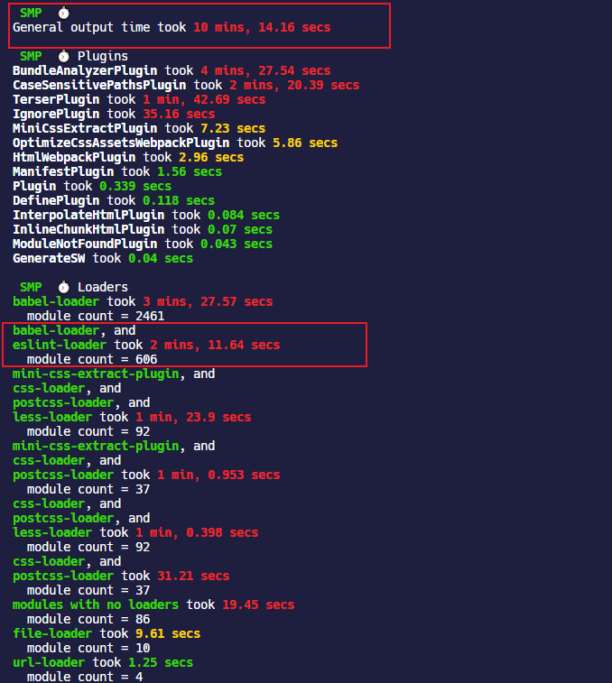
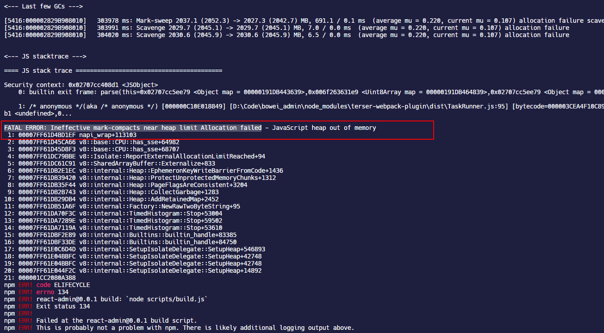
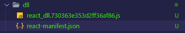
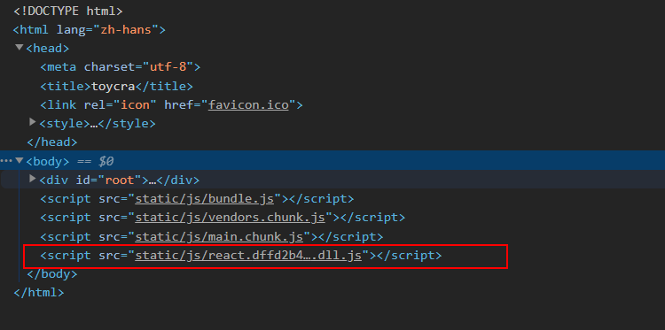

webpack 文档提供了一些优化构建性能的建议 —— [webpack - 构建性能](https://webpack.docschina.org/guides/build-performance/)，对于一些小型项目来说，这些建议很有用！

## 优化模块解析规则

### rule.include 和 rule.exclude

在使用 loader 的时候通过`include`或者`exclude`属性传入必要的路径和文件，避免全局匹配，可以提升 webpack 构建的速度。

例如`babel-loader`忽略`node_modules`内部的模块

```javascript
module.exports = {
  module: {
    rules: [
      {
        test: /\.m?jsx?$/,
        exclude: /(node_modules)/, //剔除node_modules
        loader: 'babel-loader',
        options: {
          presets: [
            [
              '@babel/preset-env',
              {
                modules: false,
              },
            ],
            ['@babel/preset-react'],
          ],
          plugins: [
            '@babel/plugin-proposal-class-properties',
            isDevelopment && require.resolve('react-refresh/babel'),
          ].filter(Boolean),
        },
      },
    ],
  },
};
```

在匹配图片文件的时候，指定具体的文件夹：

```javascript
module.exports = {
  module: {
    rules: [
      {
        test: [/\.bmp$/, /\.gif$/, /\.jpe?g$/, /\.png$/, /\.svg$/i],
        include: path.resolve(__dirname, 'src/assets/images'), //仅包含图片文件夹
        use: [
          {
            loader: 'url-loader',
            options: {
              limit: 10 * 1024,
              name: 'static/images/[name].[contenthash:8].[ext]',
            },
          },
          {
            loader: 'image-webpack-loader',
            options: {
              disable: isDevelopment,
            },
          },
        ],
      },
    ],
  },
};
```

### resolve.modules

`resolve.modules`指定 webpack 解析模块时应该搜索的目录，默认是`['node_modules']`，也就是 webpack 会首先查找项目根目录的`node_modules`文件夹去寻找模块，如果找不到就往上一级目录 `../node_modules` 中去找，实际上这种查找是不需要的，毕竟项目一般也不会使用层层嵌套的结构。

可以通过`path.resolve`来构造绝对路径值，这样就只会在给定目录中查找模块了。并且，有时候这个配置比`alias`还简洁，比方说对于项目中封装通用业务组件库位于`src/components`下面，然后通过`resolve.modules`配置模块解析规则如下

```javascript
module.exports = {
  resolve: {
    modules: [
      path.resolve(__dirname, './src/components'),
      path.resolve(__dirname, './src'),
      path.resolve(__dirname, 'node_modules'),
    ],
  },
};
```

这时候在编写页面的时候，如果`import`一个`src/components`下里面的组件，就不用带任何路径前缀直接写文件夹就行了，nice！不过这时候的弊端就是如果你的组件和第三方库的组件同名，就会把第三方库的组件覆盖掉了。

```javascript
import { Button } from 'Button/index.jsx';
```

这个配置加上上文提到的`rule.resolve.extensions`，结合在一起就是神器，对于`src/components`的组件，例如`src/components/Button`，直接一句话就搞定，webpack 会自动查找`src/components/Button`文件夹下的`index`文件。

```javascript
import { Button } from 'Button';
```

### resolve.symlinks

在开发若干个有相互依赖关系的库的时候，通常都会采用 symlink 的方式互相引用。对于单个项目来说，直接将`resolve.symlinks`禁用比较好。

```javascript
module.exports = {
  resolve: {
    symlinks: false,
  },
};
```

### module.noParse

`module.noParse`指定一个字符串或者正则表达式，对于匹配的模块名，webpack 不会去解析它们。这在忽略一些大型库时，可以提高构建性能。

```javascript
module.exports = {
  module: {
    noParse: /jquery|lodash/,
  },
};
```

## 利用缓存

合理利用缓存可以加快 webpack 二次构建的速度，尽管在首次使用这些 loader 或者 plugin 的时候耗时可能会很长，但是后续执行可能会带来飞速提升。

### 优化 babel-loader

`babel-loader`是最主要的 loader，它需要处理大量的 JS，JSX 等涉及 JS 的模块，可以通过其内置的缓存配置来缓存其执行结果。

`babel-loader`支持以下有关缓存的配置项：

- `cacheDirectory`：默认是`false`，当设置成`true`以后，`babel-loader`会使用默认的缓存目录 `node_modules/.cache/babel-loader`缓存 loader 的执行结果，在以后的 webpack 打包的时候，将会尝试读取缓存，来避免每次都重新编译
- `cacheIdentifier`：用来指定缓存的标识符，默认是由 `@babel/core` 版本号，`babel-loader` 版本号，`.babelrc` 文件内容（存在的情况下），环境变量 `BABEL_ENV` 的值（没有时降级到 `NODE_ENV`）组成的一个字符串，通过改变`cacheIdentifier`来使缓存失效
- `cacheCompression`：默认是`true`，会使用 Gzip 压缩每个 Babel 编译的结果

```javascript
module.exports = {
  module: {
    rules: [
      {
        test: /\.m?jsx?$/,
        loader: 'babel-loader',
        options: {
          //...
          cacheDirectory: true,
        },
      },
    ],
  },
};
```

### 优化 eslint-loader

如果项目在使用`eslint-loader`，一定要使用`exclude`忽略`node_modules`文件夹，并开启`cache:true`缓存项，因为`eslint-loader`检查代码真的超级耗时间！

过去的项目使用经验，大概是 10 分钟的打包时间，`eslint-loader`在不开启缓存的时候，占用了 **1/5** 的打包时间！



### cache-loader

[`cache-loader`](https://github.com/webpack-contrib/cache-loader)是一个 webpack loader，可以缓存 loader 的执行结果到本地磁盘文件夹中或者放在一个数据库中。但是本身来说，缓存到本地文件夹中涉及到 IO 操作，在 webpack 执行打包的过程中会带来更大的内存占用问题，所以，只在需要编译大量模块的 loader 中使用`cache-loader`。

- `babel-loader`：需要编译大量 JS 代码，但是上文说了，它默认带有缓存选项
- `css-loader`：可能会需要；其他类似的处理 CSS 预处理器的 loader 也可以使用
- `image-webpack-loader`：压缩图片的 loader，这个耗时比较多，可以考虑缓存其执行结果

#### 配置项

`cache-loader`虽然已经接近一年没有更新过了，但是它是 webpack 团队维护的，所以还是值得信赖的。

| 配置项                | 类型                                             | 默认值                                                  | 含义                                                         |
| --------------------- | ------------------------------------------------ | ------------------------------------------------------- | ------------------------------------------------------------ |
| **`cacheContext`**    | `{String}`                                       | `undefined`                                             | 相对于设置的路径生成缓存                                     |
| **`cacheKey`**        | `{Function(options, request) -> {String}}`       | `undefined`                                             | 重写生成缓存项的键的函数                                     |
| **`cacheDirectory`**  | `{String}`                                       | `findCacheDir({ name: 'cache-loader' }) or os.tmpdir()` | 设置缓存写入和读取的目录                                     |
| **`cacheIdentifier`** | `{String}`                                       | `cache-loader:{version} {process.env.NODE_ENV}`         | 设置一个用于生成 hash 的标识符                               |
| **`compare`**         | `{Function(stats, dep) -> {Boolean}}`            | `undefined`                                             | 修改缓存比较的函数，如果返回`true`就表示使用缓存而不是去执行 loader 生成新资源 |
| **`precision`**       | `{Number}`                                       | `0`                                                     | Round `mtime` by this number of milliseconds both for `stats` and `dep` before passing those params to the comparing function |
| **`read`**            | `{Function(cacheKey, callback) -> {void}}`       | `undefined`                                             | 使用函数生成一个新的内容来覆盖缓存的内容                     |
| **`readOnly`**        | `{Boolean}`                                      | `false`                                                 | 如果不希望更新缓存，只是读取它可以将这个配置项设为`true`     |
| **`write`**           | `{Function(cacheKey, data, callback) -> {void}}` | `undefined`                                             | 使用函数生成新资源来替换缓存内容                             |

#### 使用

```shell
yarn add cache-loader -D
```

使用的时候在耗时长的 loader 前面添加`cache-loader`就可以了，至于如何分析 loader 的执行时间，可以借助`speed-measure-webpack-plugin`这个工具。

下面是我在`image-webpack-loader`这个负责压缩图片的 loader 前添加的配置，**一定要注意在`image-webpack-loader`前引入`cache-loader`**，我现在还不明白`cache-loader`到底什么原理，我测试是在`url-loader`前使用`cache-loader`打包会丢失图片。

```javascript
module.exports = {
  module: {
    rules: [
      {
        test: [/\.bmp$/, /\.gif$/, /\.jpe?g$/, /\.png$/, /\.svg$/i],
        include: path.resolve(__dirname, 'src/assets/images'),
        use: [
          {
            loader: 'url-loader',
            options: {
              limit: 10 * 1024, //10KB
              name: 'static/images/[name].[contenthash:8].[ext]',
            },
          },
          'cache-loader', //引入cache-loader
          {
            loader: 'image-webpack-loader',
            options: {
              disable: isDevelopment, //开发环境下禁用压缩图片
            },
          },
        ],
      },
    ],
  },
};
```

在引入`cache-loader`前，我的页面中包含一张`7MB`左右的图片需要压缩，打包的耗时是这样的：


使用`cache-loader`打包一次后，再次打包，明显缩短了`image-webpack-loader`的处理时长。


## 多线程打包

### thread-loader

[`thread-loader`](https://github.com/webpack-contrib/thread-loader)是 webpack 团队提供的一个 webpack loader，如果正在使用[happypack](https://github.com/amireh/happypack)也建议迁移到`thread-loader`上来，happypack 已经不再维护了。

`thread-loader`利用的是 nodejs 的 [worker pool 机制](https://nodejs.org/zh-cn/docs/guides/dont-block-the-event-loop/)，或者叫 thread pool；当使用 node 启动 webpack 打包程序的时候，webpack 主程序会运行在事件循环的主线程上，还有 worker pool 负责处理高成本的任务。

#### 配置项

| 配置项               | 类型      | 含义                                                         |
| -------------------- | --------- | ------------------------------------------------------------ |
| `workers`            | `Number`  | 产生的 worker 的数量，默认是`cpu 核心数 - 1`                 |
| `workerParallelJobs` | `Number`  | 一个 worker 进程中并行执行工作的数量；默认是`20`             |
| `workerNodeArgs`     | `Array`   | 额外的 node.js 参数，例如`['--max-old-space-size=1024']`     |
| `poolRespawn`        | `Boolean` | 允许重新开启一个死掉的 work 池；重新开启会减慢整个编译速度，并且开发环境应该设置为`false` |
| `poolTimeout`        | `Number`  | 设置超过一定时间自动终止 worker，默认是`500ms`，可以设置为`Infinity`，这样会让 worker 一直处于活跃状态 |
| `poolParallelJobs`   | `Number`  | 池分配给 worker 的工作数量，默认是`200`，减少的话会降低效率但是会使分配更加合理 |
| `name`               | `String`  | worker 池的名称，可用于创建具有其他相同选项的不同 worker pool |

`max-old-space-size`这个额外的 nodejs 参数，在 nodejs 文档中介绍的有，这个 CLI 参数是配置 V8 引擎在执行 JS 时候最大可以使用的系统内存的，单位是`MB`，默认值是`512MB`。在 nodejs 执行的时候，如果内存限制太小，V8 就不得不频繁执行 GC 来释放哪些用不到的变量占用的内存，当程序需要的内存太大时，有时候 V8 会直接终止程序执行。stack overflow 上有一个相关问题 —— [Node.js recommended “max-old-space-size”](https://stackoverflow.com/questions/48387040/node-js-recommended-max-old-space-size/48392705#48392705)。

webpack 打包程序也是一样，对于超出内存限制，打包程序会被终止。



解决这种问题的方法就是通过在`package.json`的 npm- script 中指定 CLI 参数，例如：

```shell
  "scripts": {
    "build": "node --max-old-space-size=8192 scripts/build.js"
  },
```

#### 使用

在其它 loader 的配置前面添加`thread-loader`，则它们将会在一个 worker pool 中运行。每个 worker 都是一个独立的 node.js 进程，开启 worker 本身会产生额外开销的，每一个 worker 都会产生大于`600ms`的延迟。

此外对使用线程池执行的 loader 也会有限制：

- loader 不能产生新的文件
- loader 不能使用自定义的 loader API
- loader 不能获取 webpack 的配置

```shell
yarn add thread-loader -D
```

```javascript
module.exports = {
  module: {
    rules: [
      {
        test: /\.js$/,
        include: path.resolve('src'),
        use: [
          'thread-loader',
          'babel-loader', //在babel-loader前使用
        ],
      },
    ],
  },
};
```

为了避免开启 worker 前耗时过长，可以预热 worker pool，例如对于要使用的 loader，提前将其加载到 node.js 模块高速缓存中。

```javascript
const threadLoader = require('thread-loader');

threadLoader.warmup(
  {
    // worker的配置项，可以是传递给loader的配置项
  },
  [
    // loader
    'babel-loader',
    'sass-loader',
  ],
);
```

经过我在`babel-loader`和`eslint-loader`前添加`thread-loader`并开启线程预热以后，确实让相关 loader 的执行时间减少了大概 10 几秒的样子，总体来说影响不是很明显。


## DLL

DLL（Dynamic-link library，动态链接库）这个词来源于微软的打包技术。其实 DLL 有点类似于按需加载的意味，把一些共享的代码抽成 DLL，当可执行文件调用到 DLL 中的函数时，操作系统才会把 DLL 文件加载到内存中。

不过，JS 不存在 DLL 这种东西，使用`DllPlugin` 只是让一些第三方库提前打包出来形成一个[`library`](https://webpack.docschina.org/guides/author-libraries/)，因为在一个项目中，往往它们基本上是不会频繁升级的，提前打包出来这样让 webpack 更多的去做项目代码打包的事情，极大的加快构建速度。有点类似于代码拆分的意味，但是 code splitting 还是会在 webpack 每次构建的时候都去打包，无法加快 webpack 的构建速度。

### library

`library`也就是 JS 库，比如`lodash`等都属于一个 JS 库，webpack 提供了专门用于打包 JS 库的处理。其实 DLL 就是利用打包 library 的方式将项目代码抽成一个 library，并通过[暴露 library](https://webpack.docschina.org/guides/author-libraries/#expose-the-library) 的形式让项目中其它模块可以使用到这些 library。

### DllPlugin

`DllPlugin`是 webpack 内置的负责将代码抽出来单独打包的 webpack plugin。要使用`DllPlugin`，需要新建一个新的 webpack 配置文件，专门用于处理第三方库的打包。

#### 配置项

| 配置项      | 类型      | <是否必填 | 含义                                                         |
| ----------- | --------- | --------- | ------------------------------------------------------------ |
| `context`   | `String`  | no        | manifest 文件中请求的 context；默认是 webpack 的`context`配置项，也就是`webpack.config.js`所在的当前目录 |
| `format`    | `Boolean` | no        | 是否格式化`manifest.json`；默认是`false`                     |
| `name`      | `String`  | yes       | 暴露出的 DLL 的函数名                                        |
| `path`      | `String`  | yes       | 输出的`manifest.json`的绝对路径                              |
| `entryOnly` | `Boolean` | no        | 默认是 `true`，仅暴露入口                                    |
| `type`      | `String`  | no        | 生成的 DLL bundle 的类型                                     |

#### 使用

现在尝试配置`DllPlugin`把`react`的库文件从打包流程中抽取出来，在项目根目录新建一个`webpack.dll.config.js`的配置文件，使用`DllPlugin`。

```javascript
const path = require('path');
const webpack = require('webpack');
const { CleanWebpackPlugin } = require('clean-webpack-plugin'); //清理build文件夹

module.exports = {
  mode: 'production',
  entry: {
    react: ['react', 'react-dom'],
  },
  output: {
    path: path.resolve(__dirname, 'dll'),
    filename: '[name].[contenthash].dll.js',
    library: '_[name]_dll',
  },
  plugins: [
    new CleanWebpackPlugin(),
    new webpack.DllPlugin({
      context: __dirname,
      path: path.resolve(__dirname, 'dll/[name]-manifest.json'),
      name: '_[name]_dll',
    }),
  ],
};
```

这里的配置有几点需要注意：

- `entry`需要使用对象的配置形式，并且**每个属性的值都必须是数组，即使内部只包含单个模块也必须放在数组里**
- `output.library`不要和原模块的名称一样，最好加个前缀或者后缀，例如`react`本身暴露的模块名是`react`，那么这里就不能再使用`react`
- `output.library`就是上文提到的暴露 library 的形式，这样其他模块就可以使用`output.library`链接到抽取出来的 ”DLL“，**这个属性值必须和`DllPlugin`内部的`name`配置项保持一致**

最后结合 npm-scripts 在`package.json`中将执行这个单独的`webpack.dll.config.js`的命令写入进去。

```json
  "scripts": {
    "dll": "webpack --config webpack.dll.config.js",
  },
```

现在在控制台执行`yarn dll`，就会在项目根目录的`dll`文件夹中生成打包的 DLL 文件了，同时还会包含一些`manifest.json`文件，用于`DllReferencePlugin`。



打开`react.dll.xx.js`看一下，内部确实包含了`react.production.min.js`和`react-dom.production.min.js`生产版本的代码。再打开`manifest.json`文件，内部包含了模块 id，DLL 的 名称，DLL 包含的所有模块。


### DllReferencePlugin

`DllReferencePlugin`负责根据`DllPlugin` 生成的`manifest.json`将项目 chunk 和 DLL 链接在一起。

#### 配置项

| 配置项       | 类型     | 是否必填 | 含义                                                         |
| ------------ | -------- | -------- | ------------------------------------------------------------ |
| `context`    | `String` | yes      | `manifest.json`文件中请求的 context；默认是 webpack 的`context`配置项，也就是`webpack.config.js`所在的当前目录 |
| `scope`      | `String` | no       | DLL 中内容的前缀                                             |
| `extensions` | `Array`  | no       | 用于解析 DLL bundle 中模块的扩展名，仅在使用`scope`时使用    |
| `content`    | `String` | no       | 请求到模块 id 的映射，默认是`manifest.json`文件内部的`content` |
| `name`       | `String` | no       | 暴露出的 DLL 的函数名称，默认是`manifest.json`文件内部的`name` |
| `manifest`   | `Object` | yes      | `String`                                                     |
| `sourceType` | `String` | no       | DLL 是如何暴露自己模块的，见 —— [`output.libraryTarget`](https://webpack.docschina.org/configuration/output/#outputlibrarytarget) |

> Note：需要特别注意的一点这里的`context`这个配置项是必填的，并且必须指向`manifest.json`所在的目录的绝对路径。webpack 文档中给的说明`context`的 example 比较模糊，按照[use-dll-without-scope](https://github.com/webpack/webpack/tree/master/test/configCases/dll-plugin/2-use-dll-without-scope)这个例子看比较清楚一点`context`的用法。

#### 使用

`DllReferencePlugin`使用相对简单，在项目本来的`webpack.config.js`中按照 plugin 引入即可。如果有多个抽取的 DLL，可以使用多次。

```javascript
module.exports = {
  plugin: [
    new webpack.DllReferencePlugin({
      context: path.resolve(__dirname, './dll'),
      manifest: require('./dll/react-manifest.json'),
    }),
    new webpack.DllReferencePlugin({
      context: path.resolve(__dirname, './dll'),
      manifest: require('./dll/other-manifest.json'),
    }),
    //...
  ],
};
```

这样再执行`yarn build`打包，webpack 就会自动跳对`react`模块了。打包信息显示 webpack external（使用外部拓展）了`react_dll`。


在`webpack.config.js`内部不使用`DllReferencePlugin`时，整个打包过程需要 5S 左右的时间，使用之后，减少了 2S。


### 复制 DLL 文件

第三方库的 DLL 文件，需要插入 HTML 中，并且复制到项目的`build`目录下，否则项目无法运行。

使用[`copy-webpack-plugin`](https://github.com/webpack-contrib/copy-webpack-plugin)将 DLL 复制到`build`目录，使用[`html-webpack-tags-plugin`](https://github.com/jharris4/html-webpack-tags-plugin)将额外的`<script>`标签插入到 HTML 页面中，`html-webpack-tags-plugin`需要配合 HtmlWebpackPlugin 一起使用。

```shell
yarn add copy-webpack-plugin html-webpack-tags-plugin -D
```

```javascript
module.exports = {
  plugin: [
    new CopyWebpackPlugin({
      patterns: [
        { from: './dll/react.dffd2b4e9672e773b9c9.dll.js', to: 'static/js' },
      ],
    }),
    new HtmlWebpackPlugin({
      inject: true,
      template: './public/index.html',
      favicon: './public/favicon.ico',
    }),
    new HtmlWebpackTagsPlugin({
      append: true,
      publicPath: 'static/js', //dll.js文件的路径前缀
      tags: ['react.dffd2b4e9672e773b9c9.dll.js'],
    }),
  ],
};
```



### 和 SplitChunksPlugin 的冲突

经过我的测试，如果 webpack 配置了`SplitChunksPlugin`来抽取`node_modules`中的代码，和`DllReferencePlugin`确实是有冲突的。

因为我的测试项目很小，只引入了`react`和`react-dom`这两个第三方库，而现在我又通过`DllPlugin`把它们两个抽取了出来单独打包，所以项目就不应该存在 vendor chunk 了才对，但是无论开发环境还是生产环境，配置了如下的`SplitChunksPlugin`都会把`react`部分打包进来。

```javascript
module.exports = {
  optimization: {
    splitChunks: {
      cacheGroups: {
        vendor: {
          test: /[\\/]node_modules[\\/]/,
          name: 'vendors',
          chunks: 'all',
        },
      },
    },
  },
};

// 或者是
module.exports = {
  optimization: {
    splitChunks: {
      chunks: 'all',
    },
  },
};
```


## externals

`externals`可以直接将某些模块在打包过程中剔除，这样减少 webpack 打包时候的工作量，从而加快构建速度。

### 配置项

#### 正则表达式

可以为`externals`指定一个正则表达式，则所有匹配名称的模块在打包的时候都会被忽略

```javascript
module.exports = {
  externals: /react/,
};
```

#### 对象

可以为`externals`指定一个对象形式，属性的键表示忽略的模块名，属性的名称表示`library`暴露的全局变量，例如使用 React 会去这样导入其内部的`React`和`ReactDOM` API

```javascript
import React from 'react';
import ReactDOM from 'react-dom';
```

那么通过`externals`就可以像下面这样去配置，`react`和`"react-dom"`表示 webpack 打包要排除上面`import`中`from`的模块，为了替换这些模块，需要使用`React`和`ReactDOM`这样的全局变量。

```javascript
module.exports = {
  externals: {
    react: 'React',
    'react-dom': 'ReactDOM',
  },
};
```

这样执行`yarn build`打包以后，可以看到 webpack external 了`React`和`ReactDOM`的全局变量。


为了能够找到`React`和`ReactDOM`这样的全局变量，需要将 React 库放在 HTML 中通过`<script>`全局引入。

```html
<script crossorigin src="react.production.min.js"></script>
<script crossorigin src="react-dom.production.min.js"></script>
```

对于具有父级模块的结构，也可以传入一个数组作为属性名，其中`./math`属于父模块，表示`subtract`只使用了`./math`内部的`other`模块，所以这个结果最终被编译成`require('./math').subtract`。

```javascript
module.exports = {
  //...
  externals: {
    subtract: ['./math', 'other'],
  },
};
```

### 可能并不需要 DllPlugin

`DllPlugin`本身更多的用处是把第三方库抽成单独的`library`，而且还需要暴露全局变量，即通过`<script>`的方式全局注入，然后通过`DllReferencePlugin`引用`library`。

那为什么不直接用 CDN +`externals`的方式呢？把资源通过 CDN 引入，然后直接`externals`忽略模块打包完事了呀！

CDN 的配置可以使用很多方式，首先可以直接将 CDN 资源手动放在 HTML 模板页面，通过`HtmlWebpackPlugin`就会自动生成带有 CDN 资源的 HTML 页面。

例如在上文配置了`externals`忽略 React 的时候，在 HTML 页面添加 React 的 jsDelivr 的 CDN 链接：

```shell
<script crossorigin src="https://cdn.jsdelivr.net/npm/react@16.12.0/umd/react.production.min.js"></script>
<script crossorigin src="https://cdn.jsdelivr.net/npm/react-dom@16.12.0/umd/react-dom.production.min.js"></script>
```

也可以借助`HtmlWebpackPlugin`的[自定义模板](https://github.com/jantimon/html-webpack-plugin#writing-your-own-templates)来解决，`HtmlWebpackPlugin`默认是支持 [ejs 模板](https://ejs.bootcss.com/)，对传入`HtmlWebpackPlugin`的配置项可以在 HTML 中`<%= htmlWebpackPlugin.options.xxx %>`的形式去访问。

这里还得区分 React 开发环境和生产环境的版本，如果在开发环境使用了生产环境的 React，有一个区别是浏览器的 React devtools 插件就检测不到应用是在开发环境，因此也就没用了。

```javascript
module.exports = {
  plugins: [
    new HtmlWebpackPlugin({
      inject: true,
      template: './public/index.html',
      favicon: './public/favicon.ico',
      cdn: {
        script: [
          isDevelopment
            ? 'https://cdn.jsdelivr.net/npm/react@16.12.0/umd/react.development.js'
            : 'https://cdn.jsdelivr.net/npm/react@16.12.0/umd/react.production.min.js',
          isDevelopment
            ? 'https://cdn.jsdelivr.net/npm/react-dom@16.12.0/umd/react-dom.development.js'
            : 'https://cdn.jsdelivr.net/npm/react-dom@16.12.0/umd/react-dom.production.min.js',
        ],
      },
    }),
  ],
};
```

修改 HTML 页面，ejs 本身很简单，直接在 HTML 里写的每一行 JS 代码用`<% ... %>`包起来就行，如果是变量，用`<%= ... %>`包起来。

```html
<!DOCTYPE html>
<html lang="zh-hans">
  <head>
    <meta charset="utf-8" />
    <title>toycra</title>
  </head>
  <body>
    <div id="root"></div>
    <!--CDN-->
    <% if (htmlWebpackPlugin.options.cdn) { %>
      <% for(let src of htmlWebpackPlugin.options.cdn.script) { %>
        <script crossorigin="anonymous" src="<%=src%>"></script>
      <% } %>
    <% } %>
  </body>
</html>
```

现在执行打包，React 模块就被`externals`的配置忽略掉了，其使用 CDN 方式全局注入。

