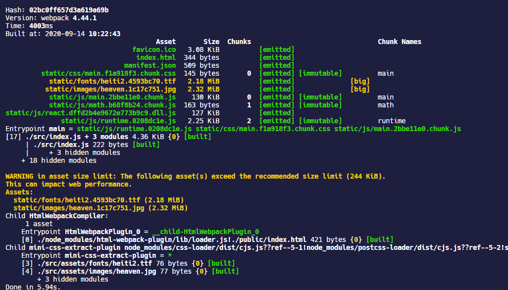
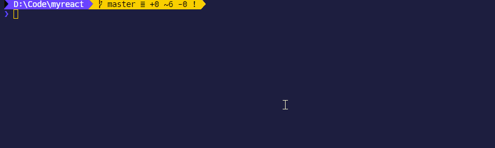

## stats

`stats`是控制 webpack 如何打印出开发环境或者生产环境的打包结果信息。如果是开发环境使用 WDS，还可以在`devServer.stats`配置。



可以为`stats`指定一个字符串：

| 预设                | 描述                                              |
| :------------------ | :------------------------------------------------ |
| `'normal'`          | **默认值**，标准输出                              |
| `'errors-only'`     | 只在发生错误时输出                                |
| `'errors-warnings'` | 只在发生错误或有新的编译时输出                    |
| `'minimal'`         | 只在发生错误或新的编译开始时输出                  |
| `'none'`            | 没有输出                                          |
| `'verbose'`         | 输出全部打包信息，比`'normal'`要更为详细          |
| `'detailed'`        | 全部输出除了 `chunkModules` 和 `chunkRootModules` |

也可以为`stats`指定一个属性的对象，所有属性值见 —— [stats-options](https://webpack.docschina.org/configuration/stats/#stats-options)

## devServer.info

在开发环境下，使用 WDS 会打印出自己独特的 CLI 信息，例如：


这些信息可以通过[`devServer.info` - CLI only](https://webpack.docschina.org/configuration/dev-server/#devserverinfo---cli-only)来禁用，本来这些东西也没啥用，这样再配合一些 webpack 的进度条工具（如 webpackbar 等）就使得控制台信息变得很简洁。

```json
  "scripts": {
    "start": "webpack-dev-server --info=false --env.NODE_ENV=development",
    "build": "webpack --env.NODE_ENV=production"
  },
```


## performance

`performance`是 webpack 内置的负责进行打包性能评估的配置，它提示当前项目内部可能需要进行优化的点，将提示信息输出在控制台。例如，如果一个资源超过 250kb，webpack 会在打包的时候输出到控制台提示信息。


### 配置项

如果将`performance`直接设置成`false`，就可以禁用它。其他的的配置项还有：

- `performance.hints`：指定 webpack 是否在控制台打印性能提示信息，只有三个可选值：

  - `warning`：仅作为提示
  - `error`：把提示信息当成错误来输出

  - `false`：禁用性能提示信息

- `performance.maxEntrypointSize`：配置提示入口文件的大小的限制，默认是`250000`字节，当入口文件超过这个限制就会显示性能提示

- `performance.maxAssetSize`：当 webpack 生成的 bundle 等文件超过`performance.maxAssetSize`指定的大小时，就会发出性能提示信息，默认是`250000`字节。

- `performance.assetFilter`：一个函数配置，接收 webpack 打包生成的文件名，然后根据规则指定使用哪些文件来计算性能提示。

## FileSizeReporter

CRA 内部是直接禁用了`performance`这个配置项，使用它们自己开发的[`FileSizeReporter`](https://github.com/facebook/create-react-app/tree/master/packages/react-dev-utils#filesizereporter)来进行性能评估。


应该可以通过`react-dev-utils`集成`FileSizeReporter` ，但是我还没找到这玩意怎么用的。

## webpack-bundle-analyzer

[`webpack-bundle-analyzer`](https://github.com/webpack-contrib/webpack-bundle-analyzer)是一个 plugin 和 CLI 工具，它将 bundle 内容展示为一个便捷的、交互式、可缩放的树状图形式。

### 配置项

| Name                    | Type                                                         | Description                                                  |
| ----------------------- | ------------------------------------------------------------ | ------------------------------------------------------------ |
| **`analyzerMode`**      | 默认是`server`, 其它可选`static`, `json`, `disabled`         | `server`模式会开启一个服务器展示打包结果；<br />`static`模式会生成一个 HTML 页面；<br />`json`模式会生成一个 JSON 文件；<br />`disabled`模式需要同时设置`generateStatsFile:true`，只会生成一个 JSON 文件 |
| **`analyzerHost`**      | `{String}`                                                   | Default: `127.0.0.1`. Host that will be used in `server` mode to start HTTP server. |
| **`analyzerPort`**      | `{Number}` or `auto`                                         | Default: `8888`. Port that will be used in `server` mode to start HTTP server. |
| **`reportFilename`**    | `{String}`                                                   | Default: `report.html`. Path to bundle report file that will be generated in `static` mode. It can be either an absolute path or a path relative to a bundle output directory (which is output.path in webpack config). |
| **`reportTitle`**       | `{String|function}`                                          | Default: function that returns pretty printed current date and time. Content of the HTML `title` element; or a function of the form `() => string` that provides the content. |
| **`defaultSizes`**      | One of: `stat`, `parsed`, `gzip`                             | Default: `parsed`. Module sizes to show in report by default. [Size definitions](https://github.com/webpack-contrib/webpack-bundle-analyzer#size-definitions) section describes what these values mean. |
| **`openAnalyzer`**      | `{Boolean}`                                                  | 默认是`true`，是否默认在浏览器打开打包结果页面               |
| **`generateStatsFile`** | `{Boolean}`                                                  | 默认是`false`，是否生成打包结果的 JSON 文件                  |
| **`statsFilename`**     | `{String}`                                                   | 默认是`stats.json`，生成打包结果的 JSON 文件的文件名         |
| **`statsOptions`**      | `null` or `{Object}`                                         | Default: `null`. Options for `stats.toJson()` method. For example you can exclude sources of your modules from stats file with `source: false` option. [See more options here](https://webpack.js.org/configuration/stats/). |
| **`excludeAssets`**     | `{null|pattern|pattern[]}` where `pattern` equals to `{String|RegExp|function}` | Default: `null`. Patterns that will be used to match against asset names to exclude them from the report. If pattern is a string it will be converted to RegExp via `new RegExp(str)`. If pattern is a function it should have the following signature `(assetName: string) => boolean` and should return `true` to _exclude_ matching asset. If multiple patterns are provided asset should match at least one of them to be excluded. |
| **`logLevel`**          | One of: `info`, `warn`, `error`, `silent`                    | Default: `info`. Used to control how much details the plugin outputs. |

### 使用

```shell
yarn add webpack-bundle-analyzer -D
```

下面的配置是让`webpack-bundle-analyzer`针对打包结果只生成一个 JSON 文件，然后使用其内置的 CLI 和 npm-script 结合的方式，在需要的时候使用命令行在浏览器打开显示打包结果的页面。

`analyzerMode: "disabled"`或者`analyzerMode: "json"`这个配置是需要的，如果不加这个配置项虽然打包结束不会自动打开浏览器页面，但是还是会开启一个 HTTP 服务，这样打包运行完，控制台终端还是处于运行状态，不会结束。

```javascript
module.exports = {
  ...
  plugins: [
    // 仅在生产环境打包时使用
    isProduction &&
      new BundleAnalyzerPlugin({
        analyzerMode: "disabled",			//或者设置成"json"
        openAnalyzer: false,
        generateStatsFile: true,
        statsFilename: "stats.json",
      }),
  ]
}
```

然后在`package.json`中配置打开[`webpack-bundle-analyzer`的 CLI 命令](https://github.com/webpack-contrib/webpack-bundle-analyzer#options-for-cli)

```json
"scripts": {
  "analyze": "webpack-bundle-analyzer --port 8888 ./build/stats.json"
}
```

然后执行`yarn analyze`就可以在默认浏览器打开生成的 JSON 文件，显示 bundle 分析树状图。


### 树状图怎么看

对于上面这张树状图，可以了解出以下信息：

- 打包过程生成了 2 个 bundle 文件，对应于图中最外层包裹的 bundle 文件名 —— `1.mian.js`和`main.js`
- `1.mian.js`中的模块全部来自`node_modules`，这对应于上文中我们说的 SplitChunksPlugin 的默认拆分，它将项目中所有从`node_modules`导入的以来单独打包成一个 chunk；除此之外还能层层深入分析 chunk 之间包含了其它哪些模块
- 在整个依赖图中，可以清楚的看到`react-dom.production.min.js`所占的体积最大，所以它占的图的面积最大
- 根据这个就能具体分析项目中具体哪个模块生成的代码需要进行拆分优化

## speed-measure-webpack-plugin

[`speed-measure-webpack-plugin`](https://github.com/stephencookdev/speed-measure-webpack-plugin)是一个分析 webpack 打包流程执行时间的插件。

```shell
yarn add speed-measure-webpack-plugin -D
```

```javascript
const SpeedMeasurePlugin = require('speed-measure-webpack-plugin');
const smp = new SpeedMeasurePlugin();

module.exports = function(env) {
  const isDevelopment = env.NODE_ENV === "development";
  const isProduction = env.NODE_ENV === "production";
  const webpackConfig = {
    entry:,
    module:,
    //...
  }

  return isProduction ? smp.wrap(webpackConfig) : webpackConfig;
};
```

这样配置完了以后，就可以在执行`yarn start`或者`yarn build` 的时候在控制台显示出每一步执行 webpack 的 loader 或者 plugin 所耗费的时间，这里有几个插件的分析指标：

- `general output time`：可以认为是 loader 和 plugin 的执行时间，但是这其中还包括了 webpack 从硬盘读取这些 loader 和 plugin 的时间，这部分是 SMP 无法测量的，所以这个时间总是会小于 loader 和 plugin 的执行时间综合
- `modules with no loaders`：webpack 对于基本的 JS 文件的处理


### 配置项

可以在初始化`smp`的时候传入这个插件的配置项。

```javascript
const SpeedMeasurePlugin = require('speed-measure-webpack-plugin');
const smp = new SpeedMeasurePlugin({
  //options
});
```

| 配置项               | 类型              | 默认值        | 含义                                                         |
| -------------------- | ----------------- | ------------- | ------------------------------------------------------------ |
| `disable`            | `Boolean`         | `false`       | 是否禁用本插件                                               |
| `outputFormat`       | `String`          | `"human"`     | 默认是输出可读性更强的形式，其它还可以指定`"json"`，输出 JSON 格式；`"humanVerbose"`输出的信息会更为详细 |
| `outputTarget`       | `String|Function` | `console.log` | 可以指定一个文件路径字符串写入插件的分析结果；也可以指定一个函数在输出结果的时候调用 |
| `pluginNames`        | `Object`          | `{}`          | 为 webpack 执行的插件自定义一个名称，默认是使用插件构造函数的名称 |
| `granularLoaderData` | `Boolean`         | `false`       | 默认情况下，本插件会分组进行 loader 的执行时间分析，如果设置成`true`，那么会给出每一个 loader 的执行时间，这种情况下，有些 loader，例如`thread-loader`和`file-loader`分析的结果会不准确。甚至会报错 |

## webpackbar

[`webpackbar`](https://github.com/nuxt/webpackbar)是一个的 webpack 打包进度条工具，尤其是把 webpack 的`stats`设置成`"errors-only"`的时候，还是挺好看的。

### 配置项

| 配置项      | 类型       | 默认值      | 含义                                                         |
| ----------- | ---------- | ----------- | ------------------------------------------------------------ |
| `name`      | `String`   | `"webpack"` | 进度条上面显示的文字，会自动大写开头                         |
| `color`     | `String`   | `"green"`   | 进度条的颜色，可以使用 HEX 形式的 color 值                   |
| `profile`   | `Boolean`  | `false`     | 没研究出来这个开不开有啥区别                                 |
| `fancy`     | `Boolean`  | `true`      | 是否显示进度条                                               |
| `basic`     | `Boolean`  | `true`      | 如果要自定义 reporter，这个需要设置成`false`                 |
| `reporter`  | `Function` | `null`      | 自定义的打印进度信息的函数                                   |
| `reporters` | `Array`    | `[]`        | 自定义的一系列监听函数，见 —— [custom-reporters](https://github.com/nuxt/webpackbar#custom-reporters) |

### 使用

```shell
yarn add webpackbar -D
```

```javascript
const WebpackBar = require('webpackbar');

module.exports = {
  plugins: [
    new WebpackBar(), //默认配置就行
  ],
};
```

效果如图所示：

