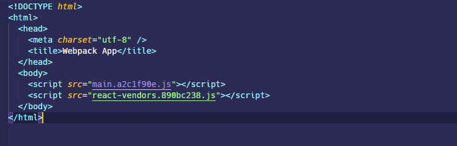

## 思路

`webpack`是可以轻易做到分入口打包的，主要思路就是从不同`entry`配置入口，然后根据`html-webpack-plugin`的配置分别将不同的`chunks`插入到不同的页面中最终生成出来。

在测试之前先看一下`webpack`的`entry`的配置，需要注意的是`V4`和`V5`的配置不一样，`V5`的改动比较大

## entry

### V4-entry

> [Entry and Context | webpack](https://v4.webpack.js.org/configuration/entry-context/#entry)

看一下 V4 版本的`webpack`配置，支持字符串，字符串数组，对象，函数四种配置形式。

- 字符串，字符串数组：需要传入每个入口文件的路径，生成的 chunk 会被命名为`main`
- 对象：对象的每个属性就是 chunk 的名称，属性值就是该入口文件的路径
- 函数：根据函数的返回值动态修改的入口，返回入口文件的路径，该函数会在`webpack`启动或者在`webpack`监视文件更改以后触发

### V5-entry

> [Entry and Context | webpack](https://webpack.js.org/configuration/entry-context/#entry)

V5 版本的`webpack`配置丰富了许多，依旧是支持字符串，字符串数组，对象，函数四种配置形式。不过添加了一些额外的属性。

- 字符串，字符串数组：需要传入每个入口文件的路径，生成的 chunk 会被命名为`main`
- 对象：对象的每个属性就是 chunk 的名称，属性值就是该入口文件的路径，但是同时支持以下额外的属性配置：
  - `import`和`filename`：`import`和`filename`配合使用指定特定的入口文件路径和生成的 chunk 名称，如果不指定`filename`则默认使用属性名作为 chunk 名，`filename`和`output.filename`完全一致，同样支持`[hash]`，`[contenthash]`等模板字符串。
  - `dependOn`：`dependOn`用于在一个入口内部指定其依赖其他入口生成的 chunk，通常用于将第三方`node_modules`的文件拆出来单独生成一个 chunk，然后其他入口使用`dependOn`引入这个依赖。

```javascript
  entry: {
    main: {
      import: "./src/index.jsx",
      filename: "main.[contenthash:8].js",
      dependOn: "react-vendors",
    },
    test: {
      import: "./src/test.jsx",
      filename: "test.[contenthash:8].js",
      dependOn: "react-vendors",
    },
    "react-vendors": ["react", "react-dom"],
  },
```


## output

由于添加了多个入口，所以最后生成的 bundle 名也需要使用动态生成的配置，即使用`[name]`可替换模板字符串来做

```javascript
  output: {
    filename: "[name].[contenthash:8].js",
    path: path.resolve(__dirname, "dist"),
  },
```

## html-webpack-plugin

> [jantimon/html-webpack-plugin (github.com)](https://github.com/jantimon/html-webpack-plugin)

`html-webpack-plugin`是一个可以将`webpack`构建生成的`bundle.js`或者`bundle.css`插入到 HTML 页面中的`plugin`，这里主要使用其`filename`、`chunks`和`excludeChunks`来做分入口打包的配置。

- `filename`指定生成的 HTML 文件的路径，注意是路径，支持`/`目录写入

- `chunks`也就是当前生成的 HTML 页面包含的 chunk(bundle)名称
- `excludeChunks`也就是需要排除的 chunk(bundle)名称

可以在`webpack`的`plugins`配置项中多次引入`html-webpack-plugin`的实例，每引入一次就应该额外配置一个`filename`去生成单独的 HTML 文件，否则不会起任何作用也不会报错。推荐是使用同一个`template`，毕竟 HTML 都一样，没必要单独做个页面出来，除非页面布局不一致。

```javascript
plugins: [
  new HtmlWebpackPlugin(
    Object.assign(
      {},
      {
        inject: true,
        template: 'index.html',
        chunks: ['main', 'react-vendors'],
        filename: 'main.html',
        minify: {
          removeComments: true,
          collapseWhitespace: true,
          removeRedundantAttributes: true,
          useShortDoctype: true,
          removeEmptyAttributes: true,
          removeStyleLinkTypeAttributes: true,
          keepClosingSlash: true,
          minifyJS: true,
          minifyCSS: true,
          minifyURLs: true,
        },
      },
    ),
  ),
  new HtmlWebpackPlugin(
    Object.assign(
      {},
      {
        inject: true,
        template: 'index.html',
        chunks: ['test', 'react-vendors'],
        filename: 'test.html',
        minify: {
          removeComments: true,
          collapseWhitespace: true,
          removeRedundantAttributes: true,
          useShortDoctype: true,
          removeEmptyAttributes: true,
          removeStyleLinkTypeAttributes: true,
          keepClosingSlash: true,
          minifyJS: true,
          minifyCSS: true,
          minifyURLs: true,
        },
      },
    ),
  ),
];
```


