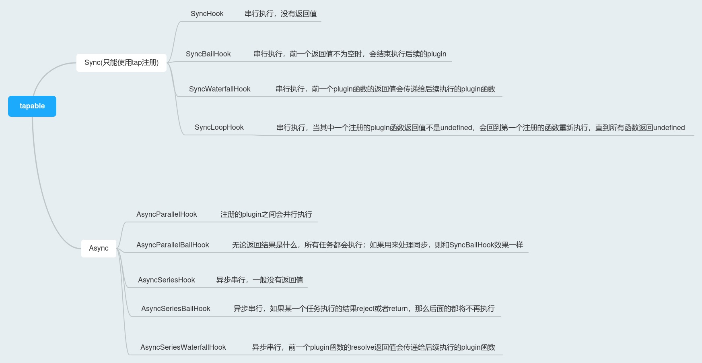

## webpack 基本概念

`webpack`有以下概念：

- `entry`：构建入口，分为单入口和多入口，入口不同`webpack`构建过程生成的依赖树也不会相同，最红也会生成不同的`chunk`
- `loader`：模块编译器，用于处理不同文件类型的模块代码，在`webpack`里每个单独的文件都可以成为一个单独的`module`，这些单独的`module`需要通过不同的`loader`解析，例如`babel-loader`解析`jsx`代码生成普通的`React.createElement`代码，`less`转换成`css`等
- `plugin`：顾名思义，拓展程序，对不同类型的模块生成的代码进一步处理的程序，例如压缩混淆`js`代码，将构建生成 的`js`、`css`代码插入`html`
- `chunk`：代码块`chunk`对应的是代码分割的概念，即`code splitting`，代码分割即将`webpack`生成的`bundle`拆分成不同的代码块去加载，该功能收益来自于 HTTP 缓存机制，对一些项目中基本不变的代码模块抽取出一个单独的`chunk`进行处理，会在代码更新的时候避免请求该`chunk`，从而提高页面加载速度，提升用户体验。
- `resolve`：`resolve`在`webpack`中负责解析模块路径，或者提供方便开发的 `alias`功能等

## 构建流程


### 获取配置项

`webpack`支持通过配置文件（`webpack.config.js`），或者`CLI`的方式向`webpack`传递配置项，且**`CLI`方式注入的配置项优先级高于配置文件中的配置项**。

### 实例化 compiler 对象

如果使用`webpack`的 nodejs 接口来编写`webpack`的启动程序，这一过程可以直观地感受到，通过 nodejs 接口会直接返回一个`compiler`对象。

```javascript
const webpack = require('webpack');

// 传入配置项作为参数，获取compiler对象
const compiler = webpack({ ...options });
```

### 构建依赖 graph

`compiler`对象内部的`run`异步方法会启动构建流程，首先从`entry`访问入口文件开始，调用`loader`编译模块代码，将模块之间的引用全部转换成`nodejs`的[`CommonJS`语法](http://nodejs.cn/api/modules.html)，然后使用`Acorn`转换成`AST`，根据`ImportDeclaration`节点类型递归解析依赖模块，重复这个过程，最后形成一个依赖树。

```javascript
const acorn = require("acorn")
const walk = require("acorn-walk")

class Compiler {
  constructor(options) {
		this.entry = options?.entry;
    this.output = options?.output;
    this.module = options?.module;
    this.modules = [];
  }

  // 执行构建流程
  run() {
    this.modules.map((_module) => {
      _module.dependencies.map((dependency) => {
        this.modules.push(this.buildModule(dependency));
      });
    });

    this.emitFiles();
  }

  buildModule(fileName = this.entry) {
    const dependencyGraph = [];
    // 使用指定的loader去编译模块代码
		const loader = this.module.rules.find(v => v.test.test(fileName));
    // 获取模块源代码
    const source = fs.readFileSync(fileName, "utf-8");
    const transformCode = require(loader.loader)(source);

    // 将编译后的js模块代码使用acorn获取ast并遍历获取依赖树
    walk.transformCode(acorn.parse(transformCode), {
      if(node.type === 'ImportDeclaration') {
				dependencyGraph.push(node.value);
      }
    })

    return {
      filename, // 文件名称
      dependencies: dependencyGraph, // 依赖列表
      transformCode, // 转化后的代码
    };
  }

  // 输出chunk
  emitFiles() {}
}
```

### 注入 require 方法

对于最终生成的所有依赖模块极其内部的代码，会通过`__webpack__require`这个方法去执行。其内部具有缓存机制，对于已经加载执行的模块代码会直接返回结果。

```javascript
function __webpack__require(moduleId) {
  // 对于已经加载的模块，直接返回结果
  if (installedModules[moduleId]) {
    return installedModules[moduleId].exports;
  }

  // 没有加载的模块在installedModules创建新的缓存记录
  const module = (installedModules[moduleId] = {
    id: moduleId,
    loaded: false,
    exports: {},
  });

  // 调用模块内部的方法，获取module.exports
  module[moduleId].call(
    module.exports,
    module,
    module.exports,
    __webpack__require,
  );

  // 标记模块加载
  module.loaded = true;
  return module.exports;
}
```

### 生成代码

最终生成的代码会使用 IIFE 来包裹，其参数就是依赖 graph，执行程序就是`__webpack__require`

```javascript
class Compiler {
  //...

  emitFiles() {
    let modules = '';
    this.modules.map(_module => {
      modules += `'${_module.filename}' : function(require, module, exports) {${_module.transformCode}},`;
    });

    const bundle = `
        (function(modules) {
          function require(fileName) {
            const fn = modules[fileName];
            const module = { exports:{}};
            fn(require, module, module.exports)
            return module.exports
          }
          require('${this.entry}');
        })({${modules}})
    `;

    fs.writeFileSync(outputPath, bundle, 'utf-8');
  }
}
```

## 编写 loader

### loader 是什么

一个函数，用于编译源代码内部不同类型的模块，拓展`webpack`的解析能力，接收以下三个参数：

- `content`：源代码
- `map`：可以被 https://github.com/mozilla/source-map 使用的 SourceMap 数据
- `meta`：meta 数据，可以是任何内容

`loader`可以直接返回处理后的代码，表示该`loader`是以同步模式运行的

```javascript
module.exports = function(content, map, meta) {
  let result = '';

  // 一些处理
  return result;
};
```

当`loader`内部具有异步处理时，需要对结果使用`callback`函数进行包装，`callback`依次接收四个参数：

- `error`：第一个参数是错误信息`Error`或者`null`
- `result`：第二个参数则是处理过后的代码
- `source map`：第三个参数是 source map
- `meta`：第四个参数，会被 webpack 忽略，可以是任何类型的参数

```javascript
module.exports = function(content, map, meta) {
  var callback = this.async();
  someAsyncOperation(content, function(err, result) {
    if (err) return callback(err);
    callback(null, result, map, meta);
  });
};
```

### loader 的链式调用

`module.rules.use`这个数组传递的多个`loader`按照数组索引的顺序从后往前执行，第一个执行的`loader`会获取模块源代码作为参数，然后其执行结果会传递给下一个执行的`loader`，最后一个`loader`执行期望返回`JS`代码和`sourcemap`；比较常见的就是`less`的处理流程

```javascript
module: {
  rules: [
   	test: /\.less$/,
    use: [
    	"style-loader",
    	"css-loader",
    	"less-loader"
  	]
  ]
}
```

### [loader-utils](https://github.com/webpack/loader-utils#readme)

常用于获取在`webpack`配置项中传递给`loader`的参数配置，返回的参数配置项是一个**只读**的对象

```javascript
// 在loader内部使用
const loaderUtils = require('loader-utils');
const options = loaderUtils.getOptions(this);

// 通过queryString指定的配置项，例如loader?some&params
const params = loaderUtils.parseQuery(this.resourceQuery);
```

### [schema-utils](https://github.com/webpack/schema-utils)

`schema-utils`可以对`loader`获取的配置参数进行校验，从`schema-utils`中获取的`validate`方法接收三个参数：

- `schema`：用于定义`options`配置项的类型和校验不通过时的描述，也就是校验规则
- `options`：即外部传递进来的配置项
- `configuration`：最后一个参数用于补充对于`schema`的描述信息

```javascript
import { getOptions } from 'loader-utils';
import { validate } from 'schema-utils';

// 校验规则
const schema = {
  type: 'object',
  properties: {
    name: {
      type: 'string',
    },
    query: {
      type: 'number',
    },
  },
  additionalProperties: false,
};

function loader(src, map) {
  const options = getOptions(this);

  validate(schema, options, {
    name: 'Loader Name',
    baseDataPath: 'options',
  });

  // Code...
  return `function() {xxx}`;
}

export default loader;
```

### 编写 loader 的注意事项

- 功能单一原则
- 禁止写绝对路径
- 复用模块抽离

## 编写 plugin

### 什么是 plugin

一个`class`，内部一个`apply`方法，over！

`plugin`主要用于拓展`webpack`能力，在`loader`的基础上对生成的代码进一步处理。编写`plugin`需要对`webpack`的生命周期事件有一定的了解，而`webpack`生命周期事件建立在`tapable`基础上。

### tapable

`webpack`的整个生命周期流程基于[`tapable`](https://github.com/webpack/tapable#tapable)，在`tappable`中提供以下基础`hook`：

```javascript
const {
  SyncHook,
  SyncBailHook,
  SyncWaterfallHook,
  SyncLoopHook,
  AsyncParallelHook,
  AsyncParallelBailHook,
  AsyncSeriesHook,
  AsyncSeriesBailHook,
  AsyncSeriesWaterfallHook,
} = require('tapable');
```

这些`hook`代理的`plugin`函数的执行顺序和它们的名称具有很大关系，不过好在也没多少需要记忆的，常见的也就是`SyncHook`、`SyncBailHook`、`AsyncSeriesHook`。



`tapable`的使用比较简单，一般是在实例属性`hooks`上基于上述 hook 的实例注册新的生命周期 hook，然后单独的实例就可以通过`hooks`属性访问这些注册的生命周期；在实例化基础 hook 的时候可以指定一个字符串数组作为参数，这些字符串数组后续会回调函数的参数名。

```javascript
// Compilation 继承自 Tapable
class Compilation extends Tapable {
  /**
   * Creates an instance of Compilation.
   * @param {Compiler} compiler the compiler which created the compilation
   */
  constructor(compiler) {
    // 塑造子类 this
    super();
    // 在实例属性 hooks 上注册以下 hook
    this.hooks = {
      buildModule: new SyncHook(['module']),

      rebuildModule: new SyncHook(['module']),

      failedModule: new SyncHook(['module', 'error']),

      succeedModule: new SyncHook(['module']),

      addEntry: new SyncHook(['entry', 'name']),

      failedEntry: new SyncHook(['entry', 'name', 'error']),

      succeedEntry: new SyncHook(['entry', 'name', 'module']),

      dependencyReference: new SyncWaterfallHook([
        'dependencyReference',
        'dependency',
        'module',
      ]),

      /** more **/
    };
  }
}

// 使用 tap、tapAsync、tapPromise等方法编写 plugin 回调函数
const compilation = new Compilation();

compilation.hooks.calculateRoutes.tap('EntryPlugin', (entry, name) => {
  // ...
});
```

对于注册自`Sync`开头的 hook 只能使用`tap`方法来注册回调函数，而基于`AsyncSeries`和`AsyncParallel`这些生命周期 hook 可以使用`tap`、`tapAsync`和`tapPromise`来注册回调函数。

`tapPromise`通常会返回`promise`对象，而`tapAsync`注册的回调函数会带有一个额外的`callback`参数，需要在适当的时候调用这个`callback`方法来通知`webpack`继续执行后续任务。

```javascript
compiler.hooks.entryOption.tap('MyPlugin', (context, entry) => {
  /* ... */
});

compiler.hooks.beforeCompile.tapAsync('MyPlugin', (params, callback) => {
  params['MyPlugin - data'] = 'important stuff my plugin will use later';
  callback();
});

compiler.hooks.run.tapPromise('MyPlugin', (source, target, routesList) => {
  return new Promise(resolve => setTimeout(resolve, 1000)).then(() => {
    console.log('以异步的方式触发具有延迟操作的钩子。');
  });
});
```

### 生命周期 hook

在`webpack`内部基于`tapable`提供的基础 hooks，又封装了一些单独的生命周期`hook`，它们可以在`plugin`内部使用，如你所见，在`webpack`文档中就列举了巨量的`hook` —— [compiler 钩子 | webpack 中文文档 (docschina.org)](https://webpack.docschina.org/api/compiler-hooks/).

- `compiler`：`compiler`对象相当于`webpack`构建程序的实例，伴随`webpack`构建的整个生命周期
- `compilation`：`compilation`对象会在每次触发重新编译的时候在`compiler`内部重新创建一个实例，所以`compilation`注册的 hook 函数会在每次编译的时候都会执行
- `parser`：`parser` 位于 [NormalModuleFactory](https://webpack.docschina.org/api/compiler-hooks/#normalmodulefactory) 中，需要在`compiler.hooks.normalModuleFactory`的内部访问，主要在`webpack`内部解析`AST`的时候触发

```javascript
compiler.hooks.normalModuleFactory.tap('MyPlugin', factory => {
  factory.hooks.parser
    .for('javascript/auto')
    .tap('MyPlugin', (parser, options) => {
      parser.hooks.someHook.tap(/* ... */);
    });
});
```

- `resolverFactory`和`ContextModuleFactory`主要是在`webpack`解析文件目录的时候触发

一般关注比较多的还是`compiler`和`compilation`这两个对象内部的生命周期 hook，在使用它们编写插件的时候需要注意根据文档里的继承关系看清楚使用的是哪个基础 hook 注册的，以使用`tap`、`tapAsync`或者`tapPromise`来对应注册回调函数。

