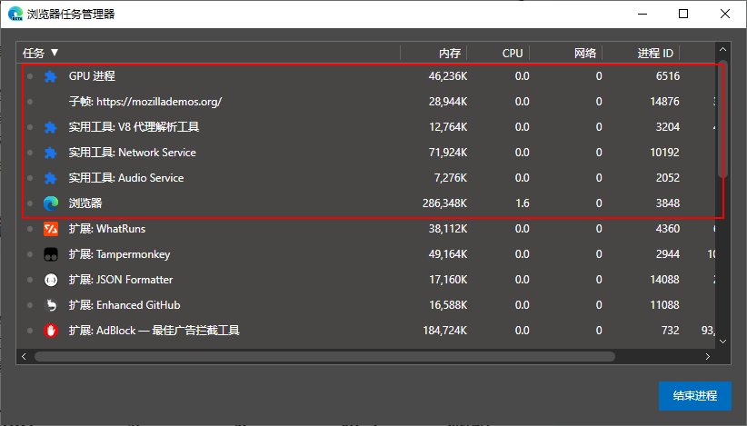

## 浏览器的工作进程

在熟悉 URL 到 web 展示之前，首先需要了解浏览器的软件架构。以目前市场占有率最高的 Chrome 浏览器为例，Chrome 主要基于开源的 Chromium 项目包装了 UI 等程序。

| Compare  | Chrome                                                       | Chromium                                                     |
| -------- | ------------------------------------------------------------ | ------------------------------------------------------------ |
| 是否开源 | 闭源                                                         | 以 BSD 许可协议开源                                          |
| 隐私性   | 会自动收集信息并将其传输给 Google，例如崩溃报告，使用情况统计信息，设备操作系统等 | 不会自动收集浏览器的崩溃信息，也不会收集用户信息             |
| 稳定性   | 更胜一筹                                                     |                                                              |
| 更新机制 | 会自动下载并安装更新                                         | 需要手动下载和安装补丁                                       |
| 拓展     | 除了基本的免费编解码器：Opus，Theora，Vorbis，VP8，VP9 和 WAV，还集成了 flash，支持播放 H.264 编码的视频，支持专有媒体格式 AAC，H.264 和 MP3 的许可编解码器 | 只支持基本免费编解码器：Opus，Theora，Vorbis，VP8，VP9 和 WAV |

### Chromium 的多进程架构

> [Multi-process Architecture](https://www.chromium.org/developers/design-documents/multi-process-architecture)

Chromium 采用的是多进程架构，在启动的时候就会开启多个进程来完成页面的渲染和其它一些任务。

| 进程                     | 说明                                                         |
| ------------------------ | ------------------------------------------------------------ |
| 浏览器主进程             | 浏览器的主进程包括 UI 线程，例如地址栏，书签栏，前进后退按钮等； 负责用户交互； 负责管理其他子进程； 同时还包含提供存储功能的存储线程 |
| Network Service 网络进程 | 负责网络请求，例如页面资源文件 HTML，JS，CSS 的加载；网络进程本来是浏览器主进程的一个线程，但是后来独立成为一个进程 |
| 渲染进程                 | 渲染进程主要负责浏览器的每一个标签页里面内容呈现，Chrome 的 Blink 引擎和 V8 引擎都是工作在这个进程的，Blink 负责解析 HTML 和 CSS 以及页面渲染等；V8 负责执行 JS |
| GPU 进程                 | GPU 的使用初衷是为了实现 3D CSS 的效果，随后 Chrome 也使用 GPU 来绘制浏览器的 UI 框架 |
| 多个插件进程             | 每个插件都是独立运行在单独的进程中                           |
| V8 代理解析工具          | 解析 PAC，PAC 是一种网页浏览器技术，用于定义浏览器该如何自动选择适当的代理服务器来访问一个网址，也就是翻墙 |

### 不同的渲染进程模式

实际上 Chromium 在渲染页面的时候支持使用不同的进程模型来开启渲染进程，默认情况下 Chromium 对用户访问的网站的每个实例使用单独的 OS 进程（也就是一个标签页就是一个进程）；但是用户仍然可以指定命令行开关选择其它模型。

> [Process Models](https://www.chromium.org/developers/design-documents/process-models)

- `site`：Chrome 定义`site`的方式是协议`scheme`和主机名称`hostname`，并且包含子域名和端口号，例如 mail.google.com 和 docs.google.com，或者 google.com 和 google.com:8080 都属于相同的`site`；这是为了不同子域名的页面或站点端口不同的页面能够通过 Javascript 相互访问；
- Process-per-site-instance：默认情况下 Chrome 会为`site`的每一个实例开启一个进程，也就是打开一个链接地址就开启一个进程，这种方式的好处是隔离不同站点也隔离了同一站点的不同页面，即使是同一个站点的内容，如果在一个页面中填写表单崩溃，也不会影响到同站点的另一个页面；但是这种方式也带来更高操作系统内存占用；
- Process-per-site：同一个`site`的所有实例都放到一个渲染进程中；
- Process-per-tab：每一个选项卡是一个单独的渲染进程；
- Single process：更简单了，就一个渲染进程搞定所有页面。

### 多进程架构的优劣

- 最重要的两点是多进程保证网页访问的稳定性和安全性，即使是同一个网站，当开启不同页面时，使用多进程的方式为每个页面单独打开一个进程，也能保证足够的页面稳定性！不仅如此，页面的 JS 文件，浏览器插件等也很容易让页面发生崩溃，如果将插件和每个页面都单独放置在一个进程内，由于进程之间相互独立，即使一个进程崩溃也不会影响其他进程运行，并且进程之间无法直接通信，这样既保证稳定性又保证安全性；
- 从开发角度看，多进程之间通信比较困难；从用户角度看，多进程模式很容易造成操作系统内存占用提高

## 从 URL 解析到 Web 展示

​		从 URL 到 web 页面显示这之间的过程不是一句两句能概括的，但是从前端能感知的角度出发，可以把过程大致概括为以下 9 个阶段：

### 构建 URL

当用户在地址栏键入 URL 时，UI 线程会判断这是一个网络地址还是搜索查询的内容，

- 如果是搜索内容，UI 线程会根据浏览器的默认搜索引擎合成搜索 URL；
- 如果是一个域名，UI 线程会判断是否要为域名添加协议等内容组成一个完整的 URL；

之后，UI 线程会把 URL 提交给网络进程进行处理。

### 查找缓存

网络进程在收到 URL 请求以后，会查找资源缓存。现代浏览器内部都内建了私有缓存，根据 HTTP 缓存策略去选择是否将 web 资源暂时保存在内存中，或者持久化到电脑磁盘文件中。浏览器内部的缓存机制有以下几种：

- 内存缓存：内存缓存保存了 web 页面整个生命周期阶段中从网络请求获取到的资源，同时针对指定了`preload`属性的资源，也会提前请求并缓存在内存中；
- `Service Worker`缓存：Service Worker 本身带有缓存相关的方法，主要是为了离线 web 网页而使用，web 开发者可以指定缓存的内容，具体的参考 —— [使用 Service Workers - Web API 接口参考 | MDN (mozilla.org)](https://developer.mozilla.org/zh-CN/docs/Web/API/Service_Worker_API/Using_Service_Workers)
- 磁盘缓存：磁盘缓存通常用于缓存较大体积文件，此时受制于电脑内存容量，已无法使用内存缓存。
- `Push Cache`：作为 HTTP2 Session 的一部分，存留时间大概 5 分钟（Chrome）。

查找到缓存以后，如果是使用 HTTP1.0 版本的服务器返回的资源，那么只需要根据资源头部使用的`Expires:<Date>`和`Pragma`来确定是否使用缓存。而使用 HTTP1.1+ 版本的服务器，支持在 HTTP 响应首部使用`Cache-control`控制资源缓存策略。

如果可以利用缓存，则浏览器会直接将缓存作为响应返回，不支持的话，就需要开启额外的 TCP 连接去和服务端请求资源。

### DNS解析

DNS（Domain Name Server），域名解析服务器，一般是互联网服务提供商（ISP）或者第三方组织（google）提供的一个公共的服务器资源，用于将域名和对应的 IP 地址映射关系保存起来，并响应客户端请求返回域名对应的 IP 地址。

DNS 查询的记录可以被浏览器或者计算机缓存，例如 chrome 内部可以使用`chrome://net-internals/#dns`查看缓存的 DNS 记录，而计算机内置的 DNS 客户端也可以缓存查询记录。如果没有缓存，则 DNS 查询请求就会被转发到 ISP 指定的 DNS 服务器或者第三方 DNS 服务器，由它们内部的 DNS 解析器开启 DNS 解析过程。

DNS 解析采用递归解析的方式来返回域名对应的 IP 地址，并且使用网络运输层 UDP 协议建立连接，因为 UDP 协议不需要建立连接即可发送请求，所以过程非常迅速，例如查询`example.com`的过程如下：

1. DNS 解析器查询根域名服务器，获取顶级域名（`.com`）服务器的 IP 地址；
2. 继续向顶级域名服务器发送请求，获取到权威域名`example.com`对应的 IP 地址；
3. 此时 DNS 解析器就可以将 IP 地址返回给本地计算机，这样浏览器就可以获取域名对应的 IP 地址；而如果还有三级域名这种的结构`xxx.example.com`，则还需要向权威域名发送查询请求，权威域名会返回附加域名的 IP 地址

### 建立 TCP 连接

获取到域名对应的 IP 地址以后，浏览器就可以像目标 IP 地址建立 TCP 连接，TCP 连接建立的过程不用多说 —— 三次握手，更准确来说应该是一次握手，三报文交换。

### 发送 HTTP 请求并接收响应

紧接上文缓存机制说起，根据 HTTP 缓存策略，浏览器需要对以下几种类型的缓存发送再验证请求，再验证一般使用 GET 方法向服务器发送请求确认缓存资源可以使用，如果缓存有效，服务端返回 HTTP 响应状态码`304`，而如果缓存失效，则服务端会返回新的资源和`200`状态响应。

1. `Pragma: no-cache`：用于 HTTP1.0 时代；缓存资源必须进行验证
2. `Cache-control: no-cache`：对缓存的资源每次都必须进行验证
3. `Cache-control: must-revalidate`：对过期的缓存资源必须进行验证

当网络进程收到服务器发来的 HTTP 报文时，会首先判断响应状态码，如果是`301`，`302`，`307`之类的重定向响应，网络进程还会根据响应头部的`Location`字段再次发起重定向请求新的 URL。

如果是`200`之类表示请求成功的响应，则会根据 HTTP 响应首部字段的`Content-Type`字段区分数据的类型，不同类型的数据需要不同的解析程序。例如 HTML 需要提交渲染进程进行 DOM 解析，而`application/octet-stream`之类的下载资源文件，网络进程就会提交下载请求到浏览器的下载管理器进行下载。

### DOM 解析

当浏览器获取到服务端发送的 HTML 文档以后，就会开启 DOM 解析的过程。DOM 解析的过程是将 HTML 代码字符解析转换成 DOM 对象，也就是编译的几个阶段：

1. 解码：从 HTTP 返回的报文都是编码过的字节流数据，需要从`Content-Type`获取编码方式，然后转换成源代码字符；
2. 词法分析：逐个分析 HTML 代码字符，根据 HTML 的标签语法等特点，将带个字符重新组合成标签元素，得到`tokens`；
3. 语法分析：对`tokens`进行遍历，将它们之间重新建立起 DOM 对象上下文的结构关系，最终组成 DOM 对象

在 DOM 解析的过程中，对于 CSS 和 JS 资源还需要请求加载才能解析，其中还有一些预加载资源：

- `<link rel="preload">`：在`link`标签内部指定`preload`属性会让浏览器尽快请求某个资源文件并且缓存下来，这样后续遇到该资源的时候就可以更快加载执行；
- `<link rel="prefetch">`：在`link`标签内部指定`prefetch`指定浏览器在空闲时间请求某个资源并缓存下来，相比`preload`适合预加载页面低优先级的一些资源文件；
- `<script defer>`：先请求 JS 文件，等到 HTML 解析完成以后触发 `DOMContentLoaded` 事件前去执行；
- `<script async>`：先请求 JS 文件，等 JS 请求完就会加载执行
- `<script type="module">`对于 ES Modules 模块内部 JS，行为和`defer`一致

在解析 HTML 的过程中，同时还会请求加载 CSS 并解析得到 CSSOM，CSSOM 也是一个树形结构，会把 DOM 元素和 CSS 样式关联起来。

计算 DOM 节点的样式需要根据 CSS 的继承和层叠规则来进行，一个 DOM 节点的样式可以来源于以下方面：

- 元素的 `style` 属性内嵌的 CSS
- 页面`<style>`内嵌的 CSS
- 页面`<link>`引入的 CSS
- 浏览器的用户代理样式
- 继承自父节点的样式

在 JS 中可以使用`Window.getComputedStyle(element)`这个 API，这个方法返回一个元素的最终计算得到的所有 CSS 属性值。

### 构建 render 树

得到 DOM 和 CSSOM 以后，浏览器会将两者组合起来，构建 render 树，主要是以下过程：

- 遍历 DOM 节点，筛选页面可见的 DOM 元素，剔除`script`，`meta`等元素以及`display:none`等不可见的元素；
- 从 CSSOM 查找适用于当前节点的样式
- 返回可见元素节点和样式组合

### 布局

得到 DOM 可见节点和样式以后，还需要计算 DOM 节点的尺寸大小和在视口内的位置坐标，也就是布局过程，也成为回流（`reflow`）。

布局过程还需要对节点进行遍历，从父元素开始确定尺寸和位置，然后到子元素一层层进行，相对定位等都会被转换成具体的像素坐标值，最终得到 DOM 节点的盒模型，盒模型能够准确地描述元素的尺寸和在视口内的位置坐标。

### 绘制

绘制又称为光栅化，是浏览器调用操作系统的绘制 API 根据节点的坐标和尺寸将节点元素绘制在屏幕上。到此，完成 HTML 的渲染流程。

