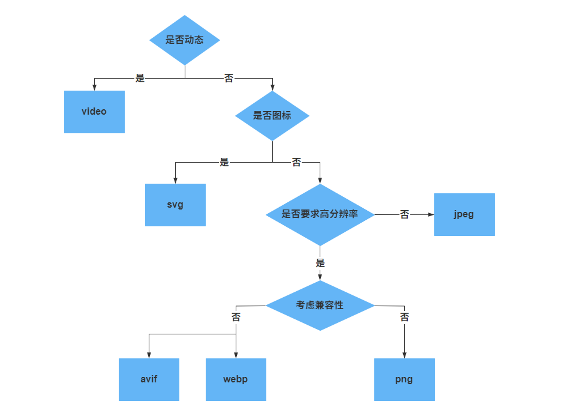

## web图像格式

web 支持的图像格式非常多，常见的有以下这些：

| 格式 | 后缀                                       | MIME            | 压缩方式           | 是否可动态 | 色彩深度                  | 最大像素`px`                  | 图像体积 | 兼容性           |
| ---- | ------------------------------------------ | --------------- | ------------------ | ---------- | ------------------------- | ----------------------------- | -------- | ---------------- |
| JPEG | `.jpg`, `.jpeg`, `.jfif`, `.pjpeg`, `.pjp` | `image/jpeg`    | 有损               | 否         | `8位`                     | `65,535×65,535`               | 较大     | 全兼容           |
| PNG  | `.png`                                     | `image/png`     | 无损               | 否         | `8位`和`16位`             | `2,147,483,647×2,147,483,647` | 大       | 全兼容           |
| APNG | `.apng`                                    | `image/apng`    | 无损               | 是         | `8位`和`16位`             | `2,147,483,647×2,147,483,647` | 较大     | IE不支持         |
| GIF  | `.gif`                                     | `image/gif`     | 无损               | 是         | 不支持                    | `65,536×65,536`               | 大       | 全兼容           |
| SVG  | `.svg`                                     | `image/svg+xml` | 无损（可优化）     | 否         | -                         | 无限                          | -        | 全兼容           |
| WebP | `.webp`                                    | `image/webp`    | 无损或者高质量有损 |            | 有损`8位`，无损可到`32位` | `16,383×16,383`               | 小       | IE不支持         |
| AVIF | `.avif`                                    | `image/avif`    | 无损或者高质量有损 |            | ` 8/10/12位`              | `2,147,483,647×2,147,483,647` | 非常小   | IE，Safari不支持 |

:::tip 色彩深度

色彩深度：简称色深，在计算机图形学领域表示在图像或者视频帧缓冲区中储存每一像素的颜色所用的`bit`数，常用单位为位/像素（`bpp`）。色彩深度是用**n位颜色**来说明的，色彩深度越高，可用的颜色就越多，例如，色彩深度是`n`位，即有`2n`种颜色选择。

例如：

- `1位`：只有黑白两种颜色
- `8位`：RGB 三通道，其中红色和绿色各占3位，蓝色占2位，或者带有 A（Alpha）透明度通道，一共可以表示`256`种颜色

利用色深计算出图像的体积大小，可以`1 byte = 8 bit`，`8位`色深的一个像素点大致占`1 byte`，那么`100*100`的图像体积就是`100*100*1 byte`

:::

### WebP

`WebP`

### AVIF

## 选择合适的图像格式

选择合适的图像格式，可能会明显减少图像的体积，减少图片在网络传输过程的延迟。可以按照以下步骤筛选图像格式：

## 图像压缩

### imagemin

### SVGO

