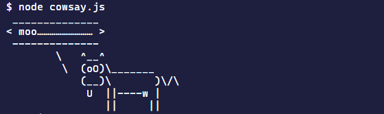

## Scaffold 简介

当使用`react-create-app`命令行工具的时候能够轻松地创建 React 基础应用，其背后就是利用`webpack`提供的能力编写的脚手架。`cra`虽然一定程序上可以满足小型项目的需求，但是由于其封装限制（需要`eject`才能暴露配置）以及内部一些冗余的配置，导致其并不能完全适应大型项目的要求，因此理论上具有前端开发岗位的公司都应该自行定制自己的脚手架以适应业务的需求，例如自动配置`react-router`，启用`less`等这些拓展功能。

## yeoman

`yeoman`，约曼是一个脚手架编写服务，包括但不仅限于`react`，`angular`应用，包括但不仅限于 JS 语言，其建立在以下三种工具的基础之上：

- `yo`：`yeoman`命令行工具，用于使用脚手架模板（`generators`）创建项目
- `gulp/grunt`：`gulp`等应用构建工具
- `npm`：`yo`以及脚手架需要的模板工具都必须由`npm`包管理系统来提供

### 使用 generator

在`yeoman`中，脚手架就是`generator`，其本身提供许多第三方的[`generators`](https://yeoman.io/generators/)可以随意使用，第三方的`generators`全部使用`generator-*`的形式来命名，例如使用`generator-webapp`：

- 全局安装`yo`和`generator-webapp`

```shell
yarn global add yo

yarn global add generator-webapp
```

- 使用`yo`运行`generator-webapp`

```shell
yo webapp
```

### 编写 generator

#### 安装 generator-generator

`yeoman`本身提供自定义脚手架的辅助工具 —— [`generator-generator`](https://github.com/yeoman/generator-generator)

```shell
yarn global add yo

yarn global add generator-generator
```

首先全局安装`generator-generator`，然后在指定目录执行`yo generator`，即可生成编写`generator`的项目结构

```shell
.
├── generators/
│   └── app/
│       ├── index.js
│       └── templates/
│           └── dummyfile.txt
├── .editorconfig
├── .eslintignore
├── .gitattributes
├── .gitignore
├── .travis.yml
├── .yo-rc.json
├── LICENSE
├── README.md
├── package.json
└── __tests__/
    └── app.js
```

#### Generator 基类

`yeoman`提供一个基类`Generator`，自定义的`generator`都需要`extends`该基类，例如：

```javascript
const Generator = require('yeoman-generator');

module.exports = class extends Generator {
  method1() {
    console.log('hey 1');
  }
};
```

#### 运行 generator

由于是本地开发的`generator`程序，不能直接作为全局`npm`模块运行，但是可以通过在`generator`项目根目录执行`npm link`或者`yarn link`来链接执行本地模块，接下来会自动安装项目依赖并执行`generator`程序。

```shell
cd generator

yarn link
```

当运行`generator`以后，`yeoman`会在`generator`内部查找`.yo-rc.json`文件，并把`.yo-rc.json`所在的目录作为`generator`的根目录，从`generators/app`目录下查找`index.js`文件并执行，如果和`app`有同级目录，则可以使用`yo <generator-name>:<sub directory-name>`执行其中的子程序。

## yeoman-run loop

回到`class`的原理上来说，在`class`内部定义的普通方法都会被绑定到父类的`prototype`上，由于`generator`继承自`Generator`基类，所以其内部普通函数都定义在`Generator.prototype`上，它们会自动运行。

普通函数会自动运行但不是按顺序执行，它们会有对应的执行队列，队列通常按照以下顺序执行：

1. `initializing`：获取`generator`的初始配置
2. `prompting`：执行`this.prompt()`
3. `configuring`：保存配置，例如写入`.editorconfig`等配置文件
4. `default`：当方法名没有匹配到优先级的时候，会进入这个队列
5. `writing`：写入本地文件的操作
6. `conflicts`：处理冲突，内部使用，编写`generator`的时候一般用不到
7. `install`：执行脚手架安装依赖程序，例如`yarnInstall`
8. `end`：`generator`运行结束前最后执行

一般来说，经常用到的就是`prompting`，`default`，`writing`和`install`阶段

## yeoman-API

### 交互

`yeoman`提供一系列用户交互方面的 API 如下

#### this.log

> `this.log(string)`

在脚手架程序中禁止使用`console.log()`以及`process.stdout.write()`语句，而应该使用`yeoman`内置的`this.log()`程序来打印文本信息，`this`表示当前`generator`的执行上下文。

#### this.prompt

> `this.prompt(questions) => promise<answers>`

`yeoman`内置[Inquirer.js](https://github.com/SBoudrias/Inquirer.js)提供的`prompt`方法，它是一个异步方法，返回`Promise`类型的结果，提供基于 nodejs 的用户交互接口

```javascript
const inquirer = require('inquirer');

inquirer
  .prompt(questions)
  .then(answers => {
    // Use user feedback for... whatever!!
  })
  .catch(error => {
    if (error.isTtyError) {
      // Prompt couldn't be rendered in the current environment
    } else {
      // Something else went wrong
    }
  });
```

`questions`是一个对象数组类型，包含一连串问题，会按顺序提问。每个问题都可以由以下属性组成：

| 属性          | 类型                                   | 默认值               | 解释                                                         |
| ------------- | -------------------------------------- | -------------------- | ------------------------------------------------------------ |
| `type`        | `string`                               | `input`              | `input`：问题要求输入<br />`number`：要求输入数字，非数字得到的答案将会是`null`<br />`confirm`：输入确认，`Y/n`<br />`list`：选择项，必须同时提供`choices`属性<br />`rawlist`：带有编号的选择项，必须同时提供`choices`属性<br />`expand`：也是选项，提供编号以及更复杂的选项内容<br />`checkbox`：多选框，一般来说按空格键是选择<br />`password`：密码输入，注意一般同时设置`mask: '*'`，否则看不见输入的字符<br />`editor`：打开选择的编辑器进行输入 |
| `name`        | `string`                               |                      | 储存答案对应的属性                                           |
| `message`     | `string`                               | `function`           | 和`name`一样                                                 |
| `default`     | `string|number|boolean|array|function` |                      | 问题答案的默认值，定义为函数时第一个参数是问题的答案         |
| `choices`     | `array|function`                       |                      | 选择项，包含`key`，`name`和`value`属性，选项之间可以包含`new inquirer.Separator()`分割线 |
| `validate`    | `(input) => boolean`                   |                      | 验证答案的函数，接收用户输入参数，返回`true`表示通过验证，不通过可以返回一个错误提示的字符串 |
| `filter`      | `(input) => value`                     |                      | 过滤用户输入                                                 |
| `transformer` | `(input) => display value`             |                      | 将用户输入进行转换，返回的值是最终展示给用户的               |
| `when`        | `boolean`                              | `(answers)=>boolean` |                                                              |
| `pageSize`    | `number`                               |                      | 更改使用 list，rawList，expand 或 checkbox 时将呈现的行数    |
| `store`       | `boolean`                              | `false`              | `yeoman`拓展的属性，用于储存用户历史输入信息，可用于下一次运行`generator`的默认值 |

`answers`也就是用户输入的所有问题的答案，各个属性名称和`question.name`的值一样，属性值类型取决于`question.type`：

- `confirm`：则返回`true`或者`false`
- `input`|`editor`|`password`：返回字符串
- `number`：返回数字，如果输入的内容不能转换成`number`类型，则返回`null`
- `list`|`rawlist`|`expand`：返回用户选择的选项字符串
- `checkbox`：返回多选的字符串数组

在`generator`内部可以通过`this.answers`来获取所有答案

```javascript
const Generator = require('yeoman-generator');

module.exports = class extends Generator {
  async prompting() {
    const answers = await this.prompt([
      {
        type: 'input',
        name: 'name',
        message: 'Your project name',
        default: this.appname, // Default to current folder name
      },
      {
        type: 'confirm',
        name: 'cool',
        message: 'Would you like to enable the Cool feature?',
      },
    ]);

    this.log('app name', answers.name);
    this.log('cool feature', answers.cool);
  }

  writing() {
    this.log('cool feature', this.answers.input); // user answer `cool` used
  }
};
```

#### this.argument

在执行某个`generator`命令的后面跟随的参数被称为`argument`，例如执行`yarn create react-app`的时候后面需要跟上项目名称，用来初始化项目文件夹

```shell
yarn create react-app <project-directory>
```

这些传递的参数可以通过`this.argument`限定其格式，**该方法必须在`constructor`中使用**，其接受两个参数：

> `this.argument(name, [options])`

- `name`：也就是获取该参数值的键，可以通过`this.options[name]`获取用户输入的参数值
- `<options>`：可以指定以下属性来限制参数的格式
  - `type`：参数类型，`String`，`Number`，`Array`，注意大写开头的格式
  - `required`：是否必须
  - `default`：默认值
  - `desc`：参数的描述信息

对于用户输入的参数，可以在`generator`内部通过`this.options[name]`来获取。

```javascript
module.exports = class extends Generator {
  constructor(args, opts) {
    super(args, opts);

    this.argument("appname", {
      type: String,
      required: true,
      default: 'myproj',
      desc: 'some description'
    });

    this.log(this.options.appname);
  }
};

// 执行generator，后面带的参数值就是指定的appname对应获取的值
yo my-generator my-project
```

#### this.option

`option`有点类似于`augument`，不同的是`option`的输入必须采用`--`分隔的形式，这种通常是命令的含义而不是参数，例如`--babel`是指定`babel`作为编译器。

对于`option`的指定通过`this.option`方法，该方法同样接收两个参数：

- `name`：获取输入值的键名
- `<options>`：一系列限制属性
  - `type`：类型，`String`，`Number`，`Boolean`
  - `default`：默认值
  - `alias`：简短的别名
  - `desc`：描述信息
  - `hide`：是否在帮助信息中显示

对于用户输入的信息，在`generator`内部通过`this.options[name]`来获取。

```javascript
module.exports = class extends Generator {
  constructor(args, opts) {
    super(args, opts);

    this.option("coffee", {
      type: String,
      default: 'myproj',
      desc: 'some description'
    });

    this.scriptSuffix = this.options.coffee ? ".coffee" : ".js";
  }
};

// 执行generator
yo my-generator --coffee
```

### 依赖管理

`yeoman`内置`npm`，`yarn`等依赖安装的方法：

- `this.npmInstall()`：在运行时通过`npm`安装依赖
- `this.yarnInstall()`：在运行时通过`yarn`安装依赖
- `this.installDependencies()`：默认执行`npm`或者`bower`安装依赖，但是可以通过设置参数来控制包管理器

```javascript
this.installDependencies({
  npm: true,
  bower: false,
  yarn: true,
});
```

- `this.fs.readJSON()`：使用该方法可以读取模板文件中`package.json`的配置
- `this.fs.extendJSON()`：可以补充拓展`package.json`的配置

### 文件写入

脚手架的一个核心功能是直接生成本地项目文件结构，所以具有文件系统的交互能力是必须的！

脚手架内部的文件上下文有两个：

- `generator`内部模板文件的目录路径，默认是`./templates/`
- 使用`generator`搭建项目的目录路径

#### this.fs

`yeoman`的文件读写建立在[`mem-fs-editor`](https://github.com/sboudrias/mem-fs-editor)基础上，`yeoman`提供`this.fs`对象，其暴露了所有`mem-fs-editor` 支持的 API。

- `this.fs.read(filepath, [options])`：读取文件并返回字符串
- `this.fs.readJSON(filepath, [defaults])`：读取文件并返回 JSON，`defaults`表示当目标路径的文件找不到或者读取出错时返回的内容
- `this.fs.write(filepath, contents)`：写入文件内容，不存在则创建文件，存在则替换文件内容
- `this.fs.writeJSON(filepath, contents[, replacer [, space]])`：使用 JSON 写入文件内容，`replacer`和`space`是`JSON.stringify()`方法的参数，`replacer`函数用于处理序列话的过程，`space`是 JSON 缩进空格，默认为`2`
- `this.fs.append(filepath, contents, [options])`：向指定文件添加内容
- `this.fs.extendJSON(filepath, contents[, replacer [, space]])`：拓展 JSON 文件的内容
- `this.fs.delete(filepath, [options])`：删除文件
- `this.fs.copy(from, to, [options], context[, templateOptions ])`：将一个文件从`from`路径拷贝到`to`指定的路径
- `this.fs.copyTpl(from, to, context[, templateOptions [, copyOptions]])`：将一个`ejs`模板文件从`from`路径拷贝到`to`指定的路径
- `this.fs.move(from, to, [options])`：移动或者重命名文件
- `this.fs.commit([filters,] [stream,] callback)`：将文件操作持久化保存到硬盘上，这个操作在`yeoman`中已经自动完成，所以这个方法不需要了

在`yeoman`中使用示例：

```javascript
class extends Generator {
  async prompting() {
    this.answers = await this.prompt([{
      type    : 'input',
      name    : 'title',
      message : 'Your project title',
    }]);
  }

  writing() {
    this.fs.copyTpl(
      this.templatePath('index.html'),
      this.destinationPath('public/index.html'),
      { title: this.answers.title } // user answer `title` used
    );
  }
}
```

#### this.templatePath

模板文件的目录路径，默认是`./templates/`，可以使用`this.sourceRoot()`访问，对于具体的模板文件可以使用`this.templatePath(<file_path>)`来访问。

#### this.destinationPath

运行`generator`创建项目的文件根目录，可以使用`this.destinationRoot()`访问，对于目录下的文件可以使用`this.destinationPath(<file_path>)`访问。

注意，如果要修改安装依赖的目标路径，可以通过`this.destinationRoot()`在最后的`install`阶段来修改：

```javascript
install() {
  this.destinationRoot(this.options.appname);
}
```

## 辅助工具

### chalk

[`chalk`（粉笔）](https://github.com/chalk/chalk)是一个开源的调整控制台输出文本样式的工具，在`generator`内部使用可以让项目输出的信息更有意思。

```javascript
const chalk = require('chalk');

const error = chalk.bold.red;
const warning = chalk.keyword('orange');

console.log(error('Error!'));
console.log(warning('Warning!'));
```


### cowsay

[`cowsay`](https://github.com/piuccio/cowsay)，也是一个很有意思的开源工具，能在控制台打印出来一头说话的牛。

```javascript
const cowsay = require('cowsay');

console.log(
  cowsay.say({
    text: 'moo………………………',
    e: 'oO',
    T: 'U ',
  }),
);
```



### yosay

[`yosay`](https://github.com/yeoman/yosay)是`yeoman`开源的另一个小工具，和`cowsay`差不多，它输出的是`yeoman`的 logo，还自带彩色。

```javascript
const yosay = require('yosay');

console.log(yosay());
```

