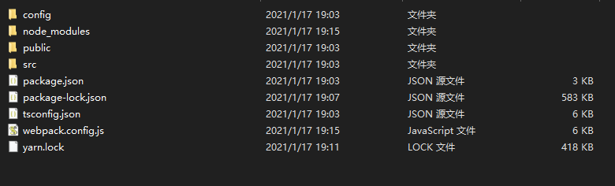

## 初始 generator

既然使用了`yeoman`就不要耽误功夫自己配置脚手架的目录结构了，直接使用`yeoman`的`generator-generator`搭建脚手架项目如下：

```shell
.
├── generators/
│   └── app/
│       ├── index.js
│       └── templates/
│           └── dummyfile.txt
├── .editorconfig
├── .eslintignore
├── .gitattributes
├── .gitignore
├── .travis.yml
├── .yo-rc.json
├── LICENSE
├── README.md
├── package.json
└── __tests__/
    └── app.js
```

在`generators`目录下的文件就是编写脚手架的主要文件，其它文件都不用管的，其中：

- `app/index.js`文件是`generators`的默认执行文件，执行`yo <generator>`的时候首先会查找该文件并执行
- `app/templates`就是默认的模板文件目录，可以放任何项目文件

推荐一种相对简单的方法是直接在`templates`下率先编写好项目，例如安装`webpack`这些工具，运行并测试，最后将项目的`node_modules`文件夹删除，然后在

`generators`内部直接将这些模板文件以及`package.json`复制到指定的目录下即可。

## 创建模板项目

在`app/templates`下建立这样的项目结构，这就是一个完整的项目目录，如果执行`npm install` 安装完依赖包，就能直接运行的模板项目。

```bash
templates
├─ config
│    └─ cssModuleConfig.js
├─ package.json
├─ public
│    ├─ favicon.ico
│    └─ index.html
├─ src
│    ├─ App.tsx
│    ├─ components
│    │    └─ Button
│    ├─ index.js
│    └─ pages
│           └─ page1
├─ tsconfig.json
└─ webpack.config.js
└─ package.json
```

## 编写 generator

在`app/index.js`下写入如下内容，这里需要注意的一步是最后一步安装依赖的过程，使用`this.destinationRoot`修改目标路径，这一步是相对而言的，因为我的脚手架具有指定项目目录的参数`appname`，就像`create-react-app`那样，指定创建项目的目录，例如执行`yarn create react-app myProj`实际上是在`myProj`目录下写入模板文件，同时执行`npm install`等命令也要相对于这个目录，所以必须执行`this.destinationRoot(this.options.appname)`修改成当前目录。

```javascript
'use strict';
const Generator = require('yeoman-generator');
const chalk = require('chalk');
const cowsay = require('cowsay');

module.exports = class extends Generator {
  constructor(args, opts) {
    super(args, opts);

    // 注册命令行参数
    this.argument('appname', {
      type: String,
      required: true,
    });
  }

  prompting() {
    this.log(
      cowsay.say({
        text: `Welcome to the epic ${chalk.red(
          'generator-custom-react',
        )} generator! Let's go`,
        e: 'oO',
        T: 'U ',
      }),
    );
  }

  writing() {
    this.fs.copy(
      this.sourceRoot(),
      // copy到指定的appname
      this.destinationPath(this.options.appname),
    );

    // 读取package.json，并修改配置
    const packageJson = this.fs.readJSON(this.templatePath('package.json'));
    const configJson = {
      name: this.options.appname,
      ...packageJson,
    };
    // 将目标路径下package.json替换成修改后的内容
    this.fs.writeJSON(
      this.destinationPath(`${this.options.appname}/package.json`),
      configJson,
    );
  }

  install() {
    // 必须
    this.destinationRoot(this.options.appname);
    this.installDependencies({
      npm: true,
      bower: false,
      yarn: true,
    }).then(() =>
      this.log(
        'Everything is ready, please run yarn start to activate your app',
      ),
    );
  }
};
```

## 发布

`generator`项目必须发布到`npm`上才能被安装执行，所以需要最后编写完需要进行发布。

`npm`发布需要三个步骤

### 注册账号

打开[npm 注册](https://www.npmjs.com/signup)，随便输个容易记住的账号和密码即可


### 登录 npm

在`generator`目录，注意是`generator`根目录，不是`templates`目录等其他路径，执行`npm login`登录到`npm`。

注意，这里可能要修改一下`npm registry`地址，例如从`taobao`源改回来

```bash
npm config set registry http://registry.npmjs.org
```

```bash
npm login
```


如果要登出，可以使用`npm logout`命令，不过需要执行`registry`地址

```bash
npm logout --registry=https://registry.npm.taobao.org
```

### 修改 version

在发布前别忘了每次发布都要修改一下`package.json`文件的`version`字段，且不能和以前重复。

### 执行发布

> [npm-publish](https://docs.npmjs.com/cli/v6/commands/npm-publish)

执行发布的命令是`npm publish --access=public`，`access`是指定发布的`package`是公开的，只会作用在个人或者组织的`package`上。因为`npm`在个人或者团体注册的时候会默认将个人或者团体注册作为命名空间限制`package`，这样你的`package`就可以和其它人的`package`同名。

但是非付费用户，必须指定`access=public`，因为其默认值是`restricted`。

```bash
npm publish --access=public
```


## 测试

现在就可以在`npm`官网找到刚才发布的`package`了


根据`generator`的介绍，测试一下

```bash
yarn global add generator-custom-react

yo custom-react cra
```


等待一段时间，模板文件和依赖都成功写入了指定`cra`目录下



### 更新

可以通过执行`yarn global upgrade`来更新脚手架的版本

```bash
yarn global add generator-custom-react
```