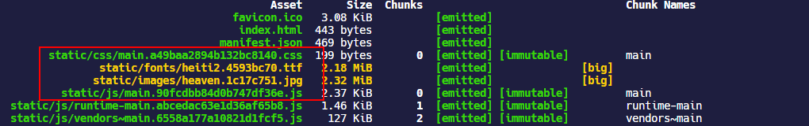
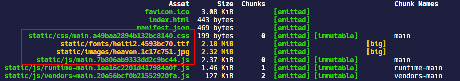
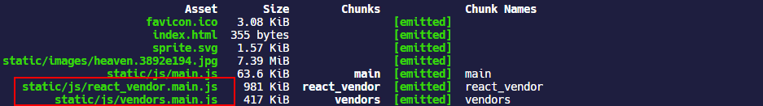

## chunk 和 bundle

> [Concepts - Bundle vs Chunk](https://github.com/webpack/webpack.js.org/issues/970#issuecomment-305525560)

经常让人摸不着头脑的是 chunk 和 bundle 这两个概念。chunk，翻译过来就是大块，也就是代码块；而 bundle 则是束，包的意思。从 webpack 给出的[术语表](https://webpack.js.org/glossary/)中是这么解释的：

> **Chunk**: This webpack-specific term is used internally to manage the bundling process. Bundles are composed out of chunks, of which there are several types (e.g. entry and child). Typically, _chunks_ directly correspond with the output _bundles_ however, there are some configurations that don't yield a one-to-one relationship.
>
> chunk 在 webpack 中用于内部打包的过程；bundle 由 chunk 组成，一般来说，chunk 和 bundle 是对应的，但是也可能通过配置改变它们一一对应的关系。
>
> **Bundle**: Produced from a number of distinct modules, bundles contain the final versions of source files that have already undergone the loading and compilation process.
>
> bundle 由不同的模块组成，包含已经进行加载和经过编译的源文件的最终输出文件。

webpack 文档的解释很模糊，chunk 其实是 **code splitting** 中的概念，当使用到 code splitting 将 bundle 拆分出多个 chunk 就能体会到 chunk 和 bundle 的区别了。

## output

webpack 中用来管理输出的配置项主要就是[`output`配置项](https://webpack.docschina.org/configuration/output/)，`output`可选的属性还是很多的，常用的有以下部分：

- `filename`：指定每个打包输出 bundle JS 的名称，如果是只指定`entry`是一个入口文件，那么默认也只会生成一个名称为`main.js`的 bundle 文件。在代码拆分的时候，需要通过 [hash]来指定不同的文件名。
- `chunkFilename`：指定非入口 chunk 的名称，默认是使用 chunk 的 id 来指定，即`[id].js`
- `hashSalt`：hash 加盐是一种密码学中的手段，对需要进行 hash 运算的内容在任意固定位置插入特定的字符串来让加盐后的散列结果和没有加盐的结果不相同。
- `hotUpdateChunkFilename`：自定义热更新 chunk 的文件名，默认是`[name].[hash].hot-update.js`，这里的`[name]`是上面指定的`filename`，例如：


- `scriptType`：指定`<script>`标签插入到页面中的`type`属性，默认是什么都不指定，对于`<script>`标签来说，`type`属性为空，则会将文件看作 JS
- `path`：指定整个项目打包输出的 bundle 的目录，默认是项目根目录的`dist`文件夹
- `publicPath`：开发环境一般用不到这个配置，如果在使用 WDS 的时候，同时指定`publicPath`，就表示提供给 WDS 的文件都来自于`publicPath`目录；但是生产环境下可能用来配置 CDN 的路径前缀
- `sourceMapFilename`：仅在 [`devtool`](https://webpack.docschina.org/configuration/devtool/) 设置为 `'source-map'` 时有效，也就是生成的 source map 的文件名，默认情况下是和 bundle 在同一个目录中
- `ecmaVersion`：控制生成代码的 ES 版本，在 webpack4 中这个值是`5`，在 webpack5 中，这个值是`6`，也就是允许 ES6 代码存在
- `compareBeforeEmit`：在打包输出文件之前，检查文件在目录中是否已经存在，如果存在就不再新写入一个相同的文件，默认是`true`
- `iife`：添加 IIFE 外层包裹的括号，默认是`true`
- `module`：默认是`true`，即允许输出的 JavaScript 文件作为模块类型
- `pathinfo`：在生产环境下默认是`true`，即引入「所包含模块信息」的相关注释；在开发环境下默认是`false`，且建议是`false`

### filename 和 chunkFilename

> [webpack - 缓存](https://webpack.docschina.org/guides/caching/#output-filenames)

从概念解释上来说，`output.filename`指定的是主 bundle 的文件名称；`output.chunkFilename`指定的是 chunk 的文件名称，如果为 webpack 只指定了一个入口`entry`，那么`output.chunkFilename`是没啥用的，只有代码拆分的时候指定多个 chunk，这个配置项才能体现出来，拆分出的 chunk 如果找不到`output.chunkFilename`就会继而使用`output.filename`作为 chunk 文件名。

web 开发中经常遇到的一个问题就是浏览器对资源的缓存，导致发布的新的 JS 文件无法生效；过去解决方式一般是在 JS 的文件名后面添加一串不重复的版本号。在工程化的前端项目里，显然无法通过手动修改文件名来完成替换。

**缓存是有用的，通过代码拆分，我们可以做到将一些不会经常改变的核心代码抽成一个 chunk 进行打包，并赋予一个长期缓存来解决浏览器重复请求网络去加载资源的问题。对于不常更改的 chunk，我们希望每次打包它们的名称都是固定的，而对于经常修改的 chunk，需要根据内容去每次生成一个唯一的 chunk 名称来保证更新客户端的缓存。**

通常 webpack 会为每一个模块分配一个唯一的模块标识符 [`module identifier`](https://webpack.docschina.org/guides/caching/#module-identifiers)，这个 id 是一个 Int 类型的数字，并且通常从`0`开始，依据生产的 chunk 依次递增。

webpack 可以使用一种称为 **substitution(可替换模板字符串)** 的方式，通过使用内容散列(content hash)替换在`output.filename`或`output.chunkFilename`配置的模板字符串来作为输出 bundle 文件的名称，这样在文件内容修改时，会计算出新的 hash，浏览器会使用新的名称加载文件，从而使缓存无效。

具体可以使用的模板字符串见—— [loader-utils.interpolateName](https://github.com/webpack/loader-utils#interpolatename)

| 模板字符串      | 含义                                                         |
| --------------- | ------------------------------------------------------------ |
| `[hash]`        | 根据模块 id 生成的 hash                                      |
| `[contenthash]` | 根据文件内容生成的 hash，每个文件资源都不相同                |
| `[chunkhash]`   | 根据每个 chunk 内容生成的 hash                               |
| `[name]`        | module name，如果 module 没有名称，则会使用其 id 作为名称    |
| `[id]`          | module identifier，默认是根据模块引入的顺序，从`0`开始的整数 |
| `[query]`       |                                                              |
| `[function]`    |                                                              |

在上面的模板字符串中存在三种 hash，默认三种 hash 的长度都是`20`个字符长度，可以通过加 length 的方法`[xxxhash::<length>]`指定 hash 的长度。并且如果开发环境使用 WDS，那么`[contenthash]`无法是用于开发环境的。

第一种`[hash]`，需要注意的是它是根据模块 id 生成的，所以每个 chunk 得到的值都是一样的，在指定代码拆分以后，对其做了测试，可以看到两个 chunk 的 hash 都是一样的。


如果修改其中一个 chunk 的模块代码，所有 chunk 的 hash 值都会发生变化，所以使用`[hash]`是不稳定的，达不到上面我们说的目的。

`[chunkhash]`是根据每个 chunk 内容生成的 hash 值，这种情况在有些时候它是稳定的，我在修改单独入口文件的模块代码时，

并未影响其它 chunk 的 hash 值。


但是当 chunk 内 CSS 和 JS 混杂的时候，例如在 React 中`import`一个单独的 CSS 文件，这是很常见的事，如果对`output.filename`使用了`[chunkhash]`，而对导出的 CSS 也使用了`[chunkhash]`，那么 JS 和 CSS 得到的 hash 值将是一样的，这时候 JS 和 CSS 的变化会相互影响。例如下面的配置导致的结果是 JS 主 bundle 的 hash 值和 CSS 的 hash 值始终一样。

```javascript
module.exports = {
  output: {
    filename: isProduction
      ? 'static/js/[name].[chunkhash].js'
      : 'static/js/bundle.js',
    path: path.resolve(__dirname, 'build'),
  },
  plugins: [
    isProduction &&
      new MiniCssExtractPlugin({
        filename: 'static/css/[name].[chunkhash].css',
      }),
    ,
  ],
};
```


而如果仅对 JS 使用`[chunkhash]`，而 CSS 使用`[contenthash]`，那么 CSS 发生变化，JS 的 hash 名称一样也会变。

```javascript
module.exports = {
  output: {
    filename: isProduction
      ? 'static/js/[name].[chunkhash].js'
      : 'static/js/bundle.js',
    path: path.resolve(__dirname, 'build'),
  },
  plugins: [
    isProduction &&
      new MiniCssExtractPlugin({
        filename: 'static/css/[name].[contenthash].css',
      }),
    ,
  ],
};
```




至于`[contenthash]`则是根据具体的模块内容生成的 hash 值，它能检测细微层次 module 的变化，由于 chunk 包含 module，`[contenthash]`是为单个 module 准备的，在使用`[contenthash]`以后，chunk 中的 CSS 和 JS 模块不会相互影响。






最后对于进行 code splitting 的项目，建议如下的配置，`[contenthash]`还可以附加像`[contenthash:10]`这样的形式来决定生成的 hash 字符串的长度。

```javascript
module.exports = function(env) {
  const isDevelopment = env.NODE_ENV === 'development';
  const isProduction = env.NODE_ENV === 'production';

  return {
    mode: isProduction ? 'production' : isDevelopment && 'development',
    output: {
      filename: isProduction
        ? 'static/js/[name].[contenthash].js'
        : 'static/js/bundle.js',
      chunkFilename: isProduction
        ? 'static/js/[name].[contenthash].chunk.js'
        : 'static/js/[name].chunk.js',
    },
    plugins: [
      isProduction &&
        new MiniCssExtractPlugin({
          filename: 'static/css/[name].[contenthash].css',
          chunkFilename: 'static/css/[name].[contenthash].chunk.css',
        }),
    ],
  };
};
```

## clean-webpack-plugin

当使用`[contenthash]`替换 chunk 名称的时候，对于修改过的 chunk，每次都会生成一个具有新的 chunk 名的 chunk，而旧的 chunk 会依然保留在`output.path`文件夹中，这些垃圾文件会随着每次 build 越来越多。


[`clean-webpack-plugin`](https://github.com/johnagan/clean-webpack-plugin)是负责清理 build 文件夹的插件，默认情况下，这个插件会清空在`output.path`文件夹里的所有文件，以及每次成功重建后所有未使用的 webpack 静态资源。现在这个插件已经到了 V3.0 版本。

```shell
yarn add clean-webpack-plugin -D
```

```javascript
// 需要注意这里要带括号
const { CleanWebpackPlugin } = require('clean-webpack-plugin'); //清理build文件夹

module.exports = {
  plugins: [isProduction && new CleanWebpackPlugin()],
};
```