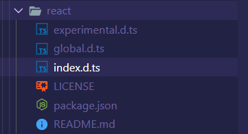

## 安装 TS

```shell
yarn add typescript -D
```

安装`@types`的类型声明包。当使用第三方库时，我们需要引用它的声明文件，才能获得对应的代码补全、接口提示等功能，声明文件是以`index.d.ts`的一个文件，一般放在项目的根目录中，或者可以通过`package.json`中的`typings`/`types`属性来指定项目中声明文件的位置。

获取一个库类型声明文件有两种方式：

- 一种是该库包含了自己的声明文件，即包含了`index.d.ts`文件，这样的第三方库在使用的时候只需要安装库本身就可以了；
- 另一种是通过 TypeScript 提供的 [DefinitelyTyped](https://github.com/DefinitelyTyped/DefinitelyTyped) 仓库获取本身没有包含声明文件的第三方库的声明文件

React 库本身没有包含声明文件，需要通过安装`@types`类型声明包才可以：

```shell
yarn add @types/react @types/react-dom -D
```

可以看到`@types/react`中只包含了 React 相关的声明文件而已。



### 项目配置

使用`yarn run tsc --init`可以自动在当前终端打开的项目目录生成一个`tsconfig.json`文件，也可以直接手动创建这个文件，具体的配置项参见 —— [TSConfig 参考](https://www.typescriptlang.org/tsconfig)

这个文件指定了项目根文件和编译项目所需的编译器配置，例如指定需要编译的文件夹`include`，忽略编译部分文件夹`exclude`，以及压缩编译的具体配置等`compilerOptions`

```json
{
  "compilerOptions": {
    "target": "es5",
    "module": "commonjs",
    "jsx": "react"
  },
  "include": ["src/**/*"],
  "exclude": ["node_modules", "build", "dll", "public"]
}
```

## 配置 webpack

TypeScript 具有特定的文件格式，例如`ts`或者`tsx`；webpack 需要安装额外的 loader 来解析他们，babel 7 之前的解决方案是通过安装`ts-loader`或者[`awesome-typescript-loader`](https://github.com/TypeStrong/ts-loader)，在项目已经存在 babel 编译器的时候，这样的编译流程是冗余的，一份`tsx`代码经历的是`tsx->ts-loader->js->babel-loader-js`这样的流程，也就是一份 JS 文件需要被两个 loader 处理；于是从 babel 7 开始引入了[`@babel/preset-typescript`](https://babeljs.io/docs/en/babel-preset-typescript)，可以很方便的利用 babel 来编译所有 JS 相关的代码了。

```shell
yarn add @babel/preset-typescript -D
```

`@babel/preset-typescript`只包含一个 plugin —— [`@babel/plugin-transform-typescript`](https://babeljs.io/docs/en/babel-plugin-transform-typescript)，该 plugin 的配置项如下

| 配置项                  | 类型      | 默认值  | 含义                                                         |
| ----------------------- | --------- | ------- | ------------------------------------------------------------ |
| `isTSX`                 | `boolean` | `false` | 当启用的时候，将旧式的 TS 类型断言语法`var foo = <string>bar`解析为 JSX 标签语法；如果开启，需要同时配置`allExtensions: true` |
| `jsxPragma`             | `string`  | `React` | 替换编译 JSX 表达式时使用的函数，默认是使用 React 的声明`React` |
| `allowNamespaces`       | `boolean` | `false` | 启用对 TS 的`namespace`的编译，将来可能将该配置项默认设置成`true` |
| `onlyRemoveTypeImports` | `boolean` | `false` | 当启用的时候，编译的时候只会移除[type-only](https://www.typescriptlang.org/docs/handbook/release-notes/typescript-3-8.html#type-only-imports-exports)语法 |
| `allowDeclareFields`    | `boolean` | `false` | 当启用的时候，在类中使用`declare`声明的类型会被移除；Babel 8 以后这个配置项会默认开启 |

```javascript
module.exports = {
  module: {
    rules: [
      {
        test: /\.(js|jsx|tsx|ts)$/,
        exclude: /node_modules/,
        loader: 'babel-loader',
        options: {
          presets: [
            [
              '@babel/preset-env',
              {
                modules: false,
              },
            ],
            ['@babel/preset-react'],
            ['@babel/preset-typescript'],
          ],
        },
      },
    ],
  },
  resolve: {
    extensions: ['.ts', '.tsx'],
  },
};
```

### 注意事项

`@babel/preset-typescript`不支持`const enum`语法，解决方法如下：

- 使用[babel-plugin-const-enum](https://www.npmjs.com/package/babel-plugin-const-enum)
- 移除`const`声明

`@babel/preset-typescript`不支持 TypeScript 特定的`export =`和`import =`语法，解决方法如下：

- 使用[babel-plugin-replace-ts-export-assignment](https://www.npmjs.com/package/babel-plugin-replace-ts-export-assignment)
- 使用 ES Module 的`export default`或者`export const`替换`export =`语法；使用`import xxx from xxx`替换`import =`语法

对于使用了 webpack 的`resolve.alias`配置模块路径别名的，需要在`tsconfig.json`中配置以下两个参数：

```javascript
// webpack.config.js
module.exports = {
  resolve: {
    alias: {
      '@': path.resolve(__dirname, 'src'),
    },
  },
};
```

```json
// tsconfig.json
{
  "compilerOptions": {
    "baseUrl": ".",
    "paths": {
      "@/*": ["./src/*"]
    }
  }
}
```

## 修改项目

重命名项目文件为`ts`或者`tsx`后缀，这样 TS 的类型提示就会生效了