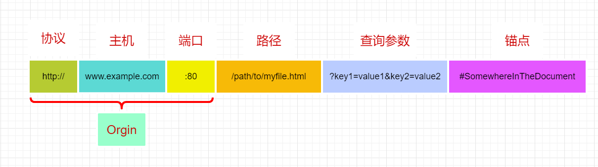
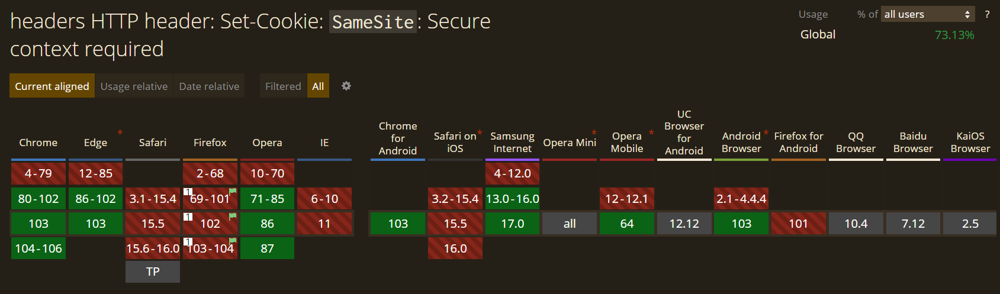

# 同源策略

## 同源的定义

同源：**协议，域名/ip，端口号**三者全部相同，注意一般情况下省略端口号都是默认`80`端口的情况。在页面中通过`javascript:`方式打开的页面会继承当前 URL 的源。

- 限制子域名不属于同源的，例如 mail.google.com 和 docs.google.com；
- 限制不同端口的不属于同源，例如 google.com 和 google.com:8080



## 同站的定义

为了下文内容的完整性，这里再单独介绍下一个容易和同源搞混淆的概念：同站。

同站只看域名部分，但也分为两种情况：

1. 对于在[现有顶级域名列表](https://web.dev/i18n/zh/same-site-same-origin/)下的二级域名相同，即可认为是同站，例如`.com`和`.org`这些顶级域，其和子域名也看做同站：`example.com`和`xxx.example.com`
2. 对于在[公共后缀列表](https://publicsuffix.org/list/public_suffix_list.dat)下的域名，需要保证其下子域名相同，例如`.co.jp`或 `.github.io`这些，需要再往前看一层子域名是否相同，`your-project.github.io`和`my-project.github.io`就不是同站

但是 Chrome 对于同站[有自己的定义](https://web.dev/samesite-cookies-explained/)，它会把请求 URL 的**协议**也算在内，也就是`http`和`https`就不是同站。

## 不受同源策略限制的情景

同源策略并不是严格限制所有网页请求资源的加载，一般情况对以下请求是被允许的：

- 通过`script`，`img`，`video`，`audio`，`iframe`元素的`src`属性发起的请求；

- 通过`link`元素的`href`属性发起的请求；

- 通过`object`元素的[`data`属性](https://developer.mozilla.org/en-US/docs/Web/HTML/Element/object#attr-data)发起的请求；

- 在 CSS 中通过[`image`](https://developer.mozilla.org/en-US/docs/Web/CSS/image)数据类型发起的请求，例如：

  - [`url()`函数](https://developer.mozilla.org/en-US/docs/Web/CSS/url)；

  - `image()`函数；
  - [`image-set()`函数](https://developer.mozilla.org/en-US/docs/Web/CSS/image/image-set)

- 通过`form`元素的`action`属性指定的请求

## 受到同源策略限制的情景

跨域请求资源的读操作通常是被限制的，通常来说跨域请求能够发出，但是收到的响应会被浏览器丢弃，并以错误提醒的方式抛出。

- 禁止页面内部的 JS 通过[`iframe.contentWindow`](https://developer.mozilla.org/en-US/docs/Web/API/HTMLIFrameElement/contentWindow)读取页面内部嵌入的`iframe`的内容；为了能让不同源中文档进行交流，可以使用 [`window.postMessage`](https://developer.mozilla.org/zh-CN/docs/Web/API/Window/postMessage)
- 禁止读取`image`，`video`，`audio`等多媒体元素的数据，例如`canvas`绘制的场景
- 禁止读取`XMLHttpRequest`或者`fetch`发起的跨域请求的响应内容
- 禁止访问不同源的`sessionStorage`，`localStorage`和`IndexDB`存储的内容

## cookie 的限制

cookie 的限制其实不是同源还是同站限制，稍微宽泛一点。

首先服务端可以通过[`Set-Cookie`响应头](https://developer.mozilla.org/en-US/docs/Web/HTTP/Headers/Set-Cookie)以键值对`key=Value`的方式来设置客户端的 cookie

```http
Set-Cookie: <cookie-name>=<cookie-value>
```

除了设置 cookie 的值，还可以在 cookie 值的后面追加以下几个限制 cookie 的属性：

```http
Set-Cookie: <cookie-name>=<cookie-value>; Domain=<domain-value>; 
Secure; HttpOnly
```

- `Expires=<date>`：指定 cookie 的清除截止时间，一个 UTC 时间，使用 [iso8601 时间格式](https://icodex.me/docs/javascript/Date/%E8%AE%A1%E7%AE%97%E6%9C%BA%E6%97%B6%E9%97%B4%E7%9A%84%E8%A1%A8%E7%A4%BA%E6%96%B9%E6%B3%95#iso-8601)，例如`2023-07-18T15:57:26.671Z`
- `Max-Age=<number>`：指定 cookie 过期前的秒数，设置为 0 或者负数会使浏览器清除 cookie，优先级高于`Expires`
- `Domain=<domain-value>`：指定一个发送 HTTP 请求时携带 cookie 的域名，如果不指定的话就默认为当前域名，但是不包括子域名；而如果明确指定了一个域名，请求其子域名时，cookie 也会始终携带上；现代浏览器一般行为与早期规范相反，指定域名 (.example.com) 的前导点会被忽略，也就是包含当前域和其子域
- `Path=<path-value>`：指定发送 HTTP 请求时携带 cookie 的 URL 中必须包含的`pathname`部分：
  - 如果指定`/`，则所有子路径都会包含在内；
  - 如果指定`/sub`，则所有以`/sub`开头的子路径也都匹配在内

- `Secure`：指定携带 cookie 时请求 URL 协议必须是`https`或者`localhost`

- `HttpOnly`：指定 cookie 只能用于 HTTP 传输，不能被 JS 等脚本读取，防止 XSS（跨站脚本攻击）

- `SameSite=<samesite-value>`：指定发送不同站请求时是否携带 cookie，主要为了防范 CSRF（跨站请求伪造）攻击，`SameSite`的值可以有以下几种：

  - `Lax`：默认值，网页内部的跨站资源请求（例如`img`元素等）不会携带 cookie，但是通过导航链接`a`元素跳转到其他站点时会携带`cookie`

  - `Strict`：cookie 只在同站请求时发送
  - `None`：cookie 总是在请求的时候携带上，同时必须指定`Secure`属性，进一步限制 HTTPS 的安全性

到目前为止，指定`SameSite:None`时必须指定`Secure`的行为在浏览器之间仍不一致，只有 chromium 内核的浏览器支持：



## 好处

同源策略的最大好处是使得网页请求变得更加安全：

- 可以阻止网页恶意脚本，尤其是基于`cookie`的身份验证和授权机制，现在绝大部分网站仍然使用这种方式来进行用户身份的识别。设想一下，假设一个用户正在访问银行网站且未注销。然后，用户转到另一个站点，该站点的某些恶意 JavaScript 代码在后台运行，并试图通过 DOM API 或者`document.cookie`来获取银行网页中的数据。这是来自一个不同源网页脚本的攻击行为，有了浏览器的同源策略就能轻易组织它。

## 不足

- 同源策略无法阻止跨站伪造请求（CSRF）和点击劫持之类的攻击。
- 同源策略给前端本地开发带来麻烦，本地服务器打开的页面访问服务器资源时就会受到限制。

# CORS

CORS，Cross-Origin Resource Sharing，跨域资源共享是 W3C 针对跨源资源请求制定的标准方案，也是目前跨域请求主流的解决方案。

由于浏览器的同源策略限制，在页面 JS 中使用`XMLHttpRequest`和`Fetch API`时只能请求同源的 URL，CORS 则允许通过特定 HTTP 请求头和响应头参数来允许`XMLHttpRequest`和`Fetch API`执行跨源请求。

现在主流浏览器基本都支持 CORS，只要服务端配置以下响应头部就可以顺利实现跨域资源请求，有一个网站叫[Enable CORS](https://enable-cors.org/index.html)，介绍了诸多服务端实现的方法，例如 [nginx 的配置项](https://enable-cors.org/server_nginx.html)

## 简单请求

浏览器会将跨域请求分为简单请求和非简单请求。

在简单请求中，浏览器会根据`XMLHttpRequest`的请求自动添加`Origin`请求头参数，在发出请求并获取响应之后，会根据响应头部的`Access-Control-Allow-Origin`字段判断当前域是否在服务器允许跨域请求的范围之内。因此要想允许跨域请求，只需要服务端设置响应头参数`Access-Control-Allow-Origin`即可。

> 请求头部自动添加
>
> ```shell
> Origin: http://foo.example
> ```

> 响应头需要服务器手动添加
>
> ```shell
> Access-Control-Allow-Origin: http://foo.example
> ```

简单请求只需要两步即可收到响应：

- 浏览器添加`Origin`头部信息，发送请求；
- 服务器返回响应头`Access-Control-Allow-Origin`，**浏览器收到后判断是否允许跨域请求，不允许则报错**


**简单请求**必须满足以下所有条件：

- 使用`GET`，`HEAD`或`POST`请求
- 只允许以下`Content-Type`值
  - `application/x-www-form-urlencoded`
  - `multipart/form-data`
  - `text/plain`：纯文本字符串
- 除了使用用户代理自动设置的头部字段，只允许手动设置以下头部参数

  - [`Accept`](https://developer.mozilla.org/en-US/docs/Web/HTTP/Headers/Accept)
  - [`Accept-Language`](https://developer.mozilla.org/en-US/docs/Web/HTTP/Headers/Accept-Language)
  - [`Content-Language`](https://developer.mozilla.org/en-US/docs/Web/HTTP/Headers/Content-Language)
  - [`Content-Type`](https://developer.mozilla.org/en-US/docs/Web/HTTP/Headers/Content-Type) (but note the additional requirements below)
  - `DPR`
  - `Downlink`
  - `Save-Data`
  - `Viewport-Width`
  - `Width`

- 没有在请求中使用的任何`XMLHttpRequestUpload`对象上注册事件侦听器

- 请求中未使用[`ReadableStream`](https://developer.mozilla.org/en-US/docs/Web/API/ReadableStream) 对象

## 非简单请求

**非简单请求**就是不符合简单请求必须满足的所有条件，非简单请求一般是以下任一情况：

- `PUT`，`DELETE`等方法
- 常用的`Content-Type`：
  - `application/json`
  - `text/xml`

非简单请求发起时，浏览器会先使用`OPTIONS`方法发起一个**预检请求**到服务器，根据服务器返回的响应头部`Access-Control-Allow-Origin`以获知服务器是否允许该请求。

> 预检请求头额外参数
>
> ```shell
> Origin: http://foo.example
> Access-Control-Request-Method: POST
> Access-Control-Request-Headers: X-PINGOTHER, Content-Type
> ```

在这个预检请求头参数中，`Access-Control-Request-Method`参数告知服务器在下一次发送时将使用`POST`请求，`Access-Control-Request-Headers`表示正是请求还将携带两个自定义的请求字段：X-PINGOTHER 和 Content-Type

> 预检请求体额外参数
>
> ```shell
> Access-Control-Allow-Origin: http://foo.example
> Access-Control-Allow-Methods: POST, GET, OPTIONS
> Access-Control-Allow-Headers: X-PINGOTHER, Content-Type
> Access-Control-Max-Age: 86400
> ```

服务器在收到预检请求后，肯定会发送一个`Access-Control-Allow-Origin`头部字段来告知浏览器，只有该参数的值允许跨域请求；如果服务器允许发送请求，对应请求时发送的`Access-Control-Request-Method`字段，服务端还会回应`Access-Control-Allow-Methods`字段，表示允许使用的请求方法；`Access-Control-Allow-Headers`对应于请求时`Access-Control-Request-Headers`字段，表示允许请求时发送的额外头部字段。

此外浏览器还会根据`Access-Control-Max-Age:86400`表明该响应的有效时间为 86400 秒，也就是 24 小时之内，浏览器无须为同一请求再次发起预检请求。值得注意的是，不同浏览器对于这个时间的上限要求不同：

- FireFox 是最大 24 小时，也就是 86400 秒
- 而 Chrome 在 V76 以后，最大值允许 2 小时，7200 秒
- 如果值是`-1`，表示不允许缓存该预检请求，每次请求都必须先预检

非简单请求由于需要发送预检请求的原因，一般需要三次握手才能获取最终的响应结果：

- 浏览器判断是非简单请求，使用`OPTIONS`发送预检请求；服务端收到预检请求，返回响应；
- 浏览器判断服务端是否允许发送正式请求，允许使用允许的请求方法和头部发送正式请求；
- 服务端收到正式请求，返回响应；浏览器接收响应


## 附带身份凭证的请求

一般而言，对于`XMLHttpRequest`和`Fetch`，受到同源策略的限制，浏览器不会在跨域请求时发送当前页面的`cookie`等身份凭证信息，但是`XMLHttpRequest`支持`withCredentials`属性，将该属性设置为`withCredential = true`，则表示该请求会发送`cookie`，HTTP Basic authentication，或者客户端 SSL 证明等信息。

```javascript
var ajax = new XMLHttpRequest();

if (invocation) {
  ajax.open('GET', url, true);
  ajax.withCredentials = true;
  ajax.send();
}
```

如果服务器接受请求的凭据，会在响应头中添加：

```shell
Access-Control-Allow-Credentials: true
```

而如果响应头中没有`Access-Control-Allow-Credentials: true`，浏览器将不会把响应内容返回给请求的发送者，在`XMLHttpRequest`收到响应后，`requestText`将是空字符串，`status`值为`0`，而且会调用`onerror()`事件处理程序。

另外，对于附带身份凭证的请求，服务器不得设置 `Access-Control-Allow-Origin` 的值为“`*`”。这是因为请求的首部中携带了 `Cookie` 信息，如果 `Access-Control-Allow-Origin` 的值为“`*`”，请求将会失败。而将 `Access-Control-Allow-Origin` 的值设置为指定的请求域名如 `http://foo.example.com`，则请求将成功执行。

## CORS headers

### Access-Control-Allow-Origin

`Access-Control-Allow-Origin`属于最常见的响应头参数，用于指定一个不同源的域名列表被允许访问资源，或者直接使用通配符`*`来标识允许所有不同源域名访问。

服务器会获取 HTTP 请求头字段`Origin`进行对比，允许则会将`Access-Control-Allow-Origin`设置成和`Origin`相同的值并返回。

```http
Origin: https://foo.bar.org
```

```http
Access-Control-Allow-Origin: *
```

### Access-Control-Allow-Headers

对于在预检请求时发送了`Access-Control-Request-Headers`请求头时，必须使用`Access-Control-Allow-Headers`响应头来标识允许客户端在访问资源时携带的 HTTP 请求头字段，支持自定义请求头字段。

如果`Access-Control-Allow-Headers`指定了通配符`*`，则表示允许访问资源时携带任意请求头（除了[`Authorization`](https://developer.mozilla.org/en-US/docs/Web/HTTP/Headers/Authorization)，`Authorization`必须严格在`Access-Control-Allow-Headers`标示出来）。

```http
Access-Control-Request-Headers: Content-Type, x-requested-with
```

```http
Access-Control-Allow-Headers: Content-Type, x-requested-with
```

### Access-Control-Allow-Credentials

`Access-Control-Allow-Credentials`配合`XMLHttpRequest.withCredentials`或`fetch`的请求参数`Request.credentials`来使用，也就是选择在跨域请求时携带`cookie`，`Authorization`请求头或者TLS 客户端证书等身份凭据。

其分为两种情况：

- 简单请求，通过以上两个设置会在跨域请求时携带`cookie`，如果服务端响应头为`Access-Control-Allow-Credentials:true`，则浏览器会把 HTTP 响应内容返回给请求方法，否则直接丢弃响应；
- 对于发送预检请求`Options`的情况，预检请求响应头必须为`Access-Control-Allow-Credentials:true`，后续请求才会继续发送。

```http
Access-Control-Allow-Credentials: true
```

### Access-Control-Allow-Methods

用于预检请求，当预检请求携带`Access-Control-Request-Method`请求头时，服务端可通过`Access-Control-Allow-Methods`响应头指定允许的 HTTP 请求方法。

如果`Access-Control-Allow-Methods`设置成通配符`*`，如果请求没有携带任何`cookie`或者 HTTP 认证请求头`Authentication`，则表示允许任何请求方法；如果携带了身份凭据，`*`没有意义。

```http
Access-Control-Request-Method: POST
```

```http
Access-Control-Allow-Methods: POST, GET, OPTIONS
Access-Control-Allow-Methods: *
```

### Access-Control-Expose-Headers

`Access-Control-Expose-Headers`指定允许浏览器暴露给`js`等静态资源使用的响应头。

### Access-Control-Max-Age

`Access-Control-Max-Age`指定浏览器缓存预检请求结果的最长时间，以秒为单位。

```http
Access-Control-Max-Age: 600 
```

## CORS 的一些缺陷

从 CORS 的机制了解到，在浏览器执行非简单请求时将会发送预检请求，等到服务端验证通过才去发送正式请求，这样的请求方式无端的多了一次建立连接的请求开销，对于大量并发的请求时，这种开销就会增加服务器的压力，可以从两方面进行优化：

- 尽量只发送简单请求，使用`GET`，`POST`方法的同时不要去设置额外的请求头部，同时发送的`Content-Type`不能使用`application/json`，可以使用`text/plain`让后端解析；
- 让服务端在响应头添加`Access-Control-Max-Age`参数，来缓存预检结果，避免每次请求都会先发送预检请求

# JSONP

JSONP，JSON with Padding，填充式 JSON，也是跨域资源请求的一种方式。

JSONP 的原理就是**利用`script`标签的`src`属性可以跨域载入资源，通过服务端返回的 JS 脚本来执行预先设置好的回调函数。**

JSONP 实现的方式是：

- 利用 DOM 接口`createElement`动态创建一个`script`标签；
- 将`script`的`src`属性设置成服务器的请求地址，并在后面串接一个回调函数；
- 当服务器收到请求后，会解析请求发送的回调函数的名称，服务端在允许的情况下可以返回一串文本，形式大致就是`functionName({...数据})`，一个由回调函数名称和 JSON 数据组成的字符串；后端可以先获取查询数据，然后再和回调函数名称拼接字符串即可；
- 由于是`<script>`元素请求的脚本，浏览器在收到服务端返回的脚本内容以后，会把它当成 JS 去执行，也就达到了获取跨域获取数据的目的

```shell
<script>
  var script = document.createElement("script");
	script.src = "http://www.example.com/path1?callback=handleResponse";
  document.body.insertBefore(script, document.body.firstChild);
  function handleResponse(jsonResponse)
  {
    //jsonResponse就是响应数据
  }
</script>
```


## 第三方实现

jQuery.ajax 在 1.5 版本以后，支持 jsonp 跨域请求设置，ajax 里面可以通过`dataType`， `jsonp`，`jsonpCallback`等参数来设置 jsonp 请求，这里只能指定请求方法为`GET`，就算指定成 POST 方式，会自动转为 GET 方式。

> https://api.jquery.com/jquery.ajax/

```javascript
$.ajax({
  url: '',
  async: true,
  method: 'GET',
  dataType: 'jsonp',
  jsonpCallback: 'handleResponse',
  success: function(data) {
    var result = JSON.stringify(data);
  },
});
```

axios 需要安装第三方库`jsonp`才支持 jsonp 请求

> https://github.com/axios/axios/blob/master/COOKBOOK.md#jsonp

可以自行将 jsonp 请求基于 Promise 封装为一个异步函数进行调用，参见掘金的一个回答：

> https://juejin.im/post/6844903992057659400#heading-1

## JSONP 的缺点

- JSONP 通过`script`标签请求服务器加载文件，因此**只支持`GET`请求**，如果要携带请求参数，只能将参数串接在 URL 后面，这样直接暴露数据的方式相对来说**不安全**，但也并不是说绝对不安全，实际上服务端仍然可以对请求去做验证；
- 同时 JSONP 的**报错不是太明显**，要确定 JSONP 是否请求失败，可以通过`script`的`onerror`事件来处理；或者使用定时器来定时检测是否收到响应；
- JSONP 和 CORS 都需要服务端配合，在 CORS 兼容性已经很好的今天，推荐使用 CORS。

# WebSockets

> [WebSocket API](https://developer.mozilla.org/en-US/docs/Web/API/WebSocket)

WebSockets，或者叫网络层套接字协议，它和 HTTP 一样，属于网络层的一种协议，并且建立在 TCP 连接基础上的，但是 WebSockets 最主要的功能是提供全双工双向通信，使得服务端可以向网页推送数据。

WebSockets 协议的原理和使用这里不做具体分析，**WebSockets 协议能跨域请求的原理是使用单独的协议而不受浏览器的同源策略限制**。

首先要明确一点，WebSockets 需要在 HTTP 报文的基础上建立连接，在创建一个 WebSockets 对象后，浏览器就会马上尝试创建连接，过程大致如下：

首次会通过发送 HTTP 报文的方式建立与服务器的 TCP 连接，然后再发送最后一个 HTTP 报文请求服务器切换到 WebSockets 的协议上来，服务器在收到请求后会发送`101`响应来表示成功切换到 WebSockets 协议上了。

你可能会疑惑，为什么通过 HTTP 请求建立 TCP 连接的时候不受浏览器的同源策略限制，实际上仍然会收到限制，但是浏览器会忽略这个限制，继续发送切换到 WebSockets 协议的请求建立 WebSockets 协议的连接，而只要建立了 WebSockets 协议的连接，就不是 HTTP 协议能管的事了。

> 参考：https://blog.securityevaluators.com/websockets-not-bound-by-cors-does-this-mean-2e7819374acc

JS 建立 WebSockets 协议并接收数据只需两步：

- 初始化一个 WebSocket 对象；
- 使用`onmessage`方法接收数据。

```javascript
// Create WebSocket connection.
const socket = new WebSocket('ws://localhost:8080');

// Connection opened
socket.addEventListener('open', function(event) {
  socket.send('Hello Server!');
});

// Listen for messages
socket.addEventListener('message', function(event) {
  console.log('Message from server ', event.data);
});
```

# 代理服务器

代理分为正向代理和反向代理。

## 正向代理

正向代理就是代理客户端，日常最为常用，例如前端开发起的本地 Nodejs 服务器；

```js
// 现在，对 /api/users 的请求会将请求代理到 http://localhost:3000/api/users
module.exports = {
  //...
  devServer: {
    proxy: {
      '/api': 'http://localhost:3000',
    },
  },
};
```

## 反向代理

反向代理就是代理服务器，通过请求同源的服务端域名，通过反向代理配置等方式将请求转发至目的域名这样。


例如`nginx`的反向代理，利用代理 nginx 服务器监听端口请求域名，然后根据匹配规则将请求转发到真正的目标处理服务器进行处理

```nginx
server {
  listen       80;
  server_name  域名;
  root D:\build;

  location / {
    proxy_set_header X-Real-IP $remote_addr;
    proxy_set_header Host $host;
    proxy_set_header X-Forwarded-For $remote_addr;
    proxy_pass http://ip:port;
  }

  location /apis {
    rewrite  ^/apis/(.*)$ /api/v1/$1 break;
    proxy_pass   http://ip:port;
  }

  location /imgs {
    rewrite  ^/imgs/(.*)$ /$1 break;
    proxy_pass   http://ip:port;
  }

  location /fontimgs {
    rewrite  ^/fontimgs/(.*)$ /$1 break;
    proxy_pass   http://ip:port;
  }

  error_page   500 502 503 504  /50x.html;
  location = /50x.html {
    root   html;
  }
}
```