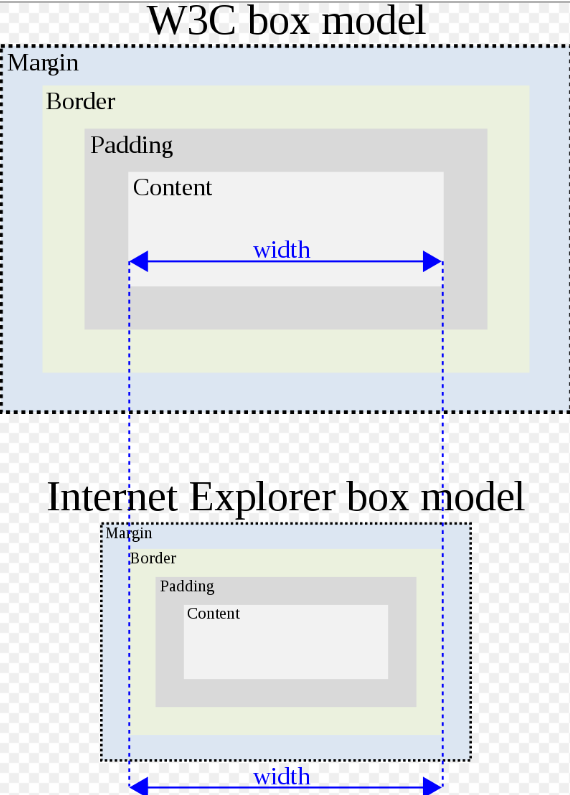
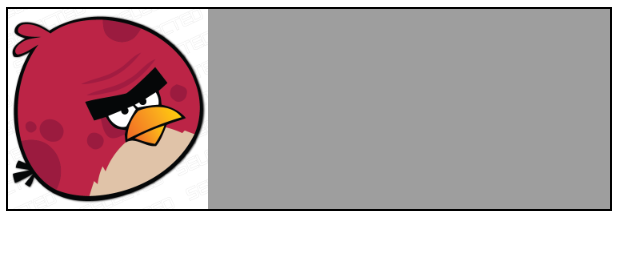

浏览器的渲染引擎会采用一些不同的渲染模式以兼容渲染过去 HTML 发展过程中和现代规范不同的网页，其中标准模式是用来针对现行的 HTML5 规范，而有限标准模式和怪异模式都是针对以前的网页。

浏览器渲染引擎会根据 HTML 的 DTD 声明形式`<!DOCTYPE>`来判断采用何种渲染模式，不同的渲染模式可能导致些许网页最终呈现上的差异，这些差异主要来源于 DOM 解析以及布局过程中。

## 标准模式

使用标准的 HTML4.0 或者 HTML5.0 的声明方式，都会采用标准模式来渲染网页，如此：

```html
<!-- HTML4 -->
<!DOCTYPE html PUBLIC "-//W3C//DTD HTML 4.01//EN" "http://www.w3.org/TR/html4/strict.dtd">

<!-- 没有系统标识 -->
<!DOCTYPE html PUBLIC "-//W3C//DTD HTML 4.01//EN">
```

```html
<!-- HTML5 -->
<!DOCTYPE html>
```

### 有限标准模式

如果使用的是 HTML4.0 的宽松声明方式，Chrome，IE 等会使用**有限标准模式**来渲染网页

```html
<!DOCTYPE html PUBLIC "-//W3C//DTD HTML 4.01 Transitional//EN" "http://www.w3.org/TR/html4/loose.dtd">
```

## 怪异模式

> [wahtwg - Quirks Mode](https://quirks.spec.whatwg.org/)

如果**未使用任何`<!DOCTYPE>`声明**或者`<!DOCTYPE>`声明的方式不符合标准形式，缺少必要属性等，浏览器就会使用怪异模式来渲染网页：

```html
<!-- 例如 -->
<!DOCTYPE html PUBLIC>

<!DOCTYPE html PUBLIC "-//W3C//DTD HTML 4.01 Transitional//EN">
```

另外，IE6 版本之前的 IE 浏览器，如果在`<!DOCTYPE>`声明之前有一个 XML 声明，不管是否指定完整的 DOCTYPE，它就会以怪异模式渲染一个页面

```html
<?xml version="1.0" encoding="utf-8"?>
<!DOCTYPE html PUBLIC "-//W3C//DTD XHTML 1.0 Strict//EN" "http://www.w3.org/TR/xhtml1/DTD/xhtml1-strict.dtd">
```

在 IE9 版本以前，如果 DOCTYPE 之前有任何语句，包括注释语句，怪异模式也将会触发；IE9 版本以后基本没有这些区别了，统一和主流的浏览器使用标准模式。

```html
<!-- This comment will put IE 6, 7, 8, and 9 in quirks mode -->
<!DOCTYPE html PUBLIC "-//W3C//DTD HTML 4.01//EN" "http://www.w3.org/TR/html4/strict.dtd">
```

## 怪异模式和标准模式的区别

### IE 盒模型缺陷

在 HTML 4 和 CSS 之前，很少 HTML 元素既支持 border 也支持 padding，所以对一个元素的宽度和高度的定义并不是很有争议，当时也只是非常少浏览器供应商严格地实施了 W3C 盒模型。

**在 IE6 版本及以前**，IE 浏览器也没有按照标准的 W3C 规定的盒模型来呈现元素尺寸，它是把内容，内边距（padding）和边框（border）全部包括在一个指定的宽度或高度之内。在 IE6 版本及以后，则尽在怪异模式的网页中如此计算盒模型，标准模式则是使用 W3C 的规范标准盒模型。

```shell
width = content width + padding + border;

size = width + margin;
```



### 图片的垂直对齐

标准模式和怪异模式下，浏览器对块级元素内部的图片的行高`line-height`处理不同：

- 怪异模式下，块级元素内部的图片将对齐至包含它们的盒子的下边框；



- 而在标准模式下，块级元素内部的图片将对齐至基线，也就是图片下面可能留有空白部分。


- 而在使用有限标准模式的网页中，`table-cell`内部的图片也将使用怪异模式的方式去处理，下方没有任何空白。

```html
<!DOCTYPE html PUBLIC "-//W3C//DTD HTML 4.01 Transitional//EN" "http://www.w3.org/TR/html4/loose.dtd">

<div
  id="box"
  style="display: table-cell; border: 2px solid; background: #9e9e9e;"
>
  
</div>
```

