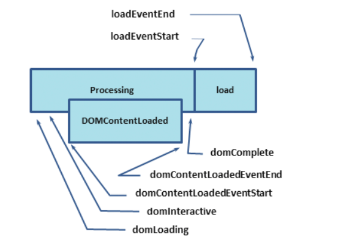

## 事件

### DOMContentLoaded

当初始的 HTML 被完全加载和解析完成之后，`DOMContentLoaded`事件被触发，而无需等待样式表、图像和子框架的完全加载；**`DOMContentLoaded`事件必须等待其所属 script 之前的样式表加载解析完成才会触发**，但是`script`支持`defer`和`async`属性，有不同的触发策略：

- `defer`的 JS 会在`DOMContentLoaded`之前执行
- `async`的 JS 不会影响`DOMContentLoaded`执行；`DOMContentLoaded`可能会发生在异步脚本之前（如果异步脚本在页面完成后才加载完成），`DOMContentLoaded`也可能发生在异步脚本之后（如果异步脚本很短，或者是从 HTTP 缓存中加载的）

```javascript
document.addEventListener('DOMContentLoaded', function() {
  console.log('3 seconds passed');
});
```

### load

当整个页面及所有依赖资源如样式表，图片等资源都已完成加载时，触发`load`事件

```javascript
window.addEventListener('load', event => {
  console.log('page is fully loaded');
});

window.onload = event => {
  console.log('page is fully loaded');
};
```



一张图对比`DOMContentLoaded`和`load`事件触发的时间，可以看出`DOMContentLoaded`总是在 DOM 解析的过程中触发，而`load`则在文档和所有子资源完成加载以后触发。

### beforeunload

当用户触发了离开页面的导航（navigation）或试图关闭当前标签页窗口或者浏览器时，会触发`beforeunload`事件

- 该事件经常用作编辑文档时提示窗口关闭，网页能够触发一个确认对话框，询问用户是否真的要离开该页面；但是需要注意阻止默认的浏览器事件`preventDefault`

```javascript
window.addEventListener('beforeunload', event => {
  // Cancel the event as stated by the standard.
  event.preventDefault();
  // Chrome requires returnValue to be set.
  alert('确认离开当前页面吗?');
});
```

### unload

页面或者`iframe`窗口正在被关闭时触发

```javascript
window.addEventListener('unload', function(event) {
  console.log('I am the 3rd one.');
});
```

### readystatechange

`readystatechange` 事件是跟踪文档加载状态的另一种机制，它很早就存在了，现在则很少被使用。

> [current document readiness](https://html.spec.whatwg.org/multipage/dom.html#current-document-readiness)
>
> [stops parsing the document](https://html.spec.whatwg.org/multipage/parsing.html#the-end)

- `loading`：正在加载
- `interactive`：浏览器完成对所有 HTML 的解析，DOM 元素可以访问，但是图像，样式表等资源可能还在加载，接下来会触发`DOMContentLoaded`事件
- `complete`：文档和所有子资源已完成加载，接下来就会触发`load`事件

> 使用`readystatechange`可以实现其他 DOM 事件

```javascript
// 模拟 DOMContentLoaded/ jquery ready
document.onreadystatechange = function() {
  if (document.readyState === 'interactive') {
    initApplication();
  }
};
```

```javascript
// 模拟 load 事件
document.onreadystatechange = function() {
  if (document.readyState === 'complete') {
    initApplication();
  }
};
```

