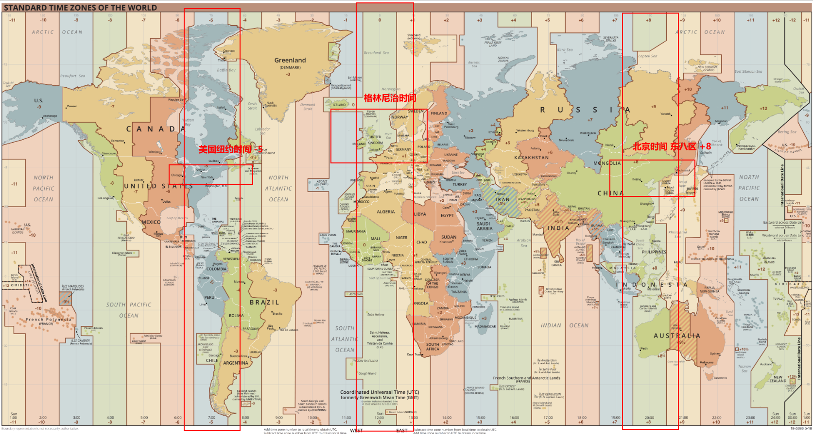

## 计算机表示时间的几种方法

### GMT

GMT，Greenwich Mean Time，是部分欧洲国家仍然在使用的格林尼治标准时间，是英国伦敦格林尼治天文台所在地当地的时间。


### UTC

Coordinated Universal Time，协调世界时间，是由国际标准组织（ISO，Internatinal oganization of standard）制定并且测量的世界标准参考时间，它的值**和 GMT 接近**，相差不超过 0.9 秒，但是精度比 GMT 要更高。UTC 主要是为了统一全球时间表示，为了不区分时区表示同一时间，各个地区都是基于 UTC 时间偏移量来表示本地时间，例如中国地区`UTC +08:00`，美国`UTC -04:00`。

### 计算机系统的起始时间

`19700101`，这是一个有趣的时间，被称为 Unix 时间；在 1971 年，《Unix Programmer's Manua》出版，将格林威治时间（GMT）`1971年1月1日0时0分0秒`作为系统的起始时间。后来为方便记忆和计算，起始时间修改成 1970 ；由于 Unix 是 32 位系统，最大能表示的数字为 32 个二进制 1 也就是`2^31`，这个数字存储的是秒，换算成年就是`2^31/(365*24*60*60) ≈ 68`，从 1970 年算起到 2038 年结束，所以就有了 2038 年问题的来源。

### unix 时间戳

时间戳时相对于 UTC 标准时间而言的，所以时间戳没有时区的分别，从 UTC`1970年01月01日00时00分00秒`到现在的 UTC 时间经过的毫秒数就是时间戳。

## 规范标准

### RFC 2822

> [RFC 2822](https://tools.ietf.org/html/rfc2822#page-14)
>
> `[day-of-week , ] day month year hour ":" minute [ ":" second ] zone`

RFC 2822 是由互联网工程任务组（英语：Internet Engineering Task Force，缩写：IETF，IETF 是一个非盈利的，自愿加入的，并且创建出来的标准也是资源遵守的组织）制定的时间表示格式，这种形式规则如下：

- `day-of-week`：取星期几的英文单词前三个字母，"Mon" / "Tue" / "Wed" / "Thu" / "Fri" / "Sat" / "Sun"
- `day`：两位数，`[0, 30]`
- `month`：取月份单词的前三个字母，"Jan" / "Feb" / "Mar" / "Apr" / "May" / "Jun" / "Jul" / "Aug" / "Sep" / "Oct" / "Nov" / "Dec"

- `year`：四位数字，`[0000, 9999]`
- `time`：时分秒，秒可选
- `zone`：`±`紧跟四位数字，表示时区

```java
6 Mar 17 21:22 UT
6 Mar 17 21:22:23 UT
6 Mar 2017 21:22:23 GMT
06 Mar 2017 21:22:23 Z
Mon 06 Mar 2017 21:22:23 z
Mon, 06 Mar 2017 21:22:23 +0000
```

### RFC 7213

> [HTTP-date](https://tools.ietf.org/html/rfc7231#section-7.1.1)
>
> `Sun, 06 Nov 1994 08:49:37 GMT`

RFC 7213 是 ES 规范文档中出现的一种时间格式，也是 IETF 制定的，实际上和 RFC 2822 是一样的时间格式。

### ISO 8601

> [Wikipedia - ISO_8601](https://en.wikipedia.org/wiki/ISO_8601)

ISO 8601 是由国际标准化组织（ISO，International Organization for Standardization）制定的表示日期和时间的方式，上文说过 IETF 完全是一个自愿性的组织，所以标准不是那么严格，但是 ISO 是全球各个国家和地区公认的，走到哪都认可。

ISO 8601 的时间表示一般形如以下三种形式：

```shell
YYYY-MM-DDTHH:mm:ss.sss

YYYY-MM-DDTHH:mm:ss.sssZ

YYYY-MM-DDTHH:mm:ss.sss+hhmm
```

对于表示时间字符串的形式 ISO8601 有明确规定如下：

#### 日期格式

- 年份，使用`YYYY`表示从[0000~9999]之间的年，超过`9999`或者小于`0000`的年份可以在前面用`+`或者`-`表示

```javascript
±YYYYYY
```

- 月份和日期分别用`MM`和`DD`表示，允许以下格式的日期表示，至少保证 8 位数字，不足的前面补`0`

```javascript
YYYY - MM - DD;
YYYYMMDD;

YYYY - MM; //不允许
YYMMDD; //也不允许

// 在2000年的规范时允许省略年份，但是2004以后就不允许了
--MM - DD;
--MMDD;
```

- 周，使用`W`大写字母加上[01~53]的格式`Www`，后面可以加上`D`表示是一周的第几天，周只能放在年份后面，允许以下格式；关于一年第一周的计算，通常是指一年第一个星期四所在的周

```javascript
YYYY - Www;
YYYYWww;
YYYY - Www - D;
YYYYWwwD;

2009 - W01 - 1; // 表示2008年12月29日，星期一
```

- 还支持一种日期表示格式，表示在一年的第几天，[001~365]

```javascript
YYYY - DDD;
YYYYDDD;

1981 - 095; // 1981-04-05
```

#### 时间格式

在表示时间上，ISO 采用的都是 24 小时，基础格式是`[hh][mm][ss][.mmm]`，拓展格式是`[hh][mm][ss]`；`[hh]`在`[00~24]`之间，`[mm]`在`[00~59]`之间，`[ss]`在`[00~60]`之间，在最新的 2019 的规范中，`0`时不再使用`24:00`表示，而是使用`00:00`，使用这张格式需要注意日期需要提前一天；注意毫秒前面的`.`不能省略

```javascript
hh: mm: ss.sss;
hhmmss.sss;
hh: mm: ss;
hhmmss;
hh: mm;
hhmm;
hh;
```

日期和时间合并表示，需要在中间加上**大写字母`T`**连接，有时候`T`也可以省略

```javascript
2007-04-05T14:30Z

200704051430
```

#### 时区表示

UTC 时间是全球一致的标准时间，ISO 使用 UTC 偏移量来表示时区，**强烈建议在表示时间的字符串中一定要带上`Z`表示这是标准的 UTC 时间，或者带上偏移量`±[hh][mm]`来表示和 UTC 时间的区别，如果什么都不到，将表示这个时间就是本地时间**。

如果时间是 UTC 时间，后面会紧跟大写字母`Z`，`Z`是零 UTC 偏移量的标志；

```javascript
1995-12-17T03:24:00Z
```

如果时间后面不带`Z`而紧跟`±[hh]:[mm]`，`±[hh][mm]`或者`±[hh]`的形式，表示时区相对于 UTC 标准时间增加或者减少的时间；

- 减号`-`表示慢于 UTC 时间，也就是说 UTC 标准时间要在当前时区的时间加上偏移量得到，一般都是西半球的国家；
- 而`+`表示快于 UTC 时间，一般都是东方国家，也就是说 UTC 标准时间要在当前时区的时间减去偏移量得到

```javascript
1995-12-17T03:24:00+0800

// 偏移量 + 08:00，表示快于UTC时间8个小时，则UTC时间需要减去8得到，大约是
1995-12-16T19:24:00Z
```

如果时间没有任何表示时区的标志，则表示以本地时区为参考，也就是省略了偏移量的形式；

```javascript
1995-12-17T03:24:00
```



