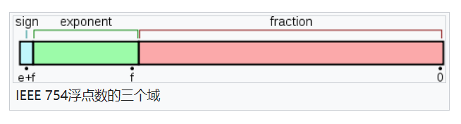
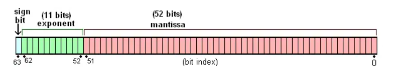
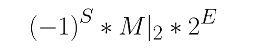
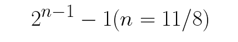

## 计算机中的浮点数表示

> [wikipedia - IEEE 754](https://zh.wikipedia.org/wiki/IEEE_754)

浮点就是浮动的小数点，通过小数点移位来表示精度不同的数值，所以浮点数也就是小数。

IEEE 754 二进制浮点数算数标准是目前使用最广泛的浮点数运算标准，它指定的是现实世界中的数字如何在计算机的二进制世界中进行表示的方法，大多数编程语言都使用 IEEE 754 标准来设定语言中的数字类型。

在 IEEE 754 算术标准中，一个浮点数在转成二进制科学计数法以后，可以使用三部分的二进制组合表示，一个二进制符号位，一部分二进制表示指数部分，一部分表示有效数字部分



### 32 位单精度浮点数

单精度，用 8 位存储二进制科学计数法的指数部分，用 23 位存储有效数字部分


### 64 位双精度浮点数

64 位双精度使用 64 位二进制表示浮点数，用 11 位存储二进制科学计数法的指数部分，用 52 位存储有效数字部分



由于 JS 使用的是 64 位双精度浮点数，所以只看从 JS 数字到 64 位二进制的转换过程。根据 IEEE 规范，一个浮点数使用由符号位，指数部分，尾数部分三部分组合的**二进制科学计数法形式**来表示。例如：

```javascript
171 = 10101011 = -1 ^ (0 * 1.0101011 * 2) ^ 7;
```



在这个表达式中，**需要注意的是 S，E 都是十进制数，而 M 是二进制数**，**S 和 E 需要换算成二进制形式来表示**，但是实际 IEEE 754 规范并不是直接将这三部分存成二进制，需要遵循下面的约束规则：

- S，sign，符号位，需要一位二进制来表示正负，`0`表示正，`1`表示负；
- E，exponent，指数部分，在 64 位双精度浮点数中用 11 位二进制来换算，但是都知道指数值有正负之分，所以指数值不能直接转成 11 位二进制来表示；所以 IEEE 规定了一个中间数来区分指数的正负，大于中间数的指数值就是正，小于中间数的指数值就是负。实际的指数值 E 加上这个中间数然后再转成 11 位二进制形式就得到了 64 位二进制中表示指数的部分。
  - 这个中间数根据 IEEE 754 标准规定使用以下公式进行计算；那么在 64 位双精度下指数部分用 11 位二进制表示，中间数就是 1023，所以实际的指数值为 11 位二进制转换成十进制得到的数值再减去 1023



- M，mantissa，尾数部分，上文提到科学计数法的前面小数部分就是尾数，形如：`1.0101011 * 2^7`尾数是`1.0101011`，那么在二进制科学计数法的形式里面，**尾数的小数点左侧部分肯定始终保证是 1，所以在保存的时候就可以被舍弃了**，只保存尾数的小数点右侧的部分，所以在 64 位双精度浮点数中，尾数有 52 位，但是实际表示的是 53 位有效数字`1.xxxxx`，1 后面跟 52 位部分


如上表示十进制数字转 64 位的形式，如果要逆向转换得到上面的二进制科学计数法形式，**还需要对尾数部分继续转十进制**才能和符号部分`(-1)^S`，指数部分`2^E`相乘，因为乘法肯定是建立在都是十进制的基础上。

```javascript
// 举个例子
4.5

// 转成二进制科学计数法
1.001 * 2^2

// 上面的指数部分2，还需要加上1023，得到E是1025，然后再将1025转成11位二进制，缺位补0，就得到了指数部分的二进制形式

1025	=>		10000000001

// 再看有效数字部分，1.001舍去小数点前面1，得到001，不足52位，后面全补0
0010000000000000000000000000000000000000000000000000

// 最后和11位指数部分，1位符号位，拼接在一起得到完整的64二进制形式M
0010000000000000000000000000000000000000000000000000 10000000001 0

// 这个64位二进制反过来转回十进制，先找到前面52位，并在前面补上舍去的 1.组成尾数部分
1. 0010000000000000000000000000000000000000000000000000

// 然后找到指数部分11位转成十进制，然后减去1023，得到指数实际值 E = 2
10000000001 = 1025
1025 - 1023 = 2

// 最后一位符号位是 S = 0，表示正，得到二进制科学计数法形式
(-1)^0 * 2^2 * 1. 0010000000000000000000000000000000000000000000000000|(二进制)

// 继续讲尾数部分1. 001转十进制
1.001 = 1*2^0 + 0*2^(-1) + 0*2^(-2) + 1*2^(-3) = 1 + 1/8

// 最后三部分相乘
(-1)^0 * 2^2 * (1 + 1/8)  = 4.5
```

- 三个特殊值

1. 如果指数部分二进制全为`0`并且尾数的小数部分也全是`0`的时候，就表示正负 0`±0`
2. 如果指数部分全是`1`并且尾数的小数部分全是`0`，就表示正负无穷`±Infinity`；
3. 如果指数部分全是`1`而尾数的小数部分不全是`0`，这里的`2^52-1`种情况都表示`NaN`