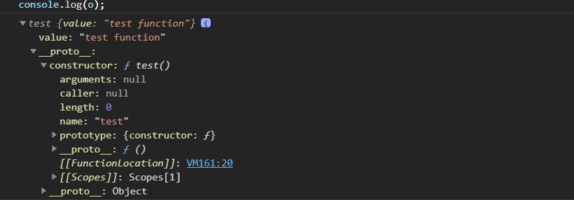
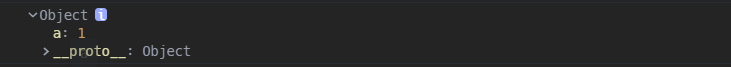
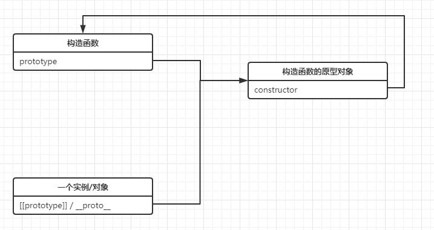

## 面向对象

通常的面向对象语言都具有三大特性：封装，继承和多态，JS 虽然是面向对象语言，但是 JS 没有类，只能通过构造函数和原型链来实现封装和继承的特性。

## 封装

### 构造函数

- 任何函数都可以作为构造函数，区别是构造函数调用使用`new`关键字
- 构造函数的调用会创建一个新的空对象，这个对象从构造函数的原型对象继承属性和方法，并把这个对象作为其调用上下文，为其绑定`this`

### new

只有普通函数和类能被`new`调用，而箭头函数不能作为构造函数，这也是箭头函数和普通函数的一个主要区别

- 创建新对象
- 将新对象的`[[prototype]]`指向构造函数的原型`prototype`
- 指定构造函数内部的调用上下文对象为新对象，也就是绑定`this`
- 执行构造函数，初始化对象属性
- 返回新对象

```javascript
//模拟实现new
function create(Constructor) {
  // 创建一个空的对象
  var obj = new Object();

  // 设置新对象的 __proto__ 为构造函数的原型对象，从而继承原型对象的属性
  Object.setPrototypeOf(obj, Constructor.prototype);

  // 调用构造函数本身，初始化对象，apply 调用指定 this 值和参数的函数，并返回其结果
  var ret = Constructor.apply(obj, [...arguments].slice(1));

  // 优先返回构造函数返回的对象
  return ret instanceof Object ? ret : obj;
}

// 测试
function test() {
  this.value = 'test function';
}

var o = create(test);
```



## 基于原型的继承

### prototype 和原型对象

一般来说，函数内部都有一个`prototype`属性，指向该函数的原型对象；这是其它普通对象内部所不具有的属性。

> Note：并非所有函数都有原型，`Function.prototype`是一个函数，但是`Function.prototype.prototype === undefined`

```javascript
function foo() {}
console.dir(foo);
```


```javascript
// 普通对象并不具有prototype属性
var obj = { a: 1 };
console.dir(obj);
```



### prototype.constructor

`constructor`属性是原型对象内部的属性，这个属性是一个指针，指向构造函数本身；可以通过原型来访问`prototype.constructor`



- `constructor`的`enumerable`属性是`false`，是不支持遍历的
- 对于引用类型来说 `constructor` 属性值是可以修改的，但是对于基本类型来说是只读的
- `constructor`其实没有什么用处，只是 JavaScript 语言设计的历史遗留物。由于`constructor`属性是可以变更的，所以未必真的指向对象的构造函数，只是一个提示；不过，从编程习惯上，我们应该尽量让对象的`constructor`指向其构造函数。

### [[prototype]]和\_\_proto\_\_

- 每个对象内部都有一个私有属性`[[prototype]]`，指向构造函数的原型对象；某些浏览器支持`__proto__`直接观察`[[prototype]]`的值，ES5 后已经被废弃了
- 通过对象字面量`{}`创建的对象本质上是调用`Object`这个构造函数创建的，所以它们也都具有`[[prototype]]`指向`Object.prototype`
- 通过`new`关键字和构造器`Object()`，`Array()`等创建的对象，它们内部都有一个私有属性`[[prototype]]`（在某些浏览器中可以用`__proto__`（发音 dunder proto）观察），它是一个属性，指向构造函数的原型对象；`[[prototype]]`是构建原型链实现继承的基础

- 通过`Object.create()`创建的对象，是指定其`[[prototype]]`为传入的对象，也就是设置其`__proto__`属性

### 原型链

每个对象通过`[[prototype]]`属性和构造器的原型对象建立连接关系，从中继承原型对象的属性和方法；通过让原型对象等于其它构造函数创建的实例，那么原型对象具有了`[[prototype]]`属性，这样通过`[[prototype]]`与其它类型的原型对象建立连接，继承它的属性和方法，最后一层一层指向`Object.prototype`，并最终指向`null`，这种关系叫原型链。

```javascript
function SuperType() {
  this.property = 'superType';
}

SuperType.prototype.getSuperValue = function() {
  return this.property;
};

function SubType() {}

SubType.prototype = new SuperType();

var instance = new SubType();
console.log(instance.getSuperValue()); //superType
```


在原型链中需要注意：

- 原型链的构建并不依赖原型，构建原型链的基础属性是`[[prototype]]`，在浏览器中可以通过`__proto__`观察，在 ES6 以后被规范化，通过两个方法`Object.getPrototypeOf()`和`Object.setPrototypeOf()`来读写
- 一般来说每个对象原型链上都会存在`Object.prototype`这个原型对象，并从中继承一些属性和方法

- `Object.prototype`不是原型链最后一个节点，`null`才是原型链的最后环节，也就是：

```javascript
instance.__proto__ === SubType.prototype;

instance.__proto__.__proto__ === SuperType.prototype;

instance.__proto__.__proto__.__proto__ === Object.prototype;

instance.__proto__.__proto__.__proto__.__proto__ === null;
```

#### Object.prototype

> 由`Object`的原型对象提供的共享的属性

- `constructor`：指向创建对象的构造函数，也就是`Object()`
- `obj.hasOwnProperty(propertyName)`：检查给定属性是否在自有属性而不是原型对象的属性中
- `prototypeObj.isPrototypeOf(obj)`：检查前面的对象是否在后面对象的原型链上
- `obj.toLocaleString()`：返回对象的字符串表示
- `obj.toString()`：返回对象的字符串表示；经常会被覆盖重写
- `obj.valueOf()`：返回对象的字符串，数值或者布尔值表示，通常和`toString`返回值相同
- `obj.propertyIsEnumerable(propertyName)`：检查给定属性是否支持`for...in`遍历

#### 原型链搜索机制

基于原型链可以构建起原型搜索机制，每当代码读取一个对象的某个属性时，都会执行一次搜索：

- 首先从实例自身开始，找实例自身的自有属性；
- 实例对象上没有属性，就顺着`[[prototype]]`找上层继承的原型对象的属性；
- 直到`Object.prototype`上都找不到，那么就会返回`undefined`

- 正是因为原型链的搜索机制，导致实例属性上的同名属性优先级高于原型对象上的同名属性，原型链越往上层，属性优先级越低，这种现象通常称为**属性屏蔽**。

```javascript
function SuperType() {
  this.property = 'superType';
}

SuperType.prototype.getSuperValue = function() {
  return this.property;
};

function SubType() {}

SubType.prototype = new SuperType();

var instance = new SubType();
console.log(instance.getSuperValue()); //superType
```

如以上获取`getSuperValue`方法的搜索：


### 函数也是对象

为什么 JS 里的函数也是一个对象，从原型链的角度可以得出结论。

上文说过，每个函数都具有原型`prototype`属性，指向函数自身的原型对象；除此之外，每个函数都是`Function`类型的实例，所以函数内部都有`[[prototype]]`属性，指向`Function.prototype`，在浏览器中`[[prototype]]`可以用`__proto__`来观察。

```javascript
function foo() {}
console.dir(foo);
```


根据规范定义，`Function.prototype`是一个函数，虽然它是函数，但是它并没有原型`prototype`属性。

```javascript
console.log(foo.__proto__ === Function.prototype); //true

console.log(typeof Function.prototype); //"function"

console.log(Function.prototype.prototype); //undefined
```

继续观察，`Function.prototype`本身也具有`[[prototype]]`属性，它指向`Object.prototype`，从`Object.prototype`上继承了一些属性和方法，所以函数本身也就是一个对象。

```javascript
console.log(Function.prototype.__proto__ === Object.prototype); //true
```

所以从函数的角度，可以构建这样一张函数原型链的图：


### Function 和 Object

上文说过函数的原型对象会链接到`Object.prototype`；而`Object`构造函数也会具有`[[prototype]]`属性，指向`Function.prototype`

```javascript
console.log(Object.__proto__ === Function.prototype); // true
```

不光`Object`构造函数，其它内置对象，或者原始值对象的`[[prototype]]`也都指向`Function.prototype`

```javascript
console.log(Boolean.__proto__ === Function.prototype); //true

console.log(Number.__proto__ === Function.prototype); //true

console.log(String.__proto__ === Function.prototype); //true

console.log(Symbol.__proto__ === Function.prototype); //true

console.log(Array.__proto__ === Function.prototype); //true

console.log(Date.__proto__ === Function.prototype); //true

console.log(RegExp.__proto__ === Function.prototype); //true
```

所以这里存在这样一条原型链关系：


再看`Function`构造函数，它内部的`[[prototype]]`也是指向`Function.prototype`

```javascript
console.log(Function.__proto__ === Function.prototype);
```

所以这里又存在这样一条原型链：


不知道从哪冒出来什么先有`Function`还是先有`Object`的问题，仅从`instanceof`的方向考虑，`instanceof`规范定义的机制就是找原型链上的对象，所以肯定能得出以下结论：

```js
Object instanceof Function; // true
Function instanceof Object; // true

Object instanceof Object; // true
Function instanceof Function; // true
```

但是本质上`Function`和`Object`，`Array`，`String`等内置类型构造函数，它们都是函数，让它们的原型对象等于`Function.prototype`才使得原型链更加完整，试想如果没有这样一个原型链的链接，那么从 JS 的角度解释，这些内置类型构造函数到底是啥类型呢？不可能规范就这么凭空生成两个构造函数吧！

个人感觉只需要注意以下两点：

- `Function.prototype`虽然是函数，但是不具有`prototype`属性，它也根本不需要`prototype`属性，它只是在函数继承`Object`过程中起到一个中介的作用

- 普通对象的原型链中是不存在`Function.prototype`的，只有函数才会存在

最后基于函数和对象的关系，完整的函数的原型链如下图所示：


### 操作原型的方法

- `obj.__proto__`：ES5 之前的方式，可以直接设置一个对象的原型对象，现在已经废弃了
- `Object.getPrototypeOf(obj)`/ `Reflect.getPrototypeOf()`：获取一个对象的`[[prototype]]`
- `Object.setPrototypeOf(obj, prototype)`：设置一个对象的`[[prototype]]`为指定的对象，返回新的对象；如果该对象的原型属性不可扩展，会抛出`TypeError`异常

```javascript
function _setPrototypeOf(o, p) {
  _setPrototypeOf =
    Object.setPrototypeOf ||
    function _setPrototypeOf(o, p) {
      o.__proto__ = p;
      return o;
    };
  return _setPrototypeOf(o, p);
}
```

- `Reflect.setPrototypeOf(obj, prototype)`：设置一个对象的原型为指定的对象，如果操作成功返回 `true`，否则返回 `false`
- `prototypeObj.isPrototypeOf(obj)`：判断一个对象在不在后面对象的原型链上
- 多数情况下不推荐直接修改对象的原型，这样会造成其它同类型的对象收到影响，同时访问原型也会带来性能问题，推荐使用`Object.create(prototypeObj, propertiesObj)`来创建一个新的对象

## 继承的方式

继承是面向对象三大特性之一，JS 的继承都是基于原型实现的，基本思想就是通过原型链继承原型对象上的属性，并且传递`this`塑造对象的实例属性，也就是自有属性。

### 原型链继承

通过`new`直接调用父构造函数来改变子构造函数的原型对象

```javascript
function SuperType() {
  this.property = 'superType';
}

SuperType.prototype.getSuperValue = function() {
  return this.property;
};

function SubType() {}

SubType.prototype = new SuperType();

var o = new SubType();
console.log(o);
```


缺点如下：

- 由于是塑造子类型的`prototype`，所以通过父类塑造的自有属性也在`prototype`上
- `SubType`的`constructor`属性丢失了，变成了`SuperType`的`constructor`
- 最致命的一点是由于直接改变的`prototype`为父类的实例，当使用`SubType`作为构造函数创建的对象，如果其中某个对象存在操作修改原型的情况，则其它对象都会受到影响

### 借用构造函数继承

- 实现方式是借用父类的构造函数，即在子类构造函数内部将`this`绑定到父类构造函数，在调用构造函数创建一个新对象的时候，将新对象通过`call`传递到父类构造函数中，继承实例属性
- 这种方式的优点是，每次创造的对象绑定的`this`是分开的，引用类型的属性修改也不会相互影响，弥补了原型链继承的不足；当然缺点就是无法继承父构造函数原型对象上的属性和方法

```javascript
function SuperType() {
  this.property = 'superType';
}

SuperType.prototype.getPropertyValue = function() {
  return this.property;
};

function SubType() {
  SuperType.call(this);
}

var o = new SubType();
console.log(o);
```


### 组合继承

- 把原型链和构造函数调用组合起来，是最常用的继承模式

```javascript
function SuperType() {
  this.property = 'superType';
}

SuperType.prototype.getPropertyValue = function() {
  return this.property;
};

function SubType() {
  SuperType.call(this); //第二次调用父类构造函数
}

SubType.prototype = new SuperType(); //第一次调用父类构造函数
SubType.prototype.constructor = SubType;

var o = new SubType();
console.log(o);
```


- 这个结果不仔细看和原型链还真没什么区别，但是仔细一看，`property`这个属性在`SubType.prototype`上重复了一个？原因是`SuperType`的构造函数被调用了两次，注意代码执行的顺序，第一次是发生在赋值操作修改`SubType`的原型，第二次才是调用父类构造函数，这样在每次创建一个新对象的同时，都能将新的对象绑定到父类构造函数的`this`，在新对象的自有属性上创建一个新的同名属性，而又由于属性屏蔽的原因，自有属性会屏蔽原型上的属性，所以对象之间即使操作引用类型的属性，也不会相互影响
- 注意`constructor`属性也要补上
- 这种方式的缺点是两次调用了父类构造函数，性能上有所损失；同时可以看到`SubType`的原型对象上保留了`SuperType`内部作用在实例上的属性，这是无用的属性，浪费内存空间

```javascript
function SuperType() {
  this.property = 'superType';
  this.colors = ['1', '2', '3'];
}

SuperType.prototype.getPropertyValue = function() {
  return this.property;
};

function SubType() {
  SuperType.call(this); //第二次调用父类构造函数
}

SubType.prototype = new SuperType(); //第一次调用父类构造函数
SubType.prototype.constructor = SubType;

var o = new SubType();
var t = new SubType();
o.colors.push('4');

console.log(o);
console.log(t);
```


### 原型式继承

- JSON 格式的发明人道格拉斯·克罗克福德提出了一个`object()`函数，其实和原型链的基本思想是一致的，就是让构造函数的原型指向另一个类型的实例

```javascript
function object(prototypeObj) {
  function F() {}

  F.prototype = prototypeObj; //只是复制了被继承类型的原型对象的内存地址

  return new F();
}
```

缺点

- 对象保有相同的原型对象的引用，引用类型的属性有被篡改的可能

### 寄生式继承

- 然后道格拉斯·克罗克福德又在原型继承的基础上提出了寄生式继承，在内部增强了返回的对象，为它添加了一些自有属性

```javascript
function object(prototypeObj) {
  function F() {}

  F.prototype = prototypeObj;

  return new F();
}

function createOther(prototypeObj) {
  //原型式继承
  var clone = object(prototypeObj);

  clone.colors = [1, 2];

  return clone;
}
```

缺点

- 对象保有相同的原型对象的引用，引用类型的属性有被篡改的可能
- 如果为对象在内部添加函数类型的属性值，每次创建一个对象都是创建一个新的方法，无法达到函数复用的目的

> `Object.create(proto[, propertiesObject])`

- ES5 添加了`Object.create()`这个方法，设置对象的`[[prototype]]`属性；JS 高级程序设计说这个方法是为了规范原型继承，但我个人认为它更像是寄生继承，因为它支持传入自定义的自有属性

```javascript
var o = Object.create(Object.prototype, {
  // foo会成为所创建对象的数据属性
  foo: {
    writable: true,
    configurable: true,
    value: 'hello',
  },
  // bar会成为所创建对象的访问器属性
  bar: {
    configurable: false,
    get: function() {
      return 10;
    },
    set: function(value) {
      console.log('Setting `o.bar` to', value);
    },
  },
});
```

### 寄生组合式继承

- 简化了组合继承的实现方式，利用复制副本的方式代替调用父类构造函数；利用父类的原型对象初始化一个新的对象出来

```javascript
function SuperType() {
  this.property = 'superType';
  this.colors = ['1', '2', '3'];
}

SuperType.prototype.getPropertyValue = function() {
  return this.property;
};

function SubType() {
  SuperType.call(this); // 只调用一次父类构造函数，继承实例属性
}

SubType.prototype = Object.create(SuperType.prototype); // 核心部分，复制一个 SuperType 的原型对象出来，作为 SubType 的原型对象
SubType.prototype.constructor = SubType;                // 还原 constructor 属性

var o = new SubType();
var t = new SubType();
o.colors.push('4');

console.log(o);
console.log(t);
```


## 类

### 类的几个发展阶段

> ES3

ES3 的类只是内置类型包括基础类型和引用类型，如`Number`，`String`，`Date`等的一个私有属性`[[class]]`，语言使用者唯一可以访问`[[class]]`的方式就是`Object.prototype.toString`，并且 ES3 的时候，只有下面几种类型有这个内置属性，可以看出这时候还不支持`Null`和`Undefined`

```javascript
“Number”
“String”
“Boolean”

“Array”
“Object”
“Date”
“Function”
“RegExp”
“Error”
“Math”
```

调用`Object.prototype.toString.call(thisArg)`会执行以下步骤

1. 获取 this 对象的`[[Class]]`属性的值
2. 计算出三个字符串`[object` , 第一步的操作结果, 以及`]`连接后的新字符串.
3. 返回第二步的操作结果

> ES5

到了 ES5，对`[[class]]`做了进一步完善，支持了`Null`，`Undefined`和`JSON`

> ES6

到了 ES6 版本，`[[class]]`私有属性被 `Symbol.toStringTag` 代替，这个`Symbol`的属性指向一个方法。通过`call`调用`Object.prototype.toString`方法时，如果传入对象的这个属性存在，它的返回值会出现在`toString`方法返回的字符串之中，表示对象的类型。

同时 ES6 也正式引入了`class`关键字，用来在 JS 中创建类。

```javascript
Symbol.prototype[Symbol.toStringTag]; //Symbol
Map.prototype[Symbol.toStringTag]; //Map
Promise.prototype[Symbol.toStringTag]; //Promise
```

### class

ES6 正式引入了 JS 里的`class`关键字，并支持`new`创建对象，并且支持继承；不过实际上**class 还是参照了构造函数的原型来实现，定义在 class 中的普通方法都被放在了构造函数的原型对象上，而静态方法都被放在了构造函数的自有属性上**，`constructor`依旧被用作初始化对象，内部可通过`this`定义对象自有属性。

对`class`使用`typeof`，返回的就是**function**

```javascript
//ES6 class的写法
class Person {
  constructor(name, age) {
    this.name = name;
    this.age = age;
  }

  sayName() {}
}

console.log(typeof Person); // function
```

```javascript
'use strict';

function _instanceof(left, right) {
  if (
    right != null &&
    typeof Symbol !== 'undefined' &&
    right[Symbol.hasInstance]
  ) {
    // 检测class是否通过new调用的，即判断this的指向是否是当前构造器的一个实例
    return !!right[Symbol.hasInstance](left);
  } else {
    return left instanceof right;
  }
}

function _classCallCheck(instance, Constructor) {
  if (!_instanceof(instance, Constructor)) {
    throw new TypeError('Cannot call a class as a function');
  }
}

// 定义属性的特殊性
// 默认class内部的属性都是不可枚举的，不支持 for...in 操作
function _defineProperties(target, props) {
  for (var i = 0; i < props.length; i++) {
    var descriptor = props[i];
    descriptor.enumerable = descriptor.enumerable || false;
    descriptor.configurable = true;
    if ('value' in descriptor) descriptor.writable = true;
    Object.defineProperty(target, descriptor.key, descriptor);
  }
}

// 非静态类型的属性都是定义在原型上
// 静态类型的属性直接定义在构造函数上
function _createClass(Constructor, protoProps, staticProps) {
  if (protoProps) _defineProperties(Constructor.prototype, protoProps);
  if (staticProps) _defineProperties(Constructor, staticProps);
  return Constructor;
}

//使用了一个立即执行的函数表达式，并且内部实现了闭包
var Person = (function() {
  function Person(name, age) {
    _classCallCheck(this, Person);

    this.name = name;
    this.age = age;
  }

  //塑造构造函数的原型
  _createClass(Person, [
    {
      key: 'sayName',
      value: function sayName() {},
    },
  ]);

  return Person;
})();
```

## 基于类的继承

`class`属于函数，其实现继承的方式通过`extends`关键字，有以下几种情况：

- 子类内部的普通函数，最终定义在父类的`prototype`上；
- 子类内部的箭头函数，定义在`this`，也就是类的实例上；
- 子类的静态函数`static`，定义在自己身上

```javascript
class Parent {}

class Child extends Parent {
  func1() {}

  static func2() {}
}

class Grandson extends Child {
  func3() {}

  static func4() {}
}
```


`class`的继承使用`extends`关键字，`extends`实现的原理是复制父类构造函数原型对象的副本，这种方式其实也有弊端，无法继承实例属性

```javascript
function _inherits(subClass, superClass) {
  if (typeof superClass !== 'function' && superClass !== null) {
    throw new TypeError('superClass must be a function or null');
  }

  // 复制原型并添加constructor属性，继承原型对象的属性
  subClass.prototype = Object.create(superClass && superClass.prototype, {
    constructor: {
      value: subClass,
      writable: true,
      configurable: true,
      enumerable: false,
    },
  });

  // 设置子类的 __proto__ = 父类，让子类可以调用父类静态方法
  if (superClass) {
    if (Object.setPrototypeOf) {
      Object.setPrototypeOf(subClass, superClass);
    } else {
      subClass.__proto__ = superClass;
    }
  }
}
```