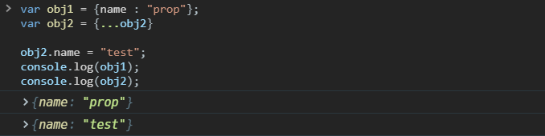
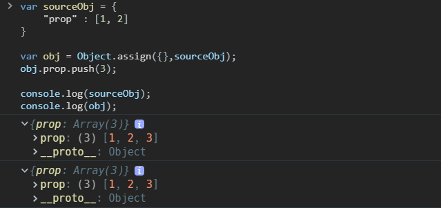
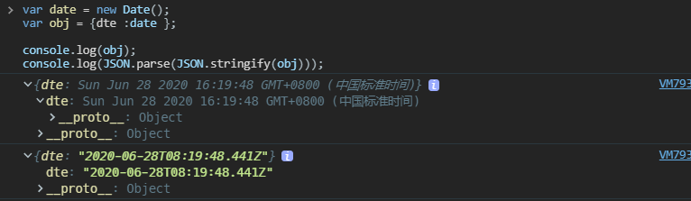
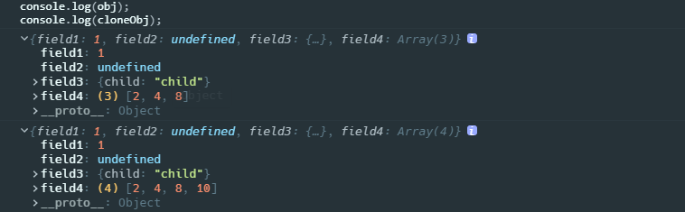

## 赋值

### =

针对赋值运算符`=`的操作，基本类型的值是复制值给新的变量，引用类型的值是复制内存地址给新的变量

```javascript
// 赋值
var obj1 = { name: 'prop' };
var obj2 = obj1;

obj2.name = 'test';
console.log(obj1);
console.log(obj2);
console.log(obj1 === obj2); //true
```


### 函数参数传递

传递参数给函数都属于赋值的操作，也就是值传递，原始类型值复制值，`Object`类型值复制引用地址值的副本

```javascript
function assign(obj) {
  obj.a.b = 2;
}

var obj = {
  a: {
    b: 1,
  },
};

var obj2 = obj;
assign(obj2);
console.log(obj);
console.log(obj2);
```


## 浅拷贝

赋值和拷贝是容易搞混的两个概念，拷贝是创建一个新的对象或者数组，**修改新对象内部的基本类型属性也不会影响源对象**；而赋值完全就是操作一样的对象，只是操作的变量名不一样而已，最明显的修改基本类型的属性值也会影响源对象；也可以这么理解，赋值针对的是`=`两边的整体，而拷贝就要讨论到整体内部的结构是否受影响了。

以上文中`=`赋值的操作来看，如果是拷贝，得出的新对象修改属性是不会影响原对象的。

```javascript
// 拷贝
var obj1 = { name: 'prop' };
var obj2 = { ...obj2 };

obj2.name = 'test';
console.log(obj1);
console.log(obj2);
console.log(obj1 === obj2); //false
```



### `Object.assign`

`Object.assign`是 ES6 引入的方法，传入目标对象和一个或者多个源对象，将多个源对象**自有属性中可枚举属性**在目标对象中创建一份，然后将源对象属性值复制给目标对象；目标对象相同属性名的值会被源对象的值覆盖，传入多个对象时是后面传入的源对象的同名属性值会覆盖前面的。

```javascript
var sourceObj = {
  prop: [1, 2],
};

var obj = Object.assign({}, sourceObj);
obj.prop.push(3);

console.log(sourceObj);
console.log(obj);

var obj1 = {
  a: 'hello',
  b: {
    a: 'hello',
    b: 21,
  },
};

var cloneObj1 = Object.assign({}, obj1);
cloneObj1.a = 'changed';
cloneObj1.b.a = 'changed';
console.log(obj1.a); //hello
console.log(obj1.b.a); //changed
```



- `Object.assign()`不光支持对象的浅拷贝，还可以浅拷贝数组，还可以将数组和字符串按`索引-元素`的形式复制给对象，将字符串拆解成单个字符组成的数组；总之会保证目标参数`target`传进去的是什么类型，最后拷贝得到的就是什么类型

```javascript
var obj = Object.assign([], ['a', 'b']); //["a","b"]

var obj = Object.assign({}, ['a', 'b']); //{0: "a", 1: "b"}

var obj = Object.assign({}, 'ab'); //{0: "a", 1: "b"}

var obj = Object.assign([], 'ab'); //["a","b"]

var obj = Object.assign('', 'ab'); //String {"", 0: "a", 1: "b"}

var obj = Object.assign('', ['a', 'b']); //String {"", 0: "a", 1: "b"}
```

- `Object.assign()`这个方法是在 ES6 里面，面试经常会让表述其实现，注意以下几点
  - `Object.assign()`拷贝的是自有属性中可枚举的属性，要考虑几种遍历属性的方法的区别性
  - `String`，`Symbol`，`Date`，`RegExp`都能拷贝
  - 对于传入`null`和`undefined`类型参数不会报错

```javascript
// 定义assign函数
function assign(target) {
  // 为什么不判断null和undefined，是因为Object会把它们转成一个空对象
  var _target = Object(target);

  if (arguments.length > 1) {
    for (var i = 1; i < arguments.length; i++) {
      var source = arguments[i];

      // 保证传入undefined和null不会报错
      if (source !== undefined && source !== null) {
        if (Object.keys) {
          // ES5 - 获取对象自有属性中可枚举的属性
          Object.keys(source).forEach(function(propertyName) {
            _target[propertyName] = source[propertyName];
          });
        } else {
          // ES3
          for (var propertyName in source) {
            if (Object.prototype.hasOwnProperty.call(source, propertyName)) {
              _target[propertyName] = source[propertyName];
            }
          }
        }

        // 支持Symbol - ES6才有
        if (Object.getOwnPropertySymbols) {
          Object.getOwnPropertySymbols(source).forEach(function(propertyName) {
            _target[propertyName] = source[propertyName];
          });
        }
      }
    }
  }

  return _target;
}

Object.defineProperty(Object, 'assign', {
  value: assign,
  configurable: true,
  writable: true,
  enumerable: false,
});
```

### `Array.prototype.concat()`

- 数组都会继承这个方法，对`concat()`不传参数就是浅拷贝

```javascript
var arr1 = [1, 2, { prop: 'arr1' }];
var arr2 = [].concat(arr1);
```

### `Array.prototype.slice()`

`slice()`可以用来从已有数组中剪切部分元素组成一个新数组并返回，当对`slice()`不传参数时就相当于一个浅拷贝的过程

```javascript
var arr1 = [1, 2, { prop: 'arr1' }];
var arr2 = arr1.slice();
```

另外，`slice()`方法还能用来将类数组对象转换成一个数字

```javascript
Array.prototype.slice.call(arguments);
```

### 展开运算符`...`

ES6 的展开运算符可以针对对象，数组，字符串做语法层面的展开，字符串会转换成数组，对象和数组会采用浅拷贝；可以把它当作`Object.assign()`和`Array.prototype.slice()`

### `Array.from`

```javascript
var arr1 = [1, 2, { prop: 'arr1' }];
var arr2 = Array.from(arr1);

arr2[2].prop = 'arr2';
console.log(arr1);
console.log(arr2);
```


### `Object.create()`

- `Object.create()`不能算做拷贝对象的一个方法，但是值得说的是它做的也是浅拷贝的动作，并且连原型对象上的属性也会复制过去

```javascript
var sourceObj = {
  prop: [1, 2],
};

var targetObj = Object.create(sourceObj);
targetObj.prop.push(3);

console.log(sourceObj);
console.log(targetObj);
```


## 深拷贝

> [Deep-copying in JavaScript](https://dassur.ma/things/deep-copy/)

对于浅拷贝和深拷贝，如果对象或者数组等，只是一层嵌套结构，那么它们的结果是相同的。它们的不用点主要是对于嵌套深层的非原始值类型`Object`的处理上，2 层及更深的`Object`，浅拷贝只会简单复制引用地址值，所以对浅拷贝的对象操作深层数据后，会影响到原对象。而深拷贝对于嵌套类型的数据结构，例如数组，对象等，**会层层递归拷贝内部属性**，遇到引用类型的属性值会重新创建新的内存地址来保存对象的值，然后把新的内存地址复制给属性。

深拷贝在 react 中的影响是很多的，如果`state`中的数据是一个深层嵌套的对象，必须十分小心其他地方对其作出修改的处理，如果每次只用`...`进行浅拷贝`state`中的对象，可能修改了一处`state`对其他地方也会产生影响；但是这时候并不是推荐使用深拷贝，而是使用`immutablejs`，因为深拷贝性能太弱了。

深拷贝需要考虑的问题很多，内部嵌套的的类型如何支持，尤其在 ES6 添加了很多额外的类型`Symbol`，`Map`，`Set`等；循环引用怎么高性能的解决，DOM 对象如何处理，正则表达式如何处理等。

### `JSON.parse(JSON.stringify(object))`

- 这算是一个古老的方法，如果一个复杂的嵌套数据结构只包含基本类型的节点，那么这是一个最简单的选择

```javascript
var sourceObj = {
  name: 'arr1',
  value: [1, 2],
  birth: undefined,
};
var targetObj = JSON.parse(JSON.stringify(sourceObj));

targetObj.value.push(3);

console.log(sourceObj);
console.log(targetObj);
```


JSON 方法的不足：

- 函数，`Symbol`，`Map`，`Set`，`ArrayBuffer`等类型和原型成员会忽略掉

- 对象内部值为`undefined`的属性和数组内部`undefined`也会被干掉
- 不能正确处理`Date`，Date 类型两次转换后会变成 UTC 格式的字符串

```javascript
// Date类型的数据会被转成字符串
var date = new Date();
var obj = { dte: date };

console.log(obj);
console.log(JSON.parse(JSON.stringify(obj)));
```



- 不能正确处理`RegExp`正则表达式，会被转换成一个空对象

```javascript
var reg = /at/g;
var obj = { reg: reg };

console.log(obj);
console.log(JSON.parse(JSON.stringify(obj)));
```


- 无法解决循环引用的问题，会抛出无法转换循环结构的错误

```javascript
var obj = { a: 'a' };
obj.b = obj;

console.log(obj);
console.log(JSON.parse(JSON.stringify(obj)));
```


### 结构化克隆算法

- [结构化克隆算法](https://html.spec.whatwg.org/multipage/structured-data.html#structuredserializeinternal)是 HTML5 规范定义的用于复制复杂 JS 对象的算法，这个算法支持的类型很多，对于 ES6 来说，除了`Symbol`不支持，其他的`Map`，`Set`，`File`之类的也支持
- 这个算法没有单独的 API 提供使用，一般都是附加在其他接口的内部使用，具体有以下几个

> [`MessageChannel`](https://developer.mozilla.org/zh-CN/docs/Web/API/MessagePort/postMessage)

- `MessageChannel`可以在两个浏览器窗口建立两个端口`MessagePort`来发送信息，`MessagePort`支持的`postMessage()`方法内部就使用了结构化克隆算法来处理传递的对象，包括循环引用的处理；我们可以利用这个方法实现一个深克隆的异步方法

```javascript
function structuralClone(obj) {
  return new Promise(resolve => {
    const {port1, port2} = new MessageChannel();
    port2.onmessage = ev => resolve(ev.data);
    port1.postMessage(obj);
  });
}

const obj = /* ... */;
const clone = await structuralClone(obj);
```

> History API

- HTML5 引入了 [`history.pushState()`](https://wiki.developer.mozilla.org/en-US/docs/Web/API/History/pushState) 和 [`history.replaceState()`](<https://wiki.developer.mozilla.org/en-US/docs/Web/API/History_API#The_replaceState()_method>) 方法，直接推动了单页面框架的诞生，这两个 API 都支持传入一个状态对象参数在不同 URL 之间传递参数，这个对象在传递的时候会使用结构化克隆算法进行处理，为了不修改浏览器历史记录，我们可以使用`history.replaceState()`来定义一个深拷贝的方法

```javascript
function structuralClone(obj) {
  // 需要保存历史状态，等会还要还原回去
  const oldState = history.state;
  history.replaceState(obj, document.title);
  const copy = history.state;
  history.replaceState(oldState, document.title);
  return copy;
}

const obj = /* ... */;
const clone = structuralClone(obj);
```

> [`Notifications`](https://developer.mozilla.org/en-US/docs/Web/API/Notification/Notification)

- `Web Notifications`，在用户允许的情况下显示跨浏览器窗口通知的 API，也就是即使切换浏览器窗口也能看的到通知；`Notification()`构造函数可以接受第二个可选的参数，这个参数可以是对象，内部有个`data`可传递任意类型的数据（`silent`是否将提醒设置成静音无震动的）

```javascript
function structuralClone(obj) {
  return new Notification('', {data: obj, silent: true}).data;
}

const obj = /* ... */;
const clone = structuralClone(obj);
```

### 第三方库

> `lodash.cloneDeep`

```javascript
var _ = require('lodash');
var arr = [{ a: 1 }, { b: 2 }];

var deep = _.cloneDeep(objects);
console.log(deep[0] === arr[0]); //false
```

> `jQuery.extend`

- `$.extend(deepCopy, target, object1, [objectN])`，该方法指定第一个参数为`true`就是深拷贝

```javascript
var $ = require('jquery');
var obj1 = {
  a: 1,
  b: { f: { g: 1 } },
  c: [1, 2, 3],
};
var obj2 = $.extend(true, {}, obj1);
console.log(obj1.b.f === obj2.b.f); // false
```

## 递归实现深拷贝

首先考虑，在浅拷贝的基础上判断对象属性值在引用类型时候需要递归复制内部数据的情况

```javascript
function cloneDeep(source) {
  if (source !== null && typeof source === 'object') {
    var result = Array.isArray(source) ? [] : {};
    Object.keys(source).forEach(function(propertyName) {
      if (
        source[propertyName] !== null &&
        typeof source[propertyName] === 'object'
      ) {
        result[propertyName] = cloneDeep(source[propertyName]);
      } else {
        result[propertyName] = source[propertyName];
      }
    });

    return result;
  }

  return source;
}
```

```javascript
//test
var obj = {
  field1: 1,
  field2: undefined,
  field3: {
    child: 'child',
  },
  field4: [2, 4, 8],
};
var cloneObj = cloneDeep(obj);
cloneObj.field4.push(10);

console.log(obj);
console.log(cloneObj);
```



### Symbol

考虑`Symbol`类型，`Symbol`类型是 ES6 新增的可以用作对象属性的类型，但是他不是可枚举类型，不支持`Object.keys`，`for...in`和`Object.getOwnPropertyNames`操作，有两种方式可以获取`Symbol`键

- 通过`Object.getOwnPropertySymbols`获取属性名数组

```javascript
function cloneDeep(source) {
  if (source !== null && typeof source === 'object') {
    //时间类型
    if (Object.prototype.toString.call(source) === '[object Date]') {
      //转时间戳再转回Date
      return new Date(source.valueOf());
    }

    //数组和对象
    var result = Array.isArray(source) ? [] : {};
    Object.getOwnPropertyNames(source).forEach(function(propertyName) {
      if (
        source[propertyName] !== null &&
        typeof source[propertyName] === 'object'
      ) {
        result[propertyName] = cloneDeep(source[propertyName]);
      } else {
        result[propertyName] = source[propertyName];
      }
    });

    //Symbol类型属性遍历
    if (Object.getOwnPropertySymbols) {
      Object.getOwnPropertySymbols(source).forEach(function(propertySymbol) {
        if (
          source[propertySymbol] !== null &&
          typeof source[propertySymbol] === 'object'
        ) {
          result[propertySymbol] = cloneDeep(source[propertySymbol]);
        } else {
          result[propertySymbol] = source[propertySymbol];
        }
      });
    }

    return result;
  }

  return source;
}
```

- 用`Reflect.ownKeys()`替换`Object.getOwnPropertyNames`和`Object.getOwnPropertySymbols()`，`Reflect.ownKeys()`就相当于`Object.getOwnPropertyNames()`和`Object.getOwnPropertySymbols()`的集合

```javascript
function cloneDeep(source) {
  if (source !== null && typeof source === 'object') {
    //时间类型
    if (Object.prototype.toString.call(source) === '[object Date]') {
      //转时间戳再转回Date
      return new Date(source.valueOf());
    }

    //数组和对象
    var result = Array.isArray(source) ? [] : {};
    Reflect.ownKeys(source).forEach(function(propertyName) {
      if (
        source[propertyName] !== null &&
        typeof source[propertyName] === 'object'
      ) {
        result[propertyName] = cloneDeep(source[propertyName]);
      } else {
        result[propertyName] = source[propertyName];
      }
    });

    return result;
  }

  return source;
}
```

### Date

考虑`Date`类型的数据，`Date`也属于引用类型，不过经过上面直接复制会被转成一个空对象，因为上面的代码只区分了数组和 Object 类型，不是数组那就使用对象字面量`{}`初始化，而 Date 类型并不像数组可以看作是索引和元素的键值对，你找不到它内部可以遍历的属性，所以就返回了空对象；我们可以将 Date 类型的值先转成时间戳，然后用时间戳和`Date`构造函数再初始化一个相同时间的`Date`类型对象

```javascript
function cloneDeep(source) {
  if (source !== null && typeof source === 'object') {
    //时间类型
    if (Object.prototype.toString.call(source) === '[object Date]') {
      //转时间戳再转回Date
      return new Date(source.valueOf());
    }

    //数组和对象
    var result = Array.isArray(source) ? [] : {};
    Object.keys(source).forEach(function(propertyName) {
      if (
        (source[propertyName] !== null) &
        (typeof source[propertyName] === 'object')
      ) {
        result[propertyName] = cloneDeep(source[propertyName]);
      } else {
        result[propertyName] = source[propertyName];
      }
    });

    return result;
  }

  return source;
}
```

```javascript
// test
var obj = {
  field1: 1,
  field2: undefined,
  field3: {
    child: 'child',
  },
  field4: [2, 4, 8],
  field5: new Date(),
};
var cloneObj = cloneDeep(obj);

console.log(obj);
console.log(cloneObj);
```


### RegExp

RegExp 和 Date 类型是一样的道理，会被转成空对象；目前所见的支持`RegExp`的就是 lodash 内部的深拷贝，可以参考一下它的实现方式

> [baseGetTag](https://github.com/lodash/lodash/blob/ddfd9b11a0126db2302cb70ec9973b66baec0975/lodash.js#L3063)

- 首先判断属性值是否为`RegExp`类型，定义了`baseGetTag`这么一个函数，判断是否支持`Symbol.toStringTag`属性，支持就使用`Symbol.toStringTag`获取对象的类型，不支持就使用安全的`Object.prototype.toString.call(thisArg)`来获取类型
- 这个`getRawTag`内部好像很复杂，其实就是避免对象的自有属性`Symbol.toStringTag`会覆盖了类型的原型对象上的`Symbol.toStringTag`属性，也就是常说的属性屏蔽影响；如果存在真的存在自有属性`Symbol.toStringTag`，先设为`undefined`，然后就可以通过`Object.prototype.toString.call(thisArg)`获取真正的类型了，总之最终结果都是通过`Object.prototype.toString.call(thisArg)`获取类型

```javascript
var symToStringTag = Symbol ? Symbol.toStringTag : undefined;
var nativeObjectToString = Object.prototype.toString;

function baseGetTag(value) {
  if (value == null) {
    return value === undefined ? undefinedTag : nullTag;
  }
  return symToStringTag && symToStringTag in Object(value)
    ? getRawTag(value)
    : objectToString(value);
}

function getRawTag(value) {
  var isOwn = hasOwnProperty.call(value, symToStringTag),
    tag = value[symToStringTag];

  try {
    value[symToStringTag] = undefined;
    var unmasked = true;
  } catch (e) {}

  var result = nativeObjectToString.call(value);
  if (unmasked) {
    if (isOwn) {
      value[symToStringTag] = tag;
    } else {
      delete value[symToStringTag];
    }
  }
  return result;
}
```

> [initCloneByTag](https://github.com/lodash/lodash/blob/ddfd9b11a0126db2302cb70ec9973b66baec0975/lodash.js#L2659)

- 获取类型之后，最终我们在`initCloneByTag`中匹配到`cloneRegExp`这个函数

> [cloneRegExp](https://github.com/lodash/lodash/blob/ddfd9b11a0126db2302cb70ec9973b66baec0975/lodash.js#L4550)

- `cloneRegExp`就是最终拷贝正则表达式的方法，原来这么简单，就是利用`RegExp`构造函数创建一个新的对象，并且调整 shi`lastIndex`

```javascript
// 匹配任意字符串
var reFlags = /\w*$/;

function cloneRegExp(regexp) {
  var result = new regexp.constructor(regexp.source, reFlags.exec(regexp));
  result.lastIndex = regexp.lastIndex;
  return result;
}
```

- `/\w*$/`这个正则表达式，反过来想简单一点，尽可能多的从结尾开始往前搜索包含在`[a-zA-Z0-9_]`里的字符，遇到不匹配的就停止，所以`/\w*$/.exec(regexp)`是匹配一个正则表达式结尾的修饰符部分，返回修饰符组成的数组

```javascript
console.log(/\w*$/.exec('/ab/gi')); // [gi]
```


- 最后就是，`regexp.constructor`就相当于`RegExp`构造函数；其第二个参数支持`["gi"]`这种类型的数组，但不支持`["g","i"]`这种，因为`["g","i"].toString() === "g,i"`；这里我曾经提了 issue，不太明白为什么采用`constructor`调用构造函数的方式，因为`constructor`会被修改，但是如果直接使用构造函数`RegExp`，也同样有被修改的风险，为了简单我还是直接用`RegExp`
- 最后，ES6 在正则表达式上添加了`flags`这个属性，所以可以直接利用这个属性生成新的正则表达式

```javascript
function cloneDeep(source) {
  if (source !== null && typeof source === 'object') {
    //时间类型
    if (Object.prototype.toString.call(source) === '[object Date]') {
      //转时间戳再转回Date
      return new Date(source.valueOf());
    }

    //正则表达式
    if (Object.prototype.toString.call(source) === '[object RegExp]') {
      var newReg = new RegExp(source, source.flags);
      newReg.lastIndex = source.lastIndex;
      return newReg;
    }

    //数组和对象
    var result = Array.isArray(source) ? [] : {};
    Object.keys(source).forEach(function(propertyName) {
      if (
        (source[propertyName] !== null) &
        (typeof source[propertyName] === 'object')
      ) {
        result[propertyName] = cloneDeep(source[propertyName]);
      } else {
        result[propertyName] = source[propertyName];
      }
    });

    return result;
  }

  return source;
}
```

```javascript
// test
var obj = {
  field1: 1,
  field2: undefined,
  field3: {
    child: 'child',
  },
  field4: [2, 4, 8],
  field5: new Date(),
  filed6: /abc/gi,
};
obj.filed6.exec('babcd');
var cloneObj = cloneDeep(obj);

console.log(obj);
console.log(cloneObj);
```


### 循环引用

- 关于循环引用和`WeakMap`的知识参见 JS 内存管理介绍和 ES6`WeakMap`的介绍

- 解决循环引用的方法是，在内部初始化一个`WeakMap`，将已经拷贝过的对象都存在`WeakMap`里，注意用源对象或者源数组作为键，用克隆后的对象作为值，这里我之前犯了一个误区，就是当源对象或者源数组作为键时，我以为应该直接返回键，这样其实还是复制的引用地址，所以还是要经过下面递归填充新的对象后通过 hash 键找到新的对象，这才是对的

```javascript
function cloneDeep(source, hash = new WeakMap()) {
  if (source !== null && typeof source === 'object') {
    //时间类型
    if (Object.prototype.toString.call(source) === '[object Date]') {
      //转时间戳再转回Date
      return new Date(source.valueOf());
    }

    /*这个地方我一开始有误区，以为根据递归，这里键值就是循环引用的对象，所以我发现直接返回source的拷贝结果也一样，之前还见过部分博客就是写的直接返回source，其实不行，因为WeakMap的键实际是对象的指针，直接返回键则还是以前对象的引用，这样拷贝完的对象和源对象内部同名属性持有的还是同一引用，还是会相互影响
     */
    if (hash.has(source)) {
      return hash.get(source);
    }

    //数组和对象
    var result = Array.isArray(source) ? [] : {};

    //这里set一个新对象作为值，然后新对象会经过下面递归的过程填充属性，所以上面的get拿到的是新的对象
    hash.set(source, result);

    Reflect.ownKeys(source).forEach(function(propertyName) {
      if (
        source[propertyName] !== null &&
        typeof source[propertyName] === 'object'
      ) {
        result[propertyName] = cloneDeep(source[propertyName], hash);
      } else {
        result[propertyName] = source[propertyName];
      }
    });

    return result;
  }

  return source;
}
```

至于递归爆栈的问题，目前所学未能企及，后续学习继续添加吧