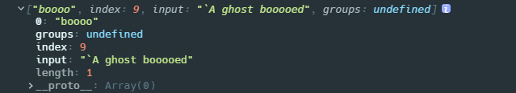
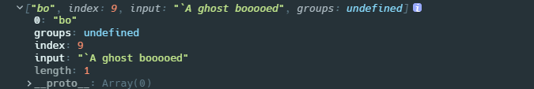
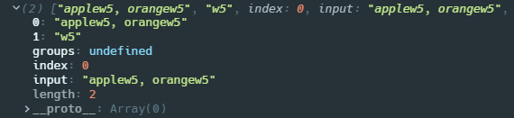

## 正则符号

正则表达式（Regular Expression，常简写为 regex、regexp 或 RE）是用于匹配字符串中字符组合的表达式，**一个正则表达式常被称为一个模式（pattern）**

## 匹配模式

| 标志 | 描述                                                    |
| :--- | :------------------------------------------------------ |
| `g`  | 全局搜索。                                              |
| `i`  | 不区分大小写搜索                                        |
| `m`  | 多行搜索                                                |
| `s`  | 允许 `.` 匹配换行符                                     |
| `u`  | 根据 unicode 字符的属性来进行匹配                       |
| `y`  | 执行“粘性(`sticky`)”搜索,匹配从目标字符串的当前位置开始 |

## [匹配位置](https://developer.mozilla.org/en-US/docs/Web/JavaScript/Guide/Regular_Expressions/Assertions)

### `^`

> `^`，caret（开若特），脱字符

这个字符可以有两种含义：

- 从字符串的开头位置开始匹配，紧跟着它的字符必须是字符串中的第一个字符
- 放在分组方括号`[^xyz]`内表示否定含义啊，匹配任何没有包含在括号中的字符

### `$`

> `$`，dollar 符

和脱字符正好相反，放在正则表达式的末尾，表示字符串的结束，它前面一个字符必须在字符串的最后

### `\b`

> `\b`：backspace，退格符，Unicode 字符是 U+0008

这个字符也有两种用法

- 从被匹配的字符串角度看，`\b`所在的位置是单词的开头或者结束位置，也就是说`\b`它的前一个字符和后一个字符不全是(一个是,一个不是或不存在)`\w`(大小写字母，数字和下划线)
- `[\b]`：匹配退格键`\u`

```javascript
console.log(/\boo/.test('moon')); //false

console.log(/\bmoo/.test('moon')); //true

var aliceExcerpt =
  'I’m sure I’m not Ada,’ she said, ‘for her hair goes in such long ringlets, and mine doesn’t go in ringlets at all.';
var regexpWordStartingWithA = /\b[aA]\w+/g;
console.log(aliceExcerpt.match(regexpWordStartingWithA)); //['Ada', 'and', 'at', 'all']
```

### `\B`

> `\B`

与`\b`相反，`\B`所在的位置不能是单词开头或者结束的位置，`\B`所在的位置只能是单词中间

```javascript
console.log(/\Bon/.test('at noon')); //true

console.log(/\Bat/.test('at noon')); //false
```

### `x(?=y)`

> `x(?=y)`

向前断言，当`x`后面紧跟着`y`才会匹配`x`，且匹配项字符串中不会包含`y`

```javascript
var str = 'cat,bat';

var newStr = /t(?=,)/.exec(str);
console.log(newStr); // ["t", index: 2, input: "cat,bat", groups: undefined]
```

### `x(?!y)`

> `x(?!y)`

与`x(?=y)`相反，只匹配`x`后面没有紧跟`y`的`x`

```javascript
var str = '3.141';

var newStr = str.match(/\d+(?!\.)/); // 匹配后面小数点的数字，并且贪婪
console.log(newStr); // [141]
```

### `(?<=y)x`

只会匹配紧跟在`y`后面的`x`

```javascript
var str = 'cat,bat';

var newStr = /(?<=b)at/.exec(str);
console.log(newStr); // ["at", index: 5, input: "cat,bat", groups: undefined]
```

### `(?<!y)x`

只会匹配前面没有`y`的`x`

```javascript
var str = 'cat,bat';

var newStr = /(?<!c)at/.exec(str);
console.log(newStr); // ["at", index: 5, input: "cat,bat", groups: undefined]
```

## 字符类

匹配字符类通常是由反斜杠`\`和单个字母组成的**转义字符**，用来表示部分`ASCII`字符，且大多都有正反含义的两种表示形式

### `.`

> `.`，小数点

两种用法

- 单独使用，表示匹配除了换行符`\n`，`\r`，行分隔符`U+2028`，段落分隔符`U+2029`之外的任意字符
- `[.]`放在方括号里只表示小数点，即使加了反斜杠也无法转义

```javascript
console.log(/b./.exec('abcd')); //[bc,......]

console.log(/b[.]/.exec('abcd')); //null

console.log(/b[\.]/.exec('abcd')); //null

console.log(/b\./.exec('abcd')); //null
```

### `\d`

> `\d`，digit，数字

匹配数字`[0-9]`

### `\D`

匹配非数字，`[^0-9]`

### `\w`

匹配在大小写字母，0 到 9，下划线`_`之间的单个字符，`[a-zA-Z0-9_]`

### `\W`

匹配不在`\w`中的字符，`[^a-zA-Z0-9_]`

### `\s`

匹配任何 Unicode 空白字符，大概有这些`[\f\n\r\t\v\u00a0\u1680\u2000-\u200a\u2028\u2029\u202f\u205f\u3000\ufeff]`

### `\S`

匹配任何非 Unicode 空白字符的字符

### `\`

> `\`：反斜杠

反斜杠的使用具体要看语境

- 对特殊字符集中的字符使用`\`，表示将按照其字面意思进行匹配，例如`\.`，就解释为匹配小数点而不具有其特殊含义了
- 对一般的字符使用，可能会让其具有特殊含义，例如`\b`表示单词边界

## 数量(贪婪/非贪婪)

### 贪婪

这些模式都是尽可能多的匹配，所以称之为**贪婪**

> `*`：大于等于 0

在`*`前的一个字符，匹配 0 次或者更多次，可以有也可以没有

```javascript
console.log(/bo*/.exec('A ghost booooed'));
```



> `+`：大于等于 1

在`+`前面的一个字符或者一种类型的字符`\d`（数字），在字符串中有多少匹配多少，多多益善，但是至少得出现一次，相当于`{1,}`

```javascript
console.log(/bo+/.exec('A ghost booooed'));
```


> `?`：小于等于 1

在`?`前面的一个字符，在字符串中至多匹配一次

```javascript
console.log(/bo?/.exec('A ghost booooed'));
```



> `{n}`：n 是正整数

指定`{n}`前面的一个字符必须连续出现`n`次，从且只匹配`n`次，后面的就不管了

```javascript
console.log(/o{3}/.exec('A ghost booooed')); //不会匹配ghost中的o,因为没有连续出现4次
```


> `{n,}`：n 是正整数

指定`{n}`前面的一个字符至少连续出现`n`次，这个相比上一个就宽松了。`n`等于 1 的时候就是`+`

```javascript
console.log(/bo{3,}/.exec('A ghost booooed')); //boooo

console.log(/bo{5}/.exec('A ghost booooed')); //null
```

> `{n,m}`：n，m 是正整数，m>n

表示至少匹配`n`次，至多匹配`m`次

```javascript
console.log(/bo{1,3}/.exec('A ghost booooed')); //booo

console.log(/bo{1,2}/.exec('A ghost booooed')); //boo
```

### 非贪婪

非贪婪模式是在贪婪模式的后面加上一个问号`?`来标识。

**非贪婪模式会取贪婪模式的最小结果**，也就是说保持贪婪模式本身的含义，在此基础上一旦找到匹配就会停止。例如`+`本来的意思是至少匹配一次，那么`+?`就是只匹配一次，取最小结果

> `*?`

```javascript
var str = 'some <foo> <bar> new </bar> </foo> thing';

//贪婪的*会从<开始往后搜索，直到找不到>为止
var greedyPtn = /<.*>/; //<foo> <bar> new </bar> </foo>

//非贪婪从<开始，找到第一个>就停止匹配
var ptn = /<.*?>/; //<foo>
```

> `+?`

在`+?`前面的字符只匹配一次，但是不能没有

> `??`

在`??`前面的字符不会被匹配，也就是完全忽略了，匹配到的结果也不会包含该字符

```javascript
console.log(/bo??x/.exec('A ghost bx'));
```


> `{n}?`

这个和`{n}`是一样的，必须匹配`n`次

> `{n,}`

在`{n,}`前面的字符只匹配`n`次

> `{n,m}`

在`{n,m}`前面的字符只匹配`n`次

## 分组策略

表示在一个范围内的字符或者字符串都是符合条件的

### `|`

> `|`，或

使用`|`连接的字符或者字符串，表示匹配其中一个

### `[]`

匹配在方括号中的任意一个字符，可以使用连字符`-`指定一个范围，例如`[abcd]`和`[a-d]`是一样的；如果连字符在方括号位置最前面或者最后面，那么连字符也包含在可匹配的字符里面

### `[^xyz]`

正好与上面相反，表示匹配任何不在方括号里的字符

### `()`

> `()`：匹配组/捕获组

`()`有多个作用

- 把单独的项组合成子表达式，以便可以使用`|`，`*`，`+`，`?`来对括号内的单元进行处理，例如`/java(script)?/`表示`java`后面的`script`部分可以有也可以没有

```javascript
console.log(/java(script)/.test('javasc')); //false

console.log(/java(script)?/.test('javasc')); //true
```

- 在完整的模式中定义子模式，当一个正则表达式整体在字符串中具有匹配项时，可以从匹配项中抽出和圆括号中子模式相匹配的部分，可以使用`match`或`exec`方法从数组中获取这些子模式的匹配字符串

```javascript
var urlRegExp = /(?<group1>\w+):\/\/(?<group2>[\w.]+)\/(?<group3>\S*)/;
var url = 'http://www.example.com/str1?arg1=xxx#rwr';
console.log(urlRegExp.exec(url));
```


- 使用`\n`的形式在同一正则表达式的后面引用前面出现的`()`里的子表达式匹配的字符串，`n`就是从左开始数第几个左括号`(`

### `(?<Name>x)`

> `(?<Name>x)`：具名捕获组

和捕获组结合使用，为每组匹配项命名；匹配到的字符串将使用指定的属性名保存在返回的数字的`groups`对象中，如果未指定名称，则`groups`始终为`null`

### `(?:x)`

> `(?:x)`：非捕获组

匹配括号中的子模式，但是不会保存匹配子模式的字符串

### `\n`

> `\n`

和捕获组一起使用，表示对正则表达式中与第 n 括号内子模式匹配的字符串的引用

```javascript
console.log(/apple(w\d),\sorange\1/.exec('applew5, orangew5'));
```



## Unicode 属性匹配

### Unicode 属性是啥

首先 Unicode 字符集几乎包含了世界上所有的文字符号，并且每种字符都有一个类似于归类的属性，比如标点符号，`emoji`这些。

ES2018 新引入了根据 Unicode 对应的字符属性来匹配字符的方法，具体可以使用的匹配属性见 —— [Runtime Semantics: UnicodeMatchProperty](https://tc39.es/proposal-regexp-unicode-property-escapes/#sec-runtime-semantics-unicodematchproperty-p)，需要注意的是正则表达式必须指定`u`的匹配模式，也就专用根据 Unicode 属性来匹配字符。

### `\p{}`

对使用了`u`修饰符的正则表达式，支持使用符号`\p{}`基于字符的 Unicode 属性匹配，unicode 属性转义符可用于匹配表情符号 emoji，标点符号，字母（甚至包括来自特定语言或脚本的字母），可以在 ECMA 规范官网查询——[UnicodeMatchProperty](https://tc39.es/ecma262/#sec-runtime-semantics-unicodematchproperty-p)

```javascript
const sentence = 'A ticket to xxx costs ¥2000 👌.';

//匹配emoji
const regexpEmojiPresentation = /\p{Emoji_Presentation}/gu;
console.log(sentence.match(regexpEmojiPresentation)); // ["👌"]
```

### `\P{}`

和`\p{}`是相反的，匹配不是括号里指定的 Unicode 属性中包含的字符