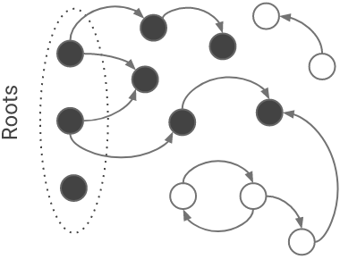
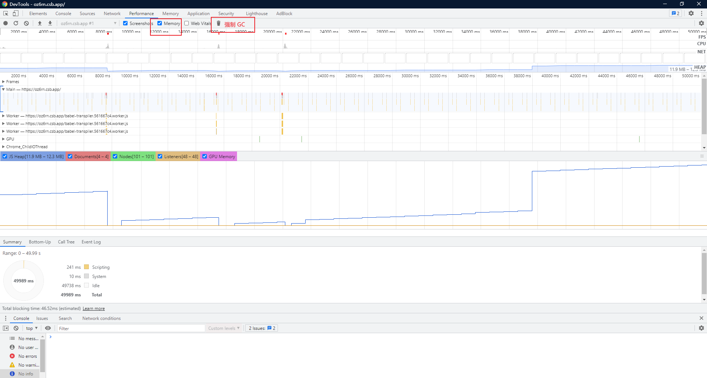

## JS 的内存管理

语言运行时声明的变量，函数，以及它们的数据都需要为其分配内存，执行时需要从内存中取出数据，使用完了再释放内存，释放内存的过程称为垃圾回收（GC，garbage collection）。

JS 分配内存的方式总的来说就是两种：栈空间和堆空间。

对于原始类型（Boolean，String，Number，BigInt，Symbol，Null，Undefined）的数据，随着执行上下文的创建，它们的值被保存在变量对象中，随着执行上下文压入执行上下文栈内，所以可以认为它们的值是保存在栈上的；

而对于引用类型 Object 及其衍生的其它引用类型的值，将会在堆中分配内存并保存它们的实际值，然后将内存地址的引用地址值传递给变量来保存，所以需要为它们分配两种类型的内存空间。

这种分配内存的方式，有以下好处：

- 栈空间的执行效率更高，执行上下文通过执行上下文栈来管理，一个函数执行完出栈就能立即回收函数内部使用的局部变量的内存；
- 堆空间负责保存占用内存较大的数据，使用引用同一内存内相同值的方式来节省内存空间，同时也为垃圾回收减轻压力；
- 从底层的 C++角度来看，栈是操作系统提供的数据结构，计算机底层对栈提供了一系列支持：分配专门的寄存器存储栈的地址，压栈和入栈有专门的指令执行；而堆是由 C/C++函数库提供的，机制复杂，需要一些列分配内存、合并内存和释放内存的算法，因此效率较低。

### GC

JS 的引擎会自动进行垃圾回收的过程，使用垃圾回收器来处理。过去的 JS 引擎经常采用的是标记 - 清除的算法来进行垃圾回收：

- 标记阶段，假定设置一个叫做根（root）的对象（在 Javascript 里，根是全局对象），从 root 开始查找对象引用关系，对根引用的对象进行标记，标识这个对象是有用的，接下来，该对象引用的对象也会被打上标记；
- 清除阶段，从头到尾扫描内存，检查所有可用的块，没有被标记的变量或者对象都被清除，释放内存，被标记的对象则清除标记，准备下一次执行使用。

传统的标记 - 清除方法具有几个缺点：

- 最明显的是进行标记 - 清除算法的时候，JS 的执行需要暂停，等待垃圾回收程序工作完再继续执行。这种情况在过去计算机硬件不够强大的时候，尤为严重，也就是当需要回收的内存很多或者垃圾回收器执行慢时，将直接造成程序卡顿；
- 此外，必须检查整个工作内存，其中大部分都要检查两次，从而可能导致分页内存系统出现问题

#### [concurrent-marking](https://v8.dev/blog/concurrent-marking)

以 V8 引擎为例，其内部使用的是一种三色标记的方法 —— [Tri-color marking](https://en.wikipedia.org/wiki/Tracing_garbage_collection#Tri-color_marking)，使用 2-bit 变量保存定义三种标记：white (00), grey (10), and black (11).

- white set，表示可以回收其内存的候选变量，经过 GC 算法之后，这里最终只剩余需要回收的垃圾变量；
- black set，从 root 开始可以访问到，并且没有引用 white set 里的变量，black set 都不需要进行垃圾回收；
- gray set，表示 root 引用的变量，但是尚未扫描其是否还引用着 white set 里的变量，由于它们是 root 引用的，所以还有用，因此无法对其进行垃圾收集，在扫描后将放到 black set 中。

执行过程大致如下：

1. 在 GC 开始之前，所有变量都位于 white set；


2. 当 GC 从全局对象开始遍历对象之间依赖关系的时候，将发现存在依赖关系的对象标记成 gray；


3. 当所有对象遍历结束，将标记成 gray 的对象再标记成 black，表示该部分对象不会进行回收



## 内存泄漏

> [memory-management](https://blog.sessionstack.com/how-javascript-works-memory-management-how-to-handle-4-common-memory-leaks-3f28b94cfbec)

内存泄漏（Memory leak）指的是**因为程序错误导致未能释放已经不再使用的变量的内存**。常见的导致内存泄漏的原因主要有以下几种：

### 不当地创建全局变量

**JS 在非严格模式下，变量可以不经过声明就直接初始化使用**，这种情况将导致调用完函数以后，变量仍然保存全局对象（`window`）的属性中，并且存在于当前页面的整个生命周期中，直到页面刷新或者关闭，变量才会随着全局对象一起被回收。

```javascript
// 直接初始化 a
function f() {
  b = 1;
}

f();
console.log(b);	 // 1
```

### 错误的闭包使用

不当的闭包使用，闭包会保存作用域链中的变量对象，这种机制是在函数定义的时候就确定的。讲道理我个人是感觉这种场景不常见

```javascript
let a = 1;
setInterval(() => {
  a++;
  return function(){
    return a;
  }
})
```

### 分离的 DOM 节点引用

分离的 DOM 节点引用指的是一个 DOM 节点已经从页面被移除了，但是在 JS 代码中依然保留着对它的引用。在过去经常使用 JS 操作 DOM 的时候，这是非常常见的内存泄漏问题。
如下面这段代码中，函数`create`创建`ul`和`li`节点，但是并未将`ul`节点在 DOM 中生成，所以`detachedTree`节点就只是存在于 JS 代码引用部分。

```javascript
let detachedTree;

function create() {
  const ul = document.createElement('ul');
  for (var i = 0; i < 10; i++) {
    const li = document.createElement('li');
    ul.appendChild(li);
  }
  detachedTree = ul;
}

document.getElementById('create').addEventListener('click', create);
```

### 未清除的定时器

这在 React 中十分常见，尤其是在子组件中创建定时器，而在组件卸载之后并没有清除定时器导致定时器注册的回调函数一直存在。

```javascript
var someResource = getData();
setInterval(function() {
    var node = document.getElementById('Node');
    if(node) {
        // Do stuff with node and someResource.
        node.innerHTML = JSON.stringify(someResource));
    }
}, 1000);
```

## 如何排查内存泄漏的问题

以下面一段代码为例，在 Chrome 浏览器的无痕模式下执行该段代码，保证插件等进程不会干扰

```javascript
    var cache = {}
    function getCachedThing(key) {
        if(!(key in cache)) {
            cache[key] = key;
        }
        return cache[key];
    }

    var i = 0;
    setInterval(function() {
        getCachedThing(i++);
    }, 100);
    window.getCachedThing = getCachedThing
```

### Performance

打开 devtool 的 Performance 面板，勾选顶部的 Memory 选项；执行 record，收集一段时间内页面的性能表现指标，如下图所示；
在这张分析图中，主要有两个随着时间改变的指标非常重要：

1. JS Heap，也就是 JS 堆内存占用，当这个指标逐渐上升的时候，代表 JS 代码存在内存泄漏
2. Nodes，也就是页面节点的数量，当页面的 DOM 节点数量逐渐上升的时候，代表 DOM 节点在不断被创建

通常的做法是点击执行 record，然后等待一段时间执行 GC，观察 GC 以后 JS Heap 和 Nodes 的变化趋势；可以看到在这段时间（40s）内，JS Heap 占用越来越高，尤其是在页面强制执行 GC 以后，JS Heap 直线飙升，这就很清楚的表明存在内存泄漏的问题。



### Memory

Performance 面板对于内存占用较大的程序可以大致分析是否存在内存泄露的问题，但是具体定位程序中内存泄露的代码需要依赖具体的内存分析面板。

内存分析面板的指标：

- Constructor：代表创建对象所调用的构造函数
- Distance：表示当前对象距离全局对象在 GC 上的距离
- Shallow Size：表示当前对象占用的内存
- Retained Size：表示当前对象被回收后可以释放的内存空间


内存分析可采用以下方式：

#### HEAP SNAPSHOTS

页面内存占用快照，包括 JS 对象分配的内存占用以及 DOM 节点的内存；方便用于分析因为分离的 DOM 节点造成的内存泄漏问题；
如下图所示，在页面记录的内存快照中搜索`Detached`（分离的），即可以显示存在的分离节点，鼠标左键定位到分离节点的条目上，下方就会显示引用存在的 JS 代码位置，这里显示的就是 JS 里的`create`方法


#### Allocation instrumentation on timeline

页面内存分配随时间变化的趋势图，点击记录可以生成一段时间内页面内存的分配趋势，例如下面一段代码，在页面点击事件触发以后，会往数组中不断添加 x 字符串，点击具体条目以后，下方也是会定位到执行的 JS 代码

```javascript
var x = [];

function grow() {
  x.push(new Array(1000000).join("x"));
}

document.getElementById("create").addEventListener("click", grow);
```


## React 内存泄漏

在 React 中下面操作会导致组件卸载：

- 通过改变组件的`state`卸载内部的子组件
- 通过路由跳转

一般来说，如果在 React 的`componentWillUnmount`直接执行`setState`操作，React 会有下面的提示：

```javascript
Can't perform a React state update on an unmounted component.
This is a no-op, but it indicates a memory leak in your application.
To fix, cancel all subscriptions and asynchronous tasks in the componentWillUnmount method”
```

但是还有一种情况是可能因为事件冒泡机制触发了其他事件监听器导致间接去执行`setState`，例如下面的一个业务组件，我在子组件中想通过父组件传递的方法销毁自身，然后因为事件冒泡机制，点击事件冒泡到了上层`Collapse`，触发了`Collapse`的`onChange`，间接调用了`handleExpand`去`setState`，所以也出现了上述错误。

```jsx
import {Collapse} from "antd";

// 父组件
class Parent extends React.Component {
	handleClose = () => {
    //销毁弹窗面板
    ...
  }
}

// 子组件
class ColPanel extends React.Component {
    state = {
        expand: false
    }

    //面板展开状态设置
    handleExpand = () => {
        this.setState({
            expand: !this.state.expand
        })
    }

    handleClose = e => {
      	//阻止冒泡
        e.stopPropagation();

      	//修改父组件内部状态，达到卸载当前组件的目的
        this.props.onClick();
    }

    render() {
        const { Panel } = Collapse;
        return (
            <Collapse
                expandIconPosition='left'
                onChange={this.handleExpand}
            // bordered={false}
            >
                <Panel
                    header={(<span>测试测试测试测试</span>)}
                    key="1"
                    extra={this.state.expand && (<Icon type="close-circle" theme="twoTone" onClick={this.handleClose} />)}
                >
                    <div>This console application produces the following o</div>
                </Panel>
            </Collapse>
        );
    }
}
```

还有许多情况，在组件卸载的时候，如果不在`componentWillUnmount`生命周期中处理一些事件或者方法，很容易造成内存泄漏：

- **事件监听**，最常见的当前组件内部监听`scroll`事件，但是卸载组件以后，`scroll`事件监听仍然存在，对于其它组件来说，这是无用的，所以需要在添加事件监听的组件内部使用`removeEventListener`移除掉；
- **定时器**，和上面是一个道理，通过`clearTimeout`或者`clearInterval`清除；
- **异步请求**，这个十分常见！向某个 API 接口发起了异步请求，希望在收到响应后，根据响应的内容，调用组件的 `this.setState()` 来更新状态；但是在请求结束之前，组件已经被卸载了。

前面两个还算简单，要在**异步请求**中判断当前组件时候被卸载了，网上还有很多讨论：

> [how-to-cancel-a-fetch-on-componentwillunmount](https://stackoverflow.com/questions/49906437/how-to-cancel-a-fetch-on-componentwillunmount)

这个做法是给一个全局的属性标记，判断当前组件是否卸载，`Promise`也可以按照这种方式来处理

```jsx | pure
class News extends Component {
  _isMounted = false;

  constructor(props) {
    super(props);

    this.state = {
      news: [],
    };
  }

  componentDidMount() {
    this._isMounted = true;					//设置标记变量

    axios
      .get('xxx')
      .then(result =>
        if(this._isMounted){				//判断是否执行
          this.setState({
            news: result.data.hits,
          }),
    		}
      );
  }

  componentWillUnmount() {
    this._isMounted = false;				//标记
  }

  render() {
    ...
  }
}
```

社区还有人专门写了一个库 —— [abortcontroller-polyfill](https://github.com/mo/abortcontroller-polyfill)，处理 fetch 在`componentWillUnmount`里面取消。

```shell
yarn add abortcontroller-polyfill -D
```

```jsx | pure
import { AbortController } from 'abortcontroller-polyfill/dist/polyfill-patch-fetch';

class FetchComponent extends React.Component {
  state = { todos: [] };

  controller = new AbortController();

  componentDidMount() {
    fetch('xxx', {
      signal: this.controller.signal,
    })
      .then(res => res.json())
      .then(todos => this.setState({ todos }))
      .catch(e => alert(e.message));
  }

  componentWillUnmount() {
    this.controller.abort();
  }

  render() {
    return null;
  }
}
```