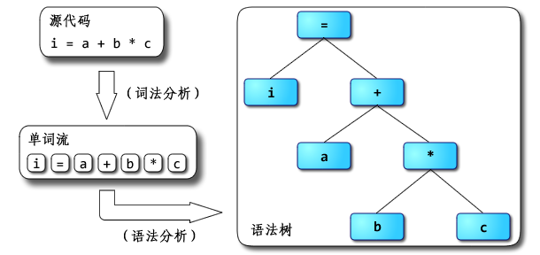
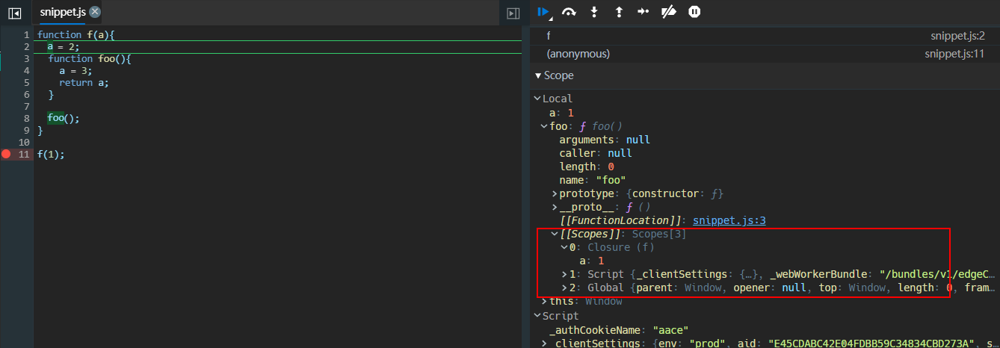

## 语言的处理过程

源代码一般需要经过一系列的处理才能得到 CPU 的可执行代码。


## 编译

编译是将一种语言翻译成另一种目标语言的过程，目标语言并无特殊要求，可以是汇编语言或者机器语言，或者其它类型的语言。


### 编译器，解析器，解释器

> [ RednaxelaFX —— 虚拟机随谈 ](https://www.iteye.com/blog/rednaxelafx-492667)

编译器：Compiler，是将程序源码转换成目标语言的程序，通常编译器的输入语言比输出语言高级，例如高级语言转换成汇编语言，但也有输入输出是同种语言的情况，例如 JS 中广泛使用的 Babel，指示负责将高版本的 ES6+的代码转换成 低版本，兼容性更强的 JS 代码。


解析器：parser，是编译器或者解释器的组成部分，也可以用在 IDE 之类的地方；作用是语法分析，提取出句子结构，广义来说，输入程序源码，输出 AST。广义的解析器里还包括：

- 扫描器（scanner），或者叫 tokenizer 或者 lexical analyzer，词法分析器；扫描器的输入一般是文本，经过词法分析，输出是将文本切割为单词的流 tokens
- parser，或者叫 syntax analyzer，语法分析器；语法分析器的输入是 tokens，经过语法分析，输出是语法树或者精简过的 AST



解释器：Interpreter，解释器就是个黑箱，输入是源码，输出就是输入程序的执行结果。实际上很多解释器内部是以“编译器+虚拟机”的方式来实现的，**先通过编译器将源码转换为 AST 或者字节码，然后由虚拟机去完成实际的执行**。所谓“解释型语言”并不是不用编译，而只是不需要用户显式去使用编译器得到可执行代码而已。

虚拟机：virtual machine，在不同的场合，VM 有着不同的含义。如果是 Java，C#这类语言，一般指高级语言虚拟机，一般认为输入是满足某种指令集架构的指令序列，中间转换为目标 ISA 的指令序列并加以执行，输出为程序的执行结果。

### 词法分析和语法分析

词法分析：Lexical Analysis，从左向右逐行扫描源程序的字符，将单个字符还原为原来的单词，并确定单词的的类型，例如该单词是属于标识符，关键字，运算符，还是具体的数据（数字，true，false，字符串等）；最终输出一串单词序列`tokens`，包含单词和它们对应的类型。

语法分析：Syntax Analysis，从词法分析输出的 tokens 进行遍历，把一个个单词组成源程序的语句块，并构造语法分析树 AST。

#### AST

AST：Abstract Syntax Tree，抽象语法树，抽象语法树描述语句的语法结构，它是一种类似于 JSON 的对象结构，包含语句中各个单词的类别，以及语句执行的顺序等。解释器会根据 AST 的顺序从上往下遍历进行执行，所以在 JS 里 AST 显示的顺序就是 JS 的执行顺序。例如`i = a + b * 10`形成的 AST：


关于 AST 的应用，已知的有以下这些：

- ESLint：根据源代码生成 AST，然后检查代码问题
- Babel：将 ES6+的 JS 源代码解析成 AST 之后，再根据 AST 生成低版本的 JS 代码
- Webpack：webpack 的部分 loader 需要将源代码解析成 AST 来分析，或者提供给 plugin 来使用

#### AST 的后序遍历

对于`i = a + b * c`这样的式子，解释器会对 AST 从上往下，从左往右开始遍历，在解释每一个节点时，如果依赖于子树的操作，则开始对子节点进行递归遍历，从递归遍历的返回值获取需要的值。


##### 优先级，结合性和求值顺序

经常被讨论的是表达式和运算符的优先级问题，JS 里也有这样的问题。

优先级：所谓优先级，从遍历 AST 的角度上看，就是节点与根节点的距离，优先级高的操作离节点更远，因为 AST 后序遍历的原因，离 AST 根节点越远的节点越早被求值。

结合性：类似于数学运算中的结合律，在一个包含两个或以上运算子表达式中，**只要运算数的位置不变**，其运算顺序就不会对运算的结果产生影响。如果式中具有括号，重新排列括号也不会影响其值。注意关键词运算数的位置不变，如果运算数位置变了， 那是另一种规律，叫交换律。

```javascript
(a + b) + c  =  a + (b + c)

(a × b) × c  =  a × (b × c)
```

求值顺序：求值顺序也分为从左往右和从右往左，从左往右就是先遍历做子节点，再遍历右子节点；反之就是从右往左。

需要明确的一点是，优先级和结合性都是在生成 AST 的时候就确定的，也就是 AST 决定它们；而求值顺序则是遍历 AST 执行时做的事情。

### 语义分析

在词法分析和语法分析之后，实际上还会进行语义分析阶段。

语义分析：Semantic Analysis，语义分析的任务是收集标识符的属性信息，以及必要的语义检查。

标识符的属性信息包括：

- 类型，什么 String，Boolean，Symbol 等等；
- 确定在内存中的存储位置和长度；
- 标识符的值，在 JS 里面赋值执行之前标识符的值都是 undefined
- **作用域 scope**
- 如果是函数，还会确定参数的个数和类型，返回值类型等

语义检查，例如以下检查：

- 变量未声明就使用
- 操作符和操作数类型不匹配
  - 数字下标不是整数
  - 对非数组变量使用数组访问操作符
  - 函数返回类型有误
  - 函数传参类型有误等

## JS 的执行过程

### V8

> [launching-ignition-and-turbofan](https://v8.dev/blog/launching-ignition-and-turbofan)

以使用最广泛的 V8 引擎为例来看 JS 的执行过程，JS 的执行引擎准确来说应该叫[**managed runtime environment for JavaScript**]，JavaScript 托管运行时环境，它不属于解释器，编译器等这些任何概念，它是包含了解释器，编译器这些程序，并且还提供自动内存管理（GC）、对象模型、核心库等功能。

V8 在 5.9 版本以前主要是使用两个编译器来编译 JS 代码：

- Full-codegen：一个简单但是非常快速的编译程序，负责编译 JS 快速生成未优化的机器代码

- Crankshaft / Turbo Fan：JIT（即时编译器），可以将源代码或者字节码转换成机器码并直接执行

这种处理架构的主要问题是在移动设备上带来的内存占用过高，Full-codegen 基准编译器生成的代码通常占据 Chrome 中整个 JavaScript 堆的近三分之一，可想而知在早期移动设备稀少的内存 RAM 中，这么高的占用留给代码实际执行的空间就很少，移动设备不免打开网页会有卡断的现象。

为了减少移动设备上的内存消耗，V8 引入了新的 JS 解释器 Ignition，Ignition 可以将 JS 编译成简洁的字节码并执行，相比 Full-codegen 直接生成机器码，可以减少 25％到 50%的代码体积，在引入解释器后，安卓设备上的 JS 代码占用内存空间减少了 9 倍左右，同时解释器生成字节码的过程要快于 Full-codegen 的编译过程，所以也提高了 JS 执行的效率；但是字节码的执行效率要低于从编译器生成的机器码的执行效率，所以 Ignition 在执行字节码的同时，还会分析执行的热点区域，将反复执行的区域传递给 Turbo Fun，接下来 Turbo Fun 会针对热点代码优化编译字节码来生成机器码保存在内存中，在以后的执行中直接去内存中执行机器码，从而提升执行效率。更多的相关细节问题可以在 V8 的 blog 中获知。


### 编译

一段 JS 代码交到 V8 手上，也会经过编译的过程，对 JS 进行词法分析，语法分析后得到 AST，以供后续处理过程。关于 JS 的词法定义，ES 规范文档的第十一章有详细的描述，参见 —— [Lexical Grammar](https://tc39.es/ecma262/#sec-ecmascript-language-lexical-grammar)。

### 创建执行上下文

在获取编译阶段得到的 AST 后，V8 引擎会进行语义分析的阶段，此过程会创建执行上下文（execution context）。

执行上下文或者叫执行环境，他是 ES 规范中一个很抽象的概念，从字面上理解，它是 JS 执行时的代码环境。

在 ES3 时期，执行上下文被认为由变量对象，作用域链和`this`绑定三部分组成

- 变量对象，保存全局执行上下文中所有的变量和函数声明
- 活动对象，是函数执行上下文的变量对象
- 作用域链，保存当前函数执行上下文中的活动对象以及上层执行上下文中的变量对象，本质上就是一个引用各层执行上下文中变量对象的指针列表，负责变量查询和解析
- `this`绑定，当执行到被调用的函数时，`this`的值就会被确定下来

执行上下文分为三种情况：

- 全局执行上下文，在浏览器中，当前标签页的一个网页内的 JS 都属于一个全局执行上下文，也就是`window`；
- 函数执行上下文，也就是函数内部的执行环境；
- `eval`函数执行上下文

执行上下文的创建会通过**执行上下文栈**来管理：

- 首先引擎会创建==全局执行上下文==推入栈顶，此时会创建全局对象，并将`this`指向全局对象，对内部的变量和函数做声明提升的操作：
  - 如果是变量声明，在变量对象中创建同名属性并设为`undefined`；
  - 如果是函数声明，情况要复杂得多，函数会直接在堆内存上被创建出来，此过程除了继承原型上的属性外，**还会创建一个预先包含变量对象引用的作用域链，将其保存在函数的`[[scope]]`私有属性中；这点非常重要，也就是说即使函数声明出来不被调用，它也会始终保存着上层作用域的变量对象，这和闭包的实现是直接相关的**；然后把引用地址复制给变量对象保存在属性中
- 如果遇到函数调用，引擎就会创建该==函数的执行上下文==推入栈顶，此过程会创建函数执行上下文的活动对象，并复制函数的`[[scope]]`属性中的对象，将其作为函数执行上下文的作用域链，然后确定`this`指向
- 如果函数内部又发生函数调用，则还是重复创建函数执行上下文推入栈顶的过程，直到函数执行完，`return`以后，就会将其从栈顶抛出，函数内部的变量，参数等也会被回收销毁，然后回到上层函数执行上下文继续执行

```javascript
function wapper() {
  function inner() {}
}

wapper();
```


以一段代码的执行为例，通过 Chrome devtool 分析其执行过程

```javascript
function f(a) {
  a = 2;
  function foo() {
    a = 3;
    return a;
  }

  foo();
}

f(1);
```

- 将断点设置在执行`f`之前的位置，从头开始 🤔，这时候全局作用域里已经有了函数`f`的声明，基本确定两件事
  - 变量对象并没有创建，因为`arguments`还是`null`，也就是未执行函数，活动对象还不存在
  - 作用域链`[[scope]]`已经确定了


- 继续执行，来到函数作用域，观察到：
  - 函数`foo`并未被调用，但是作用域内已经有了函数`foo`的声明，并且`foo`的作用域链`[[scope]]`也已经确定下来了，其中包含了外层函数的变量
  - 函数`f`的`arguments`这时候才被初始化




- 继续执行到调用`foo`的位置，进入`foo`函数作用域，执行`foo`，此时`this`仍然指向`window`


- 执行完`foo`后又回到上层`f`的作用域，最后`f`也执行完，退回到全局作用域，此时`f`的`arguments`属性也被回收销毁了


在最新的 ES2020 规范中，执行上下文被认为包含以下组成部分：

- code evaluation state：代码执行状态
- Function：当前正在执行的函数，如果当前没有执行函数，那么这个就是 null
- Realm：领域由一组内部对象，一个 ECMAScript 全局环境，在该全局环境范围内加载的所有 ECMAScript 代码以及其他关联的状态和资源组成，目前没明白啥意思
- ScriptOrModule：当前代码是以脚本文件还是以模块文件执行的
- LexicalEnvironment：词法环境，根据规范内容，使用`let`或`const`声明的变量对应于此环境
- VariableEnvironment：变量环境，根据规范，`var`声明的变量对应于此环境
- Generator：生成器

### 栈溢出

为什么函数的执行需要使用栈来管理，其实主要是因为栈的的 LIFO（last in first out）的特点很符合函数调用的嵌套关系。根据函数调用的关系来看，总是最近最先进入外层函数的执行上下文，在函数内部发生函数调用，再次进入内部函数的执行上下文，等到其执行完，再回到外层函数的执行上下文，函数的调用有完美的嵌套关系——调用者的生命期总是长于被调用者的生命期，并且后者在前者的之内，摘自 —— 为什么函数调用要用栈实现？ - RednaxelaFX 的回答 - 知乎 https://www.zhihu.com/question/34499262/answer/59415153。

栈存在内存大小的限制，当分配的调用栈空间被占满时，就会出现栈溢出的问题，也被称为爆栈。

#### 递归

递归（recursion）是常见的容易发生栈溢出问题的，在递归函数中，需要函数内部通过条件的判断不断调用自身。

JS 引擎会限制递归嵌套调用的最大次数，一般来说，10000 以下都是可靠的，当条件设置不当导致递归次数特别大时，就会出现栈溢出的错误`RangeError`。

```javascript
function recursion(n) {
  return runStack(n - 2);
}
recursion(50000);
```


#### 尾调用优化

> [尾调用](https://zh.wikipedia.org/wiki/尾调用)

在计算机科学中，尾调用是指在一个函数里的最后一步执行是返回一个函数调用结果的情形。即**最后一步新调用的返回值直接被当前函数的返回结果**。

```javascript
function a() {}

function b() {
  return a();
}
```

需要注意的是尾调用的情形强调的是最后一步执行函数的调用，在以下情况中并不属于尾调用，因为调用函数 a 的操作后还有加法运算操作，函数 a 不是最后一步执行的调用：

```javascript
function a() {}

function b() {
  return a() + 1;
}
```

如果函数调用不是作为返回值，也不是尾调用，这种情况实际上对函数最后一步执行是返回一个 `undefined`。

```javascript
function a() {}

function b() {
  a();
}
```

尾调用中一个特殊的情形就是结合了递归使用的尾递归，尾递归就是函数在最后一步执行是调用自己：

```javascript
function b() {
  if (1) {
    return b();
  }
}
```

函数的执行过程上文说过，就是执行上下文不断进栈出栈的过程，当函数的调用层数非常多时，每次调用函数都需要创建执行上下文推入调用栈中，而执行上下文中保存当前调用函数的局部变量等信息，需要为它们分配内存，那么调用栈会随着递归次数的增多占用越来越多的内存，此时对于低端机器执行可能造成程序卡顿。


如果**递归函数的形式符合尾调用的定义，那么理论上就可以使用尾调用优化**。细想一下在递归中，为每次调用自身都反复创建的执行上下文推入栈中，实际上我们只需要这个执行上下文在栈中的位置，这样其内部函数执行完以后可以带着返回值回到该位置继续执行，至于其内部的局部变量什么的早已经不再需要了，但是这些东西依然保存在内存中。在尾调用这种特殊情形中，理论上可以不需要记住尾调用的位置而从被调用的函数直接带着返回值返回调用函数的返回位置（相当于直接连续返回两次），把之前执行上下文中的变量提前回收，以节省内存空间提升性能。

要实现尾递归优化，取决于两方面：

- 一方面，代码形式上要符合尾调用的概念，为此开发者需要改写递归函数的形式
- 另一方面，需要引擎的支持，引擎不支持，那也是扯淡

语言标准一般会要求编译器或者运行平台实现尾调用优化。在 ES 规范文档中也定义了尾调用的形式 —— [Tail Position Calls](https://tc39.es/ecma262/#sec-tail-position-calls)，并且只针对严格模式下的代码，非严格模式全都不属于尾调用。