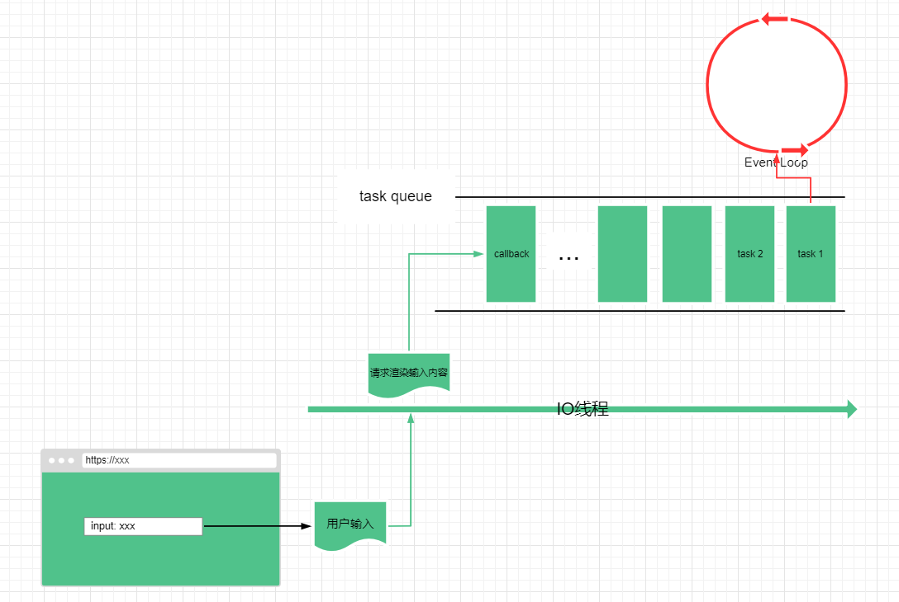

## 事件循环

> [whatwg - Event loops](https://html.spec.whatwg.org/multipage/webappapis.html#event-loops)

从 HTML 规范文档给的定义来说，**用户代理必须使用事件循环来协调事件（event），用户交互（user interaction），脚本（script），渲染（render），网络请求（network）等任务**。

这里说的用户代理指的是代表用户行为的软件代理程序，可以是浏览器，也可以是其它客户端程序，例如 Nodejs 等。

而事件循环又可以分为以下类型：

- 浏览器中同源窗口下的事件循环被称为**window event loop**
- 在`DedicatedWorkerGlobalScope`，`SharedWorkerGlobalScope`，或者`ServiceWorkerGlobalScope`中的事件循环被称为**worker event loop**
- 在`WorkletGlobalScope`中的事件循环被称为**worklet event loop**

## 任务队列

每一个事件循环都具有**一个或者多个**任务队列，任务队列是一系列任务的集合。这里说的任务队列也就是平时所讲的宏观任务的队列。

而每个事件循环还有**一个微任务队列**，微任务是一种通俗的说法，指的是通过微任务算法队列创建的任务。

:::caution

需要注意的是任务队列虽然被称为队列，但它只是任务的集合，不是队列的数据结构，因为事件循环处理模型的第一步从选定的队列中获取第一个可运行的任务，而不是使队列中的第一个任务出队列，也就是可能取的不是第一个任务。

:::

### 任务来源

每一个任务都会绑定到指定的任务来源，**任务来源就是用于区分任务类型的**，并且每个任务源都必须与特定的任务队列关联，但是浏览器可能将不同任务来源的任务合并到同一个任务队列中。

规范定义有以下类型的通用任务来源，如果用户代理在封装一个任务的时候不知道其属于什么任务来源，就会从通用任务来源中选择一种：

- DOM 操作，DOM 操作的过程中会产生任务
- UI 交互，例如鼠标点击，键盘输入等
- 响应网络触发的任务，例如`XMLHttpRequest`，`fetch`等获取响应的回调
- 需要遍历浏览器历史记录的操作，例如`history.back()`等类似的 API 操作

除了通用任务来源，来自于其他规范中还定义其它任务来源，常见的还有以下这些任务类型，参见 —— [chromium - task.type](https://source.chromium.org/chromium/chromium/src/+/master:third_party/blink/public/platform/task_type.h;l=68;bpv=0;bpt=1)：

- `HTMLCanvasElement.toBlob()`
- 由 JS 发起的`setTimeout`和`setInterval`等定时器任务
- `WebSocket`
- `postMessage`
- `FileAPI`，例如利用`Blob`或`File`对象读取文件
- `WebGL`
- `requestAnimationFrame`
- CSS 字体加载

### 微任务来源

每一个事件循环还具有一个微任务队列，微任务属于在一个任务执行过程中产生的更细粒度的任务，常见的微任务来源：

- 首先`Promise`的异步方法是一个微任务，这是在 HTML 规范中明确定义的 —— [HostEnqueuePromiseJob](https://html.spec.whatwg.org/multipage/webappapis.html#hostenqueuepromisejob)，这里说的是`Promise`回调`resolve()`或者`reject()`方法，而使用`Promise`构造函数，内部属于同步的宏任务，会立即执行；

- 利用 DOM 接口`MutationObserver`创建一个对象并通过`observe`方法监听 DOM 树的变化；
- nodejs 中的`process.nextTick`

## 事件循环处理模型

> [event-loop-processing-model](https://html.spec.whatwg.org/multipage/webappapis.html#event-loop-processing-model)

事件循环处理模型描述的是在事件循环中如何处理任务队列中的任务，也就是任务执行机制。

每一个事件循环中都有一个正在执行的任务（currently running task），一个微任务队列（macro task queue），保存从微任务来源添加进来的微任务（macro task）。

需要注意的是微任务队列不是任务队列，但是通过事件循环机制[spins the event loop](https://html.spec.whatwg.org/multipage/webappapis.html#spin-the-event-loop)，微任务队列中的微任务可能被移动到任务队列中去。

只要存在事件循环，就必须执行以下步骤：

1. 首先从所有任务队列中选择一个至少具有一个可执行任务（任务所处的当前 DOM 为空或完全处于活动状态）的任务队列`taskQueue `；如果在所有的任务队列中都不存在可执行的任务，那么就直接跳到微任务队列执行步骤 7 去检查微任务队列；
2. 让 `oldestTask`等于当前队列的第一个可执行任务，并将该任务从队列中移除
3. 设置事件循环的当前执行任务 `currently running task`等于`oldestTask`
4. 记录任务开始时间`taskStartTime`
5. 执行任务`oldestTask`
6. 设置事件循环的当前执行任务 `currently running task`为`null`
7. **检查微任务队列检查**，如果存在微任务就将微任务出队列并执行，直到微任务队列为空；
8. 设置`hasARenderingOpportunity`为`false`
9. 设置当前时间`now`
10. 报告这个任务执行所耗费的时间，这个过程实际上是找出**长任务（long tasks）**
    - 如果整个任务执行时间小于 **50ms**，就返回去继续执行下面的步骤
    - 而如果任务执行时间大于 **50ms**，会看作长任务处理
11. 如果当前事件循环是浏览器窗口中的事件循环，则更新 DOM 渲染，此过程会将`hasARenderingOpportunity`设置为`true`
12. 满足以下条件时，执行空闲时间算法 —— [start an idle period algorithm](https://w3c.github.io/requestidlecallback/#start-an-idle-period-algorithm)：
    - 浏览器中的事件循环
    - 当前页面的事件循环的任务队列中没有任务了
    - 微任务队列也是空的
    - `hasARenderingOpportunity`为`false`
13. 最后一步还会检查 worker event loop 并执行

从浏览器的角度来看，浏览器在渲染进程的主线程中完成 HTML 解析，CSS 解析，JS 执行等主要任务，并且在网页渲染完成以后，用户操作网页，这个过程可能需要再次调用线程去解析执行 JS 或者渲染网页等。

举个例子，当在网页中输入表单的时候，渲染进程的 IO 线程需要接收从键盘或者屏幕输入的内容，然后 IO 线程需要将输入内容传递给渲染进程的主线程进行渲染，同时主线程内运行的 JS 还需要根据用户的输入验证输入内容是否合理，主线程既要渲染输入内容，同时还要将输入事件的监听目标通过事件回调传递给 JS，并且 JS 处理完的结果可能涉及到 DOM 更新，又需要调用主线程去渲染。

首先主线程不知道用户什么时候会去输入内容，所以主线程需要时刻保持开启状态，为了让主线程活跃，在主线程内部引入事件循环机制。然后主线程需要接收任务，这其中包括一些其他线程或者 JS 执行发起的任务，如果一股脑地都塞到主线程内部会引起线程阻塞，那么就需要任务队列来管理这些不同来源的任务，每次主线程执行完一个任务以后，从任务队列头部去取下一个任务，如果有其他任务加入就放到任务队列的尾部等待执行。



## 长任务

有待补充

## Ajax

Ajax 全称是 Asynchronous JavaScript + XML，异步 JS 和 xml。Ajax 这个概念最初是一个老外在 2005 年提出的，具体可以从 MDN 的文档中获取相关文章链接 —— [Ajax: A New Approach to Web Applications](https://pdfs.semanticscholar.org/c440/ae765ff19ddd3deda24a92ac39cef9570f1e.pdf)。

根据文章的描述，Ajax 实际上是几种技术的结合：

- 使用 HTML 和 CSS 结合的页面；
- 使用 DOM 动态展示和交互；
- 使用 XML 和 XSLT 进行数据交换和操作；
- 使用 XMLHttpRequest 进行异步数据检索；
- 最后使用 JS 将上述内容绑定到一起


Ajax 经过十几年的发展，到现在也不仅限于使用 XML 的数据格式进行数据交换，更多的是使用`JSON`格式。并且 Ajax 本身在目前的 web 形态下已经成为了前端异步通信的代名词，引申至包含多个相关的概念，例如`Fetch`，`FileReader`等相关使用异步方式获取数据的方法。

####XMLHttpRequest

传统的 Ajax 底层便是使用`XMLHttpRequest`这个方法发起网络请求，从过去使用广泛的 jQuery 中的`ajax`还是到现在流行的`axios`也都是对`XMLHttpRequest`进行的封装。

`XMLHttpRequest`的原理可以用多进程和任务队列的方式来概括，多进程指的是浏览器的渲染进程在解析网页的过程中遇到`XMLHttpRequest`发起的请求会交给网络进程去处理；任务队列是指在网络进程从网络中请求到响应数据后，交给渲染进程的时候会被作为一个任务放在任务队列中等待执行。

建立一个简单的`XMLHttpRequest`的过程如下：

```javascript
let xhr = new XMLHttpRequest();

xhr.onload = () => {};
xhr.open();
xhr.send();
```

首先渲染进程会注册`XMLHttpRequest`请求对象，并为其设置相应的回调函数；当使用`send`方法发起网络请求时，渲染进程不会直接发起网络请求，而是将请求发送给网络进程，网络进程会通过调用资源建立 TCP 连接等过程，并发送 HTTP 报文然后获取服务器响应。在网络进程获取响应后，会利用 IPC（进程通信，Inter Process Communication）来通知渲染进程，并把响应结果传递给渲染进程（此过程可能还会进程跨域请求判断的操作），渲染进程在获取到响应数据后，会根据响应数据的类型传递到回调函数中，并封装成任务添加到任务队列中，等待事件循环去执行。


## 事件循环和 JS 执行

回到浏览器中来看事件循环，以 Chromium 为例，渲染进程的主线程负责进行 HTML，CSS 的解析，JS 的解析执行等任务，上文说过 HTML 解析会被封装成任务，那么它会放进任务队列中执行，如果遇到`<script>`就把 JS 的解析执行分别成任务放到任务队列中。

JS 执行的过程可以用执行上下文栈来处理，创建全局执行上下文，遇到函数，创建函数的执行上下文，但是 JS 可以发起一些“异步”或者延迟执行的任务，例如`setTimeout`，`XMLHttpRequest`，`Promise`等

有待补充

## 微任务队列

> [perform a microtask checkpoint](https://html.spec.whatwg.org/multipage/webappapis.html#perform-a-microtask-checkpoint)
>
> [Promise](https://developer.mozilla.org/en-US/docs/Web/JavaScript/Reference/Global_Objects/Promise)

任务队列中的每一个任务可以称为一个宏任务（macro task），而一个宏任务执行过程中可能由它自身产生一个新的任务，例如 DOM 事件回调，`setTimeout`延迟回调，`XMLHttpRequest`请求网络返回结果的回调等；

一种处理方式是将回调函数的任务直接添加到任务队列尾部，等待事件循环去执行，例如`setTimeout`和`XMLHttpRequest`就是利用这种方式；

如果直接将回调函数添加到任务队列末尾可能会因为等待任务队列中前面待执行的任务而造成延迟，例如`setTimeout`即使设置的延迟执行时间是 0，它仍然会等到循环执行完才去执行

```javascript
function callback() {
  console.log(1);
}

setTimeout(callback, 0);

for (let i = 1; i < 5; i++) {
  console.log(i);
}
```

另一种方式是使用微任务队列（micro task queue）来管理，由微任务队列来保存宏任务执行过程中产生的微任务（micro task），

当一个宏任务执行完，会执行微任务检查，判断微任务队列中时候存在需要执行的微任务，如果存在就会去执行。所以微任务虽然不会保存在任务队列中，但是它会因为事件循环执行机制被移动到任务队列中去等待执行。


