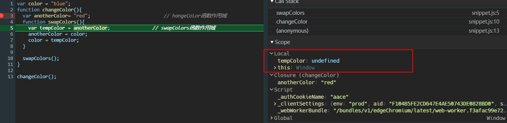

## 作用域

### 标识符

标识符是用户编程时使用的名字，用于给变量、常量、函数、语句块这些实体等命名，以建立起名称与使用之间的关系。

### 什么是作用域

作用域来自于英文单词 scope，其实我觉得它翻译成标识符的绑定范围更好理解一点，它是用来限制标识符和变量，函数等绑定关系生效的范围。

标识符是使用数字，字母，下划线等符号组成的符号，在程序执行的过程中，需要不断地去解析标识符，获取它们绑定的变量，函数等实体，而代码中同一个标识符可以和不同的变量，函数发生绑定关系，如何保证他们之间相互不受影响呢？这就是作用域的限制，在当前作用域内，标识符只能和其内部的变量，函数等具有绑定关系，如果跳出作用域通过标识符获取变量，函数等可能就会出错。

```javascript
function foo1() {
  var a = 1;
}

console.log(a); // Uncaught ReferenceError: a is not defined
```

在 JS 中，上文有一个函数 foo1，里面声明了变量`var a = 1`，此时标识符`a`绑定的实体是`1`，**它们之间的绑定适用范围就是 foo1 这个函数体内**，出了这个函数体，`a`和实体`1`的绑定就不生效了，你无法通过`a`来引用`1`，所以**`a`的 scope 就是 foo1 这个函数体**。

那么作用域和变量的生命周期有什么不同吗？应该是作用域可以看作生命周期的子集，在大多数面向对象的编程语言中可以在类中定义静态成员，静态成员在整个程序的运行过程中就会存在，也就是在类的编译过程中就会生成，但是静态成员却不能在声明之前被访问，所以它的作用域只是从声明位置开始向下的代码范围内。

### 词法作用域和动态作用域

词法作用域：`lexical scope`/`static scope`，词法作用域取决于标识符定义在源代码中的位置，这里对应的也叫词法环境或者叫词法上下文，在词法作用域中，标识符的解析是沿着其定义时的包含块或者函数体来一级一级搜索的过程；动态作用域：`dynamic scope`，取决于程序执行上下文或者叫调用上下文，标识符的解析是沿着调用函数来一级一级搜索的过程。

## JS 里的作用域

JS 使用的是词法作用域来解析大部分标识符，但是 JS 也会使用动态作用域，比如说`this`

> JS 引擎没有预编译操作，在部分文章里用预编译这样的词语来生成 JS 的声明提前发生在预编译阶段，预编译是指把存储在不同文件中的源程序聚合在一起，把被称为宏的缩写语句转换为原始语句
>
> 可以看一下这个问题的解释 —— [JavaScript 有预编译吗](https://www.zhihu.com/question/29105940)

### 块作用域

在 ES6 以前，JS 没有块级作用域，指的是`for`，`if`这样的代码块声明的变量在执行完代码块以后仍然存在标识符和数据的绑定关系；包括`try/catch`的`catch`这样的语句块，在`try`或者`catch`里声明的变量都能在外部访问到。

> 在《你不知道的 JS》里提及到了`with`和`try/catch`的`catch`分句这两点可以产生块级作用域，实际上`catch`分句并不能产生块级作用域，它只是限制了 catch 捕获的错误变量的作用域，在`catch`中声明的变量，在`catch`后面仍然能访问。

```javascript
for (var i = 0; i < 3; i++) {}

console.log(i); // 3

if (1) {
  var a = 1;
}

console.log(a); // 1

try {
} catch (e) {
  var a = 1;
}

console.log(e); // ReferenceError
console.log(a); // 1

(() => {
  let x, y;
  try {
    throw new Error();
  } catch (x) {
    x = 1;
    y = 2;
    console.log(x); // 1；这个x的作用域是catch块内部，根据作用域链的查询，其覆盖了外层的x
  }

  console.log(x); // undefined
  console.log(y); // 2
})();
```

可以使用 IIFE 来模拟块级作用域，将`for`循环这样的代码块放在 IIFE 里，这样 IIFE 在自动执行完就会销毁函数作用域中的变量

```javascript
(function() {
  for (var i = 0; i < 3; i++) {
    var a = 1;
  }
})();

console.log(a); //Uncaught ReferenceError: a is not defined
```

在 ES6 以后，引入了块级作用域，使用`let`或`const`声明的变量在`{}`的语句块内具有块级作用域，并且`let`和`const`还会引起暂时性死区的问题，如果区块中存在`let`和`const`命令，这个区块对这些命令声明的变量，从一开始就形成了封闭作用域；**凡是在声明之前就使用这些变量，就会报错**，即使全局作用域中声明了，也一样报错。

```javascript
{
  let a = 1;
  ...
}

console.log(a);									//Uncaught ReferenceError: a is not defined

var tmp = 123;
if (true) {
  tmp = 'abc'; 								// ReferenceError
  let tmp;
}
```

以下代码块内部可以配合`let`和`const`产生块级作用域

```javascript
for
if
switch
try/catch/finally
```

ES6 还提出了`class`关键字，用来声明类，在类的内部实际上也是一个块级作用域。

### 函数作用域

函数作用域本身没什么特殊性，但是上文提到 JS 在执行之前会有编译阶段，函数体内会发生声明提前的操作。

### 模块作用域

ES6 同时也引入了模块文件的属性，对`script`标签使用`type=module`的属性，就会将标识符的声明限定在`script`的标签内，在之前的 HTML 文件中，多个`script`定义的变量会相互影响，如果使用`type=module`属性就可以避免这种情况

```html
<script type="text/javascript">
  let a = 1;
</script>
<script type="text/javascript">
  console.log(a); // 1
</script>

//不会影响下文的script
<script type="module">
  var a = 1;
</script>
<script type="module">
  console.log(a); // Uncaught ReferenceError: a is not defined
</script>
```

但是`type=module`的兼容性不好，IE 全家表示不支持。

### 全局作用域

再往模块文件之上就是全局作用域，多个 script 标签它们都是在一个全局作用域下，具有全局作用域的变量和函数在代码中的任何位置都有定义。

## 作用域链

每个函数体内都有一个私有属性`[[scope]]`，保存着当前函数执行上下文的活动对象和外层作用域内的变量对象，在函数体内遇到变量时，就会按照作用域链一级一级搜索变量声明的位置。

例如下段代码的`color`的查找过程，`color` ——> 函数`swapColors`的作用域 ——> 函数`changeColor`的作用域 ——> 全局作用域，最后在全局作用域找到了声明，如果在全局作用域也找不到声明，那么就会抛出`ReferenceError`的错误

```javascript
var color = 'blue'; // 全局作用域
function changeColor() {
  var anotherColor = 'red'; // hangeColor函数作用域
  function swapColors() {
    var tempColor = anotherColor; // swapColors函数作用域
    anotherColor = color;
    color = tempColor;
  }

  swapColors();
}

changeColor();
```

注意这是一个搜索到即停止的过程，由于声明提升的原因，使用`var`声明的变量或者函数声明都会被提升到作用域顶部

```javascript
var a = 1;
function foo() {
  console.log(a); // undefined
  a = 2;
  var a = 3;
  console.log(a); // 3
}

foo();

console.log(a); // 1
```

如果我们去掉函数作用域内的声明，那么在函数作用域内找不到这个变量，就会往外层全局作用域搜索`a`，这时候函数体内操作的就是全局作用域的变量`a`

```javascript
var a = 1;
function foo() {
  console.log(a); // 1
  a = 2;
  console.log(a); // 2
}

foo();

console.log(a); // 2
```

### 声明提升

声明提升（Declarations Hoisted），**是指使用`var`声明的变量或者使用`function`声明的函数在函数作用域或者全局作用域中都具有定义的现象**。函数在声明前调用不会抛出未找到引用地址的错误`ReferenceError`，而变量在声明前访问也不会报错，会得到`undefined`。

声明提升大致有以下规则：

- 变量的声明提升，使用`var`声明的变量总是会被提升到当前作用域顶部，提前访问会得到`undefined`

```javascript
function foo() {
  a = 1;
  var a;
  console.log(a); // 1
}

foo();
```

- 函数的声明提升，会将整个函数的实现提升到作用域顶部，即使声明之前调用函数也不会报错；

```javascript
f(); // 1

function f() {
  foo();
  function foo() {
    console.log(1);
  }
}
```

- 函数声明提升优先级高于同名变量的声明提升；这是个容易误区的点，声明提升并不代表执行提前，JS 的执行仍然是按照代码顺序从上往下执行的，遇到变量赋值会执行赋值，遇到函数调用会进入函数体执行函数，函数声明在执行阶段会被跳过；所以在后续的执行过程中，变量声明仍然会覆盖函数声明的结果

```javascript
console.log(f); //function f(){}

var f = 1;
function f() {}

console.log(f); // 1
```

- ES6 规范中的`let`或者`const`声明的变量没有声明提升的现象，只要见到在`let`声明的变量之前使用了变量，就是抛出异常`ReferenceError`

```javascript
var tmp = 123;

if (true) {
  tmp = 'abc'; // ReferenceError
  let tmp;
}
```

### 使用 devtool 观察 scope

变量的作用域在 Chrome 的 devtool 中是可以被观察的，devtool-source-Scope 窗格可以观察当前变量所在作用域的情况，具体见[按作用域查看属性](https://developers.google.com/web/tools/chrome-devtools/javascript/step-code?hl=zh-cn#scope)，以下面这段代码的执行为例

```javascript
var color = 'blue';
function changeColor() {
  var anotherColor = 'red'; // hangeColor函数作用域
  function swapColors() {
    var tempColor = anotherColor; // swapColors函数作用域
    anotherColor = color;
    color = tempColor;
  }

  swapColors();
}

changeColor();
```

- 代码会从给全局作用域内的函数调用开始执行，在`changeColor`的内部打上断点，Scope 窗格里显示了三个作用域，`local`就是当前作用域，然后是`script`，最后是全局作用域`Global`；当前作用域也就是函数`changeColor`的作用域，有三个声明，并且`anotherColor`的执行未结束，它的值还是`undefined`，并且`swapColor`已经有了函数声明，这能直观的看见声明提升的过程


- 继续往下执行，会跳过函数声明的部分，来到`swapColor`调用位置，然后进入`swapColor`的作用域中，可以看到作用域中只有`tempColor`的声明，也是`undefined`



- 执行完`tempColor`赋值操作，它才有值


