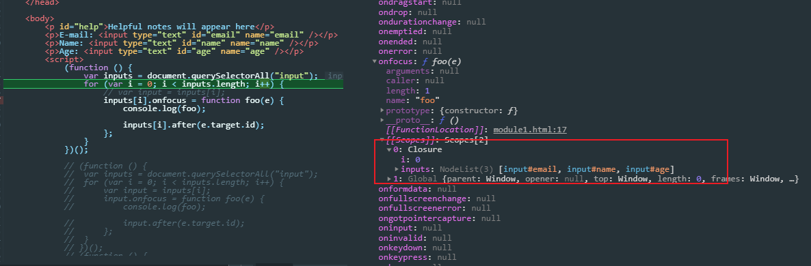
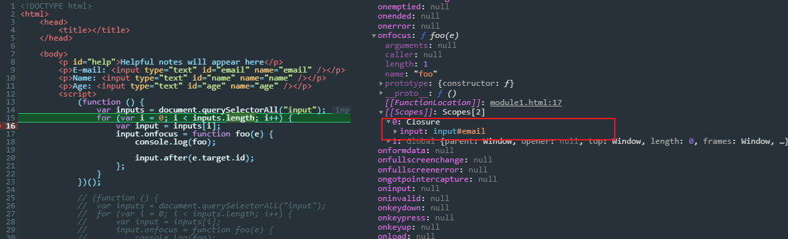

闭包翻译自`Closure`，这是一个从字面意思理解容易掉坑里的词语，它不是 JS 独有的概念，ES 规范里也没有提及它，具体可以参看以下 wiki 中对闭包的解释——[Closure](<https://zh.wikipedia.org/wiki/闭包_(计算机科学)>)：

> 在[计算机科学](https://zh.wikipedia.org/wiki/计算机科学)中，**闭包**（英语：Closure），又称**词法闭包**（Lexical Closure）或**函数闭包**（function closures），是在支持[头等函数](https://zh.wikipedia.org/wiki/头等函数)的编程语言中实现[词法](https://zh.wikipedia.org/wiki/作用域#静态作用域与动态作用域)[绑定](https://zh.wikipedia.org/wiki/名字绑定)的一种技术。闭包在实现上是一个结构体，它存储了一个函数（通常是其入口地址）和一个关联的环境（相当于一个符号查找表）。环境里是若干对符号和值的对应关系，它既要包括[约束变量](https://zh.wikipedia.org/wiki/约束变量)（该函数内部绑定的符号），也要包括[自由变量](https://zh.wikipedia.org/wiki/自由变量)（在函数外部定义但在函数内被引用），有些函数也可能没有自由变量。**闭包跟函数最大的不同在于，当捕捉闭包的时候，它的自由变量会在捕捉时被确定，这样即便脱离了捕捉时的上下文，它也能照常运行**。

从定义上来看，闭包就是保存自由变量的函数，理论上任何函数都是闭包。

简单地理解，闭包就是由函数创造的一个词法作用域，里面创建的变量被引用后，可以在这个词法环境之外自由使用。

由于作用域的限制，某个函数作用域中的变量声明，其它作用域都无法直接获取，一般来说，当函数执行完，其内部的活动对象就会被销毁，但是闭包不是，从上文作用域链的角度来看，函数在声明的时候就已经将作用域链保存在`[[scope]]`属性中，当函数被调用时，总是从`[[scope]]`属性复制对象作为执行上下文的作用域链，所以在任何时候调用都能从作用域链中搜索到外层包裹函数内部的成员。

```javascript
function f(a) {
  function foo() {
    return a;
  }

  return foo;
}

f(1)();
```

- 当执行完`f`后，返回`foo`继续执行时，可以看到`f`的参数已经被销毁了，`arguments`为 null；但是返回的`foo`已经将`f`的参数状态保存在了`[[scope]]`属性中，依然可以获取到变量`a`（这里有个小技巧，在 Scope 窗格没办法直接观察到闭包内部状态，可以通过语句`console.log()`打印函数自身，就会显示在当前作用域中了）


### 闭包应用场景的坑

在日常的代码中使用闭包的场景非常多，可能在使用函数的地方用了以后都没意思到这是一个闭包，例如下文中 DOM 事件回调函数的处理，如果不了解闭包，实在无法理解为什么循环内声明的函数都会共享一个变量。

#### setTimeout 回调

包括 DOM 事件回调，计时器回调，或者将函数作为参数传递到其它函数中执行之类的，如果使用到了包裹函数中的变量，那么就构成闭包了，当然这时候就要注意是否使用循环的问题了

```javascript
function wapper() {
  var a = 1;
  setTimeout(function() {
    console.log(a);
  }, 2000);
}

// 传递参数，super就是这么实现的
function wapper(a) {
  return function() {
    console.log(a);
  };
}

function f(fn) {
  fn();
}

f(wapper(1)); // 1
```

#### 实现私有成员

```javascript
var Counter = (function() {
  var privateCounter = 0;
  function changeBy(val) {
    privateCounter += val;
  }
  return {
    increment: function() {
      changeBy(1);
    },
    decrement: function() {
      changeBy(-1);
    },
    value: function() {
      return privateCounter;
    },
  };
})();

console.log(Counter.value()); /* logs 0 */
Counter.increment();
Counter.increment();
console.log(Counter.value()); /* logs 2 */
Counter.decrement();
console.log(Counter.value());
```

#### lazy loading function

延迟加载函数，在 JS 高级程序设计中被称为**惰性载入函数**，是一种提高代码性能的编程手段。这种情况多**使用在 API 兼容性判断**上，当需要判断是否是浏览器支持的 API 时，往往需要使用`if...else`的情况来选择最终使用的 API，这时候为了避免每次调用都会去一个一个判断，那么就可以使用惰性载入函数。

实现惰性载入函数的方式是在函数体内对自己的定义进行重写，这样如果函数在被调用一次后，函数本身的定义就会发生变化，在下一次再次调用的时候就会使用重写的定义去执行，于是就避免了每次执行都去判断。比较常见的是，babel 编译器大量使用了这种惰性载入函数去判断 API 的兼容性。

```javascript
//判断浏览器是否支持ES6方法Object.setPrototypeOf，如果不支持就使用__proto__
function _setPrototypeOf(o, p) {
  _setPrototypeOf =
    Object.setPrototypeOf ||
    function _setPrototypeOf(o, p) {
      o.__proto__ = p;
      return o;
    };
  return _setPrototypeOf(o, p);
}
```

#### 实现高阶函数

比如说实现`Function.prototype.bind()`方法，`bind`接收一个`this`值和参数列表，返回一个指定了`this`值的新函数

```javascript
//简单实现bind
function bind(fn, _this) {
  return function() {
    fn.apply(_this, arguments);
  };
}
```

或者函数柯里化（function currying）的实现，函数柯里化是创建一个已经设置好了一个或者多个参数的函数

```javascript
function curry(fn) {
  var args = Array.prototype.slice.call(arguments, 1);
  return function() {
    var inenrArgs = Array.prototype.slice.call(arguments);
    var finalArgs = args.concat(inenrArgs);
    return fn.apply(null, finalArgs);
  };
}

function add(num1, num2) {
  return num1 + num2;
}

var curriedAdd = curry(add, 5, 12);
curriedAdd(); // 17
```

### 闭包注意点

#### 在循环中创建闭包

闭包只会取得包含函数中任何变量的最后一个值，我个人觉得最容易发生这种错误的场景是在 DOM 事件回调函数声明中

```html
<p>E-mail: <input type="text" id="email" name="email" /></p>
<p>Name: <input type="text" id="name" name="name" /></p>
<p>Age: <input type="text" id="age" name="age" /></p>

<script>
  (function() {
    var inputs = document.querySelectorAll('input');
    for (var i = 0; i < inputs.length; i++) {
      inputs[i].onfocus = function foo(e) {
        console.log(foo);

        inputs[i].after(e.target.id);
      };
    }
  })();
</script>
```

首先这段代码`focus`处理的时候会报错昂，正是因为报错才更清楚问题所在，从运行过程来看：

- 首先，**`var`声明的变量在`for`循环内不会产生块级作用域，不会被限制在`for`循环内而被提升到函数作用域中**，这点很重要，可以看到只有两个作用域，迭代变量`i`处于函数作用域中


- 然后即使每次循环都为`onfocus`指定一个新的函数，但是每个函数内部的作用域链只有两层，包裹函数的作用域和全局作用域，并且作用域链会保存下来，所以最后实际每个函数使用的都是同一个迭代变量`i`，并且循环完`i`的最后一个值也被保存在了闭包的作用域链中；这点可以在 devtool 里观察到`onfocus`赋值的过程



- 等到回调函数执行的时候，从作用域中获取的也始终是保存下来的作用域链中的`i`的最后一个值，也就是 3（因为 i 最后还会迭代一次然后再判断嘛），等到`focus`触发的时候，所以就报错了


> 解决方法

经过上面的分析过程，基本清楚了产生这种现象的原因，其实就是过去使用`var`在代码块中不会产生块级作用域导致的，所以要将循环变量限制在更小的作用域中才行

- 那么首先肯定考虑使用`let`来声明循环变量，使用`let`后就可以看到每个回调函数内保存的作用域链上多了块级作用域

```javascript
(function() {
  var inputs = document.querySelectorAll('input');
  for (let i = 0; i < inputs.length; i++) {
    inputs[i].onfocus = function foo(e) {
      console.log(foo);

      inputs[i].after(e.target.id);
    };
  }
})();
```


- 然后又想到 ES5 使用 IIFE 来模拟块级作用域，每次循环把迭代的值限制在 IIFE 内，执行完一次循环，IIFE 就会自动回收掉内部变量，从而每次声明的回调函数保存的不同的作用域链

```javascript
(function() {
  var inputs = document.querySelectorAll('input');

  for (var i = 0; i < inputs.length; i++) {
    (function() {
      var input = inputs[i]; // 保证每个闭包内作用域链保存的是当前循环的变量
      input.onfocus = function foo(e) {
        console.log(foo);

        input.after(e.target.id);
      };
    })();
  }
})();
```

- 最后就是使用数组的 forEach 方法

```javascript
(function() {
  var inputs = document.querySelectorAll('input');
  inputs.forEach(function(ele, index) {
    ele.onfocus = function foo(e) {
      console.log(foo);

      ele.after(e.target.id);
    };
  });
})();
```

#### 内存占用

首先强调，闭包没有内存泄漏的问题，JS 高级程序设计中指出的是过去 IE9 之前的 BUG 了，其它的浏览器没有这个问题。但是闭包确实有内存占用的问题，但是以 V8 为例，基于标记清除的垃圾回收方式，闭包也会自动回收那些在闭包中没有找到引用项的作用域中的变量，如下

```javascript
(function() {
  var inputs = document.querySelectorAll('input');
  for (var i = 0; i < inputs.length; i++) {
    var input = inputs[i];
    input.onfocus = function foo(e) {
      console.log(foo);

      input.after(e.target.id);
    };
  }
})();
```



