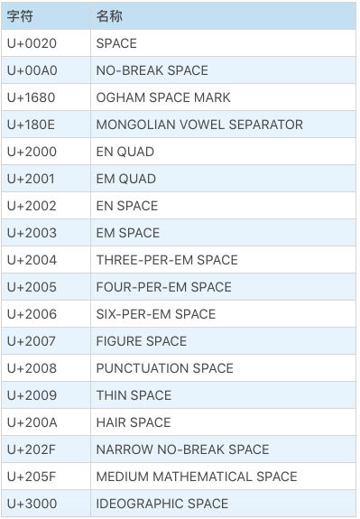
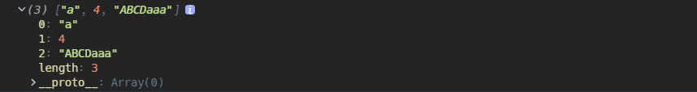
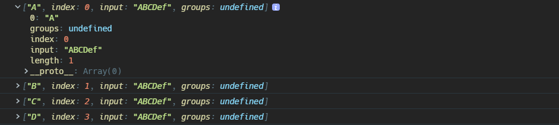

## String 类型的特点

### 定长的 16 位二进制编码

严格来说，JS 编码字符的格式其实是 UCS-2，也就是 UTF-16 的前身，后来 UTF-16 经过完善才支持使用 2 个 16 位二进制表示超过 U+FFFF 的 Unicode 码点字符，但是 JS 诞生之初的 UCS-2 并不支持使用 2 个 16 位二进制编码，所以现在的 JS 在遇到某些超过 U+FFFF 的字符时，会显示其长度是 2，例如数学指数常数`𝑒`

```java
//𝑒，数学常数，自然对数lnX的底数，码点U+1D452
console.log("𝑒".length);					// 2
```

### 不可变

js 的`String`类型的最大特点就是它是不可变的，一旦声明初始化以后，没有任何方式改变它的值，字符串本身继承的”修改“字符串的方法都是在**创建一个新的字符串，然后销毁原来字符串，最后将新字符串赋值给变量**

## 构造函数

### new String()

如果直接用`new String()`创建一个字符串的话，**它就是一个对象**。

```javascript
let s_prim = 'test';
let s_obj = new String('test');

console.log(typeof s_prim); // "string"
console.log(typeof s_obj); // "object"
```

### String()

当`String`构造函数单独使用时，它的作用是强制类型转换，这种情况相当于对括号内的值调用`toString()`方法；但是`undefined`和`null`没有继承自`Object.prototype`，它们分别得到字符串形式的表示

```javascript
console.log(String([1, 2, 3])); // "1,2,3"

console.log(String(null)); // "null"

console.log(String(undefined)); // "undefined"
```

## 创建字符串

### 字面量形式

可以使用字符串字面量`""`，`String()`，`new String()`，模板字符串``来创建一个字符串，最常用的还是字符串字面量。

本质上，`String`是一种包装类型的对象，使用字符串字面量和`String()`形式创建的字符串都是原始值，当使用原始值调用`String.prototype`上的方法时，JS 会自动进行装箱操作，将原始值包装成`String`对象。

### 模板字符串

> `string text ${expression} string text`

模板字符串是 ES6 的语法，支持使用`${}`在字符串中插入表达式，其会对`${}`中的变量进行隐式类型转换，强制转换成`string`类型，所以要时刻注意那些可能不能正常转换成字符串类型的变量传递进去。例如：

```javascript
{
} // 对象字面量
true / false; // boolean
undefined; // undefined
null; // null
NaN - 0; // NaN // 转换以后符号会被省略
Infinity; // Infinity
```

模板字符串和普通的字符串字面量`""`的区别有：

- 能够直接换行表示，双引号形式的`""`换行需要使用`+`连接
- 支持函数解析模板字符串内的字符

> `function myTag(stringArray, exp1, exp2)`
>
> @param stringArray 字符串数组
>
> @param ...expression 按顺序解析的插入的表达式的值

对于作为第一个参数的字符串数组，

- 如果原模板字符串开头不是字符串而是`${}`插入的表达式，那么该数组第一个元素会是一个空字符串`""`；同理，如果原模板字符串不是以字符串结尾，那么数组最后一个元素也将会是空字符串
- 该数组还包含一个属性`raw`，它也是一个数组，它的值也是由模板字符串中原始字符串组成的


```javascript
let person = 'Mike';
let age = 28;

function myTag(stringArray, ...expArgs) {
  console.log(stringArray);
  console.log(expArgs);
}

myTag`That ${person} is a ${age}`;
```


### Unicode 码点形式

ES6 以后支持使用`"\u0000"`到`\uFFFF`的形式表示`U+0000`到`U+FFFF`之间的 Unicode 码点，对于超出了`U+FFFF`的码点，需要使用花括号包裹起来，使用两个`"\u{xxxxx}"`的形式来表示；如果不用花括号，会把它看作两个字符，在使用某些方法时会发生一些意外的事情

```javascript
// 下面两种形式是等价的

'\u0061';

'a';

// 数学常数𝑒
'\u{1D452}';
```

## 实例属性

### length

字符串主要的属性就是`length`，正如 JS 使用 16 位二进制 UTF-16 编码每个字符串，所以`length`的值也是字符串中每个字符在 UTF-16 编码形式下的码点个数；当字符串中含有超出 U+FFFF 码点的字符时，需要使用 2 个 16 位码元表示，那么该字符的长度将被记为 2。

ES2016 规定，字符串的最大长度是`2^53-1`。

有一个容易混淆的点是`String.length`和`length`的关系，`String.length`其实是`function String(){}`这个构造函数定义时指定的必传的参数个数，所以和`length`完全不沾边。

### [[PrimitiveValue]]

基本类型的值都具有一个私有属性`[[PrimitiveValue]]`，这个值就是原始值的意思嘛，如果使用`new String()`构造的字符串，实际上是一个对象，则可以使用`valueOf`获取`[[PrimitiveValue]]`，也就是原始值形式

```javascript
var x = new String('Hello world');
console.log(x.valueOf()); // Displays 'Hello world'
```

## 实例方法

### 查找字符

#### includes

> `str.includes(searchString, fromIndex)`
>
> @param searchString 指定字符串
>
> @param fromIndex 从字符串的指定位置开始搜索，默认是 0
>
> @return Boolean

判断从指定索引位置开始的字符串是否包含指定的字符串，默认从`0`开始

#### startsWith

> `str.startsWith(searchString, fromIndex)`
>
> @param searchString 开头字符串
>
> @param fromIndex 从字符串的指定位置开始搜索，默认是 0
>
> @return Boolean

判断从指定索引位置开始的字符串是否以该字符串作为开头，默认从`0`开始

```javascript
const str1 = 'Saturday night plans';

console.log(str1.startsWith('Sat')); //true
```

#### endsWith

> `str.endsWith(searchString, length)`
>
> @param searchString 要搜索的字符串
>
> @param length 从字符串的开头位置截取字符串的长度，默认是字符串的长度
>
> @return Boolean

`endsWith`判断字符串结尾是否是指定的字符串；如果指定`length`这个参数，有两种情况：

- 当`length`小于字符串长度，则表示只判断截取长度的字符串
- 如果 length 大于字符串长度，那么一定返回`false`

```javascript
const str1 = 'Cats are the best!';

console.log(str1.length); // 18
console.log(str1.endsWith('!', 5)); // false
console.log(str1.endsWith('!', 18)); // true
```

#### charAt

> `str.charAt(index)`
>
> @param index 索引值，或者标准来说是偏移量
>
> @return String 索引位置的字符，如果索引超出范围，会返回空字符串

JS 使用的是 UTF16 编码字符，如果字符串中出现了超过`U+FFFF`码点值的字符，这个字符会被拆开成两部分，此时`charAt`返回的索引位置的值可能就不是看到的那样，如下：

```javascript
console.log('d𝑒asdad'.charAt(2));

//索引2位置的字符是𝑒，Unicode码点U+1D452，会被拆开成两个字符
console.log('d𝑒asdad'.indexOf('a')); // 3
```

#### charCodeAt

> `str.charCodeAt(index)`
>
> @param index 索引值
>
> @return Number 返回指定索引位置字符的 Unicode 码点整数值

如果给定索引值超出字符串，这个方法会返回`NaN`

```javascript
const sentence = 'The quick brown fox jumps over the lazy dog.';

// 索引4位置的字符是p，对应Unicode码点U+0050，转换成整数值就是113
console.log(sentence.charCodeAt(4)); // 113
```

#### codePointAt

> `str.codePointAt(index)`
>
> @prama index 索引值
>
> @return hex 指定索引位置字符的码点整数值

这个方法和`charCodeAt`有两点区别：

- 如果指定位置的字符在`U+OOOO`到`U+FFFF`之间，那么`charCodeAt`和`codePointAt`结果是一样的；但是如果是超出`U+FFFF`的字符，使用`codePointAt`可以准确返回其码点整数值，而`charCodeAt`只能返回部分
- 如果索引超出范围，这个方法会返回`undefined`

```javascript
const sentence = 'The quick brown fox jumps over the lazy dog.';

console.log(sentence.codePointAt(4)); // 113
```

#### indexOf

> `str.indexOf(searchString, fromIndex)`
>
> @return Number

返回指定字符串在提供字符串中的索引，如果找不到就返回`-1`；所以可以使用这个方法的结果不等于`-1`来判断字符串中是否包含某部分

```javascript
if('Blue Whale'.indexOf('Blue') !== -1)
```

### 截取字符串

#### slice

> `str.slice(beginIndex, endIndex)`
>
> @param beginIndex 起始字符串的索引
>
> @param endIndex 到该索引前一个位置结束
>
> @return String 截取的字符串

截取指定索引部分的字符串，但是不包含`endIndex`位置的字符，这点和数组的`slice`也是一样的。

和数组的`slice`一样，参数可以是负值，表示从结尾`-1`开始往前数

```javascript
let str1 = 'The morning is upon us.', // the length of str1 is 23.
  str2 = str1.slice(1, 8), // "he morn"
  str3 = str1.slice(4, -2), // "morning is upon u"
  str4 = str1.slice(12), // "is upon us"
  str5 = str1.slice(30); // ""
```

#### substring

> `str.substring(beginIndex, endIndex)`
>
> @param beginIndex 起始字符串的索引
>
> @param endIndex 到该索引前一个位置结束
>
> @return String 截取的字符串

如果参数都是正数，那么这个方法和`slice`得到的结果没有区别；区别就在于处理参数是负值的情况：

- 如果`substring`的任何一个参数小于`0`或者是`NaN`，等价于`0`

```javascript
const str = 'Mozilla';

console.log(str.substring(-1, 2)); // "Mo"
console.log(str.substring(-1, -2)); //substring(0, 0) 得到空字符串""
```

- 如果第一个参数大于第二个参数，内部会将两者进行交换处理

```javascript
let text = 'Mozilla';
console.log(text.substring(5, 2)); // "zil"
```

#### substr

> `str.substr(startIndex, length)`
>
> @param startIndex 起始字符串的索引
>
> @param length 要截取的字符串的长度
>
> @return String 截取的字符串

`substr`是一个容易和`substring`混淆的方法，它处理负值又和前面的方法不同，有以下规则：

- `startIndex`是负值的话，也是从字符串结尾往前数，如果负值的绝对值超过字符串范围，看作是`0`
- 如果不指定长度，就一直截取到字符串结尾
- 如果长度值小于等于 0，都是返回空字符串

```javascript
var aString = 'Mozilla';

console.log(aString.substr(0, 1)); // 'M'
console.log(aString.substr(1, 0)); // ''
console.log(aString.substr(-1, 1)); // 'a'
console.log(aString.substr(1, -1)); // ''
console.log(aString.substr(-3)); // 'lla'
console.log(aString.substr(1)); // 'ozilla'
console.log(aString.substr(-20, 2)); // 'Mo'
console.log(aString.substr(20, 2)); // ''
```

#### trim

> `str.trim()`
>
> @return String

去除字符串开头和结尾的 Unicode 空白字符，包括空格，tab 等等乱七八糟的空格如下



#### trimEnd/trimRight

> `str.trimEnd()`
>
> `str.trimRight()`

移除字符串右侧空白字符

#### trimStart/trimLeft

> `str.trimStart()`
>
> `str.trimLeft()`

移除字符串左侧空白字符

### 拼接字符串

#### `${}`

首先应该考虑使用模板字符串来进行字符串拼接

#### 加号+

使用`+`串接字符串是最常见的，`+`本身还会进行一些类型转换，如果`+`两边有一个是字符串，就会都转成字符串进行连接操作；但是要注意`Symbol`类型的对象不能使用`+`进行连接，会报错。

```javascript
console.log(2 + '2'); // "22"

console.log('2' + 2); // "22"

Symbol('foo') + 'bar'; // TypeError: Can't convert symbol to string
```

#### concat

> `str.concat(str2 [, ...strN])`
>
> @param String 字符串
>
> @return String

返回多个字符串连接的新字符串

```javascript
const str1 = 'Hello';
const str2 = 'World';

console.log(str1.concat(' ', str2)); // "Hello World"
```

#### padStart

> `str.padStart(targetLength, padString)`
>
> @param targetLength 最终返回的字符串的长度
>
> @param padString 要追加的字符串
>
> @return String

这个方法有点繁琐，它是将指定的字符串追加到原字符串的开头

- 如果指定`targetLength`小于原字符串长度，那么直接返回原字符串
- 如果追加的字符串长度加上原字符串长度的和超过了`targetLength`，那么将对追加的字符串进行截取，直到最终组合的字符串长度和`targetLength`相等为止
- 如果追加的字符串和原字符串长度总和小于`targetLength`，那么会重复追加字符串的部分直到等于`targetLength`

```javascript
console.log('abc'.padStart(1, 'foo')); // "abc"
console.log('abc'.padStart(5, 'foo')); // "foabc"
console.log('abc'.padStart(10, 'foo')); // "foofoofabc"
```

#### padEnd

> `str.padEnd(targetLength, padString)`
>
> @param targetLength 最终返回的字符串的长度
>
> @param padString 要追加的字符串
>
> @return String

这个方法其实就和`padStart`相反，追加字符串到原字符串结尾

```javascript
'abc'.padEnd(10); // "abc       "
'abc'.padEnd(10, 'foo'); // "abcfoofoof"
'abc'.padEnd(6, '123456'); // "abc123"
'abc'.padEnd(1); // "abc"
```

#### repeat

> `str.repeat(n)`
>
> @param n`Infinity < n <= 0`
>
> @return String

重复原字符串`n`次的新字符串，n 不能是负数，也不能超过`Infinity`，否则会抛出`RangeError`的错误

### 替换字符

这里说的并不是真的修改原字符串，因为字符串一旦声明，没有任何手段能修改它，都是重新创建一个新的。

#### replace

> `str.replace(regexp|substr, newSubstr|function)`
>
> @param 匹配字符串的正则表达式或者要查找的字符串
>
> @param 用于替换的字符串，或者一个返回字符串的函数
>
> @return String

这个方法应该是在日常使用最频繁的，因为它能使用正则表达式去匹配字符串中存在的部分。

如果第一个参数是字符串或者未指定全局匹配模式的正则表达式，那么在原字符串中只有第一个匹配的部分会被替换掉。

```javascript
const p = 'ABCDaaa';

const regex = /[a-z]/;

console.log(p.replace(regex, 'A')); // ABCDAaa

console.log(p.replace('a', 'A')); // "ABCDAaa"
```

如果指定正则表达式为全局匹配模式`g`，所有匹配项都会被替换

```javascript
const p = 'ABCDaaa';

const regex = /[a-z]/g;

console.log(p.replace(regex, 'A')); // ABCDAAA
```

`replace`方法的第二个参数可以是一个函数，这个函数一般接收三个参数：

- `matchString`：当前匹配的字符串部分
- `index`：匹配的字符串在原字符串中的索引
- `source`：原字符串

如果函数没有返回值就是返回`undefined`，那么就是使用`undefined`这个字符串去替换匹配项。

```javascript
const p = 'ABCDaaa';

const regex = /[a-z]/;

function replaceFunc(...args) {
  console.log(args);
}

console.log(p.replace(regex, replaceFunc));
```



#### :mute:replaceAll

这个方法暂时不要使用，因为到 Chrome85 以后才会正式支持，其他浏览器则根本不支持。


> `str.replace(regexp|substr, newSubstr|function)`

如果支持的话，`replaceAll`总是全部替换原字符串中的匹配项，如果第一个参数是正则表达式，必须指定全局匹配模式`g`

```javascript
const p = 'ABCDaaa';

const regex = /[a-z]/g;

console.log(p.replaceAll(regex, 'A')); // ABCDAAA

console.log(p.replaceAll('a', 'A')); // ABCDAAA
```

#### toLowerCase

> `str.toLowerCase()`
>
> @return String

全部转小写

#### toUpperCase

> `str.toUpperCase()`
>
> @return String

全部转大写

### 正则匹配

#### match

> `str.match(regexp)`
>
> @param regexp 正则表达式
>
> @return Array

搜索在字符串中的正则表达式匹配项，`match`的返回结果要么是数组要么是`null`

- 仅当在字符串中找不到任何匹配项时，其返回`null`
- 如果`match`未指定任何参数，会返回一个包含空字符串的数组，并且带有额外的四个属性
- 如果`match`中不是正则表达式字面量，回调用`new RegExp()`进行转换
- 如果`match`中的正则表达式不是`g`全局匹配模式，那么返回的数组只会**包含字符串中第一个匹配的部分，并且数组还将带有额外三个属性**
  - `groups`：一个包含捕获组匹配项的对象，如果没有使用过`(?<name>)`命名捕获组，这个值是`undefined`
  - `index`：匹配项在字符串中的索引
  - `input`：原字符串

```javascript
const str = 'ABCDef';
const regex = /[A-Z]/;
const found = str.match(regex);

console.log(found);
```


- 如果`match`的正则表达式指定了`g`匹配模式，那么数组只会包含在字符串中的所有匹配项

```javascript
const str = 'ABCDef';
const regex = /[A-Z]/g;
const found = str.match(regex);

console.log(found);
```


#### matchAll

> `str.matchAll(regexp)`
>
> @return _RegExpStringIterator_

`matchAll`只能用在指定全局匹配模式`g`的正则表达式上，否则会抛出`TypeError`。

这个方法是返回一个迭代器对象，包含每次匹配的结果，可以使用`for...of`去遍历结果，用法如下：

```javascript
const str = 'ABCDef';
const regex = /[A-Z]/g;
const matchesIterator = str.matchAll(regex);

for (let val of matchesIterator) {
  console.log(val);
}
```



#### search

> `str.search(regexp)`
>
> @param regexp 正则表达式
>
> @return Number 正则表达式匹配的第一个匹配项的索引

`search`根据传进去的正则表达式搜索字符串中的匹配项，如果找到第一个匹配项就返回其索引；如果找不到就返回`-1`，所以一般都是判断结果不等于`-1`来使用

```javascript
if(str.search(reg) !== "-1")
```

### 字符串转数组

#### split

> `str.split(separator|regexp, limit)`
>
> @parama separator 分隔字符或者一个正则表达式
>
> @parama limit 限制数组的长度
>
> @return Array

根据指定字符或者正则表达式匹配规则，将字符串转换成数组。先来说说第一个参数：

- 如果未指定参数或者分隔字符串在原字符串中找不到，则将整个字符串放进数组然后返回
- 如果分隔符出现在开头或者结尾，则数组还会带有空字符串项
- 如果分隔符是空字符串，那么字符串会被一个一个拆开成单独字符放进数组

```javascript
const str = 'abcdefg';

str.split(); // ["abcdefg"]
str.split(''); // ["a", "b", "c", "d", "e", "f", "g"]
str.split('a'); // ["", "bcdefg"]
str.split('h'); // ["abcdefg"]
```

再来说说第二个参数：

- 如果指定负数，会忽略
- 如果是`0`，返回空数组
- 其他情况，就只返回限制长度的数组

```javascript
const str = 'abcdefg';

str.split('', 0); // []
str.split('', 5); // ["a", "b", "c", "d", "e"]
```

### 遍历字符串

#### for

for 循环能遍历字符串，但是太麻烦了，而且对超过`U+FFFF`的字符，它不认识。

#### for...of

ES6 为字符串添加了迭代器属性，所以字符串支持使用`for...of`进行循环遍历。

`for...of`循环最大的好处就是它不骗人，认识超过`U+FFFF`的字符串

```javascript
//能正确输出 𝑒
for (let val of 'd𝑒asdad') {
  console.log(val);
}
```