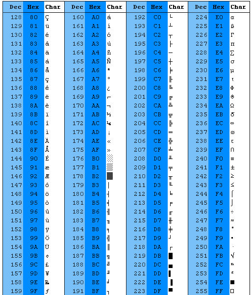

## 基本概念

在计算机中表示文字，图片，符号等内容都需要进行编码，因为它们最终都是以二进制形式存储在计算机中。下面是一些概念：

- 字符（Chracter）：这个很容易理解，就是字母、数字、运算符号、标点符号和其他符号，是组成文本的最小单位
- 字符集（Chracter Set）：就是字符的集合嘛，它一般是分国家，语言或者地区的

- **编码字符集（Coded Character Set）：为每个字符分配一个唯一的整数编号，这些整数的集合就是编码字符集**
- **码点（Code point）：在字符集中任意一个整数值都叫码点**，例如 Unicode 码点形式就是 U+XXXX
- 码空间（Code space）：代码点整数的范围
- 码单元（Code Unit）：是码点的最小二进制序列表示形式；一个码点由一系列代码单元表示，而一个码点需要的码单元数取决于编码，例如 UTF-8 中，代码点可以映射到一个，两个，三个或四个代码单元的序列

## 字符集

### ASCII

ASCII，发音艾斯 ki，是**American Standard Code for Information Interchange**（美国标准信息交换码）的简写，是电子通信的字符编码标准。大多数现代字符编码方案都基于 ASCII，并支持了更多的字符。

ASCII 码的标准制定是由美国标准协会 ASA（也就是现在的 ANSI，美国国家标准协会，类似于中国国家标准化管理委员会）手底下的一个 X3.2 小组委员会来完成，第一版标准是在 1963 年完成并发布，当时只包含大写字母和数字，在 1967 年经过重大修订，添加了小写字母和一些打印机的**控制字符**，什么回车啊，退格啊等等，至此就包含了所有在英文中可能用到的 128 个字符；这 128 个字符里面 95 个编码字符是可打印的：这些字符包括数字 0 到 9，小写字母 a 到 z，大写字母 A 到 Z 和标点符号；还有 33 种用在电传打字机里面，里面的大部分都过时了，但是部分也被现在的键盘采用了，例如回车，换行，制表符。

为了最小化数据传输的成本，X3.2 小组委员会决定使用 7 位二进制进行编码， 如下表所示，这些字符其实就是从十进制的 0 到 127，0 是 NULL，A 是 1000001，10 进制就是 65，那么 B 十进制就是 66，就是依次往下数的。

#### 控制字符

| [二进制](https://zh.wikipedia.org/wiki/二进制) | [十进制](https://zh.wikipedia.org/wiki/十进制) | [十六进制](https://zh.wikipedia.org/wiki/十六进制) | [缩写](https://zh.wikipedia.org/wiki/缩写) | [Unicode](https://zh.wikipedia.org/wiki/Unicode) 表示法 | [脱出字符](https://zh.wikipedia.org/wiki/脫出字元) 表示法 |                          名称／意义                          |
| :--------------------------------------------: | :--------------------------------------------: | :------------------------------------------------: | :----------------------------------------: | :-----------------------------------------------------: | :-------------------------------------------------------: | :----------------------------------------------------------: |
|                   0000 0000                    |      [0](https://zh.wikipedia.org/wiki/0)      |                         00                         |                    NUL                     |                            ␀                            |                            ^@                             | [空字符](https://zh.wikipedia.org/wiki/空字符)（[Null](https://zh.wikipedia.org/wiki/Null)） |
|                   0000 0001                    |      [1](https://zh.wikipedia.org/wiki/1)      |                         01                         |                    SOH                     |                            ␁                            |                            ^A                             | [标题开始](https://zh.wikipedia.org/w/index.php?title=标题开始&action=edit&redlink=1) |
|                   0000 0010                    |      [2](https://zh.wikipedia.org/wiki/2)      |                         02                         |                    STX                     |                            ␂                            |                            ^B                             | [本文开始](https://zh.wikipedia.org/w/index.php?title=本文开始&action=edit&redlink=1) |
|                   0000 0011                    |      [3](https://zh.wikipedia.org/wiki/3)      |                         03                         |                    ETX                     |                            ␃                            |                            ^C                             | [本文结束](https://zh.wikipedia.org/w/index.php?title=本文结束&action=edit&redlink=1) |
|                   0000 0100                    |      [4](https://zh.wikipedia.org/wiki/4)      |                         04                         |                    EOT                     |                            ␄                            |                            ^D                             | [传输结束](https://zh.wikipedia.org/w/index.php?title=傳輸结束&action=edit&redlink=1) |
|                   0000 0101                    |      [5](https://zh.wikipedia.org/wiki/5)      |                         05                         |                    ENQ                     |                            ␅                            |                            ^E                             | [请求](https://zh.wikipedia.org/w/index.php?title=请求&action=edit&redlink=1) |
|                   0000 0110                    |      [6](https://zh.wikipedia.org/wiki/6)      |                         06                         |                    ACK                     |                            ␆                            |                            ^F                             | [确认回应](https://zh.wikipedia.org/w/index.php?title=確認回應&action=edit&redlink=1) |
|                   0000 0111                    |      [7](https://zh.wikipedia.org/wiki/7)      |                         07                         |                    BEL                     |                            ␇                            |                            ^G                             | [响铃](https://zh.wikipedia.org/w/index.php?title=响铃&action=edit&redlink=1) |
|                   0000 1000                    |      [8](https://zh.wikipedia.org/wiki/8)      |                         08                         |                     BS                     |                            ␈                            |                            ^H                             |         [退格](https://zh.wikipedia.org/wiki/退格鍵)         |
|                   0000 1001                    |      [9](https://zh.wikipedia.org/wiki/9)      |                         09                         |                     HT                     |                            ␉                            |                            ^I                             | [水平定位符号](https://zh.wikipedia.org/wiki/制表键#定位符号) |
|                   0000 1010                    |     [10](https://zh.wikipedia.org/wiki/10)     |                         0A                         |                     LF                     |                            ␊                            |                            ^J                             |         [换行键](https://zh.wikipedia.org/wiki/換行)         |
|                   0000 1011                    |     [11](https://zh.wikipedia.org/wiki/11)     |                         0B                         |                     VT                     |                            ␋                            |                            ^K                             | [垂直定位符号](https://zh.wikipedia.org/w/index.php?title=垂直定位符號&action=edit&redlink=1) |
|                   0000 1100                    |     [12](https://zh.wikipedia.org/wiki/12)     |                         0C                         |                     FF                     |                            ␌                            |                            ^L                             | [换页键](https://zh.wikipedia.org/w/index.php?title=换页键&action=edit&redlink=1) |
|                   0000 1101                    |     [13](https://zh.wikipedia.org/wiki/13)     |                         0D                         |                     CR                     |                            ␍                            |                            ^M                             |    [CR (字符)](<https://zh.wikipedia.org/wiki/CR_(字元)>)    |
|                   0000 1110                    |     [14](https://zh.wikipedia.org/wiki/14)     |                         0E                         |                     SO                     |                            ␎                            |                            ^N                             | [取消变换](https://zh.wikipedia.org/wiki/取消變换)（Shift out） |
|                   0000 1111                    |     [15](https://zh.wikipedia.org/wiki/15)     |                         0F                         |                     SI                     |                            ␏                            |                            ^O                             | [启用变换](https://zh.wikipedia.org/wiki/启用變换)（Shift in） |
|                   0001 0000                    |     [16](https://zh.wikipedia.org/wiki/16)     |                         10                         |                    DLE                     |                            ␐                            |                            ^P                             | [跳出数据通讯](https://zh.wikipedia.org/w/index.php?title=跳出数据通讯&action=edit&redlink=1) |
|                   0001 0001                    |     [17](https://zh.wikipedia.org/wiki/17)     |                         11                         |                    DC1                     |                            ␑                            |                            ^Q                             | [设备控制](https://zh.wikipedia.org/w/index.php?title=設備控制&action=edit&redlink=1)一（[XON](https://zh.wikipedia.org/w/index.php?title=XON&action=edit&redlink=1) [激活软件速度控制](https://zh.wikipedia.org/w/index.php?title=啟用軟體速度控制&action=edit&redlink=1)） |
|                   0001 0010                    |     [18](https://zh.wikipedia.org/wiki/18)     |                         12                         |                    DC2                     |                            ␒                            |                            ^R                             | [设备控制](https://zh.wikipedia.org/w/index.php?title=設備控制&action=edit&redlink=1)二 |
|                   0001 0011                    |     [19](https://zh.wikipedia.org/wiki/19)     |                         13                         |                    DC3                     |                            ␓                            |                            ^S                             | [设备控制](https://zh.wikipedia.org/w/index.php?title=設備控制&action=edit&redlink=1)三（[XOFF](https://zh.wikipedia.org/w/index.php?title=XOFF&action=edit&redlink=1) [停用软件速度控制](https://zh.wikipedia.org/w/index.php?title=停用軟體速度控制&action=edit&redlink=1)） |
|                   0001 0100                    |     [20](https://zh.wikipedia.org/wiki/20)     |                         14                         |                    DC4                     |                            ␔                            |                            ^T                             | [设备控制](https://zh.wikipedia.org/w/index.php?title=設備控制&action=edit&redlink=1)四 |
|                   0001 0101                    |     [21](https://zh.wikipedia.org/wiki/21)     |                         15                         |                    NAK                     |                            ␕                            |                            ^U                             |  [确认失败回应](https://zh.wikipedia.org/wiki/確認失敗回應)  |
|                   0001 0110                    |     [22](https://zh.wikipedia.org/wiki/22)     |                         16                         |                    SYN                     |                            ␖                            |                            ^V                             | [同步用暂停](https://zh.wikipedia.org/w/index.php?title=同步用暫停&action=edit&redlink=1) |
|                   0001 0111                    |     [23](https://zh.wikipedia.org/wiki/23)     |                         17                         |                    ETB                     |                            ␗                            |                            ^W                             | [区块传输结束](https://zh.wikipedia.org/w/index.php?title=區塊傳輸结束&action=edit&redlink=1) |
|                   0001 1000                    |     [24](https://zh.wikipedia.org/wiki/24)     |                         18                         |                    CAN                     |                            ␘                            |                            ^X                             | [取消](https://zh.wikipedia.org/w/index.php?title=取消&action=edit&redlink=1) |
|                   0001 1001                    |     [25](https://zh.wikipedia.org/wiki/25)     |                         19                         |                     EM                     |                            ␙                            |                            ^Y                             | [连线介质中断](https://zh.wikipedia.org/w/index.php?title=連線介质中断&action=edit&redlink=1) |
|                   0001 1010                    |     [26](https://zh.wikipedia.org/wiki/26)     |                         1A                         |                    SUB                     |                            ␚                            |                            ^Z                             |        [替换](https://zh.wikipedia.org/wiki/替代字符)        |
|                   0001 1011                    |     [27](https://zh.wikipedia.org/wiki/27)     |                         1B                         |                    ESC                     |                            ␛                            |                            ^[                             |        [退出键](https://zh.wikipedia.org/wiki/退出键)        |
|                   0001 1100                    |     [28](https://zh.wikipedia.org/wiki/28)     |                         1C                         |                     FS                     |                            ␜                            |                            ^\                             | [文件分割符](https://zh.wikipedia.org/w/index.php?title=文件分割符&action=edit&redlink=1) |
|                   0001 1101                    |     [29](https://zh.wikipedia.org/wiki/29)     |                         1D                         |                     GS                     |                            ␝                            |                            ^]                             | [组群分隔符](https://zh.wikipedia.org/w/index.php?title=群組分隔符&action=edit&redlink=1) |
|                   0001 1110                    |     [30](https://zh.wikipedia.org/wiki/30)     |                         1E                         |                     RS                     |                            ␞                            |                            ^^                             | [记录分隔符](https://zh.wikipedia.org/w/index.php?title=记录分隔符&action=edit&redlink=1) |
|                   0001 1111                    |     [31](https://zh.wikipedia.org/wiki/31)     |                         1F                         |                     US                     |                            ␟                            |                            ^\_                            | [单元分隔符](https://zh.wikipedia.org/w/index.php?title=单元分隔符&action=edit&redlink=1) |

#### 可输出字符

| [二进制](https://zh.wikipedia.org/wiki/二进制) | [十进制](https://zh.wikipedia.org/wiki/十进制) | [十六进制](https://zh.wikipedia.org/wiki/十六进制) |  [图形](https://zh.wikipedia.org/wiki/图形)   |
| :--------------------------------------------: | :--------------------------------------------: | :------------------------------------------------: | :-------------------------------------------: |
|                   0010 0000                    |     [32](https://zh.wikipedia.org/wiki/32)     |                         20                         | ([space](https://zh.wikipedia.org/wiki/空格)) |
|                   0010 0001                    |     [33](https://zh.wikipedia.org/wiki/33)     |                         21                         |   [!](https://zh.wikipedia.org/wiki/惊叹号)   |
|                   0010 0010                    |     [34](https://zh.wikipedia.org/wiki/34)     |                         22                         |   ["](https://zh.wikipedia.org/wiki/双引号)   |
|                   0010 0011                    |     [35](https://zh.wikipedia.org/wiki/35)     |                         23                         |    [#](https://zh.wikipedia.org/wiki/井號)    |
|                   0010 0100                    |     [36](https://zh.wikipedia.org/wiki/36)     |                         24                         |     [\$](https://zh.wikipedia.org/wiki/$)     |
|                   0010 0101                    |     [37](https://zh.wikipedia.org/wiki/37)     |                         25                         |   [%](https://zh.wikipedia.org/wiki/百分比)   |
|                   0010 0110                    |     [38](https://zh.wikipedia.org/wiki/38)     |                         26                         |    [&](https://zh.wikipedia.org/wiki/%26)     |
|                   0010 0111                    |     [39](https://zh.wikipedia.org/wiki/39)     |                         27                         |   ['](https://zh.wikipedia.org/wiki/单引号)   |
|                   0010 1000                    |     [40](https://zh.wikipedia.org/wiki/40)     |                         28                         |    [(](https://zh.wikipedia.org/wiki/括號)    |
|                   0010 1001                    |     [41](https://zh.wikipedia.org/wiki/41)     |                         29                         |    [)](https://zh.wikipedia.org/wiki/括號)    |
|                   0010 1010                    |     [42](https://zh.wikipedia.org/wiki/42)     |                         2A                         |   [\*](https://zh.wikipedia.org/wiki/星号)    |
|                   0010 1011                    |     [43](https://zh.wikipedia.org/wiki/43)     |                         2B                         |    [+](https://zh.wikipedia.org/wiki/加号)    |
|                   0010 1100                    |     [44](https://zh.wikipedia.org/wiki/44)     |                         2C                         |    [,](https://zh.wikipedia.org/wiki/逗号)    |
|                   0010 1101                    |     [45](https://zh.wikipedia.org/wiki/45)     |                         2D                         |    [-](https://zh.wikipedia.org/wiki/减号)    |
|                   0010 1110                    |     [46](https://zh.wikipedia.org/wiki/46)     |                         2E                         |    [.](https://zh.wikipedia.org/wiki/句点)    |
|                   0010 1111                    |     [47](https://zh.wikipedia.org/wiki/47)     |                         2F                         |    [/](https://zh.wikipedia.org/wiki/斜線)    |
|                   0011 0000                    |     [48](https://zh.wikipedia.org/wiki/48)     |                         30                         |     [0](https://zh.wikipedia.org/wiki/0)      |
|                   0011 0001                    |     [49](https://zh.wikipedia.org/wiki/49)     |                         31                         |     [1](https://zh.wikipedia.org/wiki/1)      |
|                   0011 0010                    |     [50](https://zh.wikipedia.org/wiki/50)     |                         32                         |     [2](https://zh.wikipedia.org/wiki/2)      |
|                   0011 0011                    |     [51](https://zh.wikipedia.org/wiki/51)     |                         33                         |     [3](https://zh.wikipedia.org/wiki/3)      |
|                   0011 0100                    |     [52](https://zh.wikipedia.org/wiki/52)     |                         34                         |     [4](https://zh.wikipedia.org/wiki/4)      |
|                   0011 0101                    |     [53](https://zh.wikipedia.org/wiki/53)     |                         35                         |     [5](https://zh.wikipedia.org/wiki/5)      |
|                   0011 0110                    |     [54](https://zh.wikipedia.org/wiki/54)     |                         36                         |     [6](https://zh.wikipedia.org/wiki/6)      |
|                   0011 0111                    |     [55](https://zh.wikipedia.org/wiki/55)     |                         37                         |     [7](https://zh.wikipedia.org/wiki/7)      |
|                   0011 1000                    |     [56](https://zh.wikipedia.org/wiki/56)     |                         38                         |     [8](https://zh.wikipedia.org/wiki/8)      |
|                   0011 1001                    |     [57](https://zh.wikipedia.org/wiki/57)     |                         39                         |     [9](https://zh.wikipedia.org/wiki/9)      |
|                   0011 1010                    |     [58](https://zh.wikipedia.org/wiki/58)     |                         3A                         |    [:](https://zh.wikipedia.org/wiki/冒号)    |
|                   0011 1011                    |     [59](https://zh.wikipedia.org/wiki/59)     |                         3B                         |    [;](https://zh.wikipedia.org/wiki/分号)    |
|                   0011 1100                    |     [60](https://zh.wikipedia.org/wiki/60)     |                         3C                         |   [<](https://zh.wikipedia.org/wiki/小於號)   |
|                   0011 1101                    |     [61](https://zh.wikipedia.org/wiki/61)     |                         3D                         |    [=](https://zh.wikipedia.org/wiki/等号)    |
|                   0011 1110                    |     [62](https://zh.wikipedia.org/wiki/62)     |                         3E                         |   [>](https://zh.wikipedia.org/wiki/大於號)   |
|                   0011 1111                    |     [63](https://zh.wikipedia.org/wiki/63)     |                         3F                         |    [?](https://zh.wikipedia.org/wiki/问号)    |

| [二进制](https://zh.wikipedia.org/wiki/二进制) | [十进制](https://zh.wikipedia.org/wiki/十进制) | [十六进制](https://zh.wikipedia.org/wiki/十六进制) | [图形](https://zh.wikipedia.org/wiki/图形) |
| :--------------------------------------------: | :--------------------------------------------: | :------------------------------------------------: | :----------------------------------------: |
|                   0100 0000                    |     [64](https://zh.wikipedia.org/wiki/64)     |                         40                         |    [@](https://zh.wikipedia.org/wiki/@)    |
|                   0100 0001                    |     [65](https://zh.wikipedia.org/wiki/65)     |                         41                         |    [A](https://zh.wikipedia.org/wiki/A)    |
|                   0100 0010                    |     [66](https://zh.wikipedia.org/wiki/66)     |                         42                         |    [B](https://zh.wikipedia.org/wiki/B)    |
|                   0100 0011                    |     [67](https://zh.wikipedia.org/wiki/67)     |                         43                         |    [C](https://zh.wikipedia.org/wiki/C)    |
|                   0100 0100                    |     [68](https://zh.wikipedia.org/wiki/68)     |                         44                         |    [D](https://zh.wikipedia.org/wiki/D)    |
|                   0100 0101                    |     [69](https://zh.wikipedia.org/wiki/69)     |                         45                         |    [E](https://zh.wikipedia.org/wiki/E)    |
|                   0100 0110                    |     [70](https://zh.wikipedia.org/wiki/70)     |                         46                         |    [F](https://zh.wikipedia.org/wiki/F)    |
|                   0100 0111                    |     [71](https://zh.wikipedia.org/wiki/71)     |                         47                         |    [G](https://zh.wikipedia.org/wiki/G)    |
|                   0100 1000                    |     [72](https://zh.wikipedia.org/wiki/72)     |                         48                         |    [H](https://zh.wikipedia.org/wiki/H)    |
|                   0100 1001                    |     [73](https://zh.wikipedia.org/wiki/73)     |                         49                         |    [I](https://zh.wikipedia.org/wiki/I)    |
|                   0100 1010                    |     [74](https://zh.wikipedia.org/wiki/74)     |                         4A                         |    [J](https://zh.wikipedia.org/wiki/J)    |
|                   0100 1011                    |     [75](https://zh.wikipedia.org/wiki/75)     |                         4B                         |    [K](https://zh.wikipedia.org/wiki/K)    |
|                   0100 1100                    |     [76](https://zh.wikipedia.org/wiki/76)     |                         4C                         |    [L](https://zh.wikipedia.org/wiki/L)    |
|                   0100 1101                    |     [77](https://zh.wikipedia.org/wiki/77)     |                         4D                         |    [M](https://zh.wikipedia.org/wiki/M)    |
|                   0100 1110                    |     [78](https://zh.wikipedia.org/wiki/78)     |                         4E                         |    [N](https://zh.wikipedia.org/wiki/N)    |
|                   0100 1111                    |     [79](https://zh.wikipedia.org/wiki/79)     |                         4F                         |    [O](https://zh.wikipedia.org/wiki/O)    |
|                   0101 0000                    |     [80](https://zh.wikipedia.org/wiki/80)     |                         50                         |    [P](https://zh.wikipedia.org/wiki/P)    |
|                   0101 0001                    |     [81](https://zh.wikipedia.org/wiki/81)     |                         51                         |    [Q](https://zh.wikipedia.org/wiki/Q)    |
|                   0101 0010                    |     [82](https://zh.wikipedia.org/wiki/82)     |                         52                         |    [R](https://zh.wikipedia.org/wiki/R)    |
|                   0101 0011                    |     [83](https://zh.wikipedia.org/wiki/83)     |                         53                         |    [S](https://zh.wikipedia.org/wiki/S)    |
|                   0101 0100                    |     [84](https://zh.wikipedia.org/wiki/84)     |                         54                         |    [T](https://zh.wikipedia.org/wiki/T)    |
|                   0101 0101                    |     [85](https://zh.wikipedia.org/wiki/85)     |                         55                         |    [U](https://zh.wikipedia.org/wiki/U)    |
|                   0101 0110                    |     [86](https://zh.wikipedia.org/wiki/86)     |                         56                         |    [V](https://zh.wikipedia.org/wiki/V)    |
|                   0101 0111                    |     [87](https://zh.wikipedia.org/wiki/87)     |                         57                         |    [W](https://zh.wikipedia.org/wiki/W)    |
|                   0101 1000                    |     [88](https://zh.wikipedia.org/wiki/88)     |                         58                         |    [X](https://zh.wikipedia.org/wiki/X)    |
|                   0101 1001                    |     [89](https://zh.wikipedia.org/wiki/89)     |                         59                         |    [Y](https://zh.wikipedia.org/wiki/Y)    |
|                   0101 1010                    |     [90](https://zh.wikipedia.org/wiki/90)     |                         5A                         |    [Z](https://zh.wikipedia.org/wiki/Z)    |
|                   0101 1011                    |     [91](https://zh.wikipedia.org/wiki/91)     |                         5B                         |                    `[`                     |
|                   0101 1100                    |     [92](https://zh.wikipedia.org/wiki/92)     |                         5C                         | [\\](https://zh.wikipedia.org/wiki/反斜线) |
|                   0101 1101                    |     [93](https://zh.wikipedia.org/wiki/93)     |                         5D                         |  [\]](https://zh.wikipedia.org/wiki/括號)  |
|                   0101 1110                    |     [94](https://zh.wikipedia.org/wiki/94)     |                         5E                         | [^](https://zh.wikipedia.org/wiki/脱字符)  |
|                   0101 1111                    |     [95](https://zh.wikipedia.org/wiki/95)     |                         5F                         |  [\_](https://zh.wikipedia.org/wiki/底線)  |

| [二进制](https://zh.wikipedia.org/wiki/二进制) | [十进制](https://zh.wikipedia.org/wiki/十进制) | [十六进制](https://zh.wikipedia.org/wiki/十六进制) | [图形](https://zh.wikipedia.org/wiki/图形) |
| :--------------------------------------------: | :--------------------------------------------: | :------------------------------------------------: | :----------------------------------------: |
|                   0110 0000                    |     [96](https://zh.wikipedia.org/wiki/96)     |                         60                         | [`](https://zh.wikipedia.org/wiki/重音符)  |
|                   0110 0001                    |     [97](https://zh.wikipedia.org/wiki/97)     |                         61                         |    [a](https://zh.wikipedia.org/wiki/A)    |
|                   0110 0010                    |     [98](https://zh.wikipedia.org/wiki/98)     |                         62                         |    [b](https://zh.wikipedia.org/wiki/B)    |
|                   0110 0011                    |     [99](https://zh.wikipedia.org/wiki/99)     |                         63                         |    [c](https://zh.wikipedia.org/wiki/C)    |
|                   0110 0100                    |    [100](https://zh.wikipedia.org/wiki/100)    |                         64                         |    [d](https://zh.wikipedia.org/wiki/D)    |
|                   0110 0101                    |    [101](https://zh.wikipedia.org/wiki/101)    |                         65                         |    [e](https://zh.wikipedia.org/wiki/E)    |
|                   0110 0110                    |    [102](https://zh.wikipedia.org/wiki/102)    |                         66                         |    [f](https://zh.wikipedia.org/wiki/F)    |
|                   0110 0111                    |    [103](https://zh.wikipedia.org/wiki/103)    |                         67                         |    [g](https://zh.wikipedia.org/wiki/G)    |
|                   0110 1000                    |    [104](https://zh.wikipedia.org/wiki/104)    |                         68                         |    [h](https://zh.wikipedia.org/wiki/H)    |
|                   0110 1001                    |    [105](https://zh.wikipedia.org/wiki/105)    |                         69                         |    [i](https://zh.wikipedia.org/wiki/I)    |
|                   0110 1010                    |    [106](https://zh.wikipedia.org/wiki/106)    |                         6A                         |    [j](https://zh.wikipedia.org/wiki/J)    |
|                   0110 1011                    |    [107](https://zh.wikipedia.org/wiki/107)    |                         6B                         |    [k](https://zh.wikipedia.org/wiki/K)    |
|                   0110 1100                    |    [108](https://zh.wikipedia.org/wiki/108)    |                         6C                         |    [l](https://zh.wikipedia.org/wiki/L)    |
|                   0110 1101                    |    [109](https://zh.wikipedia.org/wiki/109)    |                         6D                         |    [m](https://zh.wikipedia.org/wiki/M)    |
|                   0110 1110                    |    [110](https://zh.wikipedia.org/wiki/110)    |                         6E                         |    [n](https://zh.wikipedia.org/wiki/N)    |
|                   0110 1111                    |    [111](https://zh.wikipedia.org/wiki/111)    |                         6F                         |    [o](https://zh.wikipedia.org/wiki/O)    |
|                   0111 0000                    |    [112](https://zh.wikipedia.org/wiki/112)    |                         70                         |    [p](https://zh.wikipedia.org/wiki/P)    |
|                   0111 0001                    |    [113](https://zh.wikipedia.org/wiki/113)    |                         71                         |    [q](https://zh.wikipedia.org/wiki/Q)    |
|                   0111 0010                    |    [114](https://zh.wikipedia.org/wiki/114)    |                         72                         |    [r](https://zh.wikipedia.org/wiki/R)    |
|                   0111 0011                    |    [115](https://zh.wikipedia.org/wiki/115)    |                         73                         |    [s](https://zh.wikipedia.org/wiki/S)    |
|                   0111 0100                    |    [116](https://zh.wikipedia.org/wiki/116)    |                         74                         |    [t](https://zh.wikipedia.org/wiki/T)    |
|                   0111 0101                    |    [117](https://zh.wikipedia.org/wiki/117)    |                         75                         |    [u](https://zh.wikipedia.org/wiki/U)    |
|                   0111 0110                    |    [118](https://zh.wikipedia.org/wiki/118)    |                         76                         |    [v](https://zh.wikipedia.org/wiki/V)    |
|                   0111 0111                    |    [119](https://zh.wikipedia.org/wiki/119)    |                         77                         |    [w](https://zh.wikipedia.org/wiki/W)    |
|                   0111 1000                    |    [120](https://zh.wikipedia.org/wiki/120)    |                         78                         |    [x](https://zh.wikipedia.org/wiki/X)    |
|                   0111 1001                    |    [121](https://zh.wikipedia.org/wiki/121)    |                         79                         |    [y](https://zh.wikipedia.org/wiki/Y)    |
|                   0111 1010                    |    [122](https://zh.wikipedia.org/wiki/122)    |                         7A                         |    [z](https://zh.wikipedia.org/wiki/Z)    |
|                   0111 1011                    |    [123](https://zh.wikipedia.org/wiki/123)    |                         7B                         |  [{](https://zh.wikipedia.org/wiki/括號)   |
|                   0111 1100                    |    [124](https://zh.wikipedia.org/wiki/124)    |                         7C                         |  [\|](https://zh.wikipedia.org/wiki/豎線)  |
|                   0111 1101                    |    [125](https://zh.wikipedia.org/wiki/125)    |                         7D                         |  [}](https://zh.wikipedia.org/wiki/括號)   |
|                   0111 1110                    |    [126](https://zh.wikipedia.org/wiki/126)    |                         7E                         | [~](https://zh.wikipedia.org/wiki/波浪號)  |

### Unicode

> [Unicode 字符集查询](https://www.compart.com/en/unicode/)
>
> 参考 —— [Unicode 及编码方式概述](https://www.ibm.com/developerworks/cn/java/unicode-programming-language/index.html)
>
> 参考 —— [关于 Unicode 的常见问题](https://www.unicode.org/faq//utf_bom.html#utf16-11)
>

Unicode 是由 Unicode 联盟（该联盟是一个非盈利组织，负责协调 Unicode 的发展，成员包括一些科技公司巨头，如苹果，微软，谷歌等，还有一些国家）发布的字符编码标准，该标准中定义了一个全球统一的通用字符集——Unicode 字符集。不像 ASCII，Unicode 旨在旨在收集全球所有的字符，使得所有国家所有语言之间都可以通用一套编码规则，这样在互联网全球化的发展进程中降低信息传输的成本和难度。Unicode 对应的国际标准是 ISO / IEC 10646 : 2020，它们之间共享字符库。

而 Unicode 字符集是兼容 ASCII 字符集的，前 128 个字符的码点和 ASCII 字符集的码点（十进制整数值）是完全一样，例如大写字母 A 在 ASCII 字符表中显示是 65，而 Unicode 码点值是`U+0041`，这个十六进制形式转十进制就是 65。

只是 Unicode 就是表示码点的形式是 16 进制形式`U+0000`到 `U+10FFFF`，从`U+0000`到 `U+007F`也就对应 ASCII 字符表的 0~127


在 Unicode 标准中，字符是使用`U+p+XXXX`形式表示的，p 表示平面，它占据两个十六进制数字，从`00`到`10`，对应二进制也就是`00010000`到`00000000`，也就是从 0 到 16 共 17 个平面；后四位十六进制是在每个平面内叠加的编码值，每个平面内都能编码`0000`到`FFFF`共`2^16`这么多个字符，所以理论上 Unicode 一共可以编码 17\*2^16 = 1,114,112 个字符，但是从 U + D800 到 U + DFFF 的代码点，用于在[UTF-16 中](https://en.wikipedia.org/wiki/UTF-16)编码代理对，由标准保留下来，所以剩下的编码个数就是`1,112,064`。**基本的多语言平面（英文为 Basic Multilingual Plane，简称 BMP）又称平面 0，收集了使用最广泛的字符，代码点从 U+0000 到 U+FFFF**；其中**兼容了 ASCII 字符集，从 U+0000 到 U+007F 范围内(十进制为 0~127)都是 ASCII 的字符**。


这里可能就开始有点迷糊了，照理说 Unicode 不是已经给了每个字符的表示了吗，为什么还分什么 UTF-8，UTF-16 呢？首先，从概念上来看，Unicode 是系统的概念，它并不是一项具体的编码算法，它内部包含了编码字符集，字符编码方案等众多内容；其次，Unicode 指定了字符的码点形式，使用 U+XXXXX 的十六进制形式去表示每个字符的整数编号，而计算机中处理数据的方式是二进制，也就是说在 Unicode 码点的基础上，我们还要对码点进行二进制转换；从 U+0000 到最高 U+10FFFF，随着数字越来越大，转换成二进制序列的位数可以从一位二进制`0`到最多 24 位二进制那么多，所以我们还需要确定最后到底用几位二进制数来表示码点。

## 字符编码

### 信息转换

字符编码是给人看的，但是计算机只能识别`0`和`1`二进制数，所以需要进行编码转换。

### ASCII 编码


随着电传打字机的普及，越来越多国家根据自己国家的字符拓展了 ASCII 编码；几乎每个国家都需要经过改编的 ASCII 版本，因为 ASCII 仅适合美国和其他一些国家/地区的需求。随着 8 位，16 位，32 位等计算机的发展，ASCII 也被拓展到了 8 位二进制，又添加进了 128 个字符，这期间还出现了 ISO / IEC 8859 标准，以及在此标准上由微软拓展的 Windows-1252 编码字符集



### UTF-8

UTF-8 最初是 1993 年 1 月 25 日至 29 日在[圣地亚哥](https://en.wikipedia.org/wiki/San_Diego)的[USENIX](https://en.wikipedia.org/wiki/USENIX)会议上正式提出，UTF-8 是可变字节长度的编码方式，允许使用 1 到 4 个字节，也就是最低 8 位二进制，最高 32 位二进制编码每个码点。

UTF-8 编码的方式如下：

- 从`U+0000` 到 `U+007F` (十进制为 0~127)之间的码点，为了兼容 ASCII 的一字节编码，也使用单字节编码，即这部分使用 UTF-8 得到的编码值和 ASCII 是一样的，并且都以二进制`0`开头
- 剩余的 Unicode 码点，如果**使用 UTF-8 编码的第一个字节开头有多少个二进制`1`就表示使用的是多少个字节编码，剩余字节统一使用`10`开头**；掌握这个规律后基本能轻易的从 Unicode 码点得出 UTF-8 编码的基本形式：
  - 处于`U+0080`到`U+07FF`之间的字符，第一个字节必定以两个`1`开头，所以就是 2 个字节编码，即 16 位二进制形式`110xxxxx10xxxxxx`
  - 处于`U+0800`到`U+FFFF`之间的字符，第一个字节必定以三个`1`开头，即 3 个字节编码，即 24 位二进制形式`1110xxxx10xxxxxx10xxxxxx`
  - 超过`U+FFFF`的字符，第一个字节必定以四个`1`开头，都使用 4 个字节编码`11110xxx10xxxxxx10xxxxxx10xxxxxx`


以汉字`我`为例，Unicode 码点是`U+6211`，属于`U+0800`到`U+FFFF`之间，所以使用 3 个字节编码`1110xxxx10xxxxxx10xxxxxx`的形式，从`我`的最后一个二进制数开始依次将每个二进制数填入上述形式中的空位`x`，填不满的位置补 0，即得到`U+6211`的 UTF-8 编码形式。

```javascript
`U+6211` 			=>			110 0010 0001 0001

//依次填入
1110xxxx 10xxxxxx 10xxxxxx
		 110   001000   010001

//得到
11100110 10001000 10010001

//转16进制
1110 0110 1000 1000 1001 0001
E 6 8 8 9 1

//UTF-8
E68891
```

### UTF-16

了解了 UTF-8，基本能猜到 UTF-16 的码元是 16，可以使用 1 到 2 个 16 位二进制编码。

- 从 U+0000 到 U+D7FF，U+E000 到 U+FFFF，也就是上文提到的基本多语言平面中的码点，使用单个 16 位二进制数来表示；所以 UTF-16 不兼容 ASCII 编码
- 从 U+010000 到 U+10FFFF 的码点，使用 2 个 16 位二进制表示，这部分的算法比较复杂，有兴趣再研究一下

### UCS

UCS，Universal Character Set，通用字符集，是国际标准化组织 ISO 定义的包含世界上所有语言字符的字符集，对应的国际标准号是 ISO10646，该标准和 Unicode 标准一起维护。

ISO 开始编写通用字符集是在 1989 年，1990 年发布了第一个版本 ISO10646，但是由一些科技公司组成的 Unicode 联盟以复杂性等理由拒绝 ISO 标准，并提出自己的 Unicode 标准，使用 16 位二进制表示每个字符，于是 ISO 和 Unicode 联盟统一了标准，使用 UCS-2 实现 Unicode 标准，**UCS-2 使用定长的 16 位二进制数字来表示字符**，但是这显然不够，于是经过修订，加入了可以使用 32 位二进制编码的 UTF-16，此外 ISO 还提出了 UCS-4 编码，对应于 Unicode 中的 UTF-32 编码。**在 1991 年到 1995 年之间都是 Unicode1 的版本，使用 16 位二进制编码，1996 年 7 月开始，Unicode2.0 版本发布，支持了 32 位二进制编码。UCS-2 可以说是 Unicode2.0 版本之前的实现，从 2.0 版本开始称为 UTF-16**。

我们来看 JavaScript 是什么时候发明的，1995 年 12 月，而 UTF-16 是在 1996 年才发版，所以**JavaScript 一直使用的是 UCS-2 编码字符，这也就是为什么有些书称 JavaScript 是使用 UTF-16 编码的字符集，因为 Unicode 标准不建议再使用 UCS-2 称呼 UTF-16**。而 UCS-2 的缺点是很明显的，**只能支持 16 位二进制的编码，对应 Unicode 码点从 U+0000 到 U+FFFF**。高于这个范围的码点，也就是 32 位二进制编码的字符，JS 都不认识，它只能按照 16 位编码把这些字符拆开，这也就是为什么有些单个字符的`length`在 JS 里显示是 2，我们可以随便找一个大于 U+FFFF 的码点测试一下。

```java
//𝑒，数学常数，自然对数lnX的底数，码点U+1D452
console.log("𝑒".length);					// 2
```

并且 JS 中字符串的操作 `charAt`、`charCodeAt`等方法针对的也都是 UTF16 编码。从 ES6 开始，增强了对 Unicode 字符的表示，允许使用`\u....`的形式通过 Unicode 码点表示字符

```java
console.log("\u1D452".length);				//和上面𝑒的结果一样
```