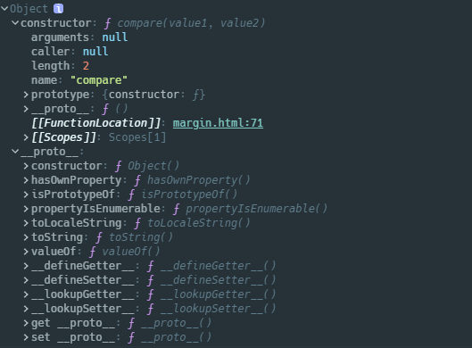

## 属性

### prototype

并不是每个函数都具有原型，唯一要注意的就是`Function.prototype`是一个函数，但是它没有原型；至于其他函数的原型指向`Function.prototype`



一个经常被讨论的话题是函数和对象的关系，也就是网上说的先有函数还是先有 Object，源于`instanceof`的结果

```javascript
Object instanceof Function; // true
Function instanceof Object; // true

Object instanceof Object; // true
Function instanceof Function; // true
```

个人感觉这种问题真的毫无意义，尤其网上还流传着一张 Hursh Jain 的原型链的图 —— [JavaScript Object Layout](http://www.mollypages.org/tutorials/js.mp)，讲道理看了那张图都有放弃学习 JS 的想法了，其实我觉得只要在了解原型链是通过对象的私有属性`[[prototype]]`构建起来的这一点，基本上都能解释上述等式成立的原因。

- 从`Object`角度考虑，当`Object`作为构造函数的时候，其必是`Function`类型的实例，所以`Object.__proto__ === Function.prototype`肯定是成立的；根据 ES 规范，`Object.prototype`的`[[prototype]]`是`null`
- 从函数角度看，根据 ES2020，`Function.prototype`是一个`built-in function object`，也就是函数，但是它不能作为构造函数使用`new`调用，其内部的`[[prototype]]`指向`Object.prototype`；同时，构造函数`Function`也具有`[[prototype]]`，指向`Function.prototype`，我们用一张图表示


- 从 JS 引擎角度看，JS 里的函数和对象都是 C++中类的实例，函数对应 JSFunction 这个类的实例，对象对应 JSObject 类的实例，而 JSFunction 继承自 JSObject，所以`Object`的属性和方法，在`Function`中也能访问到；从运行时的角度来看，原型链这张东西就是个莫须有的东西，它只不过是从人性化的角度方便我们理解 JS 的属性和方法的继承，让我们感受以下 JS 原来也是面向对象的，实际实现其实还是通过真正的面向对象的 C++的类继承来实现

### `__proto__`

由于每一个函数其实都是`Function`类型的实例，所以每一个函数都会具有`__proto__`属性，这个属性是指向`Function.prototype`的指针，以此从原型对象上继承一些属性和方法

### name

函数名

### length

表示函数定义时理论上必须传入的参数个数，这个和`arguments.length`是相反的，`arguments.length`表示调用函数实际接收的参数个数

- 不包括已经初始化默认值的参数
- 不包括剩余参数个数，仅包括第一个具有默认值之前的参数个数

```javascript
function f(a, b = 1, c) {}

console.log(f.length); // 1
```

### arguments

`arguments`是一个类数组对象，主要用来保存函数被调用时传进来的参数，也就是说从函数初始化创建直到函数被调用这个值一直是`null`；在函数被调用的时候，才会分配这个值。

**箭头函数里没有这个属性**。

```javascript
function foo() {
  console.log(arguments);
}
foo(1, 2);
```


`arguments`利用`Symbol.iterator`实现了迭代器，所以`arguments`支持`for...in`和`for...of`遍历

```javascript
function foo() {
  for (var index in arguments) {
    console.log(`${index}:${arguments[index]}`);
  }
}

foo('a', 'b', 'c'); //0:a   1:b   2:c

function foo() {
  for (var value of arguments) {
    console.log(value);
  }
}

foo('a', 'b', 'c'); //a   b   c
```

```JavaScript
// slice() 方法返回一个新的数组对象，可以用作原数组的浅拷贝
// call 使用调用者提供的 this 值和参数调用该函数的返回值
var args = Array.prototype.slice.call(arguments);
var args = [].slice.call(arguments);

// ES6
const args = Array.from(arguments);
const args = [...arguments];
```

此外 arguments 还具有两个属性：

- `length`：是当前函数实际接收的参数个数

- `callee`：**指向函数本身**，可以用这个属性实现递归函数，避免函数的引用变量被修改而导致递归出错

```javascript
function foo(num) {
  if (num < 1) {
    return 1;
  } else {
    return num * foo(num - 1);
  }
}

// 使用arguments.callee实现
function foo(num) {
  if (num < 1) {
    return 1;
  } else {
    return num * arguments.callee(num - 1);
  }
}
```

### caller

ES5 定义了`caller`属性，这个属性是调用当前函数的函数的引用，可以使用这个属性遍历函数的调用栈，在严格模式下访问这个属性同样会抛出异常：`TypeError`: 'caller', 'callee', and 'arguments' properties may not be accessed on strict mode functions or the arguments objects for calls to them.

### [[scope]]

如果在浏览器下，还会观察到函数的一个私有属性`[[scope]]`，它是函数保存的作用域链，这是实现闭包的基础。代码中是无法通过任何手段获取这个属性值的，但是可以在 devtool 里观察到。

## 原型方法

### Function.prototype.call

`call`使用给定的`this`和逗号`,`分隔的参数列表来调用一个函数，并返回函数执行后的结果

> 利用`call`实现借用构造函数继承

```javascript
function SuperType(arg){
	this.prop = arg;
}

function SubType(arg){
    SuperType.call(this,arg);
}

var obj = new SubType("test");				SubType {prop: "test"}
```

> `call`的强大之处就在于修改函数运行时的作用域，换句话说就是指定函数内部的`this`

```javascript
var color = 'red';
var o = { color: 'blue' };

function sayColor() {
  var color = 'green';
  console.log(this.color);
}

sayColor(); //"red"，当前在全局环境调用，所以this指向window
sayColor('yellow'); //"red"，当前在全局环境调用，所以this指向window
sayColor.call(o); //"blue"，因为指定this为o
```

### Function.prototype.apply

`apply`方法和`call`唯一的区别就是`apply`只有两个参数，且第二个参数必须是一个数组或者类数组对象（`arguments`），否则会抛出异常`TypeError`

```javascript
function SuperType(arg){
	this.prop = arg;
}

function SubType(arg){
    SuperType.apply(this, [arg]);
}

var obj = new SubType("test");				SubType {prop: "test"}
```

### Function.prototype.bind

`bind`使用指定的`this`和逗号`,`分隔的参数列表来创建一个新的绑定函数；在`bind`中后续指定的参数将作为新创建的函数的参数使用

> 基本用法

```javascript
function foo(y) {
  console.log(this.x + y);
}

var obj = { x: 1 };
var newFoo = foo.bind(obj);
newFoo(2); // 3
```

> `bind`的强大之处在于其实现函数柯里化的特性

函数柯里化是指创建一个已经指定好了一个或者多个参数的函数，其实现方法是利用闭包返回一个函数，事实上`bind`也是利用闭包返回一个设置好`this`的函数，所以我们可以利用`bind`实现函数柯里化

```javascript
function foo(y, z) {
  console.log(this.x + y + z);
}

//返回一个指定了参数 y 的函数
var newFoo = foo.bind({ x: 1 }, 2);

//传入的参数将赋值给 z
newFoo(3); // 6
```

### Object.prototype.toString

在上面的讨论中说到，根据 ES2020，`Function.prototype`是一个函数，其内部的`[[prototype]]`指向`Object.prototype`，所以每一个函数都能继承`Object.prototype`的属性和方法。如果对自定义的函数使用`toString()`方法时，返回的是函数定义的源码字符串，而对 JS 内置的函数使用时，返回的只是`[native code]`字符串

```javascript
console.log(Function.prototype); // ƒ () { [native code] }
```

### Object.prototype.valueOf

函数调用`valueOf`方法会返回自身

```javascript
function foo() {}

console.log(foo.valueOf() === foo); //true
```

