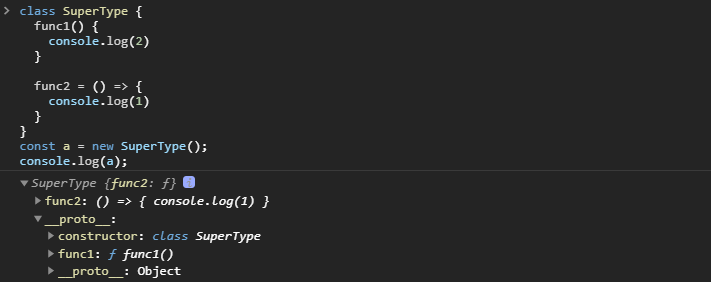

## 什么是函数

使用`function`关键字定义的代码块，可以立即执行也可以被调用执行。

JS 函数与其他面向对象语言的函数不同点是：

- 没有访问修饰符
- 没有参数类型和参数个数限制
- 没有返回类型限制，但一定有返回值，即使不写`return`或者写了`return;`这样的，也会返回`undefined`
- 没有重载但是同名函数也不会报错，按顺序同名函数后面的会覆盖前面的
- 声明提升

## 创建函数

要创建一个函数，可以使用多种形式，但是基本都遵循一个事实，函数名称仅仅是一个指针，指向当前定义的函数，可以将函数作为参传递，也可以在函数内返回另一个函数，利用这一点可以构建函数强大的特性——闭包

### 普通函数

使用`function`关键字和函数名称标识符定义，函数名不可省略，使用这种方式定义的函数存在声明提升的现象，在编译阶段函数声明会被提升到作用域的顶部，使得可以在函数定义之前就调用该函数

### 函数表达式

函数表达式有多种形式，从语法上来看，表达式的形式是将一个函数复制给一个变量的形式，那么在代码执行阶段这个步骤实际上会被拆成声明和初始化两部分，也就是表达式不存在声明提升的现象，必须要在定义后才能调用

> ```javascript
> let function_expression = function [name]([param1[, param2[, ..., paramN]]]) {
> statements
> };
> ```

#### 具名函数表达式

具名函数表达式中`function`后面的函数名称会作为**函数体的本地变量**，只能在函数体内使用

```javascript
var foo = function func() {
  console.log(func); //引用了当前函数本身
};

console.log(func); //ReferenceError:  func is not defined
```

#### 匿名函数表达式/拉姆达函数

省略了`function`关键字后面名称的函数都是匿名函数表达式，例如常见的回调函数形式，作为对象属性的方法等

```javascript
var func = function() {};

// 使用匿名函数表达式
setTimeout(function() {
  console.log('I waited 1 second!');
}, 1000);

var obj = {
  func: function() {
    //...
  },
};
```

#### 箭头函数表达式

箭头函数从 ES6 以后几乎称为了函数的替代，其本身有很多特殊性：

- 内部没有`arguments`参数
- 不能作为构造函数被`new`调用，所以内部也不能使用`new.target`，`new.target`属性可以检测函数或构造方法是否是通过`new`运算符被调用的，在通过`new`运算符被初始化的函数或构造方法中，`new.target`返回一个指向构造方法或函数的引用
- 内部不会绑定`this`变量，所以也不能被`call`，`apply`，`bind`方法调用，其内部`this`完全取决于定义时执行上下文，在全局环境下定义就是全局环境，在函数内定义就跟随外层函数的`this`
- 由于`this`指向取决于执行上下文，所以不应该将箭头函数用作声明对象方法使用，即使声明了它也始终无法通过`this`获取对象的其他属性
- 普通函数的声明存在声明提升的现象，在编译阶段会将函数的引用地址直接保存在当前作用域中，到了执行的时候会忽略普通函数的声明，直接从函数执行部分开始，然后到达函数体内部；而函数表达式的形式，声明的就是一个变量，不存在声明提升，在编译过后只会得到一个空指针的变量，在执行时去初始化然后再执行函数体；所以如果**在一个作用域中想要写代码的时候在上下文都能调用一个函数，就应该使用普通函数的形式，这在 React 的函数组件中应该是一个小技巧**
- 箭头函数和普通函数在`class`内部的表现形式是不一样的，以下面一段代码为例：

```javascript
class SuperType {
  func1() {
    console.log(2);
  }

  func2 = () => {
    console.log(1);
  };
}
```

经由 Babel 编译器模拟得到 ES5 的代码可以得到以下输出，从中可以得知在`class`内部声明的普通函数`func1`最终是定义在`SuperType.prototype`上，而箭头函数则是定义在`this`，也就是实例化对象上，可以使用`new`调用`class`观察一下输出结果

```javascript
function _defineProperties(target, props) {
  for (var i = 0; i < props.length; i++) {
    var descriptor = props[i];
    descriptor.enumerable = descriptor.enumerable || false;
    descriptor.configurable = true;
    if ('value' in descriptor) descriptor.writable = true;
    Object.defineProperty(target, descriptor.key, descriptor);
  }
}

function _createClass(Constructor, protoProps, staticProps) {
  if (protoProps) _defineProperties(Constructor.prototype, protoProps);
  if (staticProps) _defineProperties(Constructor, staticProps);
  return Constructor;
}

function _defineProperty(obj, key, value) {
  if (key in obj) {
    Object.defineProperty(obj, key, {
      value: value,
      enumerable: true,
      configurable: true,
      writable: true,
    });
  } else {
    obj[key] = value;
  }
  return obj;
}

var SuperType = /*#__PURE__*/ (function() {
  function SuperType() {
    _classCallCheck(this, SuperType);

    _defineProperty(this, 'func2', function() {
      console.log(1);
    });
  }

  _createClass(SuperType, [
    {
      key: 'func1',
      value: function func1() {
        console.log(2);
      },
    },
  ]);

  return SuperType;
})();
```



### IIFE

IIFE，Immediately Invoked Function Expression，立即执行函数也有多种形式，其实现原理是将函数声明转换成表达式，然后再在后面加上`()`表示调用

最常见的就是将要执行的函数整个放在`()`内转换成表达式，然后再使用小括号去调用它

```javascript
//可以带函数名称，不过是画蛇添足
(function foo() {
  var a = 3;
  console.log(a); // 3
})();

//省略函数名称
(function() {
  var a = 3;
  console.log(a); // 3
})();

//调用的括号内还可以传递参数
(function(a) {
  console.log(a); // 3
})(3);

//同样支持call，apply等方式调用
(function(a) {
  console.log(a); // 3
}.call(window));
```

但是，括号有个缺点，由于 JS 在语法上允许一行代码的结尾不加分号，如果上一行代码的结尾不加分号，那么紧接其后的 IIFE 包裹的括号会被认为是上一行代码的函数调用，内部的函数体则变成了调用函数的参数，这样就导致代码执行变得混乱；所以在一些不推荐结尾加分号的代码规范中，则会在 IIFE 开头加一些一元运算符（+，-，!），使得函数体变成表达式，常见大致有以下这些

```javascript
(function() {
  var a;
  //code
})();

!(function() {})();

void (function() {
  var a;
  //code
})();

//或者干脆直接使用表达式
var foo = (function() {})();
```

**立即执行函数过去最常见的用法是模拟块级作用域**，在 IIFE 函数体内的部分相当于一个块级作用域，IIFE 在自动执行完以后，函数体内定义的任何变量都将被销毁

```javascript
function foo(count) {
  (function() {
    //这里相当于块级作用域
    for (var i = 0; i < count; i++) {}
  })();

  console.log(i); //Uncaught ReferenceError: i is not defined
}

// 或者直接将循环变量封闭起来
function foo(count) {
  for (var i = 0; i < count; i++) {
    //这里相当于块级作用域
    (function() {})();
  }

  console.log(i); //Uncaught ReferenceError: i is not defined
}
```

使用 IIFE 模拟块级作用域的行为经常被用在全局作用域中，于是我们经常看到一些开源的 JS 库函数使用 IIFE 来编写整个 JS 文件，这样在这个代码文件中创建的任何变量和函数都是全局安全的，不会在通过`script`引入其它 JS 文件中产生命名冲突，变量覆盖，函数覆盖等问题

```javascript
;(function() {
	//编写代码
}()
```

### 使用 Function 构造函数

构造函数`Function`可以接收函数参数和函数体内的实现，相当于创建一个`Function`类型的实例；以这种方式创建的函数，具有很大的局限性：

- 函数本身不使用词法作用域，当执行函数时，它们只能访问自己的局部变量以及全局变量，它们不能作为闭包而访问上层函数内的变量
- 同时不推荐这种方式定义函数，其会解析两次代码，首先要将字符串解析成函数体，然后在执行的过程中再去解析函数体，并没每次调用都会重复上述两次解析，性能问题严重

```javascript
var x = 10;

function createFunction1() {
  var x = 20;
  return new Function('return x;');
}

var f1 = createFunction1();
console.log(f1()); // 10,只能访问到全局变量
```

## 函数参数的传递

ES 规定所有函数的参数都是**值传递**

> 值传递的两种方式

- 基础类型（`undefined`，`null`，`bool`，`number`，`string`，Symbol）直接把值复制一份给其他变量，这样操作的就是改变其他变量而不会影响原来的值

```javascript
function addTen(num) {
  num += 10;
  return num;
}

var count = 10;
console.log(addTen(count)); //20
console.log(count); //10
```

- 传递引用类型的参数，也会将存储在变量对象中的值复制一份给新变量分配的空间中，只不过**这个值的副本是一个指针**，而这个指针指向在堆中的一个对象；从函数属性角度看，就是将参数复制给了函数的`arguments`属性

```javascript
function setName(obj) {
  obj.name = '张三';

  //这里使用了赋值运算符，将一个新的对象赋值给了旧的变量名称，实际原来引用的对象并不会受影									//响，之后的操作都是基于新的对象
  obj = new Object();
  obj.name = '李四';
}

var person = new Object();
setName(person);
console.log(person.name); // 张三
```

## 函数的调用

一个函数到底有多少种调用手段呢？

### 普通调用

这个应该是最简单的方式，直接在函数名后面加括号`()`，始终记住如果函数没有返回值，则返回`undefined`

### 构造函数

new 的作用都知道，可以使用`new`的函数只有普通函数形式和类：


- 其中`Symbol()`构造函数，抛出`TypeError`异常
- `Function.prototype`，`Function.prototype`是一个函数，但是不能用`new`调用哦，抛出`TypeError`异常

### 作为对象的方法

也就是将对象的属性指向一个函数

### call/apply

`call`传参数列表，`apply`传参数数组；都返回调用后的结果

### Reflect.apply/Function.prototype.apply

> ES6 - `Reflect.apply(fn, thisArgument, argumentsList)`
>
> ES3 - `Function.prototype.apply(fn, thisArgument, argumentsList)`

传进去函数，`this`以及参数调用这个函数，返回调用后的结果

- 如果`this`不传，或者指定`null`或`undefined`，那么就相当于单独调用函数，内部`this`指向全局对象
- 如果`this`传进去的是基本类型的值，会进行装箱操作，将其转换成包装类型的对象

### Reflect.construct

> ES6 - `Reflect.construct(fn, argumentsList[, newTarget])`

这个方法的作用是调用函数创建一个新对象，如果指定第三个参数的话，还会将新对象的`constructor`属性设置为指定的对象

- fn：将被作为构造函数调用的函数，如果不能作为构造函数会`TypeError`
- argumentsList：类数组`arguments`或者数组；不能指定`null`或者`undefined`，会`TypeError`，如果需要传递三个参数而又不需要指定这个，可以传空数组`[]`
- newTarget：如果传了，将作为新对象的原型对象的`constructor`属性，如果不能作为构造函数会`TypeError`

```javascript
var obj = new Object();
//也就是
var obj = Reflect.construct(Object, []);
```

### obj.constructor

大多数对象的原型对象上都具有`constructor`这个属性，指向类型的构造函数，如果要调用构造函数，在类型不明确的情况下也可以使用这个方法，但是`constructor`在引用类型的对象身上，可以被轻易修改，所在在使用的时候还是要特别小心

### 借助对象调用

在学习模拟实现`call`的过程中，学到了这种方式，在对象上新建一个属性，指向这个被调用的函数，调用完了再删掉 🤔

```javascript
Function.prototype.call =
  Function.prototype && Function.prototype.call
    ? Function.prototype.call
    : function() {
        if (typeof this !== 'function') {
          throw new Error();
        }

        //获取调用call的函数
        var fn = this;
        //获取this
        var _this = arguments[0];
        //获取剩余参数
        var otherArgs = Array.prototype.slice.call(arguments, 1);

        //通过this调用函数，这将指定函数内部的this为传进去的this
        //这也就是借助了中间属性调用的方式，本质上还是归于对象的方法调用
        _this.fn = fn;
        var result = _this.fn(...otherArgs);

        delete _this.fn;
        return result;
      };
```

