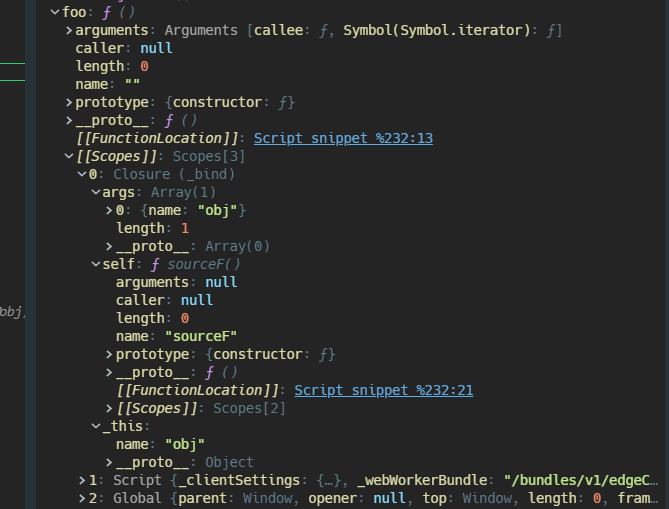

## 高阶函数

高阶函数（或者高级函数）一般是接收函数作为参数，并返回一个新函数；高阶函数的部分概念非常切合函数式编程的思维，个人认为函数式编程本身是一个非常难的话题，有些概念初次接触除了感觉写法上很绕很难理解外，更多的是在代码中不知道怎么去应用。

### Function.prototype.call/apply

我把`call`和`apply`这种被动调用函数的方法也归在这里。`call`和`apply`基本用法差不多，指定函数内部的`this`和参数，然后调用函数并返回结果，唯一的区别是`call`的参数传递是逗号分隔的列表形式，而`apply`得参数只有两个，第二个参数是数组。对于传进去的`this`有以下几种情况

- 如果这两个方法不指定参数，或者第一个参数是`null`或者`undefined`，那么就相当于单独调用函数，非严格模式函数内部`this`就是 window；
- 如果传进去的是基本类型的值，会进行装箱操作，将其转换成包装类型的对象
- 如果传进去的对象，那是极好的，函数内部`this`将指向这个对象

```javascript
function func(a, b) {
  console.log(this.prop + a + b);
}

var prop = 3;

func.call(null, 1, 2); // 6
func.apply(null, [1, 2]); // 6

var obj = {
  prop: 4,
};

func.call(obj, 1, 2); // 7
```

模拟实现 call 的关键在于使用`this`获取调用`call`的函数

```javascript
Function.prototype.call =
  Function.prototype && Function.prototype.call
    ? Function.prototype.call
    : function(_this) {
        if (typeof this !== 'function') {
          throw new Error();
        }

        //获取调用call的函数
        var fn = this;
        //获取this
        var context = _this ? Object(_this) : window;
        //获取剩余参数
        var otherArgs = Array.prototype.slice.call(arguments, 1);
        //通过this调用函数，这将指定函数内部的this为传进去的this
        //这也就是借助了中间属性调用的方式，本质上还是归于对象的方法调用
        context.fn = fn;
        var result = context.fn(...otherArgs);

        delete _this.fn;
        return result;
      };
```

### Function.prototype.bind

`bind`方法是 ES5 引入的方法，其基本用法是传入一个`this`值，返回一个指定内部`this`的新函数，新函数和原函数的参数全都保持一致；对于返回的新函数**只能通过`new`将其作为构造函数调用才能去改变内部的`this`的指向**；但是一般情况下不需要这么做，因为我们更多的是需要使用返回的函数本身就够了

```javascript
var obj = {
  prop: 4,
};

function func(prop) {
  this.prop = prop;
}

var newFunc = func.bind(obj, 'bind_arg');
```

简单实现 bind 只需要几步就行，主要是`bind`核心就是返回一个新函数，这就是闭包啊

- 使用`this`获取调用`bind`的函数，在此之前先判断是否是函数
- 通过`arguments`对象获取传递的`this`值，也就是`bind`的第一个参数；并提出剩余参数，提出剩余参数的`Array.prototype.slice.call(arguments)`这句算是常见的代码了，只要涉及到模拟函数实现的基本都会用到
- 最后返回一个新函数，内部使用`call/apply`来调用原函数，并传递参数

```javascript
function _bind() {
  if (typeof this !== 'function') {
    throw new Error('call bind must be a function');
  }

  //获取原函数
  var self = this;
  //获取this
  var _this = arguments[0];
  //获取剩余参数
  var args = Array.prototype.slice.call(arguments, 1);
  //返回新函数
  return function() {
    //获取调用新函数传进来的参数，要和传到bind里的参数进行合并
    var newArgs = Array.prototype.slice.call(arguments);
    self.apply(_this, args.concat(newArgs));
  };
}

Function.prototype._bind = Function.prototype.bind
  ? Function.prototype.bind
  : _bind;
```

如果使用`new`去调用模拟的 bind 创建的函数会发生什么呢？只会得到一个空对象，这要从闭包说起，模拟的 bind 返回的闭包始终保存着 bind 时候的三个参数`self`，`_this`，`args`；当发生 new 调用的时候，new 也会为闭包指定 this 为新创建的对象，但是闭包内部完全封闭了`this`，无论外界传什么进去，始终用的是作用域链保存的`_this`，所以更无法将外界传进去的`this`传到原函数手上用于构造新对象

```javascript
function sourceF() {
  this.name = 'source';
}

var obj = {
  name: 'obj',
};

var foo = sourceF._bind(obj);
foo(); //此时内部this指向obj，所以obj.name = "obj"

//如果通过new去调用
var o = new foo();
console.log(o); // {}
```



首先复习一下`new`做了什么，`new`会将函数内部的`this`指向新创建的对象，只要明白`new`的实现，基本上可以照着改一下上面返回的函数，先来回顾一下`new`的实现

- 创建一个新对象
- 将新对象的原型对象设置成构造函数的原型对象
- 使用新创建的对象**调用构造函数**，这样就能在构造函数内部使用`this`初始化对象
- 返回新对象

```javascript
function create(){
  var obj = {};
  //获取构造函数
  var Constructor = arguments[0];
  //设置对象的原型对象，也就是__proto__
  Object.setPrototypeOf(obj, Constructor.prototype);
  //获取传递到构造函数的参数
  var args = Array.prototype.slice.call(arguments,1);
  //初始化实例属性
  Constructor.apply(obj, args);

  return obj；
}
```

明白了模拟实现的`bind`没有将`new`调用时的`this`传递到原函数，这样就容易支持`new`了

- 在闭包内部检测`this`是否是当前函数的实例，如果是的话，就表明是通过`new`调用的，然后将新对象传递给原函数，否则就使用作用域链中保存的历史`_this`
- 怎么在匿名函数内部获取自身呢，使用`arguments.callee`
- 怎么继承原型上的属性和方法呢，通过`__proto__`呀，将`this`的`__proto__`指向原函数就行了

```javascript
function _bind() {
  if (typeof this !== 'function') {
    throw new Error('call bind must be a function');
  }

  //获取原函数
  var self = this;
  //获取this
  var _this = arguments[0];
  //获取剩余参数
  var args = Array.prototype.slice.call(arguments, 1);
  //返回新函数
  return function() {
    //获取调用新函数传进来的参数，要和传到bind里的参数进行合并
    var newArgs = Array.prototype.slice.call(arguments);
    //获取当前函数的引用
    var fn = arguments.callee;
    if (this instanceof fn) {
      _this = this;
      //设置this的原型对象为原构造函数的原型，也就是覆盖了本身new的操作
      Object.setPrototypeOf(this, self.prototype);
    }

    self.apply(_this, args.concat(newArgs));
  };
}
```

#### 应用场景

限定函数内部`this`指向是最基础的用法，在将函数作为参数传递时，尤其要注意`this`指向的问题。

```javascript
var obj = {
  text: 'obj',
  fn: function() {
    return this.text;
  },
};

function foo(func) {
  return func(); // 丢失了this，无法通过func获取到obj.text
}

foo(obj.fn); // undefined
```

如果使用 React 进行开发，往 DOM 里传回调函数的时候，必须要使用`bind`（也可以使用箭头函数），否则回调函数内部的`this`就会丢失绑定到组件实例上。

```javascript
class Foo extends Component {
  handleClick() {
    console.log('Click happened');
  }

  render() {
    return <button onClick={this.handleClick.bind(this)}>beng</button>;
  }
}
```

## partial function

partial function，也被称为偏函数，不完全函数，是一种函数变换的技巧，**根据已有的函数创建一个指定了部分参数的函数**。

一个最常见的用法是对库函数进行二次封装，例如 jQuery 的 ajax，一般项目内使用 ajax 的时候，肯定会根据 ajax 封装自己的 URL 请求方法，比如指定同步还是异步，指定后台接口地址等，但是我们封装的这个函数局限性太大，它只能用来给当前项目用，所以就可以实现一个通用的创建偏函数的方法，每个项目要封装 ajax 的时候就可以基于这个函数进行生成封装后的函数。

```javascript
var _slice = Array.prototype.slice;

function partial(fn) {
  if (typeof fn !== 'function') {
    throw new Error();
  }
  if (arguments.length > 1) {
    //获取已经指定的参数
    var args = _slice.call(arguments, 1);
    //返回处理剩余参数的新函数
    return function() {
      var innerArgs = _slice.call(arguments);
      return fn.apply(this, args.concat(innerArgs));
    };
  }
  //如果没有指定参数，直接返回原函数
  return fn;
}
```

```javascript
//test
function f(a, b, c) {
  return a + b + c;
}

var partialF = partial(f, 1, 2);
partialF(3); // 6
```

函数`bind`其实是偏函数的一种体现，`bind`内后续指定的参数也将作为内定的参数保存下来，实际还是闭包的作用

```javascript
function f(a, b, c) {
  return a + b + c;
}

var newF = f.bind(null, 1, 2);
newF(3); // 6
```

## 函数柯里化

function currying，函数柯里化也属于函数式编程的手段之一，深受 JS 高级程序设计中文版翻译的坑，中文版翻译省略掉了最关键的括号内的字，而书中又尚未介绍偏函数的概念，导致我很长时间无法区分偏函数和柯里化。


函数柯里化是自动实现偏函数的应用，偏函数只负责创建**一个**新的函数，它不会判断初始指定的参数有多少个，没指定的部分会全部返回，在新函数的下一次调用就会用上，并返回新函数的调用结果，而柯里化的函数则会判断已经传入的参数的个数，如果给定的参数少于其正确数目的参数，则返回处理其余参数的函数；当函数获得最终参数时，就调用它返回结果。

```javascript
//test
function f(a, b, c) {
  return a + b + c;
}

var partialF = partial(f, 1);
partialF(2)(3); // Uncaught TypeError: partialF(...) is not a function
```

在偏函数的基础上加上参数个数判断和递归就实现了函数柯里化，涉及其他方面的还有：

- 函数形式参数和实际传入参数的判断，也就是`func.length`和`arguments.length`的区别

```javascript
var _slice = Array.prototype.slice;

//偏函数
function partial(fn) {
  if (typeof fn !== 'function') {
    throw new Error();
  }

  if (arguments.length > 1) {
    var args = _slice.call(arguments, 1);
    return function() {
      var innerArgs = _slice.call(arguments);
      return fn.apply(this, args.concat(innerArgs));
    };
  }

  return fn;
}

// 柯里化
function curry(fn, arity = fn.length) {
  if (typeof fn !== 'function') {
    throw new Error();
  }

  return function() {
    if (arguments.length < arity) {
      return curry(partial(fn, ...arguments), arity - arguments.length);
      //这里也可以使用bind
      return curry(fn.bind(this, ...arguments), arity - arguments.length);
    } else {
      return fn.apply(this, _slice.call(arguments));
    }
  };
}
```

```javascript
//test
function f(a, b, c) {
  return a + b + c;
}

var add = curry(f);
add(1)(2)(3); // 6
add(1, 2)(3); // 6
add(1, 2, 3); // 6
```

最后 lodash 提供了实现偏函数和柯里化的通用方法，可以利用 lodash

> [`_.curry(func, [arity=func.length])`](https://lodash.com/docs/4.17.15#curry)

## Lazy Function Definition

Lazy Function Definition， JS 高级程序设计中称为惰性载入函数，最早是 2007 年的一个老外提出来的概念，这是当时的博客——[Lazy Function Definition](http://peter.michaux.ca/articles/lazy-function-definition-pattern)，基本实现方式是在当前函数的内部依据判断性条件`if`对函数本身的定义重写，使得函数在调用一次后下次再被调用就会使用重写后的定义，以判断`Object.setPrototypeOf`是否存在为例

```javascript
function _getPrototypeOf(o) {
  _getPrototypeOf = Object.setPrototypeOf
    ? Object.getPrototypeOf
    : function _getPrototypeOf(o) {
        return o.__proto__ || Object.getPrototypeOf(o);
      };
  return _getPrototypeOf(o);
}
```

老外当时的背景是 2007 年，当时 V8 第一个版本都还没出来，所以这个概念当时提出的目的是为了解决调用函数时避免内部多次判断的情况，但是提出的同时，博客底下争议也很多，大致分为两个方向，一是在当时的 JS 引擎来说，惰性载入函数的写法使用了闭包，但是当时的引擎基本都不会对闭包进行优化，闭包里使用不到的变量等不会被回收；二是从编写 JS 库的角度来说，重写函数是个相当不安全的行为，以下面代码为例，如果重写的函数被以其它标识符的形式调用，那么重写的意义就没了，反而因为使用闭包带来不必要的开销。关于这个问题，知乎上也有我的提问——[请问 JS 现在还有必要都用惰性载入函数去定义吗](https://www.zhihu.com/question/407564885/answer/1346205328)

```javascript
var foo = function() {
  var t = new Date();
  foo = function() {
    return t;
  };
  return foo();
};

var a = foo;
a(); //a和foo没有关系，a始终保有原函数的定义，重写的函数引用地址只是给了foo
```

评论里还学到了一波使用模块化之间的区别，哈哈哈哈，贺老师真的是相当严谨，2007 年的博客都翻出来了。根据贺老师最后的建议，如果在进行这种兼容性方法判断的时候，应该使用 ESmodule 的思路

```javascript
export const getPrototypeOf = o =>
  Object.getPrototypeOf(o)
    ? Object.getPrototypeOf(o)
    : function() {
        return o.__proto__;
      };
```