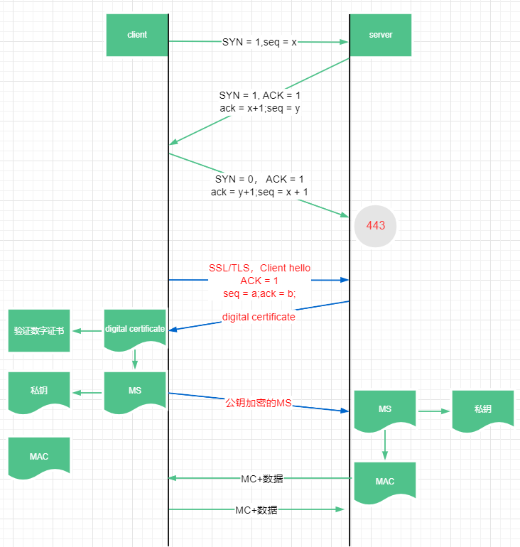

### 什么是HTTPS

> HTTPS = HTTP + 加密传输 + 身份验证 + 数据完整性保护

HTTPS，是 HTTP Secure，或者 HTTP over SSL，HTTP over TLS 的缩写，HTTPS 被称为安全的 HTTP 协议。

HTTP 协议对应的 URL 为`http://`，而 HTTPS 对应的 URL 协议名称为`https://`，使用不同的协议名称，使得浏览器能够区分处理：

- 如果 URL 是`http://`开头的，那么 TCP 会建立从浏览器端口到服务器的`80`端口的通道，包括三次握手然后发送和获取 HTTP 报文等过程；
- 如果 URL 是`https://`开头的，TCP 会建立从浏览器端口到服务器的`443`端口的通道，此时情况就是在 TCP 正式传输数据之前新进行 SSL 握手，此过程包括双方身份验证，获取数据传输的加密密钥等，SSL 握手之后就是跟正常的 HTTP 一样了，只不过传输的是加密后的报文。

### SSL 和 TSL

- SSL：Secure Socket Layer，安全套接字层
- TLS：Transport Layer Security，运输层安全协议

SSL 协议是网景公司在 1994 年开发的安全协议，广泛应用于基于万维网的各种网络应用。SSL 作用在 HTTP 和运输层之间，相当于为 TCP 传输建立一个安全的通道，以提供安全可靠的传输服务。1995 年，网景公司及那个 SSL 转交给了 IETF（Internet Engineering Task Force，Internet 工程任务组，就是专门指定一些互联网协议标准的组织），希望把 SSL 标准化，IETF 在 SSL/3.0 的基础上设计出了 TLS（Transport Layer Security）协议，为所有基于 TCP 的网络应用提供安全数据传输服务，也就是说 IETF 实际上是将 SSL/TLS 划分到了运输层，作为**运输层的安全协议**。

运输层之上的应用层协议 HTTP，通过结合 SSL/TLS 协议，实现了 HTTPS 的功能。因此 HTTPS 并非一项标准协议，而 SSL/TLS 也并非只能用于 HTTP，只要是基于 TCP 协议传输的应用都能基于 SSL/TLS 实现安全传输数据，例如 IMAP 也是使用 SSL/TLS 作为数据加密传输。

### SSL 握手

> 参考
>
> https://www.cisco.com/c/en/us/support/docs/security-vpn/secure-socket-layer-ssl/116181-technote-product-00.html
>
> https://tools.ietf.org/html/rfc6101

在使用 TCP 传输 HTTP 之前需要进行一次 SSL 握手，并且 SSL 握手阶段使用的也是 TCP 协议进行传输，SSL 握手是一件十分复杂的事情，尤其是根据证书里的公钥生成用于双方传输数据的公钥的过程，这里使用简化版本来看，以浏览器请求服务器为例：

- 浏览器请求服务器，先通过”三次握手“建立一个 TCP 连接；
- 浏览器向服务器发送一个`client hello`的报文，包含客户端支持的加密算法；
- 服务器在收到`client hello`之后，会回应一个`server hello`的报文，包含服务端选择一种对称加密算法，一种公钥加密算法和一种 MAC 算法；
- 随后服务端还会紧接着发送自己的证书`Server Certificate`（大部分情况下如此）；
- 然后服务端发送一个`Server Hello Done`的报文，表示自己事都干完了，发完以后等待客户端的响应；
- 收到`Server Hello Done`之后，客户端才开始忙活，验证服务器是否根据需要提供了有效的证书，这个过程客户端首先会分离证书明文和数字签名，然后使用 CA 机构提供的公钥解密数字签名，然后根据明文进行 hash 运算得到一个新的数字签名，和证书的数字签名进行对比，判断证书真实性；当证书验证通过后，客户端会检查服务器`server hello`选择的加密算法；
- 然后客户端会使用协议指定的密钥导出函数生成一个**主密钥（Master Secret）**，使用证书中的公钥加密发送给服务端，然后客户端还会使用密钥生成函数将这个 MS 一分为二得到一个加密密钥和一个 MAC 密钥（MAC，Message Authentication Code，报文鉴别码）；
- 服务端收到公钥加密的报文以后，用自己的私钥解密得到 MS，然后也将这个 MS 一分为二得到一个加密密钥和一个 MAC 密钥；
- 之后双方在发送数据时**使用加密密钥加密数据，使用 MAC 密钥做数字签名**；对方在收到后对 MAC 进行校验，验证数据完整性；然后使用加密密钥进行解密，这里的加密密钥也用于解密，属于对称加密的方式，所以 HTTPS 使用的是混合加密方式，既结合了公开密钥加密方式获取 MAC，然而实际上使用对称加密去加密报文。

