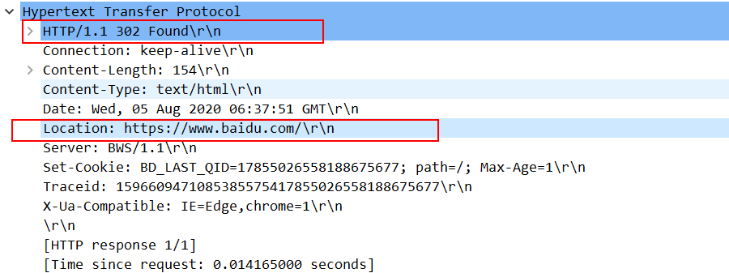

### [状态码](https://developer.mozilla.org/zh-CN/docs/Web/HTTP/Status)

HTTP 响应状态码通常是`100`到`600`之间的整数，用来表示当前请求服务器的结果。

| code | 
状态文本
           | 含义                                                         |
| ---- | ----------------------------- | ------------------------------------------------------------ |
| 200  | OK                            | 请求成功                                                     |
| 201  | Created                       | 表示请求已经被成功处理，并且成功新增了数据，在返回的响应中还应该包含新创建的数据 |
| 204  | No Content                    | 表示请求已经被成功处理，经常用作更新数据的返回响应，也就是`PUT`请求 |
| 301  | Moved Permanently             | 永久重定向，表示服务器上的文件被移动到了新的位置，服务器会通过`location`响应头返回新的 URL 地址；浏览器在接收到重定向响应的时候，会采用该响应提供的新的 URL ，并立即进行加载 |
| 302  | Found                         | 请求的资源存在，但是不在当前请求地址的服务器上，服务器需要同时使用`Location`来发送该资源在的服务器地址，浏览器收到后将重定向到该 URL 上 |
| 303  | See Other                     | 如果使用`POST`方法用于创建新数据时，新提交的数据已经存在，则服务端会使用`303`将请求重定向到存在的资源 URL 上去；重定向到新地址时，客户端必须使用 GET 方法请求新地址 |
| 304  | Not Modified                  | 如果客户端发送了一个带条件的 GET 请求且该请求已被允许，而文档的内容（自上次访问以来或者根据请求的条件）并没有改变，则服务器应当返回这个状态码。304 响应禁止包含消息体。 |
| 307  | Temporary Redirect            | 请求的资源存在，但是不在当前请求地址的服务器上，服务器需要同时使用`Location`来发送该资源在的服务器地址，浏览器收到后将重定向到该 URL 上 |
| 400  | Bad Request                   | 请求参数有误或者当前请求无法被服务器理解                     |
| 401  | Unauthorized                  | 服务器需要客户端提供认证信息来验证用户身份，服务器会同时发送[`WWW-Authenticate`](https://developer.mozilla.org/zh-CN/docs/Web/HTTP/Headers/WWW-Authenticate)首部，来提供如何进行验证的信息 |
| 403  | Forbidden                     | 服务器收到请求但是拒绝授权访问                               |
| 404  | Not Found                     | 请求资源不存在，例如图片在服务器上被删除                     |
| 407  | Proxy Authentication Required | 服务器需要客户端向代理服务器提供身份凭证信息，这个状态码会和`Proxy-Authenticate`响应首部一起发送到客户端，而客户端需要使用`Proxy-Authorization`请求首部发送身份凭据到代理服务器 |
| 500  | Internal Server Error         | 服务器错误，一般是服务端代码执行报错                         |
| 502  | Bad Gateway                   | 一般是服务器地址存在但是无法连通                             |
| 504  | Gateway Timeout               | 当服务器作为网关，不能及时得到响应时返回此错误代码           |
| 505  | HTTP Version Not Supported    | 服务器不支持请求报文中使用的 HTTP 协议版本                   |

### 重定向状态码的区别

> `302` - Found

`302`原始描述短语是**Moved Temporarily**，也就是临时性移动，使用`302`状态码表示当前请求的资源存在，但是不在当前请求的 URL 的位置，服务端会同时使用`Location`头部来传递一个临时跳转的 URL 给浏览器。有以下几点需要注意：

- 浏览器不会缓存`302`响应，除非服务端特别指定了缓存头部指示；
- 浏览重定向请求`Location`指向的`URL`，搜索引擎并不会对该资源的链接进行更新，也就是不会触发 SEO

- 一些旧客户端会错误地将重定向时的请求方法转换为`GET`；而新的浏览器应该不会有这种问题，也就是定向后的请求方法是不可预测的；
- 推荐仅在原始请求为`GET`或`HEAD`时使用该响应状态码

> `307` - Temporary Redirect

`307`突然一看好像和`302`原始含义差不多，临时重定向，而`307`和`302`最大的区别就是`307`能保证请求方法在重定向请求时不会发生变化，原始请求中的请求方法和消息主体都会在重定向请求中被重用。如果原始请求使用`GET`或`HEAD`，那么他们就没有区别。

> `303` - See Other

`303`应该是使用相对更多的状态码，`303`的一大特点是重定向的请求必须使用`GET`。所以`303`的特点如下：

- 如果`POST`请求创建的新数据已经存在，服务端应该返回`303`状态码，以及`Location`头部字段提供已存在数据的 URL，浏览器可以通过`GET`来重定向请求已存在的数据
- 重定向的页面使用`GET`请求可以被缓存

> `301` - Move Permanently

`301`含义就是永久重定向，服务端必须返回`Location`字段来指明资源新的 URL；`301`状态码多使用在`HTTP`向`HTTPS`迁移网站地址的过程中。