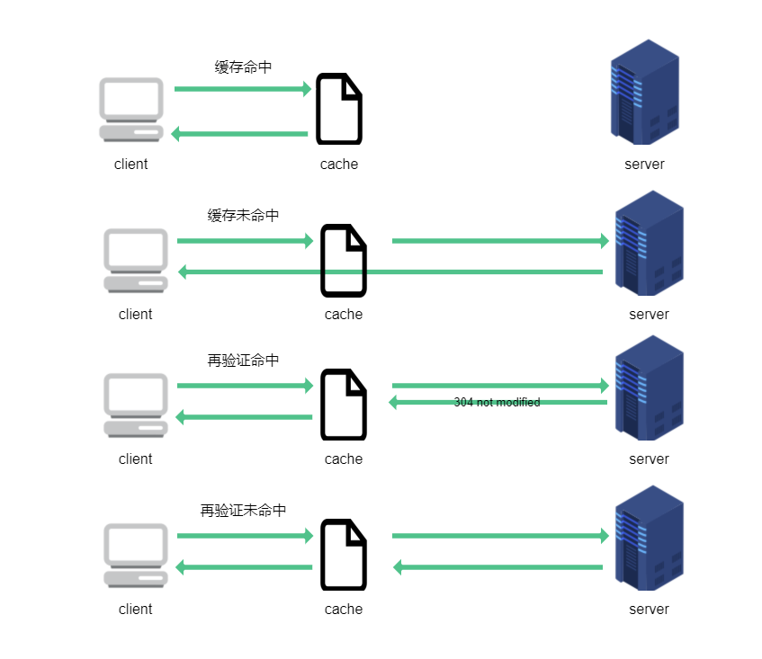
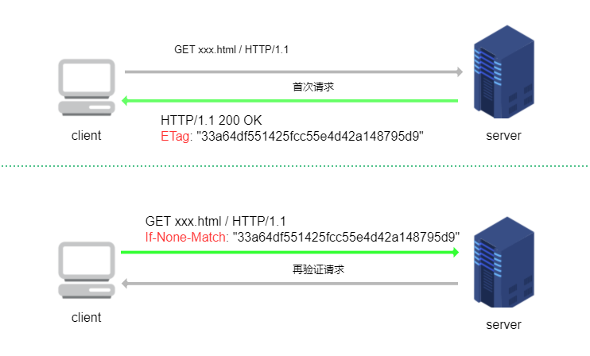

## 什么是缓存

缓存就是把原始资源保存一份副本下来，避免对原始资源的直接请求。HTTP 缓存的实现方式有很多，一般来说可以分为私有缓存和公有代理缓存。

### 私有缓存

私有缓存也就是针对用户单独设置的缓存。最为常见的就是 web 浏览器内建的私有缓存，大多数浏览器都会将常用文档缓存到个人电脑的硬盘或者内存中。

### 公有代理缓存

公有缓存，或者叫共享代理缓存，一般是通过特殊的缓存代理服务器去实现，也就是缓存内容也是保存在 web 上的，这些缓存内容可以用于响应不同的客户端请求。这种情况最为常见的是 CDN 的架设。


## 缓存的好处

### 节省网络流量

这里不光说的是节省服务器的流量，还能节省移动端用户的流量。

### 缓解服务器带宽压力

服务器都有带宽限制，每秒从服务器流出多少比特都是有最高限制的，例如`10Mbps`带宽的服务器，换算成数据量就是`1.25Mbyte`，也就是每秒最大也只能从该服务器请求`1.25Mbyte`大小的数据。如果存在缓存代理服务器，就可以不受原始服务器带宽的限制，直接从缓存服务器以更快速度获取资源。

无论是带宽还是流量都需要经济成本，所以用好缓存是可以有效节约网站成本的手段。

### 缓解瞬间拥塞

以网络突发事件为例，例如微博热门事件，可能导致全国几百万人同时请求微博服务器，造成瞬间拥塞。

### 缩短距离时延

服务器和客户端之间的地理距离也可能成为增加网络请求时延的因素，例如从北京请求美国纽约的服务器资源，这种距离还不能以直线距离来计算，物理层的媒介限制也是因素之一，例如有的网络段使用 CAT5 传输，有的网络段用 CAT6 传输；所以尽量缩短客户端和原始服务器的距离时延也是降低网络延迟的有效手段。

## 缓存命中

### 缓存命中

如果存在已有缓存可以为到达缓存的请求提供服务，就被称为**缓存命中**；如果没有缓存副本可用，或者缓存过期等，到达缓存的请求会被转发到原始服务器，这被称为**缓存未命中**。

### 再验证命中

原始服务器的内容可能发生变化，因此要经常检查缓存，看看保存的副本是否是最新的版本。这些新鲜度检测被称为**HTTP 再验证**（revalidation）。

向原始服务器发送再验证请求后，如果原始资源没有任何变化，原始资源服务器会返回`304 Not Modified`响应。确认缓存依然有效的时候，就会使用缓存，这种被称为**再验证命中或者缓慢命中**。如果原始资源已经被修改了，那么原始服务器会返回新的资源和`200`响应。而如果原始资源已经被删除了，服务器就会返回`404 not found`响应。



### 命中率

由缓存提供服务的请求所占的比例被称为缓存命中率，有时也称为文档命中率。缓存命中率在`0%`到`100%`之间浮动。命中率很难预测，对于中等规模的 web 缓存来说，`40%`的命中率是很合理的。

还有一种方式是计算缓存提供的字节在传输所有字节中所占的比例，这种被称为字节命中率。

提高文档命中率可以降低整体时延；提高字节命中率可以有效节省带宽。

## 缓存控制

### Expires

在 HTTP/1.0 协议中提供控制缓存的 HTTP 头部字段主要就是`Expires:<HTTP-date>`和`Pragma: no-cache`。

- `Expires:<HTTP-date>`指定一个 [HTTP-date](https://tools.ietf.org/html/rfc7231#section-7.1.1) 形式的日期，表示在此日期之前的缓存都是新鲜有效的，客户端不需要发送再验证请求就可以直接使用缓存
- `Pragma: no-cache`：表示在客户端每次请求到达缓存以后，必须进行再验证请求确认缓存有效以后才能使用缓存，否则不能直接使用缓存

在 HTTP/1.1 协议中指定的`Cache-Control`首部字段完全替代了`Expires`和`Pragma`，可以做到更多控制缓存的行为。

### cache-control

服务器支持以下类型的参数作为`Cache-Control`的响应参数，注意以下部分只是应用于服务器返回响应的参数，还有部分客户端可以使用的`Cache-Control`的参数未列出，见 —— [MDN - Cache-Control](https://developer.mozilla.org/zh-CN/docs/Web/HTTP/Headers/Cache-Control)

> ```
> Cache-control: must-revalidate
> Cache-control: no-cache
> Cache-control: no-store
> Cache-control: no-transform
> Cache-control: public
> Cache-control: private
> Cache-control: proxy-revalidate
> Cache-Control: max-age=<seconds>
> Cache-control: s-maxage=<seconds>
> ```

#### 可缓存性

- `public`：表明响应资源可以被任何对象缓存，例如缓存代理服务器，客户端浏览器等；并且即使资源有关联的 HTTP 身份验证，也可以进行缓存，例如`POST`请求获取的资源
- `private`：表明响应资源只能作为私有缓存，也就是只能被浏览器或者客户端单独缓存，不能被缓存代理服务器缓存
- `no-cache`：指定`no-cache`响应首部的资源，在客户端每次请求到达缓存以后，必须进行再验证请求确认缓存有效以后才能使用缓存，否则不能直接使用缓存
- `no-store`：不能缓存
- `no-transform`：中间代理服务器不能对资源进行任何修改

#### 到期时间

- `max-age=<seconds>`：一个以秒为单位的非负整数，指定缓存的有效时间，也就是缓存的保质期；**如果指定`max-age=0`，那么就相当于指定`Cache-control:no-cache`；**由于`Expires`指定的日期会受到计算机系统时间准确性的影响，所以推荐使用`Cache-Control: max-age=<seconds>`来控制缓存有效时间，并且如果指定了`Cache-Control: max-age=<seconds>`，那么`Expires` 头会被忽略
- `s-maxage=<seconds>`：一个以秒为单位的非负整数，优先级高于`max-age`或`Expires`指定的时间，但是仅能用在共享代理缓存中，私有缓存会忽略这个响应头

#### 验证策略

- `must-revalidate`：如果响应资源的`cache-control`中带有`must-revalidate`属性，表示如果缓存过期，在客户端向原始服务器再验证请求之前，缓存都不能提供给后续请求。这个与`no-cache`的区别是，`no-cache`每次都要进行再验证请求，不管缓存有没有过期，而`must-revalidate`只在过期的缓存上才强制其进行再验证请求
- `proxy-revalidate`：与`must-revalidate`类似的用法，但是仅用在共享代理缓存上
- `immutable`：`immutable`还未写入正式的 HTTP 协议中，指定`cache-control`为`immutable`的响应资源表示基本不会发生改变，即使用户刷新手动刷新页面，客户端也不应该进行再验证请求。

这些响应头参数可以通过**逗号`,`以及一个空格**作为分隔来组合在一起使用，返回给客户端，例如：

```
cache-control: public, max-age=31536000
cache-control: max-age=315360000, public, immutable
```

来自谷歌开发者文档里的一张图很好的解释了如何选择配置服务器的`cache-control`响应参数，翻译过来大致是这样：


### 试探性过期

如果响应中没有包含`Cache-Control:max-age`，也没有包含`Expires`，可以通过计算一个试探性地最大使用期作为缓存的过期时间。

## 缓存验证

缓存到期或者基于某些缓存策略时需要向原始服务器发出**再验证请求**，再验证请求一般是条件`GET`请求，即通过`GET`方法和特殊的 HTTP 条件请求首部字段在一起来实现。HTTP 协议一共定义了五种条件请求首部字段，它们都是以`If-`作为开头来命名的，对于缓存验证来说，其中最有用的是`If-Modified-Since`和`If-None-Match`字段。

再验证方法分为两种，一种是使用日期比较进行比较；另一种是通过实体标签 ETag 进行验证。

### 时间比较

时间比较的方法通过`If-Modified-Since`和`Last-Modified`首部配合实现。`Last-Modified`表示服务器认定的最后修改资源的时间，通常会在原始服务器发送资源的时候携带上；当客户端需要对缓存的资源进行再验证的时候，将上一次收到资源的`Last-Modified`指定的时间通过`If-Modified-Since`再发送回服务器，服务器根据这个时间和自己认定的最后修改资源的日期进行比较，如果两者不一致就认为资源发生了修改，就返回新资源和`200`状态码响应；而如果对比发现资源未修改，则只返回`304`响应，不携带资源。

通过时间比较的方案无法做到精确性，有一种情况是开发者对网站资源的覆盖性发布也会导致服务器认为资源发生了修改，实际上覆盖性发布的时候，文件内容可能并未发生变化；这种验证方案比`ETag`精确度要低，通常作为备用的验证方案。


### 实体标签比较

`ETag`，entity tag，实体标签通常是根据内容生成的 hash 值，或者是最后修改时间戳的 hash 值。实体标签对比的方式通过`If-None-Match`和`ETag`首部字段来实现。

服务器通常会根据发送的资源生成一个唯一标识当前资源的`ETag` hash 值，当客户端进行再验证请求时，将资源的`ETag` 通过`If-None-Match`请求头字段再发送回服务器，服务器根据资源重新生成 hash 值，和客户端的发送的`If-None-Match`里的`ETag`值进行比较，如果相同就表明资源未曾修改，则返回`304`响应；如果修改了就发送新资源，以及`200`响应和新的`ETag`值。



如果在`ETag`或者`If-None-Match`参数中使用了`W/`的前缀，表示这是一个弱验证器，弱验证器允许对一些内容进行修改，也就是原始内容发生修改的情况下，`ETag`不一定变化，这样的缓存即使和原始内容不一致也允许使用缓存。

```
ETag: W/"v2.6"
If-None-Match: W/"v2.6"
```

### 如何选择

如果服务器返回响应首部包含`ETag`，HTTP/1.1 的客户端就必须使用`ETag`验证的方法，如果服务器只返回`Last-Modified`响应头部，那么客户端就可以发送`If-Modified-Since`首部，让服务器通过时间对比的验证方法判断缓存是否有效。从优先级的角度上看，如果客户端同时发送`If-Modified-Since`和`If-None-Match`首部，`If-Modified-Since`会被忽略掉，除非服务器不支持`If-None-Match`，不过这是不可能的，主流服务器基本都支持识别`If-None-Match`。

## 浏览器的缓存机制

浏览器内建了实现 HTTP 缓存的机制， 从 URL 请求开始浏览器就会查找内建的缓存内容，浏览器对于缓存的保存有不同的策略，打开浏览器的 devtool 下的 network 面板就可以观察每条请求来自于什么地方的缓存。


### disk cache

disk cache 就是直接存在计算机硬盘上的缓存数据，这个比较好理解。

### memory cache

memory cache 是保存在内存 RAM 中缓存数据，memory cache 与 disk cache 最明显的区别 memory cache 的读取速度远远超过 disk cache 的读取速度，所以 memory cache 中加载网页资源的速度会更快。其次 memory cache 是在网页关了以后就自动擦除的，并不是持久化的缓存方案。

至于 disk cache 和 memory cache 如何选择的问题，知乎上有个讨论 —— [浏览器是根据什么决定「from disk cache」与「from memory cache」](https://www.zhihu.com/question/64201378)，这里有一个常见的会应用 memory cache 的例子就是使用 base64 的图片，一般来说大的 JS 文件都会使用 disk cache 来进行缓存做持久化处理。

### CacheStorage

如果一条资源响应提示为`from ServiceWorker`，那么这条响应就是利用 Service Worker 结合`CacheStorage`实现的缓存资源。

简单来说，`CacheStorage`提供了使用 JS 操作缓存的接口，Service Worker 内部也实现了`CacheStorage`接口，所以利用 JS 注册 Service Worker 就能控制网页具体需要缓存哪些资源。上文介绍的控制缓存的方法通过服务端配置实现，有了 Service Worker 和 `CacheStorage`提供的 JS API，意味着可以更方便的开发离线网页。具体使用 MDN 提供的有一个 demo —— [service worker test demo](https://github.com/mdn/sw-test/)

## 强制刷新缓存

### 客户端请求

web 浏览器的刷新按钮（`ctrl+R`），可以强制对浏览器中缓存内容进行再验证，客户端会发起包含`Cache-Control`头部字段的`GET`请求，注意此时的`Cache-Control`用作请求头字段了。

如果存在中间缓存代理服务器，这些再验证请求只会发送到缓存代理服务器而不是原始服务器，所以`ctrl+R`并不会总能请求到新资源。

当`Cache-Control`包含在请求头字段中时，可以设置以下参数：

> ```
> Cache-Control: max-age=<seconds>
> Cache-Control: max-stale[=<seconds>]
> Cache-Control: min-fresh=<seconds>
> Cache-control: no-cache
> Cache-control: no-store
> Cache-control: no-transform
> Cache-control: only-if-cached
> ```

- `max-stale[=<seconds>]`：用于向缓存代理服务器发出请求，表示客户端愿意接受一个已经过期的缓存资源；可以单独设置，也可以在后面指定一个非负整数的秒数，表示缓存过期的时间不能超过该时间
- `min-fresh=<seconds>`：用于向缓存代理服务器发出请求，表示客户端希望获取一个能在指定的秒数内保持其最新状态的响应
- `max-age=<seconds>`：用于向缓存代理服务器发出请求，表示客户端希望接受一个缓存时间没有超过指定时间的缓存资源
- `no-cache`：表示客户端要求代理服务器去再次进行再验证请求原始服务器，否则将不会接受缓存
- `no-store`：表示客户端希望缓存代理服务器立即删除缓存的资源
- `only-if-cached`：表示只有在缓存代理服务器的缓存中存在副本的时候，才允许其使用副本响应请求

而（`ctrl+F5`）强制刷新，则是直接绕过所有缓存，从原始服务器获取资源，此时可以从 devtool 的 network 面板观察到所有资源都不会来自于缓存请求。

### hash 文件名

使用 hash 命名资源文件名实际上是对`ETag`的拓展，利用现代化的前端开发构建工具，例如 webpack 的`filename`的`[contenthash]`机制，可以产生针对模块内容编码的 hash 值，当这些模块内容发生变化时，其对应的资源文件名也会发生变化，浏览器根据请求的`URL`在本地缓存中找不到对应项就会去请求原始服务器的资源，达到强制刷新缓存的目的。

对于项目中一些不常修改的第三方库，可以使用一个长期缓存机制，将其`Cache-Control: max-age=<seconds>`设置为一个超大的值，例如一年：`Cache-Control: max-age=31104000`，则每次加载网页这些资源文件会直接从浏览器的本地缓存读取，从而加快网页加载速度。

## HTTP 首部

与缓存有关的 HTTP 首部如下

### Date

> ```
> Date: HTTP-date
> ```
>
> eg：`date: Wed, 16 Sep 2020 00:48:33 GMT`
>
> 响应头

`date`响应首部后面接 [HTTP-date](https://tools.ietf.org/html/rfc7231#section-7.1.1) 形式的一个日期，表示 HTTP 报文创建的时间，也就是**资源第一次离开原始服务器的时间**。服务器应当在首次响应时返回`date`首部，后续客户端可以通过检测`date`首部的日期，和当前本地计算机时间进行对比，来判断该资源是否来自于缓存。这是检测请求是否命中缓存的一种方式。

### Age

> ```
> Age: <delta-seconds>
> ```
>
> eg：`age: 2200795`
>
> 响应头

`Age`响应首部后接一个非负整数，包含资源在缓存代理服务器中存储的时间，资源经过缓存代理服务器的时候，HTTP/1.1 协议要求每台设备都要将缓存的存储时间累加到`Age`中。

### Expires

> ```
> Expires: HTTP-date
> ```
>
> eg：`Expires: Wed, 16 Sep 2020 00:48:33 GMT`
>
> 响应头

`Expires`响应头部直接指定缓存过期的时间。如果在`Cache-Control`响应头设置了 `max-age`或者 `s-max-age` 指令，那么 `Expires` 头会被忽略。

### Cache-Control

上文已详细介绍

### If-Modified-Since

> ```
> If-Modified-Since: HTTP-date
> ```
>
> eg：`If-Modified-Since: Wed, 16 Sep 2020 00:48:33 GMT`
>
> 请求头

`If-Modified-Since`请求指定一个日期，通常是服务器上次响应头指定的`Last-Modified`指定的日期。服务器只在给定的日期时间之后对内容**进行过修改**的情况下才会将资源返回和`200`响应，如果未发生更改，则返回`304`响应。

### If-Unmodified-Since

> ```
> If-Unmodified-Since: HTTP-date
> ```
>
> eg：`If-Unmodified-Since: Wed, 16 Sep 2020 00:48:33 GMT`
>
> 请求头

`If-Unmodified-Since`表示只有当资源在指定的时间之后**没有进行过修改**的情况下，服务器才会返回请求的资源；如果所请求的资源在指定的时间之后发生了修改，那么会返回 [`412`](https://developer.mozilla.org/zh-CN/docs/Web/HTTP/Status/412) (Precondition Failed) 错误

### If-None-Match

> ```
> If-None-Match: <etag_value>
> If-None-Match: <etag_value>, <etag_value>, …
> If-None-Match: *
> ```
>
> 请求头

`If-None-Match`指定`ETag`值，有两种用法：

- 如上文介绍的，用于缓存的再验证请求，当服务器资源的`ETag`和`If-None-Match`指定的`ETag`**没有任何相匹配**的时候，服务器就返回原始资源和`200`响应，如果存在匹配项就返回`304`响应
- 如果指定`If-None-Match: *`，对于`PUT`请求方法来说，用来生成事先并不知道是否存在的文件，可以确保先前并没有进行过类似的上传操作，防止之前操作数据的丢失。

### If-Match

> ```
> If-Match: <etag_value>
> If-Match: <etag_value>, <etag_value>, …
> If-Match: *
> ```
>
> 请求头

`If-Match`和`If-None-Match`正好相反，`If-Match`是如果服务器**存在匹配**`ETag`的资源就返回资源和`200`响应，如果不存在就返回`416`响应。

### Vary

> ```
> Vary: <header-name>, <header-name>, ...
> Vary: *
> ```
>
> 响应头

根据 RFC7234 规范的定义，`Vary`用于指定特定的 HTTP 首部，让缓存代理服务器对后续请求的首部和原始请求的首部进行对比，只有匹配的情况下才使用缓存。

如果指定`Vary: *`则表示用不匹配，也就永远不使用缓存代理服务器的缓存。

> When a cache receives a request that can be satisfied by a stored response that has a `Vary` header field,it MUST NOT use that response unless **all of the selecting header fields nominated by the `Vary` header field match in both the original request (i.e., that associated with the stored response), and the presented request.**

`Vary`主要应用于缓存代理服务器能够精准的返回文档，要理解`Vary`需要了解 HTTP 的[内容协商机制](https://developer.mozilla.org/zh-CN/docs/Web/HTTP/Content_negotiation)。

一份特定的文件可以称为一项资源，例如 Web 网页中的 HTML 页面，CSS，JS，图片等都属于资源，这些资源需要根据 URL 从服务器请求下载下来，但是仅仅依靠简单的 URL 请求无法让服务器决定返回资源的类型，例如有的客户端浏览器支持 gzip 压缩，有的客户端不支持 gzip 支持的是 deflate 压缩；所以这就需要客户端和服务器进行协商确定最终响应的资源类型。

客户端可以指定特定的 HTTP 首部，例如[`Accept`](https://developer.mozilla.org/zh-CN/docs/Web/HTTP/Headers/Accept)、[`Accept-Charset`](https://developer.mozilla.org/zh-CN/docs/Web/HTTP/Headers/Accept-Charset)、 [`Accept-Encoding`](https://developer.mozilla.org/zh-CN/docs/Web/HTTP/Headers/Accept-Encoding)、[`Accept-Language`](https://developer.mozilla.org/zh-CN/docs/Web/HTTP/Headers/Accept-Language)等来告诉浏览器需要接受什么格式，什么语言等类型的资源。这种协商机制被称为服务端驱动型内容协商或者主动协商，就是客户端主动告诉服务器我想要什么。服务器在收到这些请求首部字段以后，也会使用相应的响应首部，它们之间存在着对应关系。

| 请求头字段        | 含义                                                 | 响应头字段         |
| ----------------- | ---------------------------------------------------- | ------------------ |
| `Accept`          | 希望接收的媒体资源的 MIME 类型                       | `Content-Type`     |
| `Accept-Language` | 告知服务器发送何种语言                               | `Content-Language` |
| `Accept-Charset`  | 接受何种形式的字符编码                               | `Content-Type`     |
| `Accept-Encoding` | 告知服务器采用何种压缩方式                           | `Content-Encoding` |
| `User-Agent`      | 接受何种用户代理类型的资源，例如 PC 端和移动端的区别 | `Vary:User-Agent`  |

而缓存代理服务器属于客户端和原始服务器的中间环节，对于请求内容取决于内容协商的资源来说，缓存服务器同样需要根据内容协商来决定是否缓存资源以及正确响应缓存资源。以资源编码为例，如果缓存服务器在之前的客户端请求中只缓存了`gzip`格式的资源，但是后续其中之一的客户端请求只能接受`br`压缩的资源，请求的 URL 是一致的，但是这时候缓存服务器就不能直接将缓存的`gzip`资源返回。也就是说 `Vary` 字段用于列出一个响应字段列表，告诉缓存服务器遇到同一个 URL 对应着不同版本文档的情况时，如何缓存和筛选合适的版本。

MDN 上的图可以很好的解释`Vary`对于缓存代理服务器的作用：

- Client 1 是一个客户端，它第一次请求缓存代理服务器的资源，此时还没有缓存，于是缓存代理服务器向原始服务器发出请求，原始服务器响应请求，并附带`Vary:Content-Encoding`的响应头，此时缓存代理服务器会缓存下来 gzip 格式的资源；
- 然后 Client 2 是另一个客户端，它也请求相同的资源，但是它希望服务器发送给它`br`格式编码的资源，由于先前缓存的是 gzip 格式的资源，根据`Vary`指定，上一次请求和当前请求的`Content-Encoding`必须匹配才能使用缓存，这里不匹配，还是向原始服务器请求；
- 然后 Client 3 也请求了相同 URL 的资源，他也请求`br`格式编码的资源，但是经过上一次 Client 2 请求以后，缓存代理服务器已经缓存了`br`格式编码的资源，所以就不再去原始服务器请求了
- 所以`Vary`能够提高缓存代理服务器发送缓存的精准性


#### 缓存服务器的 BUG

对于某些存在 BUG 的缓存服务器可能会忽略`Content-Encoding`响应头，导致缓存资源存在问题，这时候的通用解决方式是直接使用`Vary: Accept-Encoding`来告知缓存服务器将客户端支持的编码格式的文件全部缓存一份下来，这样在客户端再次请求的时候就可以正确命中缓存了。