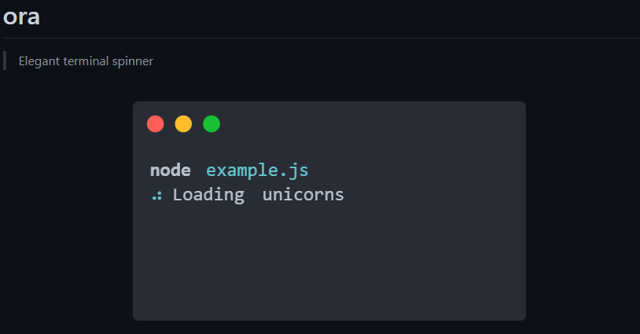

## CLI 工具

### [pnpm](https://pnpm.io/zh/installation)

飞速的 npm 依赖管理工具。

### [please-upgrade-node](https://github.com/typicode/please-upgrade-node)

根据 NodeJS CLI 工具需要的 NodeJS 版本提示用户更新版本，用于执行 CLI 前检测本地的 NodeJS 版本。

### [shelljs](https://github.com/shelljs/shelljs)

跨平台执行 NodeJS 命令。

### [ts-node](https://github.com/TypeStrong/ts-node)

直接在 NodeJS 中执行 TypeScript。

### [esno](https://github.com/antfu/esno)

使用 esbuild 编译的在 NodeJS 中执行 TypeScript，比`ts-node`更快

### [cross-env](https://github.com/kentcdodds/cross-env)

跨平台设置 NodeJS 环境变量的工具，因为 windows 不支持在命令行直接像`NODE_ENV=production`这样设置环境变量。

### [detect-port](https://github.com/node-modules/detect-port)

可用端口检测工具

### [portfinder](https://github.com/http-party/node-portfinder)

可用端口检测工具

### [nrm](https://github.com/Pana/nrm)

管理 npm 源的命令行工具。

## 文件操作

### [node-glob](https://github.com/isaacs/node-glob)

`glob`匹配模式工具

### [chokidar](https://github.com/paulmillr/chokidar)

跨平台监听文件系统工具

### [read-pkg](https://github.com/sindresorhus/read-pkg)

读取`package.json`并转换成对象

### [write-pkg](https://github.com/sindresorhus/write-pkg)

将对象序列化并写入`package.json`

### [fs-extra](https://github.com/jprichardson/node-fs-extra)

比 Nodejs 的`fs`模块好用的文件操作库

### [deepmerge](https://github.com/TehShrike/deepmerge)

深度合并两个或多个对象的可枚举属性

## terminal可视化工具

### [commander](https://github.com/tj/commander.js/)

解析`process.argv`，获取 CLI 命令。

### [Inquirer](https://github.com/SBoudrias/Inquirer.js/)

交互式命令行用户界面，可执行选项等。

### [chalk](https://github.com/chalk/chalk)

### [ora](https://github.com/sindresorhus/ora)

### [boxen](https://github.com/sindresorhus/boxen)

### [cli-progress](https://github.com/npkgz/cli-progress)

### [indent-string](https://github.com/sindresorhus/indent-string)

在 CLI 中输出定数目空格的工具，方便 log 信息的缩进控制。

### [leven](https://github.com/sindresorhus/leven)

计算字符串编辑距离算法，可用于在 NodeJS 中感知用户输入错误的命令进行提示

## Open API

### [npms.io API documentation](https://api-docs.npms.io/)

npm 官方指定的查询 npm package 公共接口，支持指定`scope`等关键词。