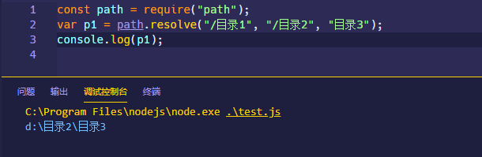
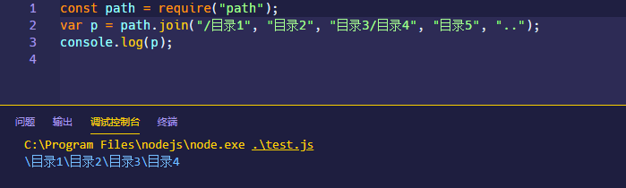

## 绝对路径

absolute path，绝对路径，表示从根目录指定文件或目录的位置，绝对路径的表示形式**总是以斜杠`/`开头，指向当前所在目录所在的系统盘的根目录**。

## 相对路径

relative path，相对路径，表示从当前目录出发寻找的同级目录或者上层目录，通常以`./`或者`.//`开头

- `.`，表示当前目录
- `..`，表示上层目录
- 如果前面不加任何点，仍然表示当前目录

```shell
D://
├─ other.js
├─ web
	├─ dist
    ├─ favicon.ico
    ├─ index.html
    └─ static
      ├─ css
      │	├─ main.css
      ├─ js
      │	├─ main.js
      └─ images
        └─ picture.jpg
```

以这样一个目录结构为例：

在 html 页面存在以下路径表示形式：

- `<script src="/other.js"></script>`
- `<link rel="icon" href="favicon.ico">`或者`<link rel="icon" href="./favicon.ico">`

- `<link rel="stylesheet" href="static/css/main.css">`
- ``

在 CSS 中存在以下图片引入路径：

- `background-image: url("../images/picture.jpg")`

## node 中的路径解析规则

### \_\_dirname

`__dirname`就表示当前使用`__dirname`的文件的目录路径，例如`webpack.config.js`中使用`__dirname`，那就表示`webpack.config.js`所在的目录。

### path.resolve

`path.resolve([...paths])`从右往左逐个解析每个路径片段，后面的每个 `path` 会被使用平台特定的分隔符追加到前面一个`path`的后面，直到构造出绝对路径就停止解析；如果在处理完所有给定的 `path` 片段之后还未生成绝对路径，则会使用当前工作目录。

例如：`path.resolve('/目录1', '/目录2', '目录3')`首先解析`目录3`，无法构造出绝对路径，然后追加到`/目录2`后面，由于`/目录2`是绝对路径，所以解析停止，返回`/目录2/目录3`。



### path.join

`path.join([...paths])`将所有给定的 `path` 片段使用平台特定的分隔符作为定界符连接到一起，最后返回合成的路径字符串。

对于 windows 平台，分隔符就是反斜杠`\`，在 linux 平台分隔符是斜杠`/`



`path.join`只负责连接路径并规范化（去除路径结尾的`.`或者`/`这样的分隔符），`path.resolve`构造成绝对路径后就会停止解析剩余的路径。


### require.resolve

`require.resolve(request[, options])`必须传入一个模块路径参数去解析，其它还可以传入用于解析模块的路径地址，如果存在，则使用这些路径而不是默认的解析路径。这些路径中的每一个都用作模块解析算法的起点，这意味着从该位置开始检查 `node_modules` 层次结构。

最终返回一个完整的解析后的规范的文件路径名。


`require.resolve`内部会使用`require()`的查询机制，所以理解`require.resolve`首先要理解`require()`的机制。

nodejs 的文档解释了[`require()`的规则](http://nodejs.cn/api/modules.html#modules_all_together)，大致如下：

- 在 nodejs 中每个文件都是一个模块，首先不可以使用`require()` 载入具有 `.mjs` 扩展名的文件

- 如果传递给`require()`的是一个 nodejs 的核心模块名称，例如`require("http")`，则直接返回该模块
- 如果传递给`require()`的不是核心模块名，也没有以`/`，`./`，`../`开头，那么 nodejs 会从当前模块所在目录的`node_modules`中查找模块，**如果找不到就往上层父目录继续查找**。例如在`'/home/ry/projects/foo.js'`中使用`require("bar.js")`，那么查找顺序如下：

  - `/home/ry/projects/node_modules/bar.js`
  - `/home/ry/node_modules/bar.js`
  - `/home/node_modules/bar.js`
  - `/node_modules/bar.js`

- 如果按确切的文件名没有找到模块，则 Node.js 会尝试带上 `.js`、 `.json` 或 `.node` 拓展名再加载
- 如果是以`/`，`./`，`../`开头的模块名称，那么会按照路径查找规则

  - `/`指向根目录绝对路径，例如在`d://home/ry/projects/foo.js'`中调用`require("bar.js")`，那么会查找`d://bar.js`是否存在
  - `./`相对于调用`require()`方法的模块自身的路径而言，例如在`'/home/ry/projects/foo.js'`中使用`require("./bar.js")`，则是在`'/home/ry/projects`中查找`bar.js`，也就是`foo.js`和`bar.js`是在同一目录下
  - `../`则是查找上层的目录

- 找不到模块就抛出`MODULE_NOT_FOUND`的错误

### process.cwd

`process.cwd`是当前 NodeJS 命令工作的绝对路径，和`__dirname`的主要区别是`__dirname`是指向脚本命令所在文件的文件路径，随着程序执行，可能会发生变化，而`process.cwd`则不会在 NodeJS 程序执行过程中发生改变，也就是控制台当前显示的目录路径。

例如下面的文件结构：

```shell
-src
	-lib
		-index.js
	-index.js
```

当在`C:\\node\\temp`目录下执行`node src/index.js`时，`__dirname`就是`src`的绝对路径，而`process.cwd`则是

`C:\\node\\temp`；如果`src/index.js`中执行`lib/index.js`，其内部`__dirname`则是`lib`的绝对路径。
