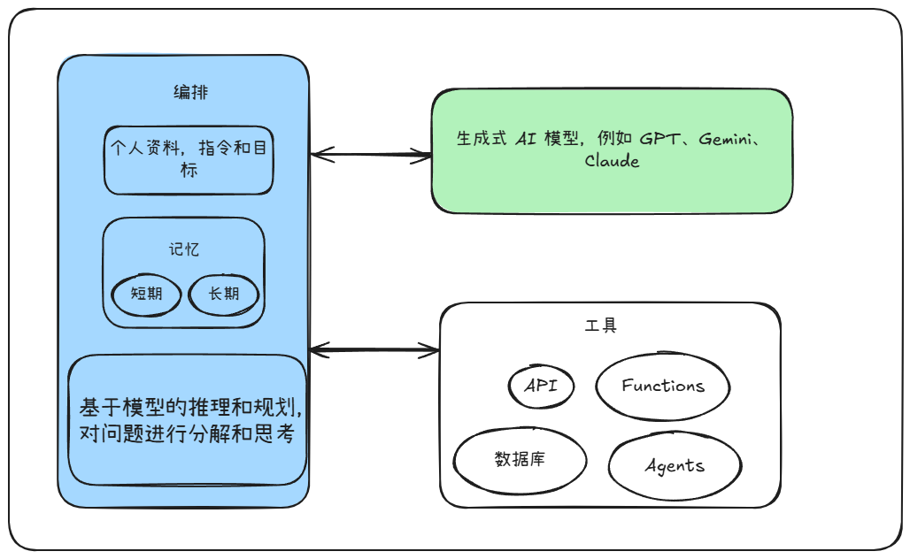

# 生成式 AI 术语表

本术语表定义了生成式人工智能 (AI) 术语。

## 生成式 AI

生成式 AI 是一种 AI，它超越了传统 AI 对分类和预测的关注。 传统 AI 模型会从现有数据中学习，以对信息进行分类或根据历史模式预测未来的结果。生成式 AI 使用基础模型来生成文本、图片、音频或视频等新内容。这种新内容是通过学习训练数据的潜在模式和风格生成的，这使得模型能够创建类似于其训练所依据的数据的输出。

## 基础模型

基础模型是使用大量数据训练的大型强大模型，这些数据通常涵盖多种模态，例如文本、图片、视频和音频。这些模型使用统计建模来预测对提示的可能回答，并生成新内容。它们会从训练数据中学习模式，例如用于文本生成的语言模式和用于图片生成的扩散技术。

## 大语言模型 (LLM)

大语言模型 (LLM，large language model) 是一种以文本为驱动的基础模型，经过大量数据训练。LLM 用于执行自然语言处理 (NLP) 任务，例如文本生成、机器翻译、文本摘要和问答。LLM 一词有时可与基础模型互换使用。不过，LLM 基于文本，而基础模型可以接受多种模态的输入(包括文本、图片、音频和视频)，并基于这些输入进行训练。

## 模型参数

模型参数是模型用于确定如何处理输入数据以及如何生成输出的内部变量。在训练期间，您可以调整模型参数(例如权重和偏差)来优化模型性能。在推理过程中，您可以通过各种提示参数来影响模型的输出，但这些参数不会直接更改已学习的模型参数。

以下是一些提示参数：

- `temperature`：温度会改变生成回答期间选择 token 的随机性，从而影响输出的创造性和可预测性。temperature 的值范围为 0 到 1。较低的温度(更接近 0)会产生更具确定性和可预测性的结果。较高的温度(更接近 1)会生成更多样化、更具创造性的文本，但结果的连贯性可能会较差。
- `topP`：Top-P 可更改模型对输出 token 进行抽样和选择的方式。Top-P 会选择累计概率超过阈值(即 p)的最小 token 集，然后从该分布中进行抽样。topP 的值范围为 0 到 1。例如，如果 token A、B 和 C 的概率分别为 0.3、0.2 和 0.1，并且 topP 值为 0.5，则模型将选择 A 或 B 作为下一个 token(通过温度确定)，并会排除 C 作为候选 token。
- `topK`：Top-K 可更改模型对输出 token 进行抽样和选择的方式。Top-K 会选择统计概率最高的 token 来生成回答。topK 的值表示模型在生成回答之前将从中选择的 token 数量，范围为 1 到 40。例如，如果 token A、B、C 和 D 的概率分别为 0.6、0.5、0.2 和 0.1，并且 top-K 的值为 3，则模型将选择 A、B 或 C 作为下一个 token(通过温度确定)，并会排除 D 作为候选 token。
- `maxOutputTokens`：maxOutputTokens 设置会更改回答中可生成的 token 数量上限。较低的值会生成较短的回答，较高的值会生成可能较长的回答。

## 提示

提示是一条自然语言请求，会发送到生成式 AI 模型，让模型给出回答。根据模型的不同，提示可以包含文本、图片、视频、音频、文档和其他模态，甚至包含多模态(多模态提示)。

有效的提示包含内容和结构。内容提供了所有相关任务信息，例如说明、示例和背景信息。 结构通过组织(包括排序、标签和分隔符)确保高效解析。根据您需要的输出，您可能需要考虑其他组件。

## 提示工程

提示工程是指创建提示并访问模型回答以获得所需回答的迭代过程。编写结构化良好的提示是确保从语言模型获得准确优质回答的重要环节。

以下是一些可用于改进回答的常见技巧：

- 零样本提示：提供不含任何示例的提示，并依赖于模型的现有知识。
- 单样本提示：在提示中提供单个示例，以引导模型的回答。
- 少样本提示：在提示中提供多个示例，以展示您所需的模式或任务。

向模型提供示例有助于控制模型回答的各个方面，例如格式、措辞、范围和总体模式。有效的少样本提示会将清晰的指令与具体且多样的示例相结合。请务必进行实验，以确定最佳示例数量；示例太少可能无法提供足够的指导，但示例太多可能会导致模型过度拟合示例，从而无法很好地泛化。

## Function Call 函数调用

函数调用是一项功能，可将大语言模型 (LLM) 连接到 API 和函数等外部工具，以增强 LLM 的回答。借助此功能，LLM 不仅可以利用静态知识，还可以通过数据库、客户关系管理系统和文档库等实时信息和服务来增强回答。例如查天气，需要调用特定的天气查询 API 才能获取结果，而不是 LLM 自己编结果。

如需使用函数调用，您需要向模型提供一组函数。然后，当您提示模型时，模型可以根据您的请求选择并调用函数。模型会分析提示，然后生成结构化数据，用于指定要调用的函数和参数值。结构化数据输出会调用函数，然后将结果返回给模型。模型会将结果纳入推理过程，以生成回答。通过此流程，模型可以访问和利用超出其内部知识的信息，从而执行需要外部数据或处理的任务。

函数调用是 AI 代理架构中的一个关键组件。函数调用为模型提供了一种结构化方式，用于指定要使用的工具以及输入格式，有助于确保与外部系统进行精确的交互。

## RAG 检索增强生成

检索增强生成 (RAG，Retrieval-augmented generation) 是一种技术，模型在回答问题前，**先从外部知识库里检索相关资料**，再结合这些内容生成回答，来提高大语言模型 (LLM) 输出的质量和准确性。

RAG 可解决 LLM 的局限性，例如事实不准确、无法访问最新信息或专业信息，以及无法引用来源。通过提供对从可信知识库或文档中检索到的信息的访问权限(包括模型未接受过训练的数据、专有数据或特定于用户的敏感数据)，RAG 使 LLM 能够生成更可靠且与上下文相关的回答。

当使用 RAG 的模型收到您的提示时，RAG 流程会完成以下阶段：

1. 检索：搜索与提示相关的数据。
2. 增强：将检索到的数据附加到提示中。
3. 生成：
   1. 指示 LLM 根据增强的提示创建摘要或回答。
   2. 将响应返回。

## ReAct

ReAct 是一种**推理与行动结合的框架**（Reasoning + Acting），也就是模型不仅思考（Reason），还能采取行动（Act），两者交替进行。

| 项目          | 是否涉及外部工具 | 是否有推理步骤 | 是否使用外部知识 | 主要用途                            |
| ------------- | ---------------- | -------------- | ---------------- | ----------------------------------- |
| Function Call | ✅ 是             | ❌ 否           | ❌ 否             | 执行具体操作（查天气、调用 API 等） |
| RAG           | ✅ 是（检索）     | ⚙️ 半推理       | ✅ 是             | 基于资料生成答案                    |
| ReAct         | ✅ 是             | ✅ 是           | ⚙️ 可能有         | 多步思考与行动决策                  |

## embedding 嵌入

嵌入是数据的数值表示形式，例如文本、图片或视频，用于捕捉不同输入之间的关系。嵌入是在模型的训练阶段生成的，方法是将文本、图片和视频转换为浮点数数组(称为向量)。 嵌入通常会降低数据维度，这有助于提高计算效率并处理大型数据集。这种降维对于训练和部署复杂模型至关重要。

机器学习 (ML) 模型要求数据采用它们可以处理的格式。嵌入通过将数据映射到连续的向量空间来满足这一要求，其中距离越近表示数据点的含义越相似。借助嵌入，模型可以识别原始数据中难以发现的细致模式和关系。

例如，大语言模型 (LLM) 依赖于嵌入，以便理解文本的上下文和含义。这种理解能力使 LLM 能够生成连贯且相关的回答。在图片生成方面，嵌入可捕获图片的视觉特征，从而使模型能够生成逼真且多样的输出。

使用检索增强生成 (RAG) 的系统依赖于嵌入来将用户查询与相关知识进行匹配。当用户提出问题时，系统会将其转换为嵌入，然后将其与知识库中文档的嵌入进行比较。这种比较通过向量空间中的相似度搜索来实现，可让系统检索语义相关性最高的信息。

## grounding（接地）

接地是指将模型的输出与可验证的信息源相关联的过程。这些来源可能提供实用且与具体情境相关的信息，例如公司内部文档、项目特定数据或通信记录。接地功能可让模型访问特定的数据源，从而有助于提高 AI 输出的准确性、可靠性和实用性。接地可降低幻觉(即模型生成不真实内容的情况)的可能性。一种常见的接地技术是检索增强生成 (RAG)，它涉及检索相关的外部信息来增强模型的回答。

## tokens

token 是基础模型处理的基本数据单位。模型会将提示中的数据拆分为多个 token 以进行处理。模型使用的所有 token 的集合称为词汇。token 可以是单个字符(例如 z)、整个字词(例如 cat)，也可以是较长字词的一部分。

词元化器会将长字词(例如复杂或技术术语、复合词，或包含标点符号和特殊字符的字词)拆分为多个 token。将文本拆分为 token 的过程称为词元化。词元化的目标是创建具有语义含义的 token，这些 token 可以重新组合以理解原始字词。例如，"predefined"一词可以拆分为以下 token："pre""define""ed"。

token 可以表示图片、视频和音频等多模态输入内容。 嵌入技术将多模态输入转换为模型可以将其作为 token 处理的数值表示形式。

每个模型在提示和回答中可以处理的 token 数量都有限制。此外，模型使用费用是根据输入和输出 token 的数量计算的。

## 上下文窗口

上下文窗口是指基础模型可在给定提示中处理的 token 数量。上下文窗口越大，模型可以访问和处理的信息就越多，从而生成更连贯、更相关且更全面的回答。

| 模型                 | 上下文窗口（token）  | 可一次性阅读代码量（估算）          | 可一次性写作字数（估算） | 音频/视频支持                                   | 音频转写能力                         |
| -------------------- | -------------------- | ----------------------------------- | ------------------------ | ----------------------------------------------- | ------------------------------------ |
| **ChatGPT 5**        | 128 K（≈ 10 万汉字） | 约 3–4 个中型项目（≈ 6–8 万行）     | 约 8–10 万汉字           | 音频：≤ 3 h（单文件） 视频：≤ 3 h（1080p） | 支持，可输出时间戳与说话人分离       |
| **DeepSeek V3**      | 256 K（≈ 20 万汉字） | 约 6–8 个中型项目（≈ 12–15 万行）   | 约 15–18 万汉字          | 音频：≤ 4 h（单文件） 视频：≤ 4 h（1080p） | 支持，中英混合识别率 95%+            |
| **Gemini 2.5 Flash** | 1 M（≈ 80 万汉字）   | 约 15–20 个中型项目（≈ 30–40 万行） | 约 50–60 万汉字          | 音频：≤ 8 h（单文件） 视频：≤ 8 h（4K）    | 支持，可实时流式转写，支持 100+ 语言 |
| **Claude 4 Sonnet**  | 200 K（≈ 15 万汉字） | 约 5–7 个中型项目（≈ 10–12 万行）   | 约 12–15 万汉字          | 音频：≤ 3 h（单文件） 视频：≤ 3 h（1080p） | 支持，擅长会议记录，自动提炼要点     |

> 注：
>
> 1. “可一次性阅读代码量”按 1 token ≈ 0.7 行 Python 代码估算，已考虑注释与空行。
> 2. “可一次性写作字数”已留 20 % 安全余量，避免触及上下文硬上限。
> 3. 音频/视频长度限制指官方 API 单文件上传最大值，超出需分段或走批处理。
> 4. 音频转写能力均含标点恢复、段落分段，Gemini 2.5 Flash 额外支持语音情绪标签。

## 延迟时间

延迟时间是指模型处理输入提示并生成回答所需的时间。检查模型延迟时间时，请考虑以下事项：

- 第一个 token 的时间 (TTFT)：模型在收到提示后生成回答的第一个 token 所需的时间。TTFT 对于需要即时反馈的流式传输应用非常重要。
- 最后一个 token 的时间 (TTLT)：模型处理提示并生成完整回答所需的总时间。

## AI agents

AI 智能体是一种应用，它通过处理输入、使用可用工具进行推理，并根据推理结果采取行动来实现目标。AI 智能体使用函数调用来格式化输入，并确保与外部工具进行精确的互动。也就是 Function Call，RAG，ReAct 的组合。

下图显示了 AI 代理的组件：

如上图所示，AI 代理包含以下组件：

- 编排：代理的编排层通过控制方案、工具使用情况和数据流来管理内存、状态和决策。编排包括以下组件：
  - 个人资料和指令：智能体扮演特定角色或角色设定，以指导其行动和决策。
  - 记忆：为了保持上下文和状态，代理会保留短期记忆和长期记忆。短期记忆用于存储当前任务所需的即时上下文和信息。长期记忆会保留完整的对话记录。
  - 推理和规划：代理使用模型执行任务分解和反思，然后创建计划。首先，代理会将用户提示拆分为多个子组件，然后通过调用一个或多个函数来处理复杂的任务。接下来，代理会使用推理和反馈来反思函数输出，从而改进回答。
- 模型：任何处理目标、创建计划和生成回答的生成式语言模型。为获得最佳性能，模型应支持函数调用，并且应使用来自工具或推理步骤的数据签名进行训练。
- 工具：一组工具，包括用于提取数据和执行操作或事务的 API、服务或函数。借助工具，智能体可以与外部数据和服务进行互动。

对于需要自主决策、复杂的多步工作流管理或自适应体验的应用，AI 代理的表现优于标准基础模型。智能体擅长使用外部数据实时解决问题，并自动执行知识密集型任务。这些功能使智能体能够提供比基础模型被动的文本生成功能更可靠的结果。
