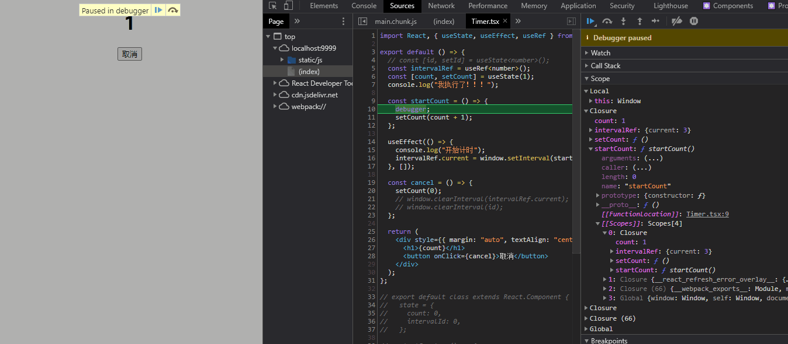

## 心智模型

> 心智模型（mental model）：A **mental model** is an explanation of someone's thought process about how something works in the real world. —— [wikipedia - Mental_model](https://en.wikipedia.org/wiki/Mental_model)
>
> 心智模型是对某人关于某物在现实世界中如何工作的思考过程的解释。

我个人觉得，心智模型就是伴随一个人成长过程中，对客观事物所建立的个人的认知。所以，心智模型会有一个建立以及不断修改的过程，通过日常的学习，所接触的事，人等都会影响心智模型的改变。


心智模型的形成会先从信息刺激开始，然后个人会观察或者直接运用得到进一步的信息反馈，若自己主观认为是好的就会保留下来，不好的就会被放弃，内心自然也是拒绝的。

放在计算机中，这是一个涉及到用户体验的话题，计算机的操作基本来自于人机交互，人机交互系统的设计要充分考虑到用户对系统的理解，这就是要求用户建立自己对于系统的思考，慢慢完善系统对于用户的反馈，从而在用户的心智模型中保留下来。


## 函数组件的特点

我记得曾经有一次我面试的时候，面试官问我一个问题，函数组件能不能被实例化，我当时还傻傻地回答*可以*，因为我当时完全没有写过函数组件，按照过去对构造函数和现在 ES 中的`class`的认识，我把函数组件大写开头的形式类比成了构造函数！

### 函数组件没有生命周期

在`class`组件中，依赖生命周期方法我们可以很好的组织组件内部的逻辑，每一个生命周期函数都有严格的执行时机限制，也就是`class`组件内部的方法不是按顺序执行的。


需要明确的概念是理解函数组件需要打破之前建立的`class`组件渲染的生命周期形式的心智模型。`class`组件一系列声明周期方法的执行都统一挂载在`class`组件的一个实例上，从初始化创建以后就会保持一个函数组件的实例，并依靠实例上的声明周期方法去调度组件以后的每次更新。

但是函数组件没有`this`，也不存在组件实例的说法，从创建以后每次更新都是直接调用函数获取返回的组件 virtual DOM；在函数组件更新过程中执行的一些方法被统一称为副作用，它们需要依靠指定的 hook 去处理其执行时间。

**在函数组件内部的方法获取最新的`state`方式也是通过重新创建函数实例**，在创建新函数的过程中，其内部访问的外部函数组件作用域中的`state`或者一些其他的函数组件内部的局部变量都会保存在其作用域链上，由此形成新的闭包；这样组件内部总是能通过回调函数的形式获取最新创建的闭包。所以说，函数组件完全和 OOP 的思想没有关系了，完全不需要纠结`class`组件上 OOP 的思想：封装，继承，多态。

从我个人感觉而言，函数组件需要特别注意闭包和回调函数配合使用上的问题，尤其是闭包使用上的问题，用时候一些期望更新的变量，然而在实际执行却毫无变化，可能组件内部闭包始终保存旧的`state`的原因。

然后也可以通过 hooks 去模拟一些`class`组件的生命周期，例如`useEffect`，`useEffect`实际上能满足大多数之前遵循`class`组件执行方法的情况。

下面来看一个在`class`组件内部注册定时器的方法，组件加载完以后初始化一个定时器，每秒叠加一个数值，看起来工作正常。

```jsx
export default class extends React.Component {
  state = {
    count: 1,
    intervalId: 0,
  };

  startCount = () => {
    console.log(this.state.count);
    this.setState({
      count: this.state.count + 1,
    });
  };

  componentDidMount() {
    console.log('开始计时');
    let id = window.setInterval(this.startCount, 1000);
    this.setState({
      ...this.state,
      intervalId: id,
    });
  }

  cancel = () => {
    this.setState({
      count: 0,
    });
    window.clearInterval(this.state.intervalId);
  };

  render() {
    console.log('render');
    return (
      <div style={{ margin: 'auto', textAlign: 'center' }}>
        <h1>{this.state.count}</h1>
        <button onClick={this.cancel}>取消</button>
      </div>
    );
  }
}
```


下面使用函数组件来实现，计划使用`useEffect`模拟`componentDidMount`，使用`useRef`来保存定时器的 id，因为`useRef`返回的`ref`对象在组件渲染完成以后就不会再变化，这样后续才能通过 id 清除定时器。

但是事与愿违，计时器停在了`2`上面，what？不是说`useEffect`第二个参数设置为空数组就相当于`componentDidMount`吗？为什么更新`state`不起作用呢？仔细观察，并不是的，定时器确实在执行，只是`startCount`函数拿到的`count`的值始终是`1`，也就是通过`useState`设定的初始值！！！

```jsx
export default () => {
  const intervalRef = useRef<number>();
  const [count, setCount] = useState(1);
  console.log('我执行了！！！');

  const startCount = () => {
    console.log(count); // always be 1
    setCount(count + 1);
  };

  useEffect(() => {
    console.log('开始计时');
    intervalRef.current = window.setInterval(startCount, 1000);
  }, []);

  const cancel = () => {
    setCount(0);
    window.clearInterval(intervalRef.current);
  };

  return (
    <div style={{ margin: 'auto', textAlign: 'center' }}>
      <h1>{count}</h1>
      <button onClick={cancel}>取消</button>
    </div>
  );
};
```


这个问题的根源就在于闭包！但是涉及 JS runtime 的一些概念。

- 首先，JS 属于脚本语言，JS 引擎是按代码顺序解析 JS 然后执行，解析 JS 的过程会进行一些编译的工作，例如词法分析，语法分析，语义检查等，在这个过程中会创建函数执行上下文（Execution Context），执行上下文包含变量对象，作用域链等内容，而作用域链则保存着当前作用域的活动对象（也就是函数体内的局部变量以及参数）以及上文的变量对象（外层作用域的局部变量等）；
- 闭包的原理就是函数本身的作用域链保存了外界的局部变量，函数等成员，这样即使在函数作为返回值结束以后，或者在回调函数中也能访问到外部作用域中的变量或者函数成员；
- `useEffect`在指定第二个参数为一个空数组以后，传递给它的函数只会在组件渲染完成以后执行一次，以后组件的更新都不会再次调用，所以这里定时器的回调函数，也就是闭包，始终保存的是组件渲染完成以后的`state.count`，外界即使更新`state`，但是根本不会影响到闭包本身

通过 Chrome 的 devtool，可以清楚的看到`startCount`内部`count`的值在其作用域链上始终是`1`！！！所以 `count + 1` 一直是 `1`！！！可以看到这里的定时器是正常执行回调函数的，但是**闭包始终保存并且访问的是函数组件最初的`state.count`**，导致`count+1`始终不变，所以观察到屏幕上计时也一直未变。

```typescript
const startCount = () => {
  debugger;
  setCount(count + 1);
};
```



在 React 核心开发者 Dan 的博客中也提到过这种现象 —— [使用 React Hooks 声明 setInterval]([使用 React Hooks 声明 setInterval — Overreacted](https://overreacted.io/zh-hans/making-setinterval-declarative-with-react-hooks/#第二次尝试))，并且他给出了很详细的分析过程和解决方法。

#### 回调函数更新 state

修复的一种方法是利用 hooks 的回调函数形式去更新`state`，回调函数形式会**接收先前的`state`**，这样就可以根据过去的`state`来计算并返回新的`state`。这种方法直接避免了用闭包保存外部作用域中变量的思路，从根本上解决问题，也很简便。

```typescript
const startCount = () => {
  debugger;
  setCount(count => count + 1);
};
```

#### 使用 useRef 缓存函数

我觉得这是一个很开拓的想法，之前我的代码中顶多用`useRef`缓存一下不可变的全局变量来方便整个函数组件内部都可获取到，但是 Dan 提供的思路是用`useRef`缓存计时器的回调函数。

这个想法就是通过`useEffect`每次去更新`ref.current`内缓存的函数，这样闭包`startCount`内总是能获取到最新的`count`值。

```mdx-code-block
import Demo from '@/demo/useInterval';

<Demo />
```


不过这里我仍然有一个疑问，不能将`ref.current`直接作为回调函数传递到定时器内部，

```typescript
function startCount() {
  setCount(count + 1);
}

useEffect(() => {
  // 会首先执行
  saveCallback.current = startCount;
});

useEffect(() => {
  // 会在组件渲染完以后才执行
  intervalRef.current = window.setInterval(saveCallback.current!, 1000);
}, []);
```

这实际上是函数参数传递的方式不同，一个固定的说法是 JS 里的函数参数传递方式都是值传递，只是原始值类型传递的就是本身变量的值，但是引用类型传递的是内存地址的副本值。

如果直接将`saveCallback.current`传递给定时器，`saveCallback.current`本身经过上一个`useEffect`的执行后已经被初始化，其保存着`startCount`的引用地址，所以这里间接等于将`startCount`赋值给定时器，导致和上面闭包一样的效果，其内部始终还是保存着初始化时的`state.count`。

但是额外声明一个函数就开辟了一个新的引用地址出来，在这个函数内部间接访问`saveCallback.current`，由于每次更新都会更新`saveCallback.current`的指向，所以`tick`内部获取到的`saveCallback.current`指向的函数也一直是最新的。

## this

如果从作用域的角度来看的话，`this`是 JS 里比较令人头疼的问题，`class`的出现从一定程度解决了`this`的乱用，也就是仅限于在`class`中使用`this`访问`class`内部的成员，这是 OOP 语言的特性，但是`class`里有个严格的规定是继承的`class`必须首先使用`super`去塑造内部构造函数`constructor`的`this`，并且由于 React 组件的特殊性，在事件回调函数中使用`this`必须在构造实例的时候就严格绑定到实例上，否则当 JSX 最终渲染到 DOM 中的时候，事件回调函数中的`this`就会丢失。

诸如此类可以说是`class`组件的复杂性，记得我当初学习也是花了个把月，甚至到知乎等地方提问才搞清楚`super`以及`bind`的问题，如果没有 OOP 编程的经验，这是一个难点。

至于函数组件，它根本就没有`this`，因为函数组件不是以`new`来调用，而是直接以函数调用的形式获取返回值，每次 rerender 也是直接执行一次函数。

```jsx
// class组件
const comp = new ClassComponent();

// 函数组件
const comp = FuncComponent();
```

而在严格模式下的 JS 函数单独调用，**其内部`this`将始终指向`undefined`**，所以在函数组件内部根本不存在`this`，也就不用管那些`this`如何指向，不用`bind`会丢失绑定的问题等等。

```jsx
export default () => {
  console.log(this); // undefined

  const handleClick = () => {
    console.log(this); // undefined
  };

  return <button onClick={handleClick}>hello world!</button>;
};
```

### useRef

没有`this`，函数组件每次更新又会重新调用，那么如果在函数组件内部保存一个值使其在更新渲染期间保持不变呢？可以使用`useRef`创建一个`ref`对象，在`ref.current`属性上保存这些值，可以满足每次更新渲染函数组件都不会发生变化，除非手动修改`ref.current`的值。这就类似于`class`组件在`this`上声明一些属性。

## useMemo 和 useCallback

### useMemo

在一个函数组件内部，其返回的组件使用到的外部成员无非就是**变量和函数**。变量无非就是需要通过组件显示的数据，函数无非就是需要通过组件交互进行的调用，或者用于间接生成组件。

React 中虽然使用 virtual DOM 来做 diff，尽管 React 可以对前后两次更新渲染过程中返回的 virtual DOM 进行 diff，但是无法阻止函数组件中任一逻辑的执行，下面以一个 TODO 组件来观察函数组件内部是如何对变量进行计算的。

现在每当我们输入一个值，可以看到负责计算`hasDoneItem`，`undoList`的函数都会被执行一遍，实际上这些函数计算所依赖的状态值`listData`根本就没发生变化，我们只是在输入而已，并没有将事项添加到`listData`中。


现在我们用`useMemo`来缓存`undoList`的计算值，仅当`listData`发生变化时才重新计算`undoList`的值，主要修改代码部分如下：

```jsx
const memoUndoList = useMemo(() => {
  console.log('计算undoList');
  return listData.filter(item => !item.done);
}, [listData]);

<UndoList listData={memoUndoList} />;
```

可以清楚的观察到传入`useMemo`的负责计算`undoList`的函数不会在每次输入都执行了！！！


甚至可以直接将子组件传递到`useMemo`内部缓存下来，避免组件更新时重新渲染

```jsx
function Parent({ a, b }) {
  // 只在a变化时才更新
  const child1 = useMemo(() => <Child1 a={a} />, [a]);
  // 只在b变化时才更新
  const child2 = useMemo(() => <Child2 b={b} />, [b]);
  return (
    <>
      {child1}
      {child2}
    </>
  );
}
```

### useCallback

`useMemo`是非常简单，如果组件中有什么值不希望在组件每次更新`state`以后`rerender`的过程中重新计算就可以放在`useMemo`中，只需要注意该缓存值计算依赖的`state`或者`props`值要放在`useMemo`的第二个参数数组中。

`useCallback`和`useMemo`的写法几乎完全一致，不同的是`useCallback`返回的是一个函数，所以`useCallback`缓存的是函数的实例。从过去经验来看 React 应用优化上一个点是减少内联回调函数的使用，内联函数就是直接在组件的回调`props`中声明函数，例如：

```jsx
// 引用回调
const Func = () => {
  const handleClick = () => {};

  return <button onClick={handleClick}>按钮</button>;
};

// 内联形式
const Func = () => {
  return (
    <button
      onClick={() => {
        //...
      }}
    >
      按钮
    </button>
  );
};
```

让我们回到 JSX 的本质上来，JSX 经过编译会形成`React.createElement`的形式，即上述`button`元素的创建实际上如下：

```typescript
// JSX - API
React.createElement(type, [props], [...children]);

React.createElement(
  'button',
  {
    onClick: () => {
      //...
    },
  },
  '按钮',
);
```

实际上 React 内部创建的每个 Virtual DOM 元素本身就是一个对象，其包含以下三个属性：

- `type`表示组件元素还是原生 HTML 元素
- `props`就是传递的属性，包括原生 DOM 支持的属性或者人为定义的组件属性，包括保持组件稳定性的`key`
- `children`表示内部包含的子组件

简单来说，在组件每次更新`state`要求重新渲染的时候，React 会使用 [Virtual DOM DIFF 算法](https://zh-hans.reactjs.org/docs/reconciliation.html#the-diffing-algorithm)从组件的根节点开始往下递归对比节点的属性；如果对比到以上两个`button`节点，每次对比内联函数形式的`props.onClick`值都会发生变化，因为完全是将一个新的函数的引用地址传递过去了。

然而这种性能影响在函数组件中其实是微乎其微的，在[React Hook FAQ 文档](https://zh-hans.reactjs.org/docs/hooks-faq.html?#are-hooks-slow-because-of-creating-functions-in-render)中也解释了相关原因，理由是现代浏览器对于闭包的优化使得性能更高，同时函数组件避免了`class`组件创建实例的开销，同时减少了`class`组件为状态复用采用的高阶组件等深层次的组件树嵌套，也就是减少了 DIFF 算法在递归对比子组件上的时间复杂度。

所以根本不需要使用`useCallback`来缓存每个回调函数的引用地址，例如原生 DOM 回调事件的触发等。**`useCallback`真正的用法在于配合`React.memo`来使用**，因为函数组件不存在`PureComponent`和`shouldComponentUpdate`这样的优化策略，`React.memo`作为一个替代品可以达到上述两个生命周期的目的。

### React.memo

`React.memo`默认情况下会对传递到子组件的`props`进行对比，且复杂对象只会做浅层对比，如果自定义对比`props`的方式，可以传递一个函数作为第二个参数给`React.memo`，该函数接收之前的`props`和即将触发更新的`props`，如果返回`false`就表示组件需要更新，返回`true`则表示组件不需要更新。完整的 API 如下：

```typescript
// 函数组件
function MyComponent(props) {
  /* 使用 props 渲染 */
}

// 对比props
function areEqual(prevProps, nextProps) {
  /*
  如果把 nextProps 传入 render 方法的返回结果与
  将 prevProps 传入 render 方法的返回结果一致则返回 true，
  否则返回 false
  */
}

React.memo(MyComponent, areEqual);
```

现在来看一个`useCallback`和`React.memo`配合使用的例子，这里展示一个`antd/Table`组件，并且将其操作列抽离为单独的组件，普通的写法很简单，但是也可以清楚的看到，每次开关`Drawer`都会导致`OperationColumn`重新渲染，这种渲染完全没有必要的。

<iframe src="https://codesandbox.io/embed/antd484-forked-e3y7p?fontsize=14&hidenavigation=1&theme=dark"
        width="100%"
    	height="500px"
     allow="accelerometer; ambient-light-sensor; camera; encrypted-media; geolocation; gyroscope; hid; microphone; midi; payment; usb; vr; xr-spatial-tracking"
     sandbox="allow-forms allow-modals allow-popups allow-presentation allow-same-origin allow-scripts"
   ></iframe>


现在使用`useCallback`以及`React.memo`来缓存`open`函数实例，可以看到开关`Drawer`的时候并不会触发`OperationColumn`重新渲染了，这是我希望看到的结果，`useCallback`的使用也达到了目的。

```typescript
const open = useCallback(() => {
  setVisible(true);
}, []);

<OperationColumn rowData={record} open={open} />;

export default React.memo(OperationColumn);
```

<iframe src="https://codesandbox.io/embed/usecallback-antd484-forked-mok5o?fontsize=14&hidenavigation=1&theme=dark"
                width="100%"
    	height="500px"
     title="useCallback - antd@4.8.4 (forked)"
     allow="accelerometer; ambient-light-sensor; camera; encrypted-media; geolocation; gyroscope; hid; microphone; midi; payment; usb; vr; xr-spatial-tracking"
     sandbox="allow-forms allow-modals allow-popups allow-presentation allow-same-origin allow-scripts"
   ></iframe>

