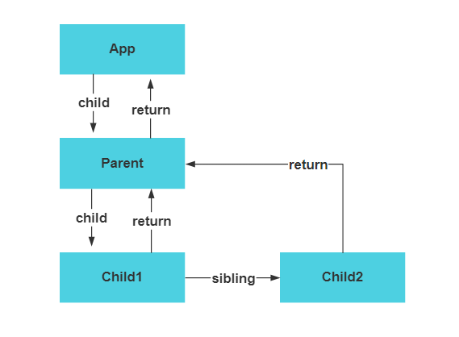

## 什么是 fiber

`fiber`翻译过来是纤维的意思，是 React 16 版本以后针对组件设计的一个对象的数据结构，一个 React 组件就对应一个`fiber`节点，其保存组件内部一些属性或者方法：

- `type`：组件的类型
- `key`：组件更新的标记
- `child` ：对应当前组件渲染的子组件
- `sibling`：当一个组件返回多个子元素的组成的数组时，`sibling`就表示子组件的兄弟组件
- `return`：当前组件的父节点

- `pendingProps` 和`memoizedProps`：分别代表更新的`props`属性和当前`props`属性，如果更新后的这俩值相同就表示当前节点可以直接复用
- `pendingWorkPriority`：一个代表组件更新优先级的数字

- `output`：一个包含最终输出的 DOM 节点的数据结构，最终会传递给`renderer`去选择创建、更新到 UI 上去

- `alternate`：当前`fiber`在另一次更新时对应的`fiber`

完整的`fiber`节点属性在[源码这里](https://github.com/facebook/react/blob/1fb18e22ae66fdb1dc127347e169e73948778e5a/packages/react-reconciler/src/ReactFiber.new.js#L117)。

### 两种类型的 fiber 节点

在任何时候，一个组件的实例最多存在两种类型的`fiber`节点：

- `current fiber`：当前已经渲染出来的`fiber`节点；
- `work-in-progress fiber`：正在内存中构建的`fiber`节点，也就是下一次更新可能会被渲染的

两种节点之间通过上述的`alternate`属性关联，`current fiber`的`alternate`指向`work-in-progress fiber`，而`work-in-progress fiber`则指向`current fiber`。

```js
currentFiber.alternate === workInProgressFiber;
workInProgressFiber.alternate === currentFiber;
```

采用两种类型`fiber`节点的原因主要是为了**复用`fiber`节点的状态**。

## fiber reconciler

### 挂载阶段

首次执行`ReactDOM.render(<App />, document.getElementById('root'))`会创建一个`fiberRoot`作为整个应用的`fiber`根节点；另外，在一个应用中`ReactDOM.render`可以在不同的代码位置多次执行，所以需要额外的`rootFiber`代表当前渲染的组件树的根节点。

`fiberRoot`具有一个`current`属性指向当前渲染的组件树的根节点，也就是

```js
fiberRoot.current = rootFiber;
```

但是由于是首次执行的挂载阶段，所以此时`current = rootFiber = null`。所以需要先递归遍历整个组件树，不断的创建新的`fiber`节点并通过`fiber.child`、`fiber.sibling`等属性关联父子节点、兄弟节点等，最终形成一棵`work-in-progress fiber tree`。



然后将`fiberRoot`的`current`属性指向该`work-in-progress fiber tree`的根节点，然后提交到`renderer`进行渲染。


### 更新阶段

在组件更新的时候会创建新的`work-in-progress fiber`，但是此时已经存在`current fiber`，它们之间通过`alternate`属性进行关联，所以它们之间会通过 diff 算法进行对比，判断是否复用之前`current fiber`的状态。

## fiber 解决了什么问题

`fiber reonciler`主要是为了解决`stack reconciler`的以下问题：

- 支持返回多个元素；
- 避免遍历更新队列一次性操作 DOM 可能阻塞 UI 渲染的问题；
- 更新处理时把任务进行优先级拆分，保证 UI 及时更新；