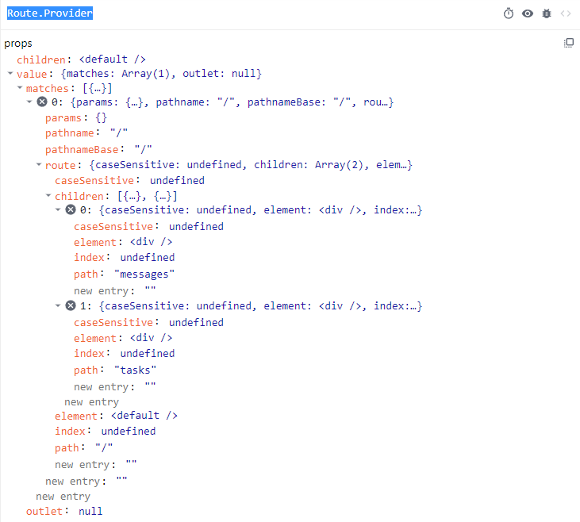

## react-router-dom v6

`react-router`早前发布了`v6`版本，改动了许多内容，现在的 API 真的好用挺多的。话不多说，直接看 API。

## JSX 组件

### BrowserRouter

`BrowserRouter`简化了属性配置，增加了一个`window`属性，关联当前 DOM 所在的`window`对象，可以用来在`iframe`之间交互。

```typescript
declare function BrowserRouter(
  props: BrowserRouterProps
): React.ReactElement;

interface BrowserRouterProps {
  basename?: string;
  children?: React.ReactNode;
  window?: Window;
}
```

`BrowserRouter`的源码非常简单，就是一个函数组件，返回了`Router`组件。

```tsx
export function BrowserRouter({
  basename,
  children,
  window,
}: BrowserRouterProps) {
  let historyRef = React.useRef<BrowserHistory>();
  if (historyRef.current == null) {
    historyRef.current = createBrowserHistory({ window });
  }

  let history = historyRef.current;
  let [state, setState] = React.useState({
    action: history.action,
    location: history.location,
  });

  React.useLayoutEffect(() => history.listen(setState), [history]);

  return (
    <Router
      basename={basename}
      children={children}
      location={state.location}
      navigationType={state.action}
      navigator={history}
    />
  );
}
```

首先使用[`history`](https://github.com/remix-run/history)库提供的`createBrowserHistory`函数创建`history`对象，然后包装成`state`传递给`Router`组件。

下面介绍一下`history`这个库，其对 HTML5 的[`history` API](https://developer.mozilla.org/zh-CN/docs/Web/API/History) 做了一层封装，HTML5 的`history` API 本身在浏览器方面有着非常好的兼容性，支持 IE10，但是其提供的方法不是太利于日常开发，(例如我们经常使用的`history.push`其实是没有的，只有`history.pushState`这样繁琐的方法)，所以在其基础之上做一层封装处理，更利于日常开发使用。

`history.listen`方法会在`history`对象内部维护一个回调函数队列，当组件内部调用`history.push`等方法后，通过传递当前操作类型`action`和当前`location`对象依次调用队列内的回调函数，这里也就是调用`setState`来刷新顶层`BrowserRouter`内部的`location`对象。

```typescript
const readOnly: <T>(obj: T) => Readonly<T> = __DEV__
  ? (obj) => Object.freeze(obj)
  : (obj) => obj;

// 拼接 url
function createPath({
  pathname = "/",
  search = "",
  hash = "",
}: Partial<Path>) {
  if (search && search !== "?")
    pathname += search.charAt(0) === "?" ? search : "?" + search;
  if (hash && hash !== "#")
    pathname += hash.charAt(0) === "#" ? hash : "#" + hash;
  return pathname;
}

// 创建回调函数队列
function createEvents<F extends Function>(): Events<F> {
  let handlers: F[] = [];

  return {
    get length() {
      return handlers.length;
    },
    push(fn: F) {
      handlers.push(fn);
      return function () {
        handlers = handlers.filter((handler) => handler !== fn);
      };
    },
    call(arg) {
      handlers.forEach((fn) => fn && fn(arg));
    },
  };
}

function createBrowserHistory(
	options: BrowserHistoryOptions = {}
): BrowserHistory {
  // 原生 history 对象
  let globalHistory = window.history;
  // 执行跳转 history.pushState 以后的回调函数队列
  let listeners = createEvents<Listener>();
  let [index, location] = getIndexAndLocation();

  // 获取当前 location 对象
  function getIndexAndLocation(): [number, Location] {
    let { pathname, search, hash } = window.location;
    let state = globalHistory.state || {};
    return [
      state.idx,
      readOnly<Location>({
        pathname,
        search,
        hash,
        state: state.usr || null,
        key: state.key || "default",
      }),
    ];
  }
  
  // 创建跳转目标的location对象
  function getNextLocation(to: To, state: any = null): Location {
    return readOnly<Location>({
      pathname: location.pathname,
      hash: "",
      search: "",
      ...(typeof to === "string" ? parsePath(to) : to),
      state,
      key: createKey(),
    });
  }
  
  // 在跳转完成以后依次调用 listeners
  function applyTx(nextAction: Action) {
    action = nextAction;
    [index, location] = getIndexAndLocation();
    listeners.call({ action, location });
  }
  
  // 创建套转目标的 state 对象
  function getHistoryStateAndUrl(
    nextLocation: Location,
    index: number
  ): [HistoryState, string] {
    return [
      {
        usr: nextLocation.state,
        key: nextLocation.key,
        idx: index,
      },
      createHref(nextLocation),
    ];
  }
  
  // 获取目标 url
  function createHref(to: To) {
    return typeof to === "string" ? to : createPath(to);
  }
    
  function push() {
    let nextLocation = getNextLocation(to, state);
    let [historyState, url] = getHistoryStateAndUrl(nextLocation, index + 1);
    // 调用 history.pushState 跳转
    globalHistory.pushState(historyState, "", url);
    ...
    applyTx(nextAction);
  }
    
  let history = {
    get action() {
      return action;
    },
    get location() {
      return location;
    },
		push,
    replace,
    go,
    back() {
      go(-1);
    },
    forward() {
      go(1);
    },
    listen(listener) {
      return listeners.push(listener);
    },
    ...
  };
    
  return history;
}
```

从 react-devtool 在浏览器观察可以看到`Router`接受的`props`大致结构如下：


`Router`组件是一个`Context.Provider`，其内部对`history`等对象使用`useMemo`做了一层缓存处理，然后通过`Context`的原理，向下透传`history`，`location`等对象。这样，当`history` 对象更新后，`Router`组件就会更新其所有子组件内部的状态。

```tsx
// 向下透传 basename，history 对象
const NavigationContext = React.createContext<NavigationContextObject>(null!);

// 向下透传 location 对象
const LocationContext = React.createContext<LocationContextObject>(null!);

function Router({
  basename: basenameProp = "/",
  children = null,
  location: locationProp,
  navigationType = NavigationType.Pop,
  navigator,
  static: staticProp = false,
}: RouterProps): React.ReactElement | null {
  let navigationContext = React.useMemo(
    () => ({ basename, navigator, static: staticProp }),
    [basename, navigator, staticProp]
  );
  
  let location = React.useMemo(() => {
    let trailingPathname = stripBasename(pathname, basename);

    if (trailingPathname == null) {
      return null;
    }

    return {
      pathname: trailingPathname,
      search,
      hash,
      state,
      key,
    };
  }, [basename, pathname, search, hash, state, key]);
  
  return (
  	<NavigationContext.Provider value={navigationContext}>
      <LocationContext.Provider
        children={children}
        value={{ location, navigationType }}
      />
    </NavigationContext.Provider>
  )
}
```

既然有`Context.Provider`，肯定也有使用`useContext`的地方，继续看下面的 API。

### HashRouter

`HashRouter`和`BrowserRouter`这块最主要的区别就是在跳转 url 的处理上，`HashRouter`会把目标路径串接在 URL 的`hash`部分，而`BrowserRouter`是直接替换当前`pathname`。

```typescript
// BrowserRouter
function createHref(to: To) {
  return typeof to === "string" ? to : createPath(to);
}

// HashRouter
function createHref(to: To) {
  return getBaseHref() + "#" + (typeof to === "string" ? to : createPath(to));
}
```

### Routes 和 Route

新的`Routes`组件取代了以前的`Switch`组件，不过依旧是和`Route`组合使用，其类型定义如下：

```ts
declare function Routes(
  props: RoutesProps
): React.ReactElement | null;

interface RoutesProps {
  children?: React.ReactNode;
  location?: Partial<Location> | string;
}

declare function Route(
  props: RouteProps
): React.ReactElement | null;

interface RouteProps {
  caseSensitive?: boolean;
  children?: React.ReactNode;
  // 组件
  element?: React.ReactNode | null;
  index?: boolean;
  // 路由路径
  path?: string;
}
```

`Routes`和`Route`组合使用，`Route`用来根据包裹页面渲染的组件和指定的`path`，`Routes`用来根据当前 URL 匹配`path`来渲染指定`Route`的组件。

```tsx
<Routes>
  <Route path="/" element={<Dashboard />}>
    <Route
      path="messages"
      element={<DashboardMessages />}
    />
    <Route path="tasks" element={<DashboardTasks />} />
  </Route>
  <Route path="about" element={<AboutPage />} />
</Routes>
```

下面研究一下源码，`Route`就只起到包裹子组件传递参数的目的，代码就是一个简单的函数。

```tsx
function Route(
  _props: RouteProps
): React.ReactElement | null {
  invariant(
    false,
    `A <Route> is only ever to be used as the child of <Routes> element, ` +
      `never rendered directly. Please wrap your <Route> in a <Routes>.`
  );
}
```

`Routes`的内部首先会使用`React.Children.forEach`递归遍历所有`Route`组件，包括`Fragment`内部的，拿到`Route`组件的`path`，`element`等属性，最终返回一个嵌套的数组结构，传递给`useRoutes`处理，就跟我们直接使用`useRoutes`一样的效果，所以这里推荐直接使用`useRoutes`，避免这一层递归遍历的，提升一点点性能。

```tsx
function Routes({
  children,
  location,
}: RoutesProps): React.ReactElement | null {
  return useRoutes(createRoutesFromChildren(children), location);
}

// 遍历所有 Routes 内部的 Route 组件，然后得到嵌套的路由数组
function createRoutesFromChildren(
	children: React.ReactNode
): RouteObject[]  {
  let routes: RouteObject[] = [];

  React.Children.forEach(children, (element) => {
    // Fragment 的 情况
    if (element.type === React.Fragment) {
      // Transparently support React.Fragment and its children.
      routes.push.apply(
        routes,
        createRoutesFromChildren(element.props.children)
      );
      return;
    }

    let route: RouteObject = {
      caseSensitive: element.props.caseSensitive,
      element: element.props.element,
      index: element.props.index,
      path: element.props.path,
    };

    // Route 嵌套的情况，编译子 Route 组件
    if (element.props.children) {
      route.children = createRoutesFromChildren(element.props.children);
    }
  });

  routes.push(route);
}

// 得到的数据结构
routes: 
[
  {
		caseSensitive: boolean,
    element: React.ReactNode,
    index: number,
    path: string,
    children: [
      {
        caseSensitive: boolean,
        element: React.ReactNode,
        index: number,
        path: string
      }
    ]
  }
]
```

### Outlet

```ts
interface OutletProps {
  context?: unknown;
}
declare function Outlet(
  props: OutletProps
): React.ReactElement | null;
```

`Outlet`是`v6`新增的组件，用于渲染嵌套在`Route`内部子路由组件的，例如有一个布局组件`Layout`，左侧是导航菜单，右侧是内容内容主体区域，那么`Outlet`组件最终会根据匹配的`path`替换成 `<Route path="/" element={<Layout />}>`下嵌套的子路由组件，这就很方便页面布局。

```tsx
function Layout() {
  return (
    <div style={{ display: 'flex' }}>
      <div style={{ flex: '0 1 20%' }}>
        <ul>
          <li>
            <Link to="/messages">messages</Link>
          </li>
          <li>
            <Link to="/tasks">tasks</Link>
          </li>
        </ul>
      </div>
      // 主内容区域
      <div>
        <Outlet />
      </div>
    </div>
  )
}

function App() {
  return (
  	<BrowserRouter>
      <Routes>
        <Route path="/" element={<Layout />}>
          <Route path="messages" element={<div>messages</div>} />
          <Route path="tasks" element={<div>tasks</div>} />
        </Route>
      </Routes>
    </BrowserRouter>
  )
}
```

`Outlet`内部使用了`useOutlet`这个 hook，可以看到`Outlet`还可以额外接收`Context`的参数透传给嵌套的子组件。

```ts
function Outlet(props: OutletProps): React.ReactElement | null {
  return useOutlet(props.context);
}
```

`useOutlet`内部逻辑很简单，得到`RouteContext`透传的`outlet`，然后用`OutletContext.Provider`包裹起来。

```tsx
const OutletContext = React.createContext<unknown>(null);

function useOutlet(context?: unknown): React.ReactElement | null {
  let outlet = React.useContext(RouteContext).outlet;
  if (outlet) {
    return (
      <OutletContext.Provider value={context}>{outlet}</OutletContext.Provider>
    );
  }
  return outlet;
}
```

### Navigate

```tsx
declare function Navigate(props: NavigateProps): null;

interface NavigateProps {
  to: To;
  replace?: boolean;
  state?: any;
}
```

`Navigate`组件用来进行路由跳转操作，其内部就是简单调用了以下`useNavigate`这个 hook.

```tsx
function Navigate({ to, replace, state }: NavigateProps): null {
  let navigate = useNavigate();
  React.useEffect(() => {
    navigate(to, { replace, state });
  });

  return null;
}
```

###Link

`Link`组件会渲染成`<a>`元素放在页面，其类型定义如下：

```typescript
declare function Link(props: LinkProps): React.ReactElement;

interface LinkProps
  extends Omit<
    React.AnchorHTMLAttributes<HTMLAnchorElement>,
    "href"
  > {
  replace?: boolean;
  state?: any;
  to: To;
  // 是否触发浏览器刷新动画
  reloadDocument?: boolean;
}

type To = Partial<Location> | string;
```

### NavLink

```tsx
declare function NavLink(
  props: NavLinkProps
): React.ReactElement;

interface NavLinkProps
  extends Omit<
    LinkProps,
    "className" | "style" | "children"
  > {
  caseSensitive?: boolean;
  children?:
    | React.ReactNode
    | ((props: { isActive: boolean }) => React.ReactNode);
  className?:
    | string
    | ((props: {
        isActive: boolean;
      }) => string | undefined);
  end?: boolean;
  style?:
    | React.CSSProperties
    | ((props: {
        isActive: boolean;
      }) => React.CSSProperties);
}
```

`NavLink`内部也使用了`Link`组件，只是内部会根据当前指定的`to`的路径和`location.pathname`是否匹配来判断是否传递一个`active`的`class`给`Link`组件。当然也可以通过`className`和`style`函数来判断是够匹配并传递指定的样式。如果指定`end`，可以保证嵌套的路由匹配后，其本身不会被追加`active`的`class`。

## Hook

### useRoutes

使用`useRoutes`配置路由数据，`useRoutes`返回的`routes`直接塞到`BrowserRouter`下即可。

可以避免一堆`Routes`和`Route`嵌套的 JSX 代码杂乱的问题，不过相信这也是目前大部分框架其实已经解决的问题，只能说`useRoutes`帮助这些框架锦上添花了。

```tsx
import { useRoutes } from "react-router-dom";

function App() {
  let element = useRoutes([
    {
      path: "/",
      element: <Dashboard />,
      children: [
        {
          path: "messages",
          element: <DashboardMessages />,
        },
        { path: "tasks", element: <DashboardTasks /> },
      ],
    },
    { path: "team", element: <AboutPage /> },
  ]);

  return element;
}
```

`useRoutes`内部主要会对传入的`routes`数组进行扁平化处理，然后根据当前页面的`location.pathname`和每个`route.path`进行匹配，筛选出需要渲染的组件。

```ts
function useRoutes(
	routes: RouteObject[],
 locationArg?: Partial<Location> | string
): React.ReactElement | null {
  // 获取 LocationContext 透传的值，包括 location 对象的 pathname，search 等属性
  let location = useLocation();
  let pathname = location.pathname || "/";
  // 扁平化处理路由结构，并根据 pathname 和 route.path 获取匹配的组件
  let matches = matchRoutes(routes, { pathname });

  return _renderMatches(
    matches &&
    matches.map((match) =>
      Object.assign({}, match, {
        params: Object.assign({}, parentParams, match.params),
        pathname: joinPaths([parentPathnameBase, match.pathname]),
        pathnameBase:
        match.pathnameBase === "/"
        ? parentPathnameBase
        : joinPaths([parentPathnameBase, match.pathnameBase]),
    	})
   	),
    parentMatches
  );
}

function matchRoutes(
  routes: RouteObject[],
  locationArg: Partial<Location> | string,
  basename = "/"
): RouteMatch[] | null {
  let location =
    typeof locationArg === "string" ? parsePath(locationArg) : locationArg;

  let pathname = stripBasename(location.pathname || "/", basename);

  if (pathname == null) {
    return null;
  }
	
  // 扁平化处理路由结构，得到以下数据结构
  let branches = flattenRoutes(routes);
  // 根据 score 排序，正常情况下 score 就是 Route 在 Routes 内部的索引顺序
  rankRouteBranches(branches);

  let matches = null;
  for (let i = 0; matches == null && i < branches.length; ++i) {
   	// 根据 location.pathname 和 Route 的 path 进行匹配
    matches = matchRouteBranch(branches[i], pathname);
  }

  return matches;
}
```

在扁平化处理的过程中，对于`Route`嵌套的情况，`route.children`中的子路由的`path`会和上层的父路由进行拼接。可以看到这里对于嵌套路由的断言处理，当嵌套的子路由以`/`开头时，其开头的路径必须和上层的`Route`指定的`path`相同，而当`Route`的`path="/"`的时候，嵌套的子路由组件写不写`/`都无所谓。

```tsx
// 这种情况嵌套的 Route 的 path 可以不以 / 开头
<Route path="/" element={<Dashboard />}>
  <Route
    path="messages"
    element={<DashboardMessages />}
    />
  <Route path="tasks" element={<DashboardTasks />} />
</Route>

// 这种情况嵌套 messages 必须以 /parent 开头，而 tasks 不以 / 开头，所以无限制
<Route path="/parent" element={<Dashboard />}>
  <Route
    path="/parent/messages"
    element={<DashboardMessages />}
    />
  <Route path="tasks" element={<DashboardTasks />} />
</Route>
```

```ts
// 扁平化处理路由结构，得到以下数据结构
/**
  *[
    {
      path: string,
      score: number,
      routesMeta: [
        {
          relativePath: route.path,
          caseSensitive: route.caseSensitive,
          childrenIndex: number,
      		route,
        }
      ]
    }
  ]
  */

function invariant(cond: any, message: string): asserts cond {
  if (!cond) throw new Error(message);
}

function flattenRoutes(
  routes: RouteObject[],
  branches: RouteBranch[] = [],
  parentsMeta: RouteMeta[] = [],
  parentPath = ""
): RouteBranch[] {
  routes.forEach((route, index) => {
    let routesMeta: RouteMeta = {
      relativePath: route.path || "",
      caseSensitive: route.caseSensitive === true,
      childrenIndex: index,
      route,
    };
    
    // 处理子路由以 / 开头的情况
   	if (meta.relativePath.startsWith("/")) {
      invariant(
        meta.relativePath.startsWith(parentPath),
        `Absolute route path "${meta.relativePath}" nested under path ` +
          `"${parentPath}" is not valid. An absolute child route path ` +
          `must start with the combined path of all its parent routes.`
      );

      meta.relativePath = meta.relativePath.slice(parentPath.length);
    }
    
   	// 组合父层路由路径，同时将反斜杠 \ 都转换成 /
    let path = [parentPath, routesMeta.relativePath].join("/").replace(/\/\/+/g, "/");
    if (route.children && route.children.length > 0) {
      flattenRoutes(route.children, branches, routesMeta, path);
    }
    
    branches.push({ path, score: route.index, routesMeta });
  });
    
  return branches;
}
```

得到扁平化的路由结构以后，会根据`location.pathname`和`route.path`进行匹配，匹配得到的路由结构会是匹配的上层`Route`组件和嵌套的`Route`的合集。

```ts
function matchRouteBranch(branch, pathname) {
  let { routesMeta } = branch;
  let matches: RouteMatch[] = [];
  
  for (let i = 0; i < routesMeta.length; ++i) {
   	let meta = routesMeta[i];
    let end = i === routesMeta.length - 1;
    let remainingPathname =
      matchedPathname === "/"
        ? pathname
        : pathname.slice(matchedPathname.length) || "/";
    // 匹配逻辑
    let match = matchPath(
      { path: meta.relativePath, caseSensitive: meta.caseSensitive, end },
      remainingPathname
    );

    if (!match) return null;
    
    Object.assign(matchedParams, match.params);

    let route = meta.route;
		
    // 匹配的路由结构
    matches.push({
      params: matchedParams,
      pathname: joinPaths([matchedPathname, match.pathname]),
      pathnameBase: normalizePathname(
        joinPaths([matchedPathname, match.pathnameBase])
      ),
      route,
    });

    if (match.pathnameBase !== "/") {
      matchedPathname = joinPaths([matchedPathname, match.pathnameBase]);
    }
  }
  
  return matches;
}
```

得到匹配的路由结构以后，因为是扁平的一维数组结构，所以使用`reduceRight`从底层嵌套的路由开始遍历，最内层`outlet`是`null`，于是会生成`route.element`，然后如果上层`route`有`element`则渲染`element`，将`outlet`通过`Context`传递下去，如果没有就渲染`outlet`。

可以看到最后渲染出来的所有组件都会被`RouteContext.Provider`包裹。

```ts
const RouteContext = React.createContext<RouteContextObject>({
  outlet: null,
  matches: [],
});

// 渲染匹配的组件
function _renderMatches(
  matches: RouteMatch[] | null,
  parentMatches: RouteMatch[] = []
): React.ReactElement | null {
  if (matches == null) return null;

  return matches.reduceRight((outlet, match, index) => {
    return (
      <RouteContext.Provider
        children={
          match.route.element !== undefined ? match.route.element : outlet
        }
        value={{
          outlet,
          matches: parentMatches.concat(matches.slice(0, index + 1)),
        }}
      />
    );
  }, null as React.ReactElement | null);
}
```

通过 react-devtool 观察到`RouteContext.Provider`向下透传的值为以下结构：



### useNavigate

```ts
declare function useNavigate(): NavigateFunction;

interface Path {
  pathname: string;
  search: string;
  hash: string;
}

type To = string | Partial<Path>;

interface NavigateFunction {
  (
    to: To,
    options?: { replace?: boolean; state?: any }
  ): void;
  (delta: number): void;
}
```

`useNavigate`替代了之前的`useHistory`用来进行路由跳转操作。

### useParams

```ts
declare function useParams<
  K extends string = string
>(): Readonly<Params<K>>;
```

`useParams`用于获取路径中的参数值，会返回一个对象。

### useSearchParams

```ts
declare function useSearchParams(
  defaultInit?: URLSearchParamsInit
): [URLSearchParams, SetURLSearchParams];

type ParamKeyValuePair = [string, string];

type URLSearchParamsInit =
  | string
  | ParamKeyValuePair[]
  | Record<string, string | string[]>
  | URLSearchParams;

type SetURLSearchParams = (
  nextInit?: URLSearchParamsInit,
  navigateOpts?: : { replace?: boolean; state?: any }
) => void;
```

`useSearchParams`用于读取或设置 URL 的`queryString`部分。

`useSearchParams`可以接收一个`url`或者一个键值对数组作为参数，然后返回一个数组，数组的第一个元素是`URLSearchParams`类型的对象；第二个是一个函数，用于设置 URL 的`queryString`部分。

`useSearchParams`内部逻辑很简单，就是使用`location.search`初始化一个[`URLSearchParams` API](https://developer.mozilla.org/zh-CN/docs/Web/API/URLSearchParams/URLSearchParams) 对象。但是`URLSearchParams` API 无法兼容 IE 浏览器，所以如果使用需要引入 polyfill。

```ts
function useSearchParams(defaultInit?: URLSearchParamsInit) {
  // 警告 IE 兼容性
  warning(
    typeof URLSearchParams !== "undefined",
    `You cannot use the \`useSearchParams\` hook in a browser that does not ` +
      `support the URLSearchParams API. If you need to support Internet ` +
      `Explorer 11, we recommend you load a polyfill such as ` +
      `https://github.com/ungap/url-search-params\n\n` +
      `If you're unsure how to load polyfills, we recommend you check out ` +
      `https://polyfill.io/v3/ which provides some recommendations about how ` +
      `to load polyfills only for users that need them, instead of for every ` +
      `user.`
  );

  // 基于传入的参数创建 URLSearchParams 对象
  let defaultSearchParamsRef = React.useRef(createSearchParams(defaultInit));

  let location = useLocation();
  let searchParams = React.useMemo(() => {
    // 基于 location.search 创建 URLSearchParams 对象
    let searchParams = createSearchParams(location.search);

    for (let key of defaultSearchParamsRef.current.keys()) {
      if (!searchParams.has(key)) {
        defaultSearchParamsRef.current.getAll(key).forEach((value) => {
          searchParams.append(key, value);
        });
      }
    }

    return searchParams;
  }, [location.search]);

  let navigate = useNavigate();
  let setSearchParams = React.useCallback(
    (
      nextInit: URLSearchParamsInit,
      navigateOptions?: { replace?: boolean; state?: any }
    ) => {
    	// 这里 + 隐式类型转换，会直接调用 URLSearchParams 对象的 toString 方法
      navigate("?" + createSearchParams(nextInit), navigateOptions);
    },
    [navigate]
  );

  return [searchParams, setSearchParams] as const;
}

// 初始化 URLSearchParams 对象
function createSearchParams(
  init: URLSearchParamsInit = ""
): URLSearchParams {
  return new URLSearchParams(
    typeof init === "string" ||
    Array.isArray(init) ||
    init instanceof URLSearchParams
      ? init
      : Object.keys(init).reduce((memo, key) => {
          let value = init[key];
          return memo.concat(
            Array.isArray(value) ? value.map((v) => [key, v]) : [[key, value]]
          );
        }, [] as ParamKeyValuePair[])
  );
}
```

### useLocation

```ts
declare function useLocation(): Location;

interface Path {
  pathname: string;
  search: string;
  hash: string;
}

interface Location extends Path {
  state: unknown;
  key: string;
}
```

`useLocation`获取[`history`库](https://github.com/remix-run/history)的`location`对象。

