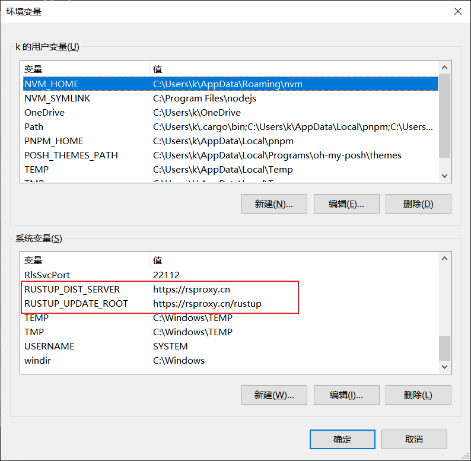

# windows

参考：https://learn.microsoft.com/zh-cn/windows/dev-environment/rust/setup#install-visual-studio-recommended-or-the-microsoft-c-build-tools

1. 安装 [Microsoft C++ 生成工具](https://visualstudio.microsoft.com/zh-hans/visual-cpp-build-tools/)，勾选【使用 C++ 的桌面开发(Desktop Development with C++)】和【Windows 10（或 11）SDK】两项进行安装；
2. 设置 rust 源([字节源](https://rsproxy.cn/#home))

首先在命令行工具配置源

```shell
# CMD

set RUSTUP_DIST_SERVER=https://rsproxy.cn
set RUSTUP_UPDATE_ROOT=https://rsproxy.cn/rustup
```

```powershell
$ENV:RUSTUP_DIST_SERVER='https://rsproxy.cn'
$ENV:RUSTUP_UPDATE_ROOT='https://rsproxy.cn/rustup'
```

然后还要将源地址配置在环境变量中，这样就可以加快 rust 安装过程中一些工具包的下载。



3. 下载并执行 [windows rust 安装工具](https://www.rust-lang.org/tools/install)

4. 测试安装是否成功，在 windows terminal 内执行`rustc --version`


# macos

# 更新和卸载

## 更新

```shell
rustup update
```

## 卸载

```shell
rustup self uninstall
```

# vscode插件

## rust-analyzer

【rust-lang.rust-analyzer】插件提供对 rust 程序的静态分析和提示，便于开发过程中及时发现错误信息。

