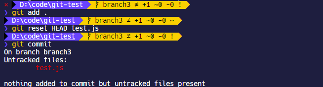
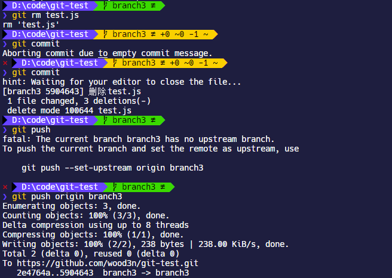
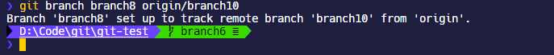
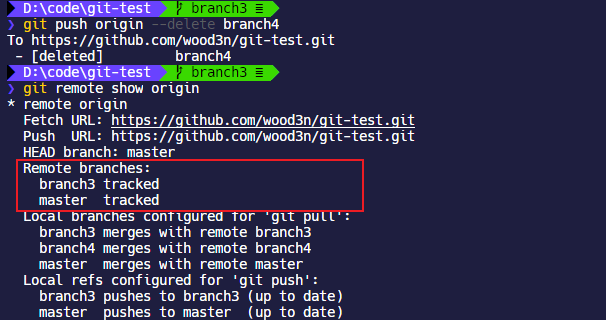
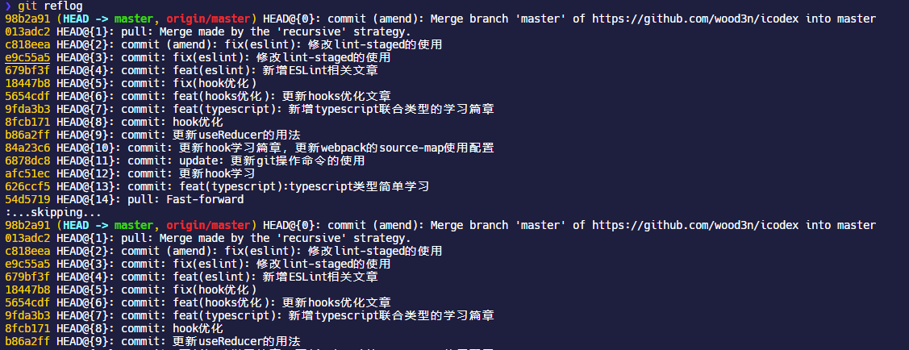

## HEAD

### 什么是 HEAD

`HEAD`是当前分支引用的指针，通常将其看作该分支上最后一次提交的快照。

在 git 中文件有三种状态：

- **modified**：已修改，包括新创建的文件，或者对已提交文件的修改，对应工作区

- **staged**：已暂存，对应暂存区

- **committed**：已提交


## 常用

### git config

Git 自带一个 `git config` 的工具来帮助设置控制 Git 外观和行为的配置变量，比较常见的就是配置 git 的用户名和邮箱

```shell
git config --global user.name "icodex"
git config --global user.email xxx@163.com
```

Git 配置使用`git push`时自动关联远程分支：

```shell
git config --global --add push.default current

git config --global --add push.autoSetupRemote true
```

Git 配置大小写敏感

```shell
git config core.ignorecase false
```

如果要获取所有 git 的配置，可以使用：

```shell
git config --list
```

### git clone

```shell
git clone <url>
eg: git clone https://github.com/libgit2/libgit2
```

复制远程仓库到本地。

### git add

```shell
git add <files>
eg: git add .
eg: git add ./src
```

对于 git 而言，文件目录中的文件一般有几种状态：

- 未修改：未修改的文件可能是没有编辑过的文件，或者编辑过已经提交的文件
- 已修改
- 已暂存：添加到暂存区的文件

编辑过某些文件之后，由于自上次提交后你对它们做了修改，git 将它们标记为已修改文件，可以选择性地将这些修改过的文件放入暂存区，然后提交所有已暂存的修改。

使用`git add`命令就是将文件添加到暂存区，`git add` 命令使用**文件或目录的路径作为参数**；如果参数是目录的路径，该命令将递归地跟踪该目录下的所有文件，例如常用的`.`表示的是当前放开 git 命令的目录，一般在项目上使用就是递归寻找所有修改过的所有文件，然后放到暂存区。

#### 取消暂存

```shell
git reset HEAD <file1>,<file2>...
```

`git reset HEAD`加上指定的文件或者文件夹，可以取消将该文件或者该文件夹放到暂存区，注意只是取消暂存区，并不是取消更改。



### git commit

```shell
// 提交
git commit -m "xxx"
// 跳过暂存直接暂存并提交
git commit -a -m "xxx"
// 合并提交记录
git commit [-a -m] [--amend]
```

如果`git commit`带上`-a`后缀就表示跳过`git add`阶段保存到暂存区的过程，直接将所有已经跟踪过的文件暂存起来一并提交。

#### 合并提交

```shell
git commit --amend

eg:
git add .
git commit -m 'initial commit'
git add forgotten_file
git commit --amend
```

`amend`是修改的意思，`git commit --amend`这个命令更像是合并提交的，因为有时候刚提交完可能又发生了文件修改，此时如果使用`git commit`会有多个 commit 记录，而使用`git commit --amend`最终只会有一个提交——第二次提交将代替第一次提交的结果，这样仓库就不会出现“啊，忘了添加一个文件”或者 “小修补，修正笔误”这种乱七八糟的提交信息了。

### git push

```shell
git push <远程主机名> <本地分支名>:<远程分支名>

//如果本地分支名与远程分支名相同，则可以省略冒号：
git push <远程主机名> <本地分支名>

git push --set-upstream origin master

git push -f
```

`git push`是带有远程地址和分支名称的，例如`git push origin master`，比如刚刚本地新建一个分支要提交到远程仓库，就需要设置远程主机名和分支名。

如果远程仓库存在多条分支，那么需要每次提交代码都指定对应的主机名和分支名，否则 git 会拒绝操作。


这样很麻烦，git 也给了命令提示，`--set-upstream`可以设置默认推送的远程仓库的分支。这样下次执行就可以不用指定分支直接使用`git push`了。


如果本地版本低于远程仓库的提交版本，使用`git push`会失败， git 会提示需要从远程仓库抓取更新才能推送。这时候使用`git push -f xx`可以强制推送本地版本到远程仓库，当然了，远程仓库已经存在的文件也会丢失。


### git fetch

```
git fetch [--all]
```

`git fetch`会将远程仓库及其改动都拉取下来，然后你可以在本地使用`git merge`命名将两个分支的代码进行合并，一般这个过程是这样的：

- 使用`git fetch`拉去所有远程分支的代码
- 使用`git add`+`git commit`/`git stash`将本地代码先暂存起来
- 执行`git merge <branch>`将指定远程仓库在本地的副本仓库合并到当前分支

一般来说，当你本地切换到

### git pull

```shell
git pull <远程主机名> <远程分支名>:<本地分支名>

//如果本地分支名与远程分支名相同，则可以省略冒号：
git push <远程主机名> <远程分支名>
```

`git pull`是从远程仓库的分支获取代码并合并到本地工作区。相当于`git fetch`和`git merge`。

### git stash

> ```shell
> git stash
> git stash pop
> ```

`git stash`非常常用，用于缓存工作区修改的代码，将工作区恢复到上次`commit`以后的状态，这样工作区就干净了，就好像没有任何更改一样。

有这样一种场景是，你本地正在开发新功能，突然测试提了一个新的 BUG，要你立即修复，这时候你功能还没开发完肯定没法`commit`代码，所以就得`git stash`缓存下来，同时还清空了工作区的修改，这样就就可以很方便的去修改 BUG，然后提交修改 BUG 的`commit`并推送。

然后你需要回到刚才开发功能的场景继续，这时候使用`git stash pop`将缓存区第一个缓存的本地修改记录出栈，于是你本地工作区就恢复到了之前开发时的完整代码，`so nice`！！！🥳🥳🥳

### git rm

```shell
git rm <file>
git rm --cached <file>	//只删除远程，不删除本地
```

`git rm`可以从远程仓库以及本地移除文件，如果后面跟的是一个目录做为参数，则会递归删除整个目录中的所有子目录和文件。先执行`git rm`可以看到本地仓库文件被删除，然后执行`git commit`和`git push`，就可以删除远程仓库的文件，



如果只想删除远程仓库的文件，而保留本地的，那么需要添加`--cached`来操作。

## 分支操作

从一个远程跟踪分支检出一个本地分支会自动创建所谓的“跟踪分支”（它跟踪的分支叫做`upstream`）。 跟踪分支是与远程分支有直接关系的本地分支。 如果在一个跟踪分支上输入 `git pull`，Git 能自动地识别去哪个服务器上抓取、合并到哪个分支。当克隆一个仓库时，它通常会自动地创建一个跟踪 `origin/master` 的 `master` 分支。

### git branch

```shell
// 显示本地全部分支名称
git branch
// 显示远程指定分支的信息
git remote show <remote>

// 创建新的分支
git branch <branchname>
// 基于指定的远程分支创建本地分支
git branch <branchname> origin/branchName
// 强制删除本地分支
git branch -D <branchname>
// 删除远程分支
git push origin --delete <branchname>
// 将本地当前分支和指定的远程分支关联起来
git branch --set-upstream-to=origin/<remote branch> <local branch>
// 重命名分支
git branch -m oldName newName

eg:
git branch testing
git branch -d issue1
```

`git branch`命令可以显示本地仓库有多少分支存在；如果要显示远程仓库的分支信息，可以使用`git remote show origin`.


默认分支名称是`master`，`git branch`命令用于在本地创建一个新的分支；`git branch`只是创建分支，并不会自动切换到新的分支。

如果使用`git branch <branchname> origin/branchName`指定远程分支，则会基于远程分支创建本地分支并且自动把它们关联起来。现在的大多数编辑器在手动切换分支的时候都会自动实现这个功能，例如`VSCode`，当你选择在分支查看面板点击某个远程分支以后，会自动为远程分支创建本地分支副本并且把他们关联起来，然后再切换到这个新创建的分支副本上去。值得注意的是，使用`git fetch`并不会同时更新这个远程分支的副本，需要使用`git pull`，这个应该是很常见的问题！




如果使用`git branch -d`后缀，则是**删除本地分支**，使用大写的`-D`后缀是强制删除，一般情况下用大写的情况居多。


如果要删除远程仓库的分支，需要使用`git push origin --delete <branchname>`



需要注意的是本地分支和远程分支不一定相同，比如说本地新建了一个分支为`branch1`，但是远程分支名是`branch2`，现在我想把本地的`branch1`设置追踪远程的`branch2`，需要使用 `git branch --set-upstream-to=origin/<branchname>` ，这个命令用于**设置已有的本地分支跟踪一个刚刚拉取下来的远程分支**，或者想要修改正在跟踪的上游分支。


### git checkout

```shell
// 切换分支
git checkout <branchname>
// 在当前分支的基础上创建本地分支
git checkout -b <newbranchname>
// 在指定远程分支的基础上创建本地分支
git checkout -b <newbranchname> <origin/branchName>

eg:
git checkout testing
```

`git checkout`是切换到某个分支去，使用`git checkout -b <newbranchname>`可以合并`git branch`和`git checkout`，即创建分支以后自动切换过去。


然后就可以进行本地新增，修改文件等操作，通过`git add`等命令提交，然后推送的时候注意要指定分支名`git push origin <branchname>`，如果远程不存在分支，那么会自动新建并合并提交记录。


### git merge

```shell
git merge <branchname>
```

**`git merge`命令是把指定分支合并到当前分支**，因此如果要合并分支，首先切换到合并后的分支上去，然后使用`git merge <branchname>`选择要合并到当前分支的分支，需要注意合并分支并不会删除分支，要删除分支需要`git branch -d`命令。


例如使用`git checkout master`先切换到`master`分支，然后使用`git merge testing`将`testing`分支合并到`master`分支中。

```shell
git checkout master

git merge testing
```

如果遇到两个仓库具有路径相同的文件合并冲突的情况，git 会暂停合并，并提示冲突信息，等待开发者手动解决冲突。例如，我们新建`branch3`和`branch4`，然后都编辑一份`test.js`文件并提交，然后在`branch3`中合并`branch4`，就出现了冲突；此时可以使用`git status`检查所有处于冲突状态的文件，如下所示：


然后打开文件解决冲突，解决冲突完了以后再使用`git add`和 `git commit`提交就可以了。


### git rebase

```shell
git rebase <branchname>

git rebase --continue
git rebase --skip
git rebase --abort
```

`rebase`有重新设定，变基的意思，`git rebase`是**把当前分支合并到指定分支去**

现在我们使用`git reset --hard HEAD~`取消刚才`git merge`的合并记录，现在历史提交记录已经恢复到之前的状态。


刚才是要把`branch4`合并到`branch3`中，现在我们切换到`branch4`下执行`git rebase branch3`，依然会出现冲突


现在解决冲突，然后注意对于修改后的文件执行`git add .`以后，不是要去`git commit`，而是要去`git rebase --continue`，有时候`git rebase --continue`会抽风，可以使用`git rebase --skip`跳过本次提交，然后使用`git merge`再重新 merge 回主分支就行了。


可以看到`git rebase`的合并操作的提交历史很整洁。

### git cherry-pick

> ```shell
> git cherry-pick <commitHash1> <commitHash2> ...
> 
> git cherry-pick <commitHash1>..<commitHashN>
> 
> git cherry-pick -m 1/2 <commitHash>
> ```

`git cherry-pick`俗称**摘樱桃**，用于将任意分支的指定提交记录合并到当前分支来，例如先使用`git log`查询提交历史后，可以获取指定`commit`的`hash`值，然后就可以使用`git cherry-pick`将该`commit`合并到当前分支了

```shell
git commit 313bj42g2jk4b4j4...
```

如果有多个提交历史需要合并，需要在多个`<commitHash>`之间添加空格

```shell
git commit 313bj42g2jk4 qe98232nfewf ...
```

可以使用`..`来指定一个区间范围，例如合并从`<commitHash1>`到`<commitHashN>`之间所有的提交历史

```shell
git commit 313bj42g2jk4..qe98232nfewf
```

如果要合并的`commit`记录是一个两个分支`merge`的记录节点，那么`cherry-pick`会发生错误提示，要求输入`-m`参数，因为它不知道应该采用哪个分支的代码变动，通过指定`1`或者`2`来决定采用哪个分支的代码：

- `1`表示的是采用`the branch being merged into`，也就是采用当时`commit`时候被合并到的分支；比如当时`commit`是从`branch1`合并到`master`去，那么指定`-m 1`就是采用合并时候`master`的代码
- `2`则表示采用`the branch being merged from`，也就是采用要合并的分支的代码

```shell
git cherry-pick -m 1 313bj42g2jk4
```

`git cherry-pick`支持以下几种参数后缀：

- `-n`，`--no-commit`：也就是只更新工作区和暂存区，不产生新的提交
- `-x`：会在提交信息的末尾追加一行`(cherry picked from commit ...)`，方便以后查到这个提交是如何产生的
- `-s`，`--signoff`：在提交信息的末尾追加一行操作者的签名，表示是谁进行了这个操作

使用`git cherry-pick`的过程一般都会有冲突，这个时候`cherry-pick`会暂停，在手动解决冲突以后，执行以下步骤：

- `git add .`暂存所有更改
- `git cherry-pick --continue`：继续`cherry-pick`

什么情况下使用`cherry-pick`，有下面几种情况：

- 比如你正在重构代码，然后 leader 在远程基于目前的迭代分支`feat-branch`为你开了一个新的分支`refactor`出来，用于代码重构；则你可以先把刚才开发的代码先`commit`，然后在本地基于新的重构分支`checkout`一个新的分支出来，在这个分支基础上把刚才`commit`的代码`cherry-pick`过来再合并，解决冲突什么的；最后删除过去开发的分支就行了
- 还有一种情况是，你本地`merge`了远端的代码并且已经推送到远端，但是你把别人最近提交的修改都干掉了，这时候首先可能想到是使用`git reset`或者`git revert`回滚远端以及本地的代码到指定版本，但是这样做最快捷的方式是你一个人默默承担这一切 🤣🤣🤣；先使用`git log`获取其他人的提交历史，然后把他们的提交记录`cherry-pick`到你当前分支上来，然后解决冲突，最后重新提交并推送到远端

## 查询历史记录

### git log

```shell
git log
```

`git log`可以显示历史提交记录，并从最近的提交记录往前排列。


```shell
git log --author=<username>
```

使用`git log --author`带上用户名，可以查询指定人员的提交记录

### git reflog

`git reflog`会显示本地存储库中分支的操作记录

`98b2a91`等最前面的一串字符是操作记录的`hash`值，利用这个值可以在`git reset`，`git revert`等进行版本回滚操作；

`HEAD@{2}`之类的表示当前`HEAD`指针在当前分支的移动次数，可以看到每提交一次代码`HEAD`就会移动一次，关于`HEAD`详细的介绍参考上文



## 回滚

### git reset

```shell
git reset [--soft | --mixed | --hard] [HEAD]
git reset --soft
git reset --hard <commitHash>

eg:
git reset --hard HEAD~
git reset --hard 3c8j0wrwjrw0824m2...
```

上文说到[`git reset`](https://git-scm.com/docs/git-reset)命令可以重置已经暂存的文件的状态，同时`git reset`也具有撤销全部修改的能力。

`--mixed`为默认后缀，可以不用带该参数，即`git reset HEAD`，用于**只重置暂存区**的文件，也就是重置上一次`git add`的操作；那么你当前正在修改的文件就不会被重置

`--soft`：只会回退版本，不会将本地工作区和暂存区的代码都一起撤销回归；

`--hard`：撤销工作区，暂存区中所有未提交的修改内容，**将暂存区与工作区都回到指定版本，并删除之前的所有信息提交**，也就是本地改过的统统撤销

`[HEAD]` 可以用来简单的表示最近的版本，如果不加`[HEAD]`直接使用则默认回退到上个`commit`的记录。

- `HEAD^` 上一个版本
- `HEAD^^` 上上一个版本
- `HEAD^^^` 上上上一个版本

- `HEAD~0` 表示当前版本
- `HEAD~1` 上一个版本
- `HEAD^2` 上上一个版本
- `HEAD^3` 上上上一个版本

例如`git reset --hard HEAD^`就是完全重置到上一个版本的提交，包括分支 merge 的记录也会重置，提交记录和本地文件都会重置到上一个版本。


如果要回退到指定版本，需要带上指定`commit`版本的`hash`值，可以先使用`git log`查询提交历史再回滚

```shell
git log

git reset --hard 3c8j0wrwjrw0824m2...
```

### git revert

```shell
git revert [HEAD]
git revert [commit-id]
```

如果使用`git revert`也能做到重置提交的目的，例如使用`git revert HEAD`是重置到上一版本，**同时会创建一个新的提交记录**。注意这点是和`git reset`主要的区别，`git reset`是连提交记录都会重置，也就是说你**滚回去以后就别想滚回来了**，`git revert`是创建一个新的提交去覆盖之前的提交记录。


### 主分支revert后无法重新提交合并的问题

当回滚主分支`master`以后，已经合并的其余分支如果想重新合并到`master`会无法提交 MR，这时候需要在待合并的本地分支执行以下操作：

1. 重新`git merge origin/master`，会丢失本地分支代码
2. 执行`git revert [revert-hash]`，这里`revert-hash`是提交 revert mr 之前提交的 revert 的那条记录的 hash；这样执行完会将本地分支回滚到 mr 之前的状态

执行完这两步以后就可以重新提交 mr 了。

## 关联

### git remote add origin

一般来说，一个项目刚开始开发的时候是现在远端创建一个仓库，然后每个人`clone`下来仓库；但是如果本地存在的项目想要上传到远端仓库怎么办呢？在执行`git init`以后再使用`git remote add origin`即可

```shell
git init
git remote add origin <URL>
git push origin master
```

但是这样并不会建立本地当前分支和远程仓库分支的联系，之后还可以使用`git branch --set-upstream-to=origin/<remote branch> <local branch>`来建立本地分支和远程分支的关联，之后就可以直接使用`git push`而不带`origin <branch>`命令参数了。

```shell
git branch --set-upstream-to=origin/<remote branch> <local branch>
```


或者也可以直接使用`git push -u origin <branch>`命令来关联远程分支。

```shell
git push -u origin branch1
```

## 代理

```shell
git config --global https.proxy http://127.0.0.1:8080
git config --global http.proxy http://127.0.0.1:8080
  
// 取消代理
git config --global --unset https.proxy
git config --global --unset http.proxy
```

注意 HTTP 的端口要和代理端口保持一致。

## QA

### windows CRLF

windows 系统执行`git add`的时候总是会莫名其妙提示换行符的 warning


这个问题在 stackoverflow 上有很高的关注量 —— [git-replacing-lf-with-crlf](https://stackoverflow.com/questions/1967370/git-replacing-lf-with-crlf)，究其原因是因为不同操作系统内部对换行符的使用规则不同导致的，在 unix 和 linux 系统下，换行符使用`LF`(line feed，U+000A)来标识，但是在 DOS 和 windows 系统下使用`CRLF`(carriage return + line feed，回车+换行组合)来标识，git 对比文件差异会将换行符考虑在内，其内部也具有`core.autocrlf`这样的配置项来兼容不同操作系统，但是在 windows 上这个配置项需要在每次安装 git 以后手动执行`git config --global core.autocrlf`配置一下才行，其配置值为：

```shell
git config --global core.autocrlf false
```

- `autocrlf true`：提交时转换为`LF`，检出时转换为`CRLF`，linux 使用
- `autocrlf false`：提交检出均不转换，windows 使用
- `autocrlf input`：提交时转换为`LF`，检出时不转换
