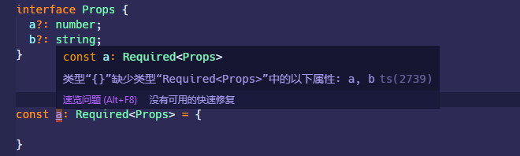
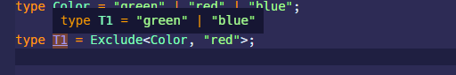
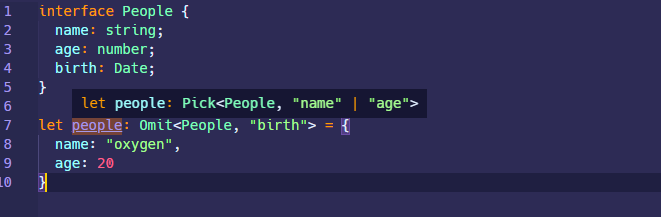
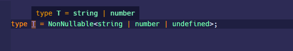

## 引言

TypeScript 提供了许多用于辅助编程的`Utility Types`，就像开发时经常编写的通用的`utility`元件代码一样，这些`Utility Types`可以很方便的在开发过程中帮助我们进行一些类型转换的操作。

## Partial

> ```typescript
> Partial<Type>
> ```

`Partial<Type>`可以将一个`interface`内部所有声明的属性都转换成可选类型`?`

## Required

> ```typescript
> Required<Type>
> ```

将一个对象的所有属性值都限定为必需，这个正好和`Partial`相对

```typescript
interface Props {
  a?: number;
  b?: string;
}

const a: Required<Props> = {};
```



## Readonly

> ```typescript
> Readonly<Type>
> ```

`Readonly<Type>`可以将一个`interface`内部所有属性都转成`readonly`的只读属性

## Record

> ```typescript
> Record<Keys,Type>
> ```

`Record<Keys,Type>`这玩意 TS 的官网介绍的有点坑，其实就是用来构造一个对象的，`keys`就是作为对象的一系列属性的类型，所以`keys`只能是`string`或者字面量类型，`Type`就是属性值的类型，这就很多了，只要是 ES 规范定义的类型都能往里扔。

例如：

- 直接构造一个普通对象

```typescript
const a: Record<string, string> = {
  name: 'oxygen',
  age: '20',
};

// 类似于interface的写法，但是要简洁许多
interface Obj {
  [propName: string]: string;
}
```

- 将两种类型映射成一个新的对象

```

```

## Pick

> ```typescript
> Pick<Type, Keys>
> ```

从指定对象类型`Type`中提取出指定的`keys`以及它们各自的类型，`keys`之间使用`|`分隔

```typescript
interface Todo {
  title: string;
  description: string;
  completed: boolean;
}

// 从Todo中提取出 title和completed 两个属性
type TodoPreview = Pick<Todo, 'title' | 'completed'>;

const todo: TodoPreview = {
  title: 'Clean room',
  completed: false,
};
```

## Exclude

> ```typescript
> Exclude<Type, ExcludedUnion>
> ```

从一系列联合类型`Type`中排除指定的`ExcludedUnion`类型，并返回排除指定类型后的完整类型

```typescript
type Color = 'green' | 'red' | 'blue';

type T1 = Exclude<Color, 'red'>;
```



## Omit

> ```typescript
> Omit<Type, Keys>
> 
> type Omit<T, K extends keyof any> = Pick<T, Exclude<keyof T, K>>;
> ```

`Omit`就是忽略的意思，从指定对象类型`Type`中删除指定的`keys`；打开 TypeScript 的定义会发现这玩意就是在`Pick<Type, keys>`和`Exclude<Type, ExcludedUnion>`基础上创造出来的

```typescript
interface People {
  name: string;
  age: number;
  birth: Date;
}

let people: Omit<People, 'birth'> = {
  name: 'oxygen',
  age: 20,
};
```



## Extract

> ```typescript
> Extract<Type, Union>
> ```

`Extract`就是提取的意思，从指定类型`Type`中提取出`Union`中也包含的类型

```typescript
type T = Exclude<string | number | (() => void), Function>;
```


## NonNullable

> ```typescript
> NonNullable<Type>
> ```

`NonNullable`从指定类型中排除`null`和`undefined`，不能排除对象属性中可选属性的`undefined`值，要将所有可选属性转换成必需的属性，使用`Required<Type>`

```typescript
type T = NonNullable<string | number | undefined>;
```



## ReturnType

> ```typescript
> ReturnType<Type>
> ```

直接提取一个函数的返回值类型

```typescript
declare function f1(): { a: number; b: string };

type T = ReturnType<typeof f1>;
```


## Parameters

> ```typescript
> Parameters<Type>
> ```

从指定的函数类型`Type`中提取出函数的参数类型，并组成一个元组`Tuple`

```typescript
interface Func {
  (name: string, age: number): void;
}

type T = Parameters<Func>;
```


## ConstructorParameters

> ```typescript
> ConstructorParameters<Type>
> ```

从指定构造函数类型`Type`提取构造函数的参数组成元组或者数组类型

```typescript
type T = ConstructorParameters<RegExpConstructor>;
```


这里要注意一下，ES 规范定义的一些构造函数在 TS 中有特定的类型表示，它们的对应关系如下：

```typescript
Symbol -> SymbolConstructor

Array -> ArrayConstructor

RegExp -> RegExpConstructor

Promise -> PromiseConstructor

Map ->  MapConstructor

Set ->  SetConstructor
```