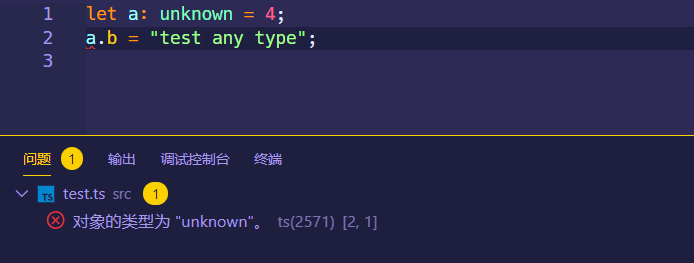

## ES 原始值类型

### 原始值类型的表示

对于 ES 规范中定义的原始值类型定义，TS 可以很简单的通过冒号`:`声明其类型，并且使用**小写**声明类型。

```typescript
// Boolean
let variable: boolean = false;

// Number
let variable: number = 6;

// BigInt, BigInt类型的变量值后面都会带有 n
let variable: bigint = 100n;

// String
let variable: string = 'str';

// Symbol
let sym: symbol = Symbol();

// Null / Undefined
let u: undefined = undefined;
let n: null = null;
```

### Null 和 Undefined

默认情况下，`null`和`undefined`是所有其他类型的子类型，也就是如果一个变量具有其它类型，它的值可以被分配为`null`或者`undefined`。

```typescript
let a: number;
a = undefined;
```

当在`tsconfig.json`中**指定`compilerOptions.strictNullChecks:true`或者`complierOptions.strict:true`**，也就是开启严格类型检查的时候；`null`和`undefined`这两个值只能被分配在声明为`unknown`，`any`或者`void`类型的变量上；这种情况在使用数组方法的时候很烦，因为多数数组方法例如`Array.prototype.find`

```typescript
interface Person {
  name: string;
  age: number;
}

const person = [{ name: 'oxygen', age: 20 }].find(item => item.age === 20);

const getPersonFile = (person: Person) => {
  return person;
};

getPersonFile(person); // error
```


要解决这种问题也很简单，把函数的参数设置成可选就行了，也可以设定一个默认值，当`Array.prototype.find`返回`undefined`的时候就会使用默认值

```typescript
// 方法一
const person = [{ name: 'oxygen', age: 20 }].find(item => item.age === 20) || {
  name: '',
  age: 0,
};

// 方法二
const getPersonFile = (person?: Person) => {
  return person;
};
```

如果在严格模式下，想要其他类型兼容`null`和`undefined`，可以使用联合类型的写法，即`|`分隔符来声明多种变量的类型

```typescript
// 声明兼容null和undefined的类型
let variable: string | null | undefined = 'str';
```

如果在变量的后面紧跟一个`!`，也能起到过滤`null`和`undefined`的作用

### 字面量类型

在 TypeScript 中支持直接使用值的形式去定义变量类型，这种表示形式类似于枚举的形式，限定一系列固定的值，例如常见的有 HTML 元素类型（`input`，`img`），DOM 事件类型（`click`，`focus`）；目前只支持三种原始值类型：`string`，`number`，`boolean`

```typescript
// string的字面量类型
function createElement(tagName: 'input' | 'img'): void {}
function handler(eventName: 'click' | 'focus'): void {}

// number的字面量类型
function add(value: 1 | 2 | 3 | 4 | 5): number {
  return value++;
}

// boolean的字面量类型，直接使用true/false定义
interface ValidationSuccess {
  isValid: true;
  reason: null;
}

interface ValidationFailure {
  isValid: false;
  reason: string;
}
```

### 大写类型格式

有些初学者在声明原始值类型的时候会使用大写的`Number`, `String`, `Boolean`, `Symbol`, 或者`Object`去写，这种写法其实和小写没什么区别，但是就语法规范来说应该禁止这种写法。

## ES 引用类型

在 ES 规范中，引用类型都是从`Object`派生出来的类型，常见的有`Date`，`Array`，`RegExp`，`Function`等

### Array

数组类型只需要在方括号`[]`前指定具体的元素类型就可以了

```typescript
let list: number[] = [1, 2, 3];
```

或者也可以通过泛型数组来声明，使用`Array<elemType>`

```typescript
let list: Array<number> = [1, 2, 3];
```

如果使用`ReadonlyArray<elemType>`声明一个数组类型，表示该数组在声明以后不允许发生改变，例如不允许动态添加元素，不允许使用修改数组本身的方法操作

```typescript
let list: ReadonlyArray<number> = [1, 2, 3];
list.push(4);
```


### Date

如果要定义一个日期类型的变量，使用`Date`

```typescript
let currentTime: Date = new Date();
```

### RegExp

如果要指定一个正则表达式类型，使用`RegExp`

```typescript
let reg: RegExp = /abc/;
```

### 函数

由于定义函数的形式比较多，所以指定函数的类型有多种形式。

普通函数可以直接在定义的时候指定参数和返回值类型，**如果函数没有返回值，则使用`void`定义函数返回类型**

```typescript
function func(name: string, age: number): string {
  return `I am ${name}, ${age} years old.`;
}
```

对于函数表达式，使用箭头符号`=>`将参数列表和返回类型串接起来；完整的函数类型等号左右两侧都需要指定参数和返回值的类型，但是 TypeScript 有类型推断机制，因此在等号两侧只要一侧指定了参数和返回类型就能自动推断完整的类型定义。

```typescript
const func: (name: string, age: number) => string = function(
  name: string,
  age: number,
): string {
  return `I am ${name}, ${age} years old.`;
};

// 简写
const func = function(name: string, age: number): string {
  return `I am ${name}, ${age} years old.`;
};

// 或者简写
const func: (name: string, age: number) => string = function(name, age) {
  return `I am ${name}, ${age} years old.`;
};

// 或者用箭头函数
const func: (name: string, age: number) => string = (name, age) => {
  return `I am ${name}, ${age} years old.`;
};
```

如果一个函数定义在对象属性中，那么这个函数可以被称为这个对象的方法。也就是对象的属性如果是一个函数，那么就需要指定其为函数类型

```typescript
interface Person {
  age: number;
  getName: (name: string) => string; //定义对象内部的方法
}

const person: Person = {
  age: 20,
  getName: name => {
    return name;
  },
};

person.getName('oxygen');
```

但是上面的写法不美观，代码可读性比较差，所以一般使用`interface`定义函数的参数和返回值类型

```typescript
interface Func {
  (name: string, age: number): string;
}

// 这里声明的函数的参数名和上面interface内指定的参数名并不需要相同
const func: Func = (name, age) => {
  return `I am ${name}, ${age} years old.`;
};

func('oxygen', 23);
```

#### 可选参数

在参数名后面紧跟`?`定义可选参数；并且可选参数**必须放在参数列表的结尾**，也就是放在必选参数的后面；如果是必传的参数，在定义函数的时候不会发生错误，但是在调用函数传递实参的时候就会报错

```typescript
interface Func {
  (name: string, age?: number): string;
}

const func: Func = name => {
  return `I am ${name}`;
};

func('oxygen');
```

#### 默认参数值

ES6 以后支持为函数参数添加默认值，但是需要注意函数表达式形式的类型声明，默认值要写在右侧声明函数的地方，而不是左侧声明类型的位置，否则会报错

```typescript
const func: (name: string, age: number) => string = (name, age = 20) => {
  return `I am ${name}, ${age} years old.`;
};
```

#### 剩余参数

当函数参数不确定时，通过 ES6 的拓展运算符`...`可以指定函数内部的剩余参数，剩余参数本身就是一个数组，所以使用数组的类型声明`typeName[]`来指定其类型

```typescript
interface Func {
  (name: string, ...args: string[]): string;
}

const func: Func = name => {
  return `I am ${name}`;
};
```

#### 函数重载

函数重载（overload）是众多 OOP（Object Oriented Programming）语言所共有的函数特性，是对 OOP 三大特性中多态性的具体实现方式之一。在 OOP 语言中，函数重载指的就是同名函数具有不同的修饰符，参数个数或者不同的参数类型等形式，从而实现不同的用途。

但是 JS 本身不支持函数重载，在 TypeScript 中实现函数重载的方式也和其它 OOP 语言有很大不同，在 TypeScript 中有以下限制：

- 多个重载函数之间只能使用普通函数形式去定义
- 重载只能通过**指定不同的参数类型或者参数个数**来达到目的，返回类型不属于重载的范围
- 最后一个定义的函数不属于重载函数，其内部需要根据参数的类型进行判断，然后决定执行什么样的操作

```typescript
function func(name: string): void;
function func(birth: Date): void;
function func(x: any): any {
  if (typeof x === 'string') {
    console.log(x);
  }

  if (typeof x === 'object') {
    console.dir(x);
  }
}

func(new Date()); // Mon Oct 05 2020 20:00:01 GMT+0800 (中国标准时间)
```

### Object

对象是 JS 中最为常见的数据类型，在 TypeScript 中表示一个对象有多种方法。

#### object

`object`关键字在 TypeScript 中代表任何**非原始值类型**，例如一个对象，但是对象表示通常使用`interface`，`interface`可以准确地表示对象内所包含的属性，以及每个属性的类型，所以`object`用的很少

```typescript
let obj: object = { prop: 0 };
```

#### interface

详见`interface`介绍的文章

## TS 特定类型

### Enum

枚举类型还是比较简单的，Enum 就是用来声明前端应用中一系列需要遍历的固定值，例如颜色，页面展示数据的状态，一周时间等等

```typescript
enum Color {
  Red,
  Green,
  Blue,
}

enum Status {
  Init,
  Completed,
  Success,
  Failed,
}

enum Days {
  Sun,
  Mon,
  Tue,
  Wed,
  Thu,
  Fri,
  Sat,
}
```

默认情况下，枚举类型的初始值从`0`开始递增，但是也可以手动指定初始值，或者每个枚举项的值：

```typescript
// 指定枚举项从 1 开始
enum Color {
  Red = 1,
  Green,
  Blue,
}

// 单独指定每个枚举项的值
enum Color {
  Red = 1,
  Green = 2,
  Blue = 4,
}
```

并且枚举类型支持声明字符串值

```typescript
export enum EvidenceTypeEnum {
  Init = 'init',
  Procesing = 'procesing',
  Success = 'success',
  Failed = 'failed',
}
```

### Any

如果一个变量在声明的时候没有明确定义其类型，那么默认就是`any`，不过这时候编辑器可能会出现错误提示，因此仍然需要显式指定其类型为`any`。

```typescript
let variable = 4;

let num: any = 4;
```

使用`any`是一种投机取巧的行为，表示不再使用 TypeScript 的类型检查机制，在使用变量的过程中可以随意改变其值的类型也不会发生错误提示。

```typescript
let num: any = 4;
num = 'str';
```

并且声明为`any`的变量，可以将其传递给其它任意类型的变量，这种情况是最危险的，对于一些函数接收限定类型的值时，传递不正确的`any`类型的变量，很有可能会发生错误！

```typescript
let a: any = 4;
function multi(arr: number[]): number[] {
  return arr.map(item => item * 2);
}

console.log(multi(a));
```


滥用`any`的行为是不安全也不规范的，毕竟 TypeScript 主要的作用就是提供类型安全的变量声明检测，如果有必要建议使用`unknown`。

### Unknown

`unknown`也就是未知类型的意思，`unknown`是所有其他类型的子类型，所以其他任何类型的变量都可以分配给`unknown`类型。

声明为`unknown`的变量并不会在初始化以后固定其类型，这是我刚学习时候的一个错误认识，即使初始化以后，同样可以在代码中其他地方修改其值的类型。

```typescript
let a: unknown = 4;
a = 'test unknown type';

console.log(a); // test unknown type
```

但是`unknown`类型的变量只能传递给`any`或者`unknown`类型，如果传递给其它类型，在代码编写时就会出现错误提示，这种行为很安全很合理。

```typescript
let a: unknown = 4;
function multi(arr: number[]): number[] {
  return arr.map(item => item * 2);
}

console.log(multi(a));
```


对于声明为`any`的变量可以访问其任意属性，甚至是不存在的属性，但是`unknown`不行。同时`unknown`类型也只能传递给`unknown`或`any`，这种限制很严格！

```typescript
let a: any = 4;
a.b = 'test any type';
```

而如果将`any`改为`unknown`，那么编辑器就会有报错提示了



### Void

`void`就是空类型，没有类型的意思，通常用于没有返回值的函数声明其返回值的类型

```typescript
function warnUser(): void {
  console.log('This is my warning message');
}
```

### Never

`never`表示永远不会出现的类型，通常用于直接抛出异常的函数，或者永远没有返回值的函数

```typescript
function error(message: string): never {
  throw new Error(message);
}
```

`never`和`void`的区别是`never`可以分配给其他类型，但是`void`只能分配给`any`和`void`。还有一点是指定为`never`的类型往往只用于内部抛出异常来处理全局错误，但是指定为`void`的函数比较灵活，可以将它们用在各个地方。

### Tuple

Tuple，元组，元组类型用于**声明元素数量和类型都明确的数组**，但是每种元素的类型不必相同，元组在声明的时候必须按顺序指定数组中每个元素的类型。

```typescript
let x: [string, number] = ['hello', 10];
```

## 类型断言

类型断言用于直接指定一个值的类型，类型断言有两种语法：

- 最新的`as`关键字语法：

```typescript
let someValue: unknown = 'this is a string';

let strLength: number = (someValue as string).length;
```

- 旧式的尖括号语法，不推荐在 React 中使用，因为和 JSX 的语法容易混淆，在`@babel/preset-typescript`中可以通过设置`isTSX`配置项选择是否将尖括号语法看作 JSX 进行编译

```typescript
let someValue: unknown = 'this is a string';

let strLength: number = (<string>someValue).length;
```

## 联合类型

将几种类型关键字或者声明的`interface`使用`|`串接起来达到动态选择类型的目的，但是最终的值只限于其中的一种类型

```typescript
let a: number | string;
a = 'oxygen';

// 这里不能再用toFixed，因为类型已经限定到了string
a.toFixed;
```

## 交叉类型

将几种类型通过`&`串接起来合并为一个类型，通常用于合并对象类型，合并的对象具有所有类型的属性

```typescript
interface User {
  id: number;
  username: string;
  age: number;
}

interface Student {
  id: number;
  score: number[];
}

let cross: User & Student;
```